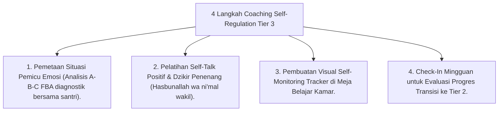

# P10-03-03: Teknik Coaching Self-Regulation dan BIP Tier 3

## Status Dokumen
* **Status**: 🌟 **A+ (Tervalidasi & Siap Diimplementasikan)**
* **Sub-Domain**: `10 Methods / 03 Coaching Methods`
* **Penanggung Jawab Keilmuan**: Dewan Keilmuan TUMBUH (*Pakar Bimbingan Konseling & Pakar PBIS*)

---

## 1. Operasionalisasi Self-Regulation Coaching bagi BIP Tier 3

Konselor BK menggunakan sesi **Self-Regulation Coaching 1-on-1** bagi santri dengan masalah perilaku persisten (Tier 3):

---

## 2. Kemitraan Konselor & Musyrif

Konselor BK berbagi instrumen pemantauan kepada Musyrif Kamar agar pendampingan di asrama berjalan selaras.
