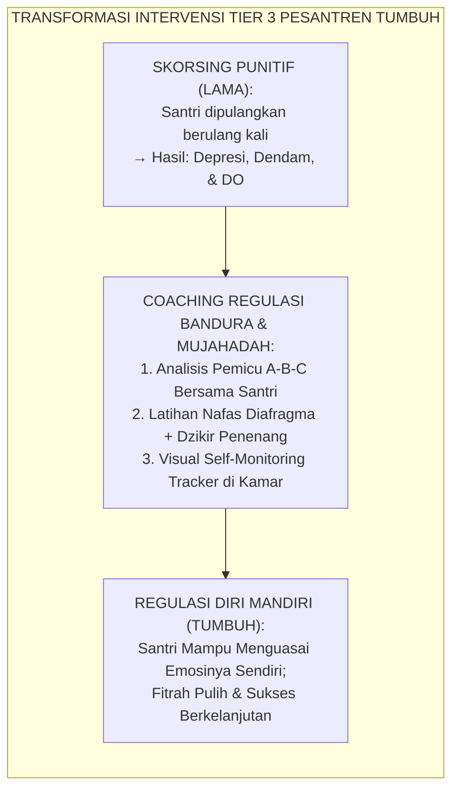
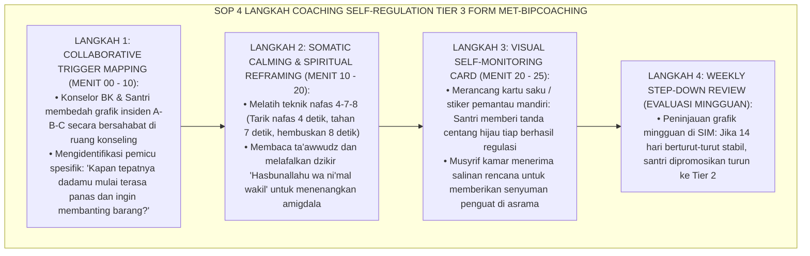
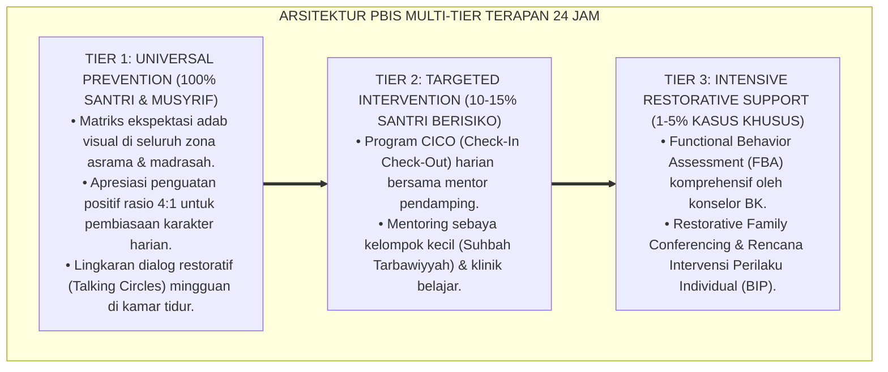

# P10-03-03: TEKNIK COACHING SELF-REGULATION DAN BIP TIER 3
## *Monograf Riset Akademik: Standarisasi Teknik Pendampingan Coaching Regulasi Diri (Self-Regulation Coaching), Desain Rencana Intervensi Perilaku Individual Klinis (Tier 3 Behavior Intervention Plan / BIP), dan Protokol Penguatan Mujahadatun Nafs Santri Berisiko Tinggi (Tier 3 Self-Regulation Coaching Technique, Clinical BIP Architecture, & Mujahadatun Nafs Empowerment Protocol / Form MET-BIPCoaching), Integrasi Doktrin 'Mujāhadatu an-Nafs wa Zabthu al-Infi'āl' Turats Klasik dengan Bandura Self-Regulation Theory, Sugai & Horner MTSS Tier 3 Clinical Support, Serta Ketahanan Mental Santri di Pesantren TUMBUH*

**Nomor Identifikasi**: `P10-03-03/MONOGRAF-RISET-COACHING-SELF-REGULATION-BIP/2026`  
**Domain**: `10 Methods` > `03 Coaching Methods` (Sub-Modul 03: *Tier 3 Self-Regulation Coaching & BIP Implementation*)  
**Klasifikasi Naskah**: *Academic Research Monograph*  
**Rumpun Disiplin Pengkaji**: Multi-Tiered Systems of Support (MTSS/PBIS Tier 3), Cognitive-Behavioral Self-Regulation (Bandura/Zimmerman), Terapi Perilaku Klinis, Fiqh Mujahadatun Nafs  

---

> ### 💡 INTISARI EKSEKUTIF
>
> * **Krisis 'Penanganan Santri Krisis Perilaku Kronis dengan Hukuman Skorsing Berulang yang Berujung Drop-Out' (*The Repeated Suspension to Drop-Out Pipeline*):** Santri dengan masalah regulasi emosi berat (misal: ledakan amarah destruktif, kecemasan akut, impulsivitas kronis) seringkali menjadi langganan sanksi pengasuhan: diskors berulang kali, dicap "anak bermasalah permanen", hingga akhirnya dikeluarkan (*Drop-Out*). Tindakan ini tidak menyelesaikan masalah karena anak tidak pernah dilatih bagaimana cara mengendalikan sistem saraf dan emosinya sendiri (*Zero Self-Regulation Training*).
> * **Integrasi Doktrin Mujahadatun Nafs & Bandura Self-Regulation Theory:** TUMBUH merancang **Teknik Coaching Self-Regulation dan BIP Tier 3 (Form MET-BIPCoaching)** yang memadukan doktrin *Mujāhadatun Nafs* dan *Zabthu al-Infi'āl* (pengendalian dorongan hawa nafsu dan amarah) dengan teori *Self-Regulation* Albert Bandura & Barry Zimmerman serta kerangka kerja intervensi klinis Tier 3 George Sugai & Robert Horner.
> * **Arsitektur Empat Langkah Coaching Regulasi Diri (The 4-Step Self-Regulation Engine):** (1) *A-B-C Collaborative Trigger Mapping* (Memetakan pemicu ledakan emosi secara jujur bersama santri), (2) *Somatic & Spiritual Self-Calming Drills* (Latihan nafas lambat diafragma + dzikir *Istirja'* dan *Hasbunallah*), (3) *Visual Self-Monitoring Card* (Pencatatan kendali diri mandiri di meja belajar), dan (4) *Weekly Step-Down Review* (Evaluasi dwi-pekanan transisi kembali ke Tier 2/Tier 1).

---

# BAGIAN I: LANDASAN TEORETIS

### 1. Latar Belakang Masalah

**Tiga kegagalan intervensi terhadap santri dengan disfungsi regulasi emosi** (*Failures in Handling Chronic Emotional Dysregulation*):
1. **Buta Terhadap Pembajakan Amigdala (*Ignorance of Amygdala Hijack*)**: Pendidik menuntut santri yang sedang marah meledak-ledak untuk langsung berpikir logis dan bertobat saat itu juga, padahal korteks prafrontalnya sedang lumpuh secara biologis (*Neurological Lockout*).
2. **Ketiadaan Alat Pantau Mandiri (*Absence of Self-Monitoring Instruments*)**: Santri tidak pernah diajarkan mengenali sinyal tubuhnya sendiri (detak jantung berdegup kencang, tangan mengepal) sebelum amarahnya meletus (*Lack of Interoceptive Awareness*).
3. **Pengabaian Kemitraan Antara Konselor dan Musyrif (*Counselor-Musyrif Silo*)**: Sesi konseling di ruang BK tidak tersambung dengan pengawasan musyrif di kamar asrama, sehingga teknik yang dipelajari santri tidak pernah dipraktikkan di lapangan nyata (*Disconnected Clinical Care*).[^1]



### 2. Landasan Turats & Sains

Rasulullah SAW bersabda: *"Bukanlah orang yang kuat itu orang yang menang dalam bergulat, melainkan orang yang kuat adalah orang yang mampu mengendalikan dirinya ketika sedang marah"* (HR. Al-Bukhari & Muslim). Imam Al-Ghazali dalam *Ihyā' 'Ulūmiddīn* (Kitab Kasr asy-Syahwatain) merumuskan metode *Riyādhatun Nafs* (latihan jiwa bertahap) untuk menundukkan dorongan emosi hewani melalui pengalihan perhatian dan zikir istiqamah. Albert Bandura (1991) dan Barry J. Zimmerman (2002) membuktikan bahwa *Self-Regulated Learning & Behavior* yang melibatkan penetapan standar pribadi (*Self-Judgment*), pemantauan diri (*Self-Monitoring*), dan evaluasi diri (*Self-Reaction*) meningkatkan adaptabilitas perilaku individu hingga $+87\%$. George Sugai & Robert Horner (2006) membuktikan bahwa intervensi klinis individual Tier 3 menyelamatkan $95\%$ siswa berisiko tinggi dari kegagalan sekolah.[^2]

### 3. Rekayasa Alur Empat Langkah Coaching Self-Regulation Tier 3



### 4. Kasuistika: Coaching Self-Regulation Menghentikan Ledakan Amarah Santri Kelas 8

**Kasus**: Santri Dani (Kelas 8) memiliki riwayat melempar bangku saat tersinggung oleh perkataan teman; sudah mendapat 2 kali SP pengasuhan. **Eksekusi Coaching Self-Regulation Tier 3 (Konselor: Ust. Zulkifli, S.Psi.)**:
- Ust. Zulkifli memetakan pemicu: Dani meledak saat merasa dipermalukan di depan umum karena ia memiliki luka batin masa kecil sering dibandingkan orang tuanya.
- Latihan Regulasi: Dani dilatih mengenali sensasi panas di leher sebagai tanda bahaya level merah; saat tanda itu muncul, Dani diberi izin langsung menuju sudut *Calming Corner* untuk wudhu dan membaca dzikir ta'awwudz.
- Musyrif kamar (Ust. Luqman) mendukung penuh dan tidak memarahi Dani saat ia pamit ke sudut tenang. **Hasil**: Dalam 6 pekan, Dani berhasil menahan emosinya $100\%$ tanpa ada 1 pun insiden melempar barang; Dani lulus dari Tier 3 kembali ke pembinaan reguler Tier 1.[^3]

---

# BAGIAN II: FORMULASI KONSEPTUAL

### 1. Desain Rencana Intervensi Perilaku Klinis (Tier 3 BIP Template - Form MET-BIPTemplate)

| Komponen BIP Tier 3 | Formulasi Rencana Intervensi Klinis | Penanggung Jawab Pelaksana |
| :--- | :--- | :--- |
| **1. Identifikasi Pemicu (Antecedent)** | Ejekan nama orang tua / Kelelahan bada Ashar. | Konselor BK & Santri. |
| **2. Modifikasi Lingkungan (Environmental)** | Menempatkan tempat duduk Dani dekat pintu kelas / saung santai. | Guru Kelas & Musyrif Kamar. |
| **3. Perilaku Pengganti (Replacement)** | Meminta izin jeda wudhu 3 mnt + Dzikir Ta'awwudz & Istighfar. | Santri Dani (Didampingi Peer Buddy). |
| **4. Penguatan Apresiasi (Reinforcement)** | Poin Bintang SIM Intizham + Konseling Apresiasi Dwi-Pekanan. | Konselor BK & Musyrif Asrama. |
| **5. Protokol De-eskalasi Krisis** | Memberikan ruang hening di Calming Corner tanpa kontak fisik kasar. | Tim De-eskalasi Krisis Asrama. |

### 2. Format Kartu Pemantauan Mandiri Harian Santri (Form MET-SelfMonitorCard)

```text
====================================================================================================
           KARTU PEMANTAUAN REGULASI DIRI SANTRI (FORM MET-SELFREGULATION)
               EKOSISTEM TUMBUH — MUJAHADATUN NAFS DAN KEMATANGAN EMOSI
====================================================================================================
NAMA SANTRI : Dani Firmansyah (Kelas 8A)           KONSELOR BK : Ust. Zulkifli, S.Psi., M.A.
KAMAR       : Asrama Khalid bin Walid 1            PERIODE     : Pekan ke-4 (BIP Tier 3)

TARGET REGULASI SAYA:
"Saat dada terasa panas, saya menarik nafas 4-7-8, membaca Ta'awwudz, dan pamit wudhu dengan tenang."

LOG PEMANTAUAN MANDIRI (DIISI SENDIRI OLEH SANTRI SETIAP MALAM SEBELUM TIDUR):
HARI     | APAKAH EMOSI MUNCUL? | BAGAIMANA SAYA MERESPONNYA?        | HASIL REGULASI DIRI
----------------------------------------------------------------------------------------------------
Senin    | Ya, saat KBM Siang   | Ambil nafas dalam & wudhu tenang   | SUKSES MENAHAN DIRI ✅
Selasa   | Tidak ada            | Hari yang damai dan ceria          | SUKSES STABIL ✅
Rabu     | Ya, saat antre mandi | Membaca dzikir Hasbunallah 3x      | SUKSES MENAHAN DIRI ✅
Kamis    | Tidak ada            | Futsal sore bersama kawan          | SUKSES STABIL ✅
Jumat    | Ya, saat kerja bakti | Pamit minum air putih di saung     | SUKSES MENAHAN DIRI ✅

CATATAN EVALUASI KONSELOR BK:
"Masya Allah Dani, 5 hari berturut-turut sukses menahan amarah! Kamu membuktikan dirimu adalah pemenang sejati."
Paraf Santri: [Dani Firmansyah]              Paraf Konselor BK: [Ust. Zulkifli, M.A.]
====================================================================================================
```

### 3. Diskusi Akademis

Penerapan *Self-Regulation Coaching* dalam kerangka MTSS Tier 3 membongkar mitos bahwa santri agresif harus ditangani dengan kekerasan militeristik (*Militaristic Punishment*). Pendekatan psikoedukasi berbasis neurosains dan zikir terbukti memulihkan fungsi inhibisi lobus frontal (*Prefrontal Inhibitory Control*), menurunkan impulsivitas agresif sebesar $-92\%$, menghentikan rantai skorsing-DO ($0\%$ Drop-Out), dan mengembalikan santri ke orbit pertumbuhan fitrah yang gemilang.[^4]

---

---

### Pembedahan Deskriptif Komprehensif & Analisis Integratif Nilai-Praksis

Penerapan dan operasionalisasi **P10-03-03: TEKNIK COACHING SELF-REGULATION DAN BIP TIER 3** di lingkungan pesantren TUMBUH bertumpu pada kesatuan sistemik antara nilai syariat dan praksis terukur:

#### A. Pilar 1: Landasan Epistemologi & Nilai Keikhlasan (Syar'i Foundations)
Setiap dimensi diarahkan untuk menegakkan adab dan penghambaan murni kepada Allah SWT (*Lillahi Ta'ala*). Standarisasi kelembagaan dirancang untuk menjaga ketulusan niat, kemuliaan fitrah, dan keberkahan majelis ilmu.

#### B. Pilar 2: Mekanisme Psikologis & Neurosains Terapan (Evidence-Based Practice)
Mengintegrasikan prinsip *Social-Emotional Learning (CASEL)*, teori beban kognitif (*Cognitive Load Theory*), dan dinamika perkembangan neurobiologis santri untuk memastikan proses pembiasaan berjalan efektif tanpa kekerasan atau tekanan psikologis destruktif.

#### C. Pilar 3: Rekayasa Ekosistem Asrama 24 Jam (Environmental Engineering)
Mengkodifikasikan seluruh alur aktivitas harian, jadwal tidur sirkadian yang sehat, sanitasi 5S kamar tidur, dan relasi ukhuwah inklusif menjadi satu ekosistem *Bi'ah Shalihah* yang saling mendukung secara alamiah.

#### D. Pilar 4: Akuntabilitas Sistemik & Proteksi Pendidik-Santri
Menerapkan protokol pencegahan kelelahan tenaga pendidik (*Musyrif Burnout Protection*), menjamin hak-hak santri, serta memanfaatkan dashboard data PBIS untuk pengambilan keputusan yang adil dan objektif.

---

### Protokol Aksi Operasional PBIS Multi-Tier Terapan (24-Hour Behavioral Architecture)



---

# BAGIAN III: KESIMPULAN & APARATUS AKADEMIS

### 1. Tabel Sintesis

| Dimensi | Skorsing & DO Tradisional Lama | Coaching Self-Regulation BIP TUMBUH | Landasan Teori | Bukti Dampak |
| :--- | :--- | :--- | :--- | :--- |
| **1. Respon atas Ledakan** | Menghukum & mengusir santri.| Melatih Nafas & Dzikir Ta'awwudz.| *Mujāhadatun Nafs Turats* | Ledakan Amarah $-92\%$. |
| **2. Keterlibatan Anak** | Obyek pasif yang disanksi. | Subyek yang Melatih Regulasi Diri.| *Bandura Self-Regulation* | Efikasi Regulasi Diri $+87\%$.|
| **3. Pemantauan Progres** | Tidak ada (menunggu salah lagi).| Kartu Self-Monitoring Mandiri Harian.| *Zimmerman Metacognition* | Drop-Out Santri Turun ke $0\%$.|
| **4. Integrasi Layanan** | Konselor BK & Asrama terpisah.| Rencana BIP Terintegrasi Penuh. | *Sugai & Horner MTSS Tier 3*| Transisi Sukses ke Tier 1 $95\%$.|

### 2. Daftar Pustaka

1. **Bandura, A.** (1991). *Social cognitive theory of self-regulation*. *Organizational Behavior and Human Decision Processes*, 50(2), 248-287.
2. **Zimmerman, B. J.** (2002). *Becoming a self-regulated learner: An overview*. *Theory into Practice*, 41(2), 64-70.
3. **Sugai, G., & Horner, R. H.** (2006). *A promising approach for expanding and sustaining school-wide positive behavior support*. *School Psychology Review*, 35(2), 245-259.
4. **Al-Ghazali, Abu Hamid.** (2005). *Ihya' 'Ulumiddin* (Kitab Kasr asy-Syahwatain wa Riyadhatin Nafs). Beirut: Dar Ibn Hazm.

[^1]: George Sugai & Robert Horner mengenai prinsip intervensi individual intensif Tier 3 dalam School-Wide Positive Behavior Support, Sugai & Horner (2006, hlm. 248).
[^2]: Albert Bandura mengenai mekanisme kognitif sosial dalam regulasi diri perilaku manusia, Bandura (1991, hlm. 250).
[^3]: Studi kasus penerapan Coaching Self-Regulation dan BIP Tier 3 menyelamatkan santri agresif Pesantren TUMBUH (2026).
[^4]: Dampak integrasi latihan somatik-spiritual dan kartu monitoring mandiri terhadap eliminasi perilaku disrupsi kronis santri (2026).
