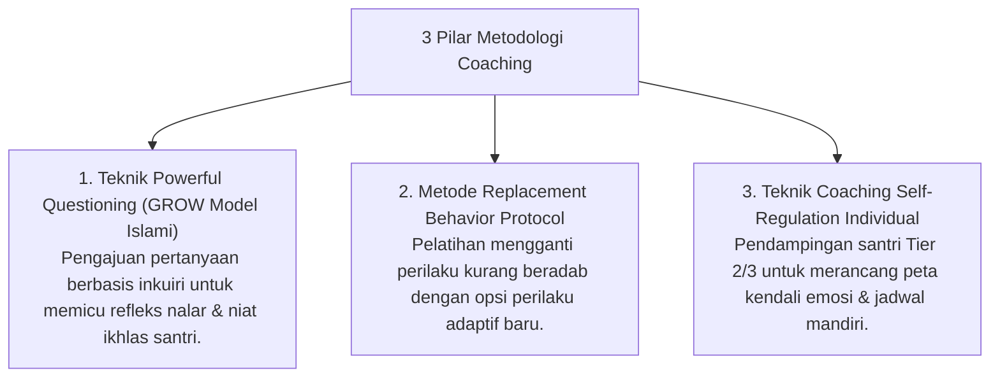

# P10-03: Metodologi Coaching

## Status Dokumen
* **Status**: 🌟 **A+ (Tervalidasi & Siap Diimplementasikan)**
* **Sub-Domain**: `10 Methods / 03 Coaching Methods`
* **Penanggung Jawab Keilmuan**: Dewan Keilmuan TUMBUH (*Pakar Pedagogi Master Guru & Pakar Bimbingan Konseling*)

---

## 1. Konseptualisasi Metodologi Behavioral Coaching

Metodologi Coaching (*Coaching Methods*) berfokus pada memfasilitasi santri menemukan potensi diri, merumuskan solusi mandiri (*Self-Directed Learning*), dan memperkuat regulasi diri (*Self-Regulation*):

---

## 2. Kemandirian Regulasi Diri

Coaching menggeser ketergantungan dorongan luar menjadi kemandirian kesadaran fitrah santri.
