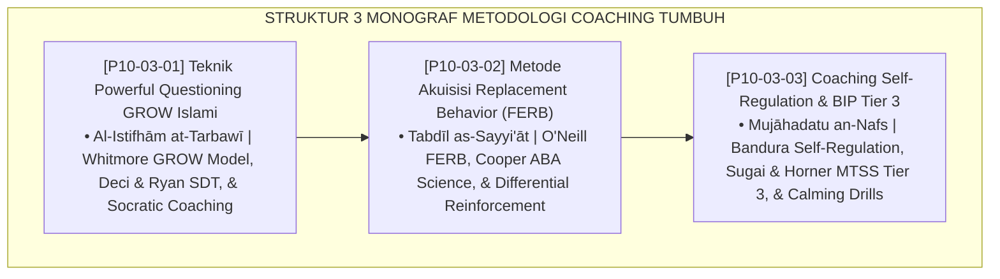

# P10-03: DOKUMEN INDUK METODOLOGI COACHING PESANTREN
## *Arsitektur dan Standarisasi Teknik Powerful Questioning Inquiry Model GROW Islami, Metode Pelatihan dan Akuisisi Perilaku Pengganti Adaptif Fungsional (FERB), Serta Teknik Pendampingan Coaching Regulasi Diri dan Rencana Intervensi Perilaku Klinis (Tier 3 BIP) sebagai Tiga Pilar Metodologi Coaching Karakter (Islamic GROW Coaching Form MET-GROWCoaching, FERB Acquisition Form MET-FERBAkuisisi, Serta Self-Regulation BIP Form MET-BIPCoaching) di Ekosistem TUMBUH Pesantren*

**Nomor Identifikasi**: `P10-03/DOKUMEN-INDUK-METODOLOGI-COACHING/2026`  
**Domain**: `10 Methods` > `03 Coaching Methods` (Gugus Sub-Domain 03: *Coaching, Behavioral Modification, & Self-Regulation Methods*)  
**Klasifikasi Naskah**: *Master Architecture & Navigation Monograph*  
**Rumpun Disiplin Pengkaji**: Executive Coaching (Whitmore), Applied Behavior Analysis (Cooper), MTSS/PBIS Tier 3 (Sugai & Horner), Fiqh Al-Hiwar wa Riyadhitin Nafs  

---

> ### 💡 INTISARI EKSEKUTIF
>
> * **Kedudukan Strategis Gugus Metodologi Coaching:** Gugus ini adalah akselerator kemandirian dan pembiasaan adab tingkat lanjut (*the self-regulation & behavior transformation engine*) di ekosistem TUMBUH. Menggeser pola pembinaan dari ceramah direktif yang otoriter dan sanksi skorsing punitif menuju dialog inkuiri Sokratik yang memberdayakan akal budi, pengajaran perilaku pengganti yang fungsional, dan pelatihan regulasi sistem saraf emosi mandiri (*From Prescriptive Moralizing to Socratic Self-Mastery*), gugus ini memastikan santri memiliki lokus kendali internal (*Internal Locus of Control*) yang kokoh berlandaskan tauhid (*Empowered Fitrah, Resilient Character*).
> * **Triad Metodologi Coaching TUMBUH:** (1) **Teknik Powerful Questioning GROW Islami** (Ghāyah, Rūh, Options, Will & Tawakkal) untuk membangkitkan kesadaran intrinsik santri, (2) **Metode Akuisisi Replacement Behavior Adaptif (FERB)** berbasis ABA untuk substitusi kebiasaan buruk secara presisi, dan (3) **Coaching Self-Regulation BIP Tier 3** untuk intervensi klinis individual tanpa skorsing-DO.
> * **3 Monograf Riset Komprehensif:** Form MET-GROWCoaching, Form MET-FERBAkuisisi, dan Form MET-BIPCoaching.

---

## 📑 PETA NAVIGASI TIGA MONOGRAF

---

## 📚 DESKRIPSI RINGKAS 3 BERKAS MONOGRAF

1. **[P10-03-01: Teknik Powerful Questioning Inquiry GROW Islami](file:///c:/xampp/htdocs/tumbuh/10%20Methods/03%20Coaching%20Methods/P10-03-01-Teknik-Powerful-Questioning-Inquiry-GROW-Islami.md)**  
   *SOP 4 tahap GROW Islami (Ghāyah, Rūh, Options, Will & Tawakkal), bank pertanyaan berdaya pemantik nalar, lembar komitmen aksi coaching, dan Form MET-GROWCoaching.*
2. **[P10-03-02: Metode Akuisisi Replacement Behavior Adaptif](file:///c:/xampp/htdocs/tumbuh/10%20Methods/03%20Coaching%20Methods/P10-03-02-Metode-Akuisisi-Replacement-Behavior-Adaptif.md)**  
   *Protokol 3 tahap akuisisi FERB (identifikasi fungsi dasar, pemilihan alternatif setara, simulasi role-play 5 mnt + DRA apresiasi 4:1), matriks konversi perilaku, dan Form MET-FERBAkuisisi.*
3. **[P10-03-03: Teknik Coaching Self-Regulation dan BIP Tier 3](file:///c:/xampp/htdocs/tumbuh/10%20Methods/03%20Coaching%20Methods/P10-03-03-Teknik-Coaching-Self-Regulation-dan-BIP-Tier-3.md)**  
   *Protokol 4 langkah (pemetaan pemicu A-B-C, latihan nafas 4-7-8 & ta'awwudz, kartu pantau mandiri meja belajar, evaluasi step-down transisi ke Tier 1), template BIP klinis, dan Form MET-BIPCoaching.*

---

## 🎯 STANDAR PENJAMINAN MUTU COACHING

Penerapan gugus **Metodologi Coaching** menjamin bahwa:
1. **Santri Menemukan Solusi dan Tanggung Jawab Moral dari Diri Sendiri (*Autonomous Agency Guarantee*)**: Coaching GROW melatih nalar reflektif tanpa perlu pendiktean.
2. **Kebiasaan Buruk Digantikan Secara Sistematis Tanpa Relaps (*Sustainable Behavior Substitution Guarantee*)**: FERB memastikan kebutuhan dasar anak tersalurkan lewat adab beradab.
3. **Santri Berisiko Tinggi Dipulihkan Tanpa Ancaman Dikeluarkan (*Zero Expulsion Restoration Guarantee*)**: BIP Tier 3 dan coaching regulasi diri menjamin pemulihan fitrah anak.
