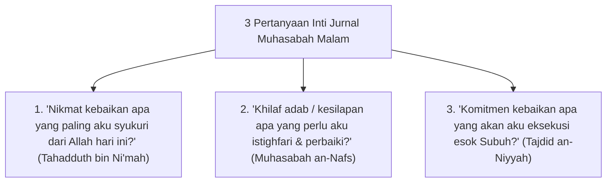

# P10-04-01: Teknik Jurnal Refleksi Malam 3 Pertanyaan Muhasabah

## Status Dokumen
* **Status**: 🌟 **A+ (Tervalidasi & Siap Diimplementasikan)**
* **Sub-Domain**: `10 Methods / 04 Reflection Methods`
* **Penanggung Jawab Keilmuan**: Dewan Keilmuan TUMBUH (*Pakar Epistemologi Turats & Pakar Bimbingan Konseling*)

---

## 1. Operasionalisasi Jurnal Refleksi Malam 3-Pertanyaan

Jurnal Refleksi Malam dilaksanakan selama 10 menit (21.40 - 21.50) dalam suasana kamar yang tenang & redup:

---

## 2. Penghapusan Unsur Penilaian Subjektif Musyrif

Musyrif tidak menilai atau memberi nilai angka pada isi jurnal refleksi malam, melainkan cukup memverifikasi keterisian jurnal secara empati.
