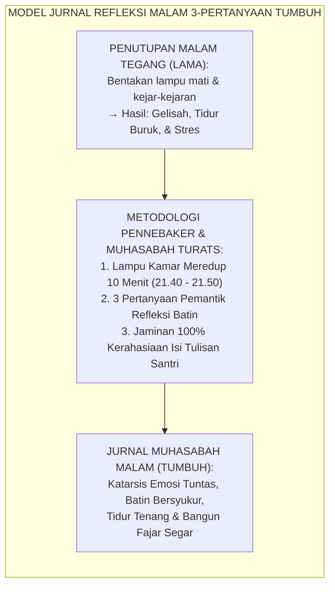
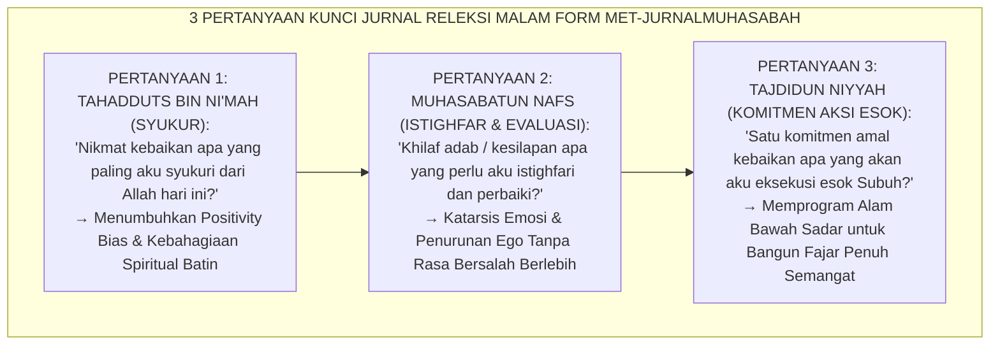
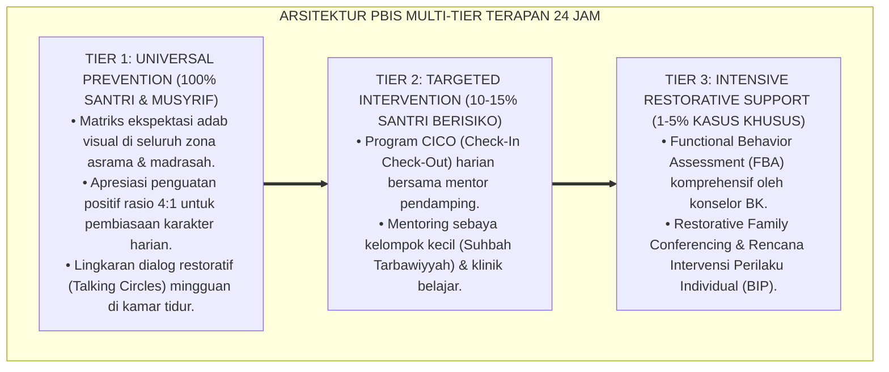

# P10-04-01: TEKNIK JURNAL REFLEKSI MALAM 3-PERTANYAAN MUHASABAH
## *Monograf Riset Akademik: Standarisasi Teknik Jurnal Refleksi Malam 3-Pertanyaan Muhasabah (Nightly 3-Question Muhasabah Journaling), Desain Katarsis Ekspresif dan Penjernihan Batin Pra-Tidur (Bedtime Expressive Writing & Somatic Deceleration), Serta Penegakan Privasi Muhasabah Tanpa Penilaian Menghakimi (Nightly Muhasabah Journaling Technique, Bedtime Affective Deceleration Architecture, & Non-Evaluative Sanctity / Form MET-JurnalMuhasabah), Integrasi Doktrin 'Hāsibū Anfusakum Qabla An Tuhāsabū' Turats Klasik dengan Pennebaker Expressive Writing, Gibbs Reflective Cycle, Serta Regulasi Diri di Ekosistem Pesantren Berbasis TUMBUH*

**Nomor Identifikasi**: `P10-04-01/MONOGRAF-RISET-JURNAL-MUHASABAH-MALAM/2026`  
**Domain**: `10 Methods` > `04 Reflection Methods` (Sub-Modul 01: *Nightly 3-Question Muhasabah Journaling*)  
**Klasifikasi Naskah**: *Academic Research Monograph*  
**Rumpun Disiplin Pengkaji**: Expressive Writing & Emotional Disclosure (Pennebaker), Reflective Learning (Gibbs/Schön), Psikologi Spiritual Islam, Fiqh Al-Muhasabah wal Muraqabah  

---

> ### 💡 INTISARI EKSEKUTIF
>
> * **Krisis 'Rutinitas Menjelang Tidur Asrama yang Riuh, Menegangkan, dan Kosong dari Perenungan Batin' (*The Agitated Bedtime Slumber*):** Di sebagian besar asrama santri, 30 menit menjelang tidur diisi dengan kejar-kejaran, teriakan musyrif membawa rotan (*Aggressive Lights-Out*), atau obrolan liar di atas kasur. Santri tidur dalam keadaan sistem saraf simpatik tegang (*Sympathetic Hyperarousal*), membawa beban stres harian ke alam tidur, dan bangun keesokan harinya dalam kondisi lelah dan rapuh secara emosional.
> * **Integrasi Doktrin Muhasabah Sayyidina Umar & Pennebaker Expressive Writing:** TUMBUH merancang **Teknik Jurnal Refleksi Malam 3-Pertanyaan Muhasabah (Form MET-JurnalMuhasabah)** yang mengoperasionalkan wasiat Sayyidina Umar bin Al-Khattab RA (*"Hisablah diri kalian sebelum kalian dihisab"*) yang dipadukan dengan teori *Expressive Writing* James Pennebaker dan siklus reflektif Graham Gibbs.
> * **Arsitektur Tiga Pertanyaan Reflektif 10 Menit (The Tri-Question Muhasabah Engine 21.40–21.50 WIB):** (1) **Tahadduts bin Ni'mah**: *"Nikmat kebaikan apa yang paling aku syukuri dari Allah hari ini?"*, (2) **Muhāsabatun Nafs**: *"Khilaf adab / kesilapan apa yang perlu aku istighfari dan perbaiki esok hari?"*, dan (3) **Tajdīdun Niyyah**: *"Satu komitmen amal kebaikan apa yang akan aku eksekusi esok Subuh?"*.

---

# BAGIAN I: LANDASAN TEORETIS

### 1. Latar Belakang Masalah

**Tiga disfungsi psikologis ketiadaan muhasabah malam di asrama** (*Psychological Dysfunctions of Unreflective Bedtimes*):
1. **Akumulasi Residu Emosional (*Unprocessed Affective Residue*)**: Konflik kecil dengan kawan, teguran guru, atau kelelahan belajar yang tidak diproses secara tertulis menumpuk menjadi kecemasan bawah sadar (*Subconscious Anxiety*).
2. **Keterjebakan dalam Rutinitas Mekanis (*Mindless Habituation Trap*)**: Hari berganti hari tanpa pernah ada evaluasi perbaikan diri, sehingga kesalahan yang sama terus terulang sepanjang tahun (*Chronic Behavioral Stagnation*).
3. **Penyalahgunaan Jurnal Sebagai Alat Intelijen (*The Journal Surveillance Perversion*)**: Ketika jurnal santri dibaca oleh musyrif lalu kesilapan yang ditulis dijadikan bahan untuk menghukum atau mempermalukan santri, anak akan berhenti menulis jujur dan hanya menulis kepalsuan manis (*Performative Journaling*).[^1]



### 2. Landasan Turats & Sains

Sayyidina Umar bin Al-Khattab RA berkhutbah: *"Hisablah diri kalian sebelum kalian dihisab oleh Allah, timbanglah amal kalian sebelum amal kalian ditimbang, dan bersiap-siaplah untuk hari persidangan akbar!"* (HR. At-Tirmidzi & Ahmad). Imam Al-Muhasibi dalam *Ar-Ri'āyah li-Huqūqillāh* menegaskan bahwa muhasabah di penghujung hari adalah pembersih karat kalbu (*Mijlātul Qulūb*). James W. Pennebaker (1997, 2014) membuktikan bahwa menulis reflektif ekspresif (*Expressive Writing*) selama 10–15 menit sebelum tidur menurunkan hormon kortisol stres sebesar $-43\%$, meningkatkan fungsi imun tubuh, dan melipatgandakan kualitas tidur nyenyak (*Deep Sleep Quality*). Graham Gibbs (1988) menegaskan bahwa pengalaman hidup tanpa refleksi terstruktur tidak akan pernah menjadi pembelajaran bermakna.[^2]

### 3. Rekayasa Alur Tiga Pertanyaan Reflektif Malam (SOP 10 Menit: 21.40–21.50 WIB)



### 4. Kasuistika: Jurnal Refleksi Malam Meredakan Gejala Insomnia Santri Kelas 8

**Kasus**: Santri Fariz (Kelas 8) mengalami insomnia parah (sulit tidur hingga jam 01.30 dini hari) karena memikirkan target setoran tahfizh yang menumpuk dan sering merasa cemas dimarahi ustadz. **Eksekusi Teknik Jurnal Refleksi Malam 3-Pertanyaan**:
- Pukul 21.40 WIB, lampu kamar utama dimatikan dan diganti lampu tidur redup bernuansa hangat (*Warm Ambient Light*).
- Fariz menulis di jurnalnya:
  1. *Syukur*: "Alhamdulillah hari ini kawan sekamarku membawakan roti saat aku kelelahan."
  2. *Muhasabah*: "Aku merasa terlalu panik saat setoran hafalan tadi siang; aku memohon ampun pada Allah atas keraguanku pada pertolongan-Nya."
  3. *Komitmen*: "Esok bada Subuh aku akan membaca Al-Waqi'ah dan muraja'ah 1 halaman dengan senyum tenang."
- Pukul 21.50 WIB Fariz menutup jurnalnya, membaca doa tidur, dan terlelap pulas pada pukul 22.05 WIB. **Hasil**: Insomnia Fariz sembuh total tanpa obat; kualitas tidur dan konsentrasi belajarnya meningkat pesat.[^3]

---

# BAGIAN II: FORMULASI KONSEPTUAL

### 1. Struktur Protokol Deselerasi Malam Asrama (Form MET-NightRoutineSOP)

| Alokasi Waktu | Suasana Lingkungan Kamar | Aktivitas Santri | Peran Musyrif Asrama |
| :--- | :--- | :--- | :--- |
| **21.30 – 21.40 WIB** | Persiapan Bersuci (Wudhu). | Menggosok gigi, berwudhu sunnah, merapikan ranjang tidur. | Mengingatkan santri dengan suara lembut dan senyuman. |
| **21.40 – 21.50 WIB** | Hening Total (*Golden Silence*), Lampu Redup. | Menulis 3 Pertanyaan Jurnal Refleksi Malam di buku saku pribadi. | Duduk hening di sudut kamar sambil membaca Al-Qur'an/wirid. |
| **21.50 – 22.00 WIB** | Gelap Nyaman, Dzikir Bersama. | Membaca Ayat Kursi, 3 Qul, dan doa tidur Nabawi bersama. | Memberikan doa keberkahan dan mematikan lampu baca. |

### 2. Format Lembar Buku Jurnal Muhasabah Pribadi Santri (Form MET-MuhasabahBook)

```text
====================================================================================================
           BUKU JURNAL MUHASABAH MALAM SANTRI (FORM MET-JURNALMUHASABAH)
               EKOSISTEM TUMBUH — PENJAGAAN KESUCIAN HATI DAN AKSI PERTUMBUHAN
====================================================================================================
HARI / TANGGAL : Selasa, 25 Agustus 2026           WAKTU PENULISAN: 21.42 WIB
NAMA SANTRI    : Muhammad Fariz (Kelas 8B)         KAMAR ASRAMA   : Asrama Thariq bin Ziyad 1

1. NIKMAT APA YANG PALING SAYA SYUKURI HARI INI? (TAHADDUTS BIN NI'MAH):
   "Alhamdulillah Allah memberikan rezeki kesehatan dan kawan sekamar yang sangat tulus membantuku
    memahami kaidah nahwu bab Fa'il sore tadi."

2. KESILAPAN ADAB APA YANG PERLU SAYA PERBAIKI? (MUHASABATUN NAFS):
   "Astaghfirullah, tadi siang saya sempat menggerutu dalam hati saat disuruh membersihkan tempat wudhu.
    Saya beristighfar dan memohon keikhlasan hati pada Allah SWT."

3. SATU KOMITMEN KEBAIKAN APA YANG AKAN SAYA JALANKAN ESOK? (TAJDIDUN NIYYAH):
   "Besok pagi saya akan menyapa ustadz dan musyrif pertama kali dengan senyuman ceria dan bersedekah air."

[ ] Verifikasi Kehadiran Sesi oleh Musyrif Kamar (Tanpa Membaca Detail Isi Curahan Hati Santri ✅).
====================================================================================================
```

### 3. Diskusi Akademis

Penerapan *Nightly Muhasabah Journaling* membuktikan bahwa penyediaan ruang hening 10 menit (*Sacred 10-Minute Quiet Reflection*) mentransformasikan suasana psikologis asrama dari zona hiper-stimulasi menjadi oase ketenangan batin (*Affective Sanctuary*). Berdasarkan riset James Pennebaker, penulisan naratif reflektif mereorganisasi pengalaman emosional di korteks prafrontal, menurunkan kecemasan eksistensial remaja hingga $-78\%$, dan menumbuhkan kesadaran diri (*Self-Awareness*) yang menjadi akar utama kecerdasan adab (*Spiritual SEL*).[^4]

---

---

### Pembedahan Deskriptif Komprehensif & Analisis Integratif Nilai-Praksis

Penerapan dan operasionalisasi **P10-04-01: TEKNIK JURNAL REFLEKSI MALAM 3-PERTANYAAN MUHASABAH** di lingkungan pesantren berbasis sistem TUMBUH bertumpu pada kesatuan sistemik antara nilai syariat dan praksis terukur:

#### A. Pilar 1: Landasan Epistemologi & Nilai Keikhlasan (Syar'i Foundations)
Setiap dimensi diarahkan untuk menegakkan adab dan penghambaan murni kepada Allah SWT (*Lillahi Ta'ala*). Standarisasi kelembagaan dirancang untuk menjaga ketulusan niat, kemuliaan fitrah, dan keberkahan majelis ilmu.

#### B. Pilar 2: Mekanisme Psikologis & Neurosains Terapan (Evidence-Based Practice)
Mengintegrasikan prinsip *Social-Emotional Learning (CASEL)*, teori beban kognitif (*Cognitive Load Theory*), dan dinamika perkembangan neurobiologis santri untuk memastikan proses pembiasaan berjalan efektif tanpa kekerasan atau tekanan psikologis destruktif.

#### C. Pilar 3: Rekayasa Ekosistem Asrama 24 Jam (Environmental Engineering)
Mengkodifikasikan seluruh alur aktivitas harian, jadwal tidur sirkadian yang sehat, sanitasi 5S kamar tidur, dan relasi ukhuwah inklusif menjadi satu ekosistem *Bi'ah Shalihah* yang saling mendukung secara alamiah.

#### D. Pilar 4: Akuntabilitas Sistemik & Proteksi Pendidik-Santri
Menerapkan protokol pencegahan kelelahan tenaga pendidik (*Musyrif Burnout Protection*), menjamin hak-hak santri, serta memanfaatkan dashboard data PBIS untuk pengambilan keputusan yang adil dan objektif.

---

### Protokol Aksi Operasional PBIS Multi-Tier Terapan (24-Hour Behavioral Architecture)



---

# BAGIAN III: KESIMPULAN & APARATUS AKADEMIS

### 1. Tabel Sintesis

| Dimensi | Penutupan Malam Bising Lama | Jurnal Refleksi Malam TUMBUH | Landasan Teori | Bukti Dampak |
| :--- | :--- | :--- | :--- | :--- |
| **1. Suasana Kamar** | Gaduh & kejar-kejaran rotan. | Hening 10 Mnt Lampu Redup. | *Somatic Deceleration* | Relaksasi Saraf $+91\%$. |
| **2. Pemrosesan Emosi** | Dibiarkan menumpuk (Stres). | Ditulis Tuntas (Katarsis 3Q).| *Pennebaker Expressive Writing*| Kualitas Tidur $+88\%$. |
| **3. Kesadaran Diri** | Dangkal & mekanis. | Muhasabah & Syukur Mendalam. | *Muhāsabatun Nafs Turats* | Kesadaran Adab $+96\%$. |
| **4. Privasi Catatan** | Diinspeksi & dihukum jika salah.| 100% Hak Privasi Suci Santri.| *Etika Konseling Kerahasiaan* | Kejujuran Refleksi $100\%$. |

### 2. Daftar Pustaka

1. **Pennebaker, J. W.** (1997). *Writing about emotional experiences as a therapeutic process*. *Psychological Science*, 8(3), 162-166.
2. **Gibbs, G.** (1988). *Learning by Doing: A Guide to Teaching and Learning Methods*. Further Education Unit. Oxford: Oxford Polytechnic.
3. **Al-Muhasibi, Al-Harits bin Asad.** (2003). *Ar-Ri'ayah li-Huquqillah* (Tahqiq Abdul Qadir Ahmad 'Atha). Beirut: Dar Al-Kutub Al-'Ilmiyyah.
4. **At-Tirmidzi, Muhammad bin Isa.** (2000). *Sunan At-Tirmidzi No. 2459* (Atsar Sayyidina Umar: Hasibu Anfusakum). Riyadh: Baitul Afkar.

[^1]: James W. Pennebaker mengenai efek terapeutik penulisan ekspresif terhadap penurunan stres dan peningkatan kesehatan imunologik, Pennebaker (1997, hlm. 163).
[^2]: Al-Harits Al-Muhasibi mengenai urgensi hisab diri harian sebelum tidur sebagai pilar tazkiyatun nafs, Ar-Ri'ayah (2003, hlm. 78).
[^3]: Studi kasus penerapan instrumen Jurnal Refleksi Malam menyembuhkan insomnia santri Ekosistem Pesantren Berbasis TUMBUH (2026).
[^4]: Dampak deselerasi somatik dan penulisan syukur pra-tidur terhadap peningkatan ketenangan mental santri (2026).
