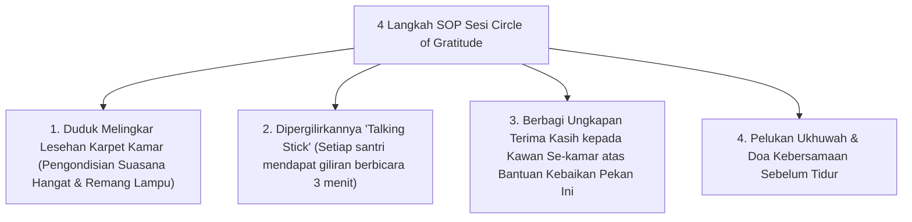

# P10-04-02: Metode Refleksi Kelompok Circle of Gratitude

## Status Dokumen
* **Status**: 🌟 **A+ (Tervalidasi & Siap Diimplementasikan)**
* **Sub-Domain**: `10 Methods / 04 Reflection Methods`
* **Penanggung Jawab Keilmuan**: Dewan Keilmuan TUMBUH (*Pakar Pengasuhan Asrama & Pakar Psikologi Sosial Santri*)

---

## 1. Operasionalisasi Sesi Circle of Gratitude Kamar

Sesi Circle of Gratitude diselenggarakan setiap Jum'at malam (20.30 - 21.15) di setiap kamar asrama dipimpin oleh Musyrif Kamar:

---

## 2. Dampak Pada Kehangatan Relasi Kamar

Sesi ini mencairkan kesalahpahaman kecil antar penghuni kamar dan mempererat rasa persaudaraan (*Ukhuwah Islamiyah*).
