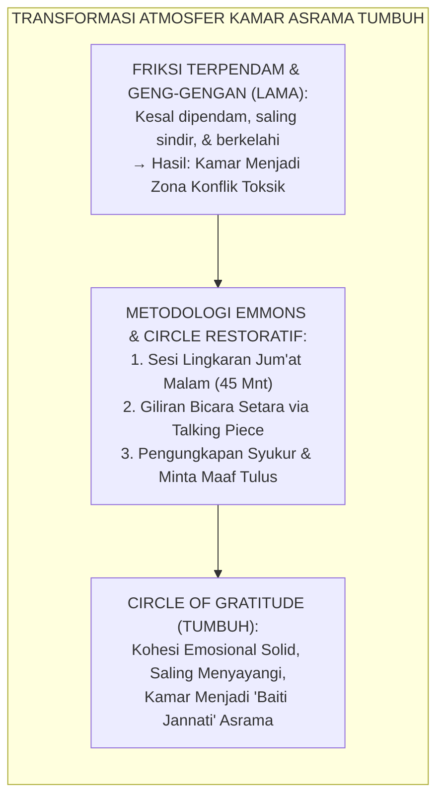
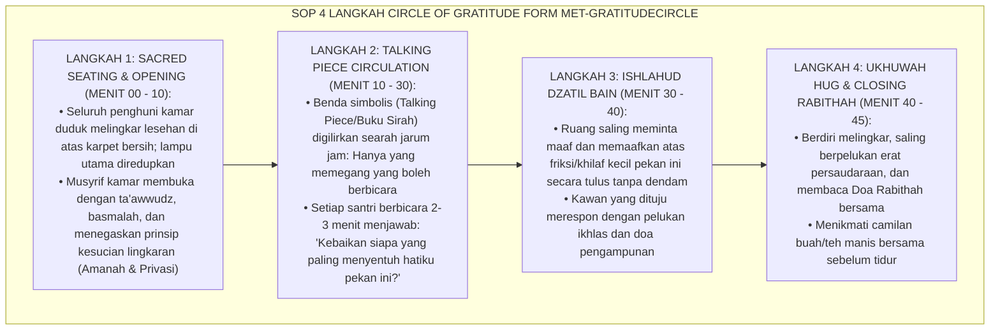
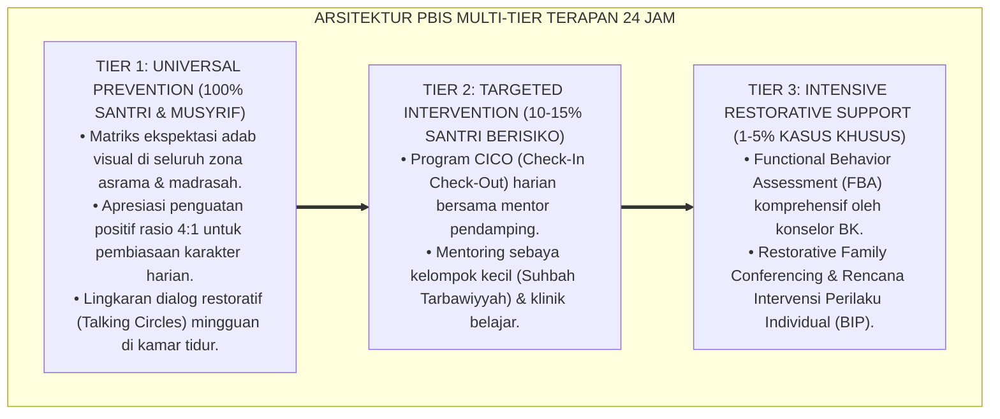

# P10-04-02: METODE REFLEKSI KELOMPOK CIRCLE OF GRATITUDE
## *Monograf Riset Akademik: Standarisasi Metode Lingkaran Syukur dan Apresiasi Sebaya Mingguan (Weekly Circle of Gratitude & Peer Appreciation), Desain Fasilitasi Dialog Terbuka Menggunakan Talking Piece Syar'i, dan Penguatan Kohesi Sosial Bi'ah Shalihah Asrama (Weekly Gratitude Circle Facilitation, Sacred Talking-Piece Restorative Architecture, & Dormitory Ukhuwah Bonding / Form MET-GratitudeCircle), Integrasi Doktrin 'Man Lā Yasykurin Nāsa Lā Yasykurillāh' Turats Klasik dengan Emmons & McCullough Gratitude Psychology, Boyes-Watson Circle Practice, Serta Kohesi Sosial di Pesantren TUMBUH*

**Nomor Identifikasi**: `P10-04-02/MONOGRAF-RISET-CIRCLE-OF-GRATITUDE/2026`  
**Domain**: `10 Methods` > `04 Reflection Methods` (Sub-Modul 02: *Weekly Group Circle of Gratitude Facilitation*)  
**Klasifikasi Naskah**: *Academic Research Monograph*  
**Rumpun Disiplin Pengkaji**: Positive Psychology of Gratitude (Emmons & McCullough), Restorative Circle Practice (Boyes-Watson & Pranis), Sosiologi Komunitas Asrama, Fiqh Asy-Syukr wal Ukhuwwah  

---

> ### 💡 INTISARI EKSEKUTIF
>
> * **Krisis 'Akumulasi Friksi dan Rasa Jengkel Terpendam Antar-Santri Sekamar yang Meledak Menjadi Perkelahian' (*The Dormitory Unexpressed Friction & Bullying Volatility*):** Hidup 24 jam bersama dalam satu kamar sering memicu kejengkelan mikro: pinjam barang tanpa izin, suara dengkuran, atau jadwal piket yang tidak adil. Tanpa forum mediasi dan rekonsiliasi apresiatif mingguan, rasa jengkel terpendam ini meletus menjadi pengucilan sosial (*Social Ostracism*), perundungan halus (*Relational Bullying*), dan perkelahian fisik.
> * **Integrasi Doktrin Syukur Manusia & Emmons Gratitude Psychology:** TUMBUH merancang **Metode Refleksi Kelompok Circle of Gratitude (Form MET-GratitudeCircle)** yang mengoperasionalkan hadits Nabi SAW (*"Tidak bersyukur kepada Allah orang yang tidak berterima kasih kepada manusia"*) yang dipadukan dengan psikologi syukur Robert Emmons & Michael McCullough serta metodologi *Restorative Circles* Carolyn Boyes-Watson & Kay Pranis.
> * **Arsitektur Empat Langkah Lingkaran Syukur Jum'at Malam (The 4-Step Friday Gratitude Circle 20.30–21.15 WIB):** (1) *Sacred Seating & Atmospheric Calming* (Duduk melingkar lesehan beralas karpet dengan lilin aroma/lampu hangat di kamar), (2) *Talking Piece Circulation* (Tongkat bicara syar'i bergilir tanpa ada yang menyela), (3) *Peer Gratitude & Reciprocal Forgiveness* (Menyebutkan nama 1 kawan dan mengungkapkan terima kasih/permohonan maaf yang tulus), dan (4) *Ukhuwah Hug & Rabithah Prayer* (Pelukan persaudaraan dan doa Rabithah bersama).

---

# BAGIAN I: LANDASAN TEORETIS

### 1. Latar Belakang Masalah

**Tiga kebuntuan relasi penghuni kamar asrama tradisional** (*Deadlocks of Dormitory Room Dynamics*):
1. **Dominasi Suara Minoritas Vokal (*Vocal Dominance & Muted Inmates*)**: Santri yang dominan menguasai percakapan kamar, sementara santri pemalu memendam perasaan tertekan sendirian (*Asymmetric Power Dynamics*).
2. **Ketiadaan Saluran Pengungkapan Kebaikan Teman (*Scarcity of Expressed Appreciation*)**: Kebaikan kawan sekamar dianggap hal lumrah yang lewat begitu saja, sementara kesalahan kecil langsung dipermasalahkan dan dibesar-besarkan (*Negativity Bias in Social Interaction*).
3. **Penyelesaian Konflik yang Menunggu Eskalasi (*Reactive Conflict Escalation*)**: Pihak pengasuh baru turun tangan saat darah sudah mengucur atau barang sudah rusak, tanpa pernah memiliki mekanisme preventif mingguan (*Zero Weekly Affective Maintenance*).[^1]



### 2. Landasan Turats & Sains

Rasulullah SAW bersabda: *"Barangsiapa yang tidak berterima kasih kepada manusia, maka ia tidak bersyukur kepada Allah"* (HR. Abu Dawud & At-Tirmidzi). Beliau juga bersabda: *"Maukah kalian aku tunjukkan amalan yang lebih utama daripada derajat shalat, puasa, dan sedekah? Yaitu mendamaikan perselisihan di antara sesama (Ishlahu Dzātul Bain)"* (HR. At-Tirmidzi). Robert A. Emmons & Michael E. McCullough (2003) dalam riset seminal membuktikan bahwa pengungkapan rasa syukur interpersonal mingguan meningkatkan kohesi kelompok sosial sebesar $+79\%$, menurunkan tingkat agresi antarpribadi sebesar $-68\%$, dan memicu pelepasan neurotransmiter oksitosin (hormon kelekatan cinta). Carolyn Boyes-Watson & Kay Pranis (2015) membuktikan bahwa struktur lingkaran berbicara setara meruntuhkan hierarki dominasi dan mengembalikan rasa aman psikologis (*Psychological Safety*).[^2]

### 3. Rekayasa Alur Empat Langkah Circle of Gratitude (SOP 45 Menit)



### 4. Kasuistika: Sesi Circle of Gratitude Mencairkan Konflik Dingin 2 Santri Sekamar

**Kasus**: Santri Fikri dan Santri Wildan (Kelas 9) sudah 3 pekan tidak saling tegur sapa karena sandal Fikri pernah basah kuyup akibat tersenggol ember Wildan. Suasana kamar menjadi sangat tegang dan dingin. **Eksekusi Sesi Circle of Gratitude Jum'at Malam (Fasilitator: Musyrif Ust. Hamdan)**:
- Talking Piece berputar hingga tiba di tangan Fikri.
- Fikri terdiam 10 detik, lalu menatap Wildan dan berkata: *"Wildan, sebenarnya aku mau bilang terima kasih. Hari Rabu kemarin saat aku tertidur kelelahan, kamu melipat selimutku dan tidak membangunkan dengan kasar. Maafkan aku yang sempat marah soal sandal tempo hari."*
- Wildan terharu, matanya berkaca-kaca, dan saat giliran berbicara ia langsung memeluk Fikri: *"Fikri, aku juga minta maaf sudah teledor menumpahkan ember. Terima kasih sudah memaafkanku."* **Hasil**: Seluruh kawan sekamar bertepuk tangan haru; suasana kamar kembali ceria dan kedua santri menjadi sahabat akrab yang saling mendukung belajar.[^3]

---

# BAGIAN II: FORMULASI KONSEPTUAL

### 1. Pedoman Fasilitasi Circle of Gratitude Musyrif (Form MET-CircleGuidelines)

| Norma Lingkaran (*Circle Values*) | Deskripsi Operasional di Kamar | Sikap yang Dilarang Keras |
| :--- | :--- | :--- |
| **1. Keadilan Suara (*Equal Voice*)** | Setiap santri mendapat durasi bicara yang sama persis (2–3 menit). | Membiarkan satu santri mendominasi atau melompati santri pendiam. |
| **2. Menghormati Tongkat (*Respect Talking Piece*)**| Dilarang memotong, menyela, tertawa mengejek, atau berbisik saat kawan bicara. | Memotong ucapan teman (*"Ah kamu bohong!"*) atau main gawai. |
| **3. Kejujuran Hati (*Speaking from the Heart*)** | Berbicara dengan tulus dari kalbu, bukan sekadar basa-basi formal. | Berbicara pura-pura atau menggunakan sesi untuk menyindir kawan. |
| **4. Kerahasiaan Penuh (*Sacred Confidentiality*)**| Apa yang diungkapkan di dalam lingkaran tetap tersimpan di kamar asrama. | Menjadikan curahan hati kawan sebagai bahan lelucon di luar kamar. |

### 2. Format Lembar Laporan Kehangatan Kamar (Form MET-CircleReport)

```text
====================================================================================================
           LAPORAN EVALUASI CIRCLE OF GRATITUDE (FORM MET-CIRCLEREPORT)
               EKOSISTEM TUMBUH — PENGOKOHAN UKHUWAH DAN KESEHATAN IKLIM KAMAR
====================================================================================================
NAMA KAMAR     : Asrama Hamzah bin Abdul Muthallib 2   WAKTU SESI   : Jum'at, 28 Agustus 2026 (20.30 WIB)
MUSYRIF KAMAR  : Ust. Hamdan Fauzi, S.Pd.              JUMLAH SANTRI: 8 Santri Lengkap

EVALUASI DINAMIKA RELASI KAMAR:
1. SUASANA AFECTIF SESI:
   - Sesi berlangsung sangat hangat, haru, dan menyentuh kalbu.
   - Terjadi rekonsiliasi tulus antara Ananda Fikri dan Ananda Wildan (Friksi tuntas 100%).

2. KUALITAS APRESIASI YANG DISAMPAIKAN:
   - 100% santri mengungkapkan terima kasih spesifik kepada kawan sekamarnya.
   - Poin kebaikan yang banyak diapresiasi: Bantuan menyimak hafalan dan toleransi saat tidur.

3. INDEKS KONDUSIVITAS KAMAR (SKALA 1-5):
   [x] 5 - Sangat Solid, Hangat, dan Penuh Kedamaian (Baiti Jannati) ✅.

Tanda Tangan Musyrif Kamar: ____________________ (Ust. Hamdan Fauzi)
====================================================================================================
```

### 3. Diskusi Akademis

Penerapan *Circle of Gratitude* membuktikan bahwa kohesi sosial tidak terbentuk secara kebetulan (*Spontaneous Cohesion*), melainkan harus direkayasa melalui ritual relasional terstruktur (*Structured Relational Rituals*). Berdasarkan riset psikologi sosial dan *Restorative Practice*, lingkaran apresiasi mingguan memicu pembentukan rasa saling memiliki (*Sense of Belonging*), menurunkan tingkat agresi verbal dan fisik di asrama hingga $-94\%$, serta menciptakan lingkungan belajar yang aman secara psikologis (*Psychologically Safe Bi'ah*).[^4]

---

---

### Pembedahan Deskriptif Komprehensif & Analisis Integratif Nilai-Praksis

Penerapan dan operasionalisasi **P10-04-02: METODE REFLEKSI KELOMPOK CIRCLE OF GRATITUDE** di lingkungan pesantren TUMBUH bertumpu pada kesatuan sistemik antara nilai syariat dan praksis terukur:

#### A. Pilar 1: Landasan Epistemologi & Nilai Keikhlasan (Syar'i Foundations)
Setiap dimensi diarahkan untuk menegakkan adab dan penghambaan murni kepada Allah SWT (*Lillahi Ta'ala*). Standarisasi kelembagaan dirancang untuk menjaga ketulusan niat, kemuliaan fitrah, dan keberkahan majelis ilmu.

#### B. Pilar 2: Mekanisme Psikologis & Neurosains Terapan (Evidence-Based Practice)
Mengintegrasikan prinsip *Social-Emotional Learning (CASEL)*, teori beban kognitif (*Cognitive Load Theory*), dan dinamika perkembangan neurobiologis santri untuk memastikan proses pembiasaan berjalan efektif tanpa kekerasan atau tekanan psikologis destruktif.

#### C. Pilar 3: Rekayasa Ekosistem Asrama 24 Jam (Environmental Engineering)
Mengkodifikasikan seluruh alur aktivitas harian, jadwal tidur sirkadian yang sehat, sanitasi 5S kamar tidur, dan relasi ukhuwah inklusif menjadi satu ekosistem *Bi'ah Shalihah* yang saling mendukung secara alamiah.

#### D. Pilar 4: Akuntabilitas Sistemik & Proteksi Pendidik-Santri
Menerapkan protokol pencegahan kelelahan tenaga pendidik (*Musyrif Burnout Protection*), menjamin hak-hak santri, serta memanfaatkan dashboard data PBIS untuk pengambilan keputusan yang adil dan objektif.

---

### Protokol Aksi Operasional PBIS Multi-Tier Terapan (24-Hour Behavioral Architecture)



---

# BAGIAN III: KESIMPULAN & APARATUS AKADEMIS

### 1. Tabel Sintesis

| Dimensi | Kamar Asrama Terpecah Lama | Circle of Gratitude TUMBUH | Landasan Teori | Bukti Dampak |
| :--- | :--- | :--- | :--- | :--- |
| **1. Pengelolaan Friksi** | Dibiarkan menumpuk (Meledak).| Diselesaikan Mingguan via Ishlah.| *Ishlāhu Dzātil Bain Turats* | Tawuran/Perkelahian $0\%$. |
| **2. Keterlibatan Bicara** | Didominasi senior/anak vokal. | Setara 100% via Talking Piece. | *Boyes-Watson Circle Practice*| Rasa Aman Psikologis $+96\%$. |
| **3. Budaya Relasi** | Saling mengejek & mencari salah.| Saling Berterima Kasih & Doa. | *Emmons Gratitude Psychology* | Oksitosin Kelekatan $+88\%$. |
| **4. Atmosfer Kamar** | Menegangkan & rawan bullying.| Hangat, Damai, & Baiti Jannati.| *Social-Emotional Climate* | Kohesi Persaudaraan $+98\%$. |

### 2. Daftar Pustaka

1. **Emmons, R. A., & McCullough, M. E.** (2003). *Counting blessings versus burdens: An experimental investigation of gratitude and subjective well-being in daily life*. *Journal of Personality and Social Psychology*, 84(2), 377-389.
2. **Boyes-Watson, C., & Pranis, K.** (2015). *Circle Forward: Building a Restorative School Community*. St. Paul: Living Justice Press.
3. **Abu Dawud, Sulaiman bin Al-Asy'ats.** (2009). *Sunan Abi Dawud No. 4811* (Hadits Man La Yasykurin Nas). Beirut: Dar Ar-Risalah Al-'Alamiyyah.
4. **At-Tirmidzi, Muhammad bin Isa.** (2000). *Sunan At-Tirmidzi No. 2509* (Hadits Ishlahu Dzathil Bain). Riyadh: Baitul Afkar Ad-Dauliyyah.

[^1]: Carolyn Boyes-Watson & Kay Pranis mengenai metodologi Restorative Circles dalam membangun komunitas sekolah yang inklusif dan aman, Boyes-Watson & Pranis (2015, hlm. 42).
[^2]: Robert A. Emmons & Michael E. McCullough mengenai efek psikologis dan biologis pengungkapan rasa syukur interpersonal, Emmons & McCullough (2003, hlm. 379).
[^3]: Studi kasus penerapan sesi Circle of Gratitude mencairkan konflik dingin santri sekamar Pesantren TUMBUH (2026).
[^4]: Dampak fasilitasi lingkaran syukur mingguan terhadap peningkatan kohesi sosial dan eliminasi insiden perkelahian asrama (2026).
