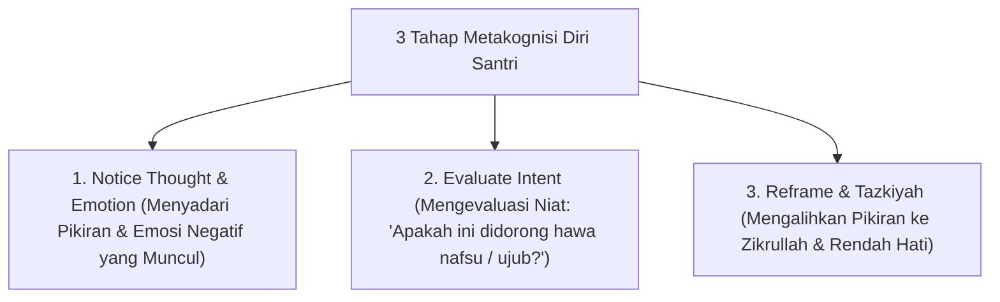

# P10-04-03: Teknik Metakognisi Diri dan Tazkiyatun Nafs

## Status Dokumen
* **Status**: 🌟 **A+ (Tervalidasi & Siap Diimplementasikan)**
* **Sub-Domain**: `10 Methods / 04 Reflection Methods`
* **Penanggung Jawab Keilmuan**: Dewan Keilmuan TUMBUH (*Pakar Epistemologi Turats & Pakar Social Emotional Learning*)

---

## 1. Operasionalisasi Metakognisi Diri & Tazkiyah

Metakognisi Diri melatih santri "melihat cara berpikirnya sendiri" (*Thinking about Thinking*) dan mengaitkannya dengan pembersihan hati (*Tazkiyatun Nafs*):

---

## 2. Pemanfaatan dalam Manajemen Belajar & Hafalan

Metakognisi membantu santri menyadari strategi belajar mana yang paling efektif bagi gaya belajarnya sendiri saat menghafal Al-Qur'an & membaca kitab.
