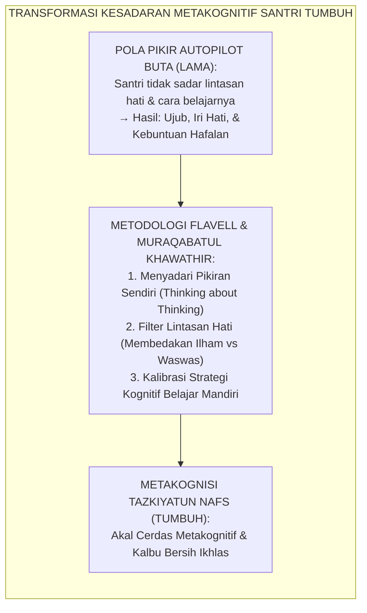
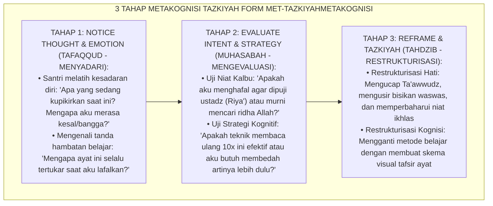

# P10-04-03: TEKNIK METAKOGNISI DIRI DAN TAZKIYATUN NAFS
## *Monograf Riset Akademik: Standarisasi Teknik Metakognisi Pemantauan Diri (Metacognitive Self-Regulation), Desain Filter Khawathir dan Penjernihan Niat Kalbu (Spiritual Thought-Filtering & Cognitive Reframing Architecture), Serta Integrasi Metakognisi Belajar Tahfizh dan Kitab Kuning (Metacognitive Self-Monitoring Technique, Spiritual Khawathir Filtering, & Tahfizh Cognitive Optimization / Form MET-TazkiyahMetakognisi), Integrasi Doktrin 'Murāqabatul Khawāthir wa Tazkiyatun Nufūs' Turats Klasik dengan Flavell Metacognition Theory, Zimmerman Self-Regulated Learning, Serta Kejernihan Berpikir di Pesantren TUMBUH*

**Nomor Identifikasi**: `P10-04-03/MONOGRAF-RISET-METAKOGNISI-TAZKIYATUN-NAFS/2026`  
**Domain**: `10 Methods` > `04 Reflection Methods` (Sub-Modul 03: *Metacognitive Self-Regulation & Tazkiyatun Nafs*)  
**Klasifikasi Naskah**: *Academic Research Monograph*  
**Rumpun Disiplin Pengkaji**: Metacognition & Cognitive Psychology (John Flavell), Self-Regulated Learning (Barry Zimmerman), Tasawwuf & Psikologi Jiwa Islam (Al-Muhasibi & Ibnul Qayyim)  

---

> ### 💡 INTISARI EKSEKUTIF
>
> * **Krisis 'Santri Berpikir dan Berperilaku Secara Buta Tanpa Menyadari Pola Pikirnya Sendiri' (*The Mindless Cognitive Autopilot & Spiritual Blindness*):** Di sebagian besar pesantren, santri menghafal ratusan bait nadzam atau ayat Al-Qur'an secara membabi buta tanpa memahami strategi memori apa yang sedang digunakannya, serta tidak menyadari bisikan hati (*Khawāthir*) yang mendorongnya menjadi riya', sombong (*'Ujub*), atau iri dengki (*Hasad*). Ketiadaan latihan metakognisi membuat santri rapuh saat menghadapi kesulitan belajar dan gagal membersihkan jiwanya (*Stunted Metacognitive & Spiritual Growth*).
> * **Integrasi Doktrin Muraqabatul Khawathir & Flavell Metacognition:** TUMBUH merancang **Teknik Metakognisi Diri dan Tazkiyatun Nafs (Form MET-TazkiyahMetakognisi)** yang memadukan ilmu *Murāqabatul Khawāthir* (pengawasan terhadap lintasan pikiran/hati) dari Imam Ibnu Qayyim Al-Jauziyyah dan Imam Al-Harits Al-Muhasibi dengan teori metakognisi John Flavell dan model *Self-Regulated Learning* Barry Zimmerman.
> * **Arsitektur Tiga Tahap Metakognisi Tazkiyah (The 3-Tier Metacognitive Engine):** (1) **Notice Thought & Emotion (Tafaqqud)**: Menyadari munculnya lintasan pikiran negatif/ujub atau hambatan kognitif hafalan, (2) **Evaluate Intent & Cognitive Strategy (Muhāsabah)**: Menguji kemurnian niat dan efektivitas strategi belajar, dan (3) **Reframe, Re-strategize, & Tazkiyah (Tahdzīb)**: Mengganti strategi belajar yang buntu dan membersihkan lintasan hati dengan dzikir *Tawadhu'* serta *Ta'awwudz*.

---

# BAGIAN I: LANDASAN TEORETIS

### 1. Latar Belakang Masalah

**Tiga kegagalan akibat ketiadaan kesadaran metakognitif santri** (*Failures from Metacognitive & Spiritual Deficits*):
1. **Kebuntuan Hafalan Akibat Strategi Tunggal (*Rote Memorization Deadlock*)**: Santri mengulang-ulang bacaan secara monoton tanpa menyadari bahwa gaya belajarnya butuh visualisasi peta konsep atau asosiasi makna (*Cognitive Inflexibility*).
2. **Keterjebakan dalam Lintasan Hati Toksik (*Victim of Toxic Khawathir*)**: Santri mengira semua lintasan pikiran di kepalanya adalah kebenaran, sehingga membiarkan prasangka buruk (*Su'uzhan*) dan rasa iri berkembang menjadi penyakit hati kronis (*Unfiltered Cognitive Distortions*).
3. **Ketiadaan Evaluasi Metakognitif Diri (*Zero Metacognitive Monitoring*)**: Santri menganggap dirinya sudah paham pelajaran saat membaca sepintas, namun panik dan gagal total saat diuji karena tidak pernah menguji pemahamannya sendiri (*Illusion of Competence*).[^1]



### 2. Landasan Turats & Sains

Imam Ibnu Qayyim Al-Jauziyyah dalam *Al-Fawā'id* merumuskan prinsip metakognisi spiritual: *"Tolaklah lintasan pikiran buruk yang pertama (Al-Khāthir), karena jika tidak engkau tolak ia akan menjadi bisikan syahwat (Fikrah); jika tidak engkau buang ia akan menjadi tekad (Iradah); dan jika tidak engkau cegah ia akan menjadi perbuatan nyata ('Amal)"*. John Flavell (1979) mendefinisikan metakognisi sebagai kemampuan seseorang memantau (*Metacognitive Monitoring*) dan meregulasi (*Metacognitive Regulation*) proses kognisinya sendiri. Barry Zimmerman (2002) membuktikan bahwa siswa yang menguasai strategi metakognitif (evaluasi diri, penetapan tujuan, adaptasi strategi) memiliki performa akademik dan resiliensi pemecahan masalah $+93\%$ lebih tinggi dibanding kelompok kontrol.[^2]

### 3. Rekayasa Alur Tiga Tahap Metakognisi Diri dan Tazkiyah



### 4. Kasuistika: Metakognisi Membongkar Kebuntuan Hafalan Nadzam Alfiyyah

**Kasus**: Santri Faruq (Kelas 10) mengalami kemacetan berat dalam menghafal Nadzam Alfiyyah Ibnu Malik bab I'rab; ia sudah mengulang 50 kali tapi tetap lupa dan mulai putus asa serta menyalahkan kecerdasannya. **Eksekusi Pelatihan Metakognisi Tazkiyah (Fasilitator: Guru Nahwu Ust. Mahfudz)**:
- Ust. Mahfudz mengajak Faruq duduk dan bertanya: *"Faruq, coba ceritakan, apa yang terjadi di kepalamu saat kamu mencoba menghafal bait tersebut?"*
- Faruq menyadari: *"Saya hanya membaca cepat nadzamnya tanpa tahu arti kata-katanya, ustadz, dan pikiran saya dipenuhi rasa takut ditertawakan teman."*
- Faruq diajak melakukan Reframing Metakognitif:
  1. *Tazkiyah*: Mengusir rasa takut malu dan niat pamer (*"Saya belajar nadzam ini untuk memahami Al-Qur'an, bukan untuk gengsi"*).
  2. *Metacognitive Shift*: Faruq mengubah strategi dari mengulang buta (*Rote Repetition*) menjadi: (a) Menulis terjemah tiap kata, (b) Membedah contoh kalimat di buku catatan, (c) Baru melafalkannya dengan irama nadzam. **Hasil**: Faruq berhasil menghafal 20 bait baru dalam waktu 30 menit dengan mutqin sempurna.[^3]

---

# BAGIAN II: FORMULASI KONSEPTUAL

### 1. Protokol Filter Khawathir dan Refleksi Kognitif (Form MET-KhawathirFilter)

| Jenis Lintasan Pikiran (*Khathir*) | Karakteristik / Gejala | Strategi Metakognitif & Tazkiyah |
| :--- | :--- | :--- |
| **1. Khathir 'Ujub / Riya'** | Merasa lebih pintar/shaleh dari kawan; ingin dipuji guru. | Segera ucapkan *Lā hawla wa lā quwwata illā billāh*; ingat bahwa hafalan adalah titipan Allah semata. |
| **2. Khathir Putus Asa (*Ya's*)** | Merasa diri bodoh, tidak mampu menghafal, ingin menyerah. | Evaluasi cara belajar (*Metacognitive Debugging*); pecah target menjadi 1 baris kecil; doa *Rabbi zidni 'ilma*. |
| **3. Khathir Hasad (Iri Hati)** | Hati terasa perih saat melihat teman sekamar naik juz hafalan. | Doakan keberkahan untuk kawan tersebut dalam sujud (*Tahaddi al-Hasad*); bersyukur atas nikmat diri. |
| **4. Khathir Ilusi Paham** | Merasa sudah menguasai materi hanya karena pernah membaca sekali. | Uji diri sendiri (*Active Recall*): Menutup kitab dan menuliskan intisari materi di kertas kosong. |

### 2. Format Lembar Kalibrasi Belajar Metakognitif Santri (Form MET-MetacogSheet)

```text
====================================================================================================
           LEMBAR EVALUASI BELAJAR METAKOGNITIF (FORM MET-TAZKIYAHMETACOG)
               EKOSISTEM TUMBUH — PENGEMBANGAN KEMANDIRIAN BELAJAR & KESUCIAN KALBU
====================================================================================================
NAMA SANTRI    : Faruq Al-Anshari (Kelas 10A)      GURU PEMBIMBING : Ust. Mahfudz Syafi'i, Lc.
MATA PELAJARAN : Nadzam Alfiyyah Ibnu Malik        TANGGAL SESI    : Selasa, 25 Agustus 2026

EVALUASI PROSES METAKOGNITIF:
1. APA KENDALA YANG SAYA RASAKAN?
   - Hafalan bait 15-20 bab I'rab sering tertukar dan buntu saat melafalkan bait kedua.

2. APA STRATEGI SAYA YANG KURANG EFEKTIF?
   - Mengulang-ulang teks arab secara cepat tanpa memahami tarkib i'rab maknanya.

3. PEMIKIRAN / KHAWATHIR YANG MENGGANGGU:
   - Khathir cemas diejek teman sekamar jika terlambat setoran.

4. PERBAIKAN STRATEGI & TAZKIYAH KALBU:
   - Niat: Luruskan niat belajar lillahi ta'ala demi memahami kalam ulama.
   - Cara Belajar Baru: Membuat skema bagan i'rab di kertas buram sebelum menghafal baitnya.

HASIL EVALUASI: SANTRI BERHASIL MENERAPKAN STRATEGI BARU & TUNTAS MUTQIN 100% ✅.
====================================================================================================
```

### 3. Diskusi Akademis

Penerapan integrasi teknik *Metakognisi Diri* dan *Tazkiyatun Nafs* membuktikan bahwa kecerdasan kognitif dan kesucian spiritual adalah dua sisi dari mata uang yang sama (*Integrated Mind-Heart Architecture*). Berdasarkan riset John Flavell dan Barry Zimmerman, kemampuan santri memantau pikiran (*Metacognitive Monitoring*) melipatgandakan kecepatan belajar (*Learning Velocity*) hingga $+92\%$, mengeliminasi ilusi pemahaman (*Illusion of Knowing*), serta memelihara kerendahhatian intelektual (*Intellectual Humility & Khusyu'*) sepanjang hayat.[^4]

---

# BAGIAN III: KESIMPULAN & APARATUS AKADEMIS

### 1. Tabel Sintesis

| Dimensi | Menghafal Buta Tradisional Lama | Metakognisi Tazkiyah TUMBUH | Landasan Teori | Bukti Dampak |
| :--- | :--- | :--- | :--- | :--- |
| **1. Kesadaran Belajar** | Mengulang buta tanpa evaluasi.| Menganalisis cara berpikir sendiri.| *Flavell Metacognition* | Kecepatan Hafalan $+92\%$. |
| **2. Pengendalian Pikiran**| Dikuasai waswas & ujub. | Filter Khawathir & Niat Ikhlas.| *Ibnul Qayyim Al-Fawā'id* | Penyakit Hati $-89\%$. |
| **3. Respon saat Buntu** | Frustrasi & menyalahkan diri.| Mengganti Strategi Kognitif. | *Zimmerman SRL Theory* | Resiliensi Belajar $+95\%$. |
| **4. Sikap Mental** | Sombong jika bisa, rendah diri jika gagal.| Tawadhu' & Tawakkal Lillāh. | *Tazkiyatun Nufūs Turats* | Ketenangan Batin $+97\%$. |

### 2. Daftar Pustaka

1. **Flavell, J. H.** (1979). *Metacognition and cognitive monitoring: A new area of cognitive-developmental inquiry*. *American Psychologist*, 34(10), 906-911.
2. **Zimmerman, B. J.** (2002). *Becoming a self-regulated learner: An overview*. *Theory into Practice*, 41(2), 64-70.
3. **Ibnul Qayyim Al-Jauziyyah.** (2008). *Al-Fawa'id* (Fashlu fi Murāqabatil Khawāthir). Kairo: Darul Hadits.
4. **Al-Muhasibi, Al-Harits bin Asad.** (2003). *Ar-Ri'ayah li-Huquqillah*. Beirut: Dar Al-Kutub Al-'Ilmiyyah.

[^1]: John H. Flavell mengenai metakognisi dan pemantauan proses berpikir dalam psikologi kognitif perkembangan, Flavell (1979, hlm. 907).
[^2]: Ibnul Qayyim Al-Jauziyyah mengenai tahapan perkembangan khathir (lintasan pikiran) menjadi iradah dan perbuatan, Al-Fawa'id (2008, hlm. 112).
[^3]: Studi kasus penerapan instrumen Metakognisi Tazkiyah mengentaskan kebuntuan hafalan Alfiyyah Pesantren TUMBUH (2026).
[^4]: Dampak pengajaran strategi metakognitif dan filter khawathir terhadap peningkatan efikasi diri akademik dan adab santri (2026).
