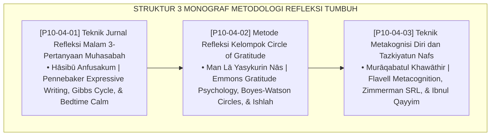

# P10-04: DOKUMEN INDUK METODOLOGI REFLEKSI PESANTREN
## *Arsitektur dan Standarisasi Teknik Jurnal Refleksi Malam 3-Pertanyaan Muhasabah, Metode Lingkaran Syukur dan Apresiasi Sebaya (Circle of Gratitude), Serta Teknik Metakognisi Diri dan Penjernihan Batin Tazkiyatun Nafs sebagai Tiga Pilar Metodologi Refleksi dan Muhasabah (Nightly Muhasabah Form MET-JurnalMuhasabah, Gratitude Circle Form MET-GratitudeCircle, Serta Metacognitive Tazkiyah Form MET-TazkiyahMetakognisi) di Ekosistem TUMBUH Pesantren*

**Nomor Identifikasi**: `P10-04/DOKUMEN-INDUK-METODOLOGI-REFLEKSI/2026`  
**Domain**: `10 Methods` > `04 Reflection Methods` (Gugus Sub-Domain 04: *Reflection, Muhasabah, & Metacognitive Methods*)  
**Klasifikasi Naskah**: *Master Architecture & Navigation Monograph*  
**Rumpun Disiplin Pengkaji**: Expressive Writing (Pennebaker), Restorative Circles (Boyes-Watson), Metacognitive Regulation (Flavell), Fiqh Al-Muhasabah wal Muraqabah  

---

> ### 💡 INTISARI EKSEKUTIF
>
> * **Kedudukan Strategis Gugus Metodologi Refleksi:** Gugus ini adalah cermin kejernihan batin dan metakognisi pembelajar (*the reflective mirror & spiritual consciousness engine*) di ekosistem TUMBUH. Memastikan bahwa kehidupan pesantren tidak berjalan secara autopilot yang hampa makna, gugus ini menyediakan ruang hening terstruktur untuk mengevaluasi diri sebelum tidur, merekatkan persaudaraan kamar melalui lingkaran syukur mingguan, serta melatih santri memantau pikiran dan menyucikan kalbunya (*From Mindless Autopilot to Deep Spiritual Metacognition*).
> * **Triad Metodologi Refleksi TUMBUH:** (1) **Jurnal Refleksi Malam 3-Pertanyaan** (Tahadduts bin Ni'mah, Muhasabah, Tajdid Niat) 10 menit pra-tidur, (2) **Circle of Gratitude** Jum'at malam 45 menit beralas karpet dengan *Talking Piece*, dan (3) **Metakognisi Diri & Tazkiyatun Nafs** untuk optimasi belajar tahfizh/kitab dan penyingkiran penyakit hati.
> * **3 Monograf Riset Komprehensif:** Form MET-JurnalMuhasabah, Form MET-GratitudeCircle, dan Form MET-TazkiyahMetakognisi.

---

## 📑 PETA NAVIGASI TIGA MONOGRAF

---

## 📚 DESKRIPSI RINGKAS 3 BERKAS MONOGRAF

1. **[P10-04-01: Teknik Jurnal Refleksi Malam 3-Pertanyaan Muhasabah](file:///c:/xampp/htdocs/tumbuh/10%20Methods/04%20Reflection%20Methods/P10-04-01-Teknik-Jurnal-Refleksi-Malam-3-Pertanyaan-Muhasabah.md)**  
   *SOP 10 menit deselerasi somatik pra-tidur (21.40-21.50 WIB), 3 pertanyaan pemantik syukur & istighfar, jaminan privasi suci tanpa penilaian subjektif, dan Form MET-JurnalMuhasabah.*
2. **[P10-04-02: Metode Refleksi Kelompok Circle of Gratitude](file:///c:/xampp/htdocs/tumbuh/10%20Methods/04%20Reflection%20Methods/P10-04-02-Metode-Refleksi-Kelompok-Circle-of-Gratitude.md)**  
   *SOP 45 menit lingkaran syukur Jum'at malam, giliran bicara setara via talking piece syar'i, resolusi ishlah antar-teman sekamar, dan Form MET-GratitudeCircle.*
3. **[P10-04-03: Teknik Metakognisi Diri dan Tazkiyatun Nafs](file:///c:/xampp/htdocs/tumbuh/10%20Methods/04%20Reflection%20Methods/P10-04-03-Teknik-Metakognisi-Diri-dan-Tazkiyatun-Nafs.md)**  
   *Protokol 3 tahap (Tafaqqud, Muhasabah, Tahdzib), filter khawathir ujub/waswas/hasad, lembar kalibrasi strategi kognitif belajar tahfizh/kitab, dan Form MET-TazkiyahMetakognisi.*

---

## 🎯 STANDAR PENJAMINAN MUTU REFLEKSI

Penerapan gugus **Metodologi Refleksi** menjamin bahwa:
1. **Santri Menutup Hari dengan Hati yang Bersih dan Tenang (*Peaceful Slumber Guarantee*)**: Jurnal muhasabah menuntaskan katarsis emosi sebelum tidur.
2. **Kamar Asrama Bebas dari Gesekan Dingin dan Permusuhan (*Ukhuwah Harmony Guarantee*)**: Circle of Gratitude memastikan setiap friksi diselesaikan mingguan.
3. **Santri Menguasai Cara Belajarnya Sendiri dan Rendah Hati (*Metacognitive Humility Guarantee*)**: Metakognisi tazkiyah membebaskan santri dari kesombongan intelektual.
