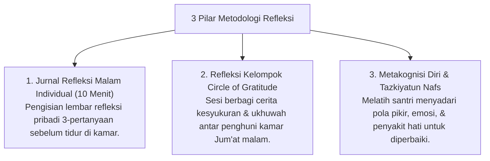

# P10-04: Metodologi Refleksi

## Status Dokumen
* **Status**: 🌟 **A+ (Tervalidasi & Siap Diimplementasikan)**
* **Sub-Domain**: `10 Methods / 04 Reflection Methods`
* **Penanggung Jawab Keilmuan**: Dewan Keilmuan TUMBUH (*Pakar Epistemologi Turats & Pakar Bimbingan Konseling*)

---

## 1. Konseptualisasi Metodologi Refleksi & Muhasabah

Metodologi Refleksi (*Reflection Methods*) dalam ekosistem **TUMBUH** disintesiskan dengan tradisi **Muhasabatun Nafs** (Introspeksi Jiwa Mandiri) dan **Tazkiyatun Nafs**:

---

## 2. Nilai Privasi & Penghormatan Karakter

Seluruh aktivitas refleksi individual dijaga kerahasiaannya untuk menciptakan ruang aman emosional (*Psychological Safety*) bagi santri.
