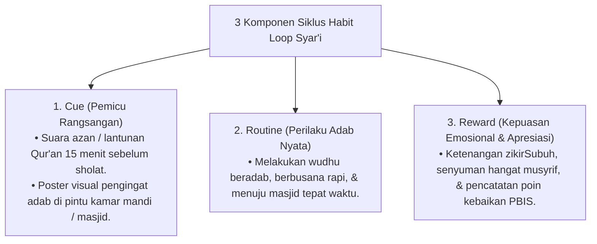

# P10-05-01: Siklus Habit Loop Cue Routine Reward Syar'i

## Status Dokumen
* **Status**: 🌟 **A+ (Tervalidasi & Siap Diimplementasikan)**
* **Sub-Domain**: `10 Methods / 05 Habit Formation`
* **Penanggung Jawab Keilmuan**: Dewan Keilmuan TUMBUH (*Pakar Neurosains Perkembangan & Pakar PBIS*)

---

## 1. Operasionalisasi Siklus Habit Loop Syar'i

Siklus Habit Loop diterapkan pada seluruh rutinitas pengasuhan 24-jam santri:

---

## 2. Penguatan Motivasi Spiritual

Reward utama diorientasikan pada rasa manisnya keimanan (*Halawatul Iman*) dan apresiasi positif musyrif (Magic Ratio 4:1).
