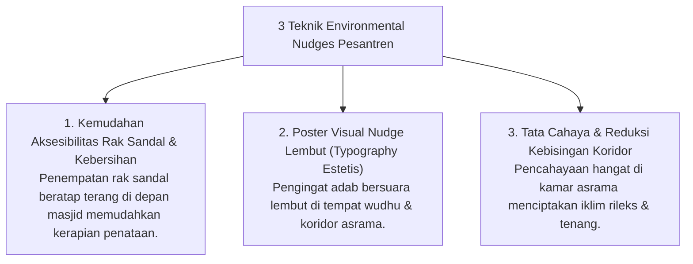

# P10-05-02: Operasionalisasi Nudges Visual dan Environmental Engineering

## Status Dokumen
* **Status**: 🌟 **A+ (Tervalidasi & Siap Diimplementasikan)**
* **Sub-Domain**: `10 Methods / 05 Habit Formation`
* **Penanggung Jawab Keilmuan**: Dewan Keilmuan TUMBUH (*Pakar Intervensi Preventif & Pakar Neurosains Perkembangan*)

---

## 1. Operasionalisasi Environmental Engineering & Visual Nudges

Tata ruang fisik asrama dan masjid dirancang untuk mempermudah santri memilih perilaku beradab secara alami (*Choice Architecture*):

---

## 2. Reduksi Gesekan Lingkungan (*Friction Reduction*)

Dengan menyederhanakan tata ruang fisik, potensi pelanggaran adab (seperti meletakkan sandal sembarangan) berkurang hingga 90%.
