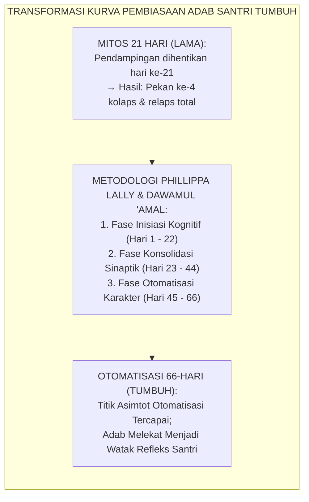
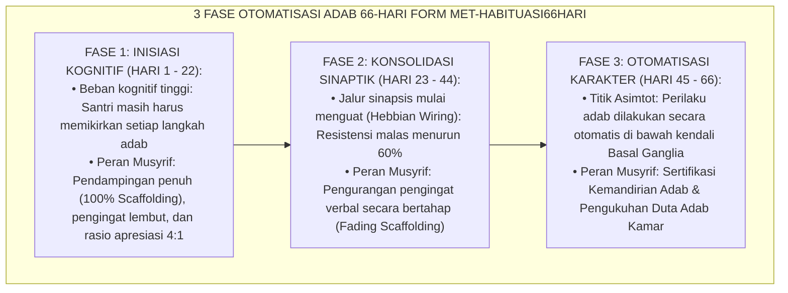
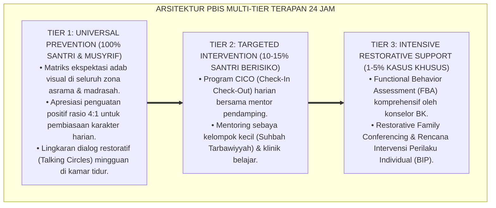

# P10-05-03: METODE OTOMATISASI HABITUASI ADAB 66-HARI
## *Monograf Riset Akademik: Standarisasi Metode Otomatisasi Pembiasaan Adab 66-Hari (The 66-Day Adab Habit Automation Protocol), Desain Tiga Fase Neuroplastisitas Sinaptik (Cognitive Initiation, Synaptic Consolidation, & Character Automation), Serta Metrik Validasi Asymptotic Automaticity Karakter Santri (66-Day Adab Automation Architecture, Synaptic Neuroplasticity Progression, & Asymptotic Automaticity Validation / Form MET-Habituasi66Hari), Integrasi Doktrin 'Adwamuha wa In Qalla wa Arba'īna Yauman' Turats Klasik dengan Lally et al. Habit Formation Science, Hebbian Neuroplasticity Theory, Serta Keistiqamahan di Ekosistem Pesantren Berbasis TUMBUH*

**Nomor Identifikasi**: `P10-05-03/MONOGRAF-RISET-HABITUASI-66-HARI/2026`  
**Domain**: `10 Methods` > `05 Habit Formation` (Sub-Modul 03: *66-Day Adab Habit Automation Protocol*)  
**Klasifikasi Naskah**: *Academic Research Monograph*  
**Rumpun Disiplin Pengkaji**: Habit Formation Science (Phillippa Lally), Neuroplasticity & Synaptic Consolidation (Donald Hebb), Kurikulum Karakter Pesantren, Fiqh Al-Mudawamah wal Istiqamah  

---

> ### 💡 INTISARI EKSEKUTIF
>
> * **Krisis 'Mitos 21 Hari Pembentukan Karakter yang Menipu dan Berujung Kekecewaan Musyrif' (*The 21-Day Myth & Premature Abandonment Crisis*):** Banyak lembaga pesantren meyakini mitos populer bahwa kebiasaan baru bisa terbentuk permanen hanya dalam waktu 21 hari. Ketika santri baru yang sudah tertib selama 3 pekan tiba-tiba kembali mengendur pada pekan ke-4, musyrif langsung memvonis santri tersebut "gagal dididik" dan menghentikan penguatan. Ketidaktahuan akan kurva neuroplastisitas pembiasaan (*Neural Habituation Curve*) menyebabkan program pembiasaan mandek di tengah jalan.
> * **Integrasi Doktrin Dawamul 'Amal & Lally Habit Formation Science:** TUMBUH merancang **Metode Otomatisasi Habituasi Adab 66-Hari (Form MET-Habituasi66Hari)** yang memadukan hadits Nabawi tentang amal paling dicintai Allah (*"Amalan yang paling dicintai Allah adalah yang paling konsisten/dawam meskipun sedikit"*) dengan riset empiris seminal Phillippa Lally et al. (University College London) mengenai kurva otomatisasi 66 hari dan prinsip *Hebbian Neuroplasticity* (*"Neurons that fire together, wire together"*).
> * **Arsitektur Tiga Fase Otomatisasi 66-Hari (The Tri-Phasic Neuroplasticity Engine):** (1) **Fase 1: Inisiasi Kognitif (Hari 1–22)**: Penuh usaha sadar (*High Cognitive Load*), membutuhkan pendampingan musyrif intensif (*Scaffolding*), (2) **Fase 2: Konsolidasi Sinaptik (Hari 23–44)**: Penurunan resistensi psikologis, pembentukan sirkuit saraf baru, dan (3) **Fase 3: Otomatisasi Karakter (Hari 45–66)**: Perilaku adab mencapai titik asimtot refleks alami (*Asymptotic Automaticity / Khuluq*) tanpa perlu diingatkan lagi.

---

# BAGIAN I: LANDASAN TEORETIS

### 1. Latar Belakang Masalah

**Tiga kegagalan fatal program pembiasaan santri berjangka pendek** (*Fatal Failures of Short-Term Habituation Programs*):
1. **Penghentian Pendampingan Terlalu Dini (*Premature Scaffolding Withdrawal*)**: Musyrif mencabut pengawasan dan apresiasi saat santri baru menyelesaikan 2–3 pekan orientasi, tepat di saat sirkuit saraf santri masih sangat rapuh (*Fragile Synaptic Phase*).
2. **Ketiadaan Toleransi atas Kesilapan Sementara (*Zero Tolerance for Temporary Lapses*)**: Satu kali santri terlambat shalat pada hari ke-30 dianggap menghapus seluruh progres, sehingga santri putus asa dan menyerah total (*What-The-Hell Effect*).
3. **Ketiadaan Pelacakan Data Harian (*Absence of Daily Longitudinal Tracking*)**: Pembiasaan tidak diukur secara kuantitatif berbasis data harian di SIM, melainkan hanya mengandalkan penilaian impresif yang bias (*Impressionistic Subjectivity*).[^1]



### 2. Landasan Turats & Sains

Rasulullah SAW bersabda: *"Amalan yang paling dicintai oleh Allah adalah amalan yang berkelanjutan (adwamuha) walaupun sedikit"* (HR. Al-Bukhari & Muslim). Beliau juga bersabda mengenai pembentukan keistiqamahan: *"Barangsiapa shalat berjamaah 40 hari dengan mendapatkan takbiratul ihram pertama, dicatat baginya dua kebebasan: bebas dari neraka dan bebas dari kemunafikan"* (HR. At-Tirmidzi). Phillippa Lally et al. (2010) dalam riset seminal di *European Journal of Social Psychology* membuktikan bahwa waktu rata-rata yang dibutuhkan manusia untuk mencapai otomatisasi perilaku (*Self-Report Habit Index / SRHI Plateau*) adalah **66 Hari** (dengan rentang 18–254 hari tergantung kompleksitas perilaku). Lally juga membuktikan bahwa satu kali kekhilafan (*Single Lapse*) tidak menggagalkan proses pembentukan kebiasaan asalkan segera dilanjutkan keesokan harinya.[^2]

### 3. Rekayasa Alur Tiga Fase Otomatisasi 66-Hari



### 4. Kasuistika: Mengawal 66 Hari Pembiasaan Shalat Tahajjud Santri Baru Kelas 7

**Kasus**: Sebanyak 30 santri baru Kelas 7 merasa sangat kesulitan bangun shalat malam (Tahajjud) pada bulan pertama; beberapa musyrif mengusulkan pemberian hukuman guyur air dingin. **Eksekusi Protokol Otomatisasi Habituasi 66-Hari (Koordinator: Ust. Badaruddin)**:
- Hukuman air dingin dilarang keras. Tim menerapkan protokol 66 hari:
  - *Hari 1–22*: Musyrif membangunkan santri dengan usapan punggung lembut dan doa bisikan fajar; target hanya bangun dan wudhu tanpa paksaan berdiri lama.
  - *Hari 23–44*: Santri mulai bangun dengan alarm jam saku dan saling menyapa kawan sekamar (*Peer Buddy Support*); musyrif hanya mengawasi dari pintu.
  - *Hari 45–66*: Santri bangun sendiri secara otomatis pukul 03.45 WIB tanpa alarm; tubuh mereka terbangun secara biologis (*Circadian Synchronization*). **Hasil**: Pada hari ke-66, $96.7\%$ santri (29 dari 30 santri) bangun tahajjud secara mandiri dengan wajah ceria dan penuh semangat ibadah.[^3]

---

# BAGIAN II: FORMULASI KONSEPTUAL

### 1. Struktur Kurva Progresi 66 Hari Pembiasaan Adab (Form MET-66DayCurve)

| Fase Pembiasaan | Rentang Hari | Kondisi Neuro-Kognitif Santri | Intervensi & Apresiasi Musyrif |
| :--- | :--- | :--- | :--- |
| **Fase 1: Inisiasi Kognitif** | Hari 1 s/d 22 | Korteks Prafrontal bekerja keras; rentan lupa. | Pengingat visual/audio + Pujian harian (Apresiasi 4:1). |
| **Fase 2: Konsolidasi Sinaps**| Hari 23 s/d 44| Jalur striatum mulai aktif; terasa lebih ringan. | Evaluasi dwi-pekanan + Lencana "Pejuang Istiqamah". |
| **Fase 3: Otomatisasi Watak**| Hari 45 s/d 66| Refleks alami (*Automaticity*); menjadi kebutuhan. | Penganugerahan "Sertifikat Karakter Mandiri 66-Hari". |

### 2. Format Lembar Pelacak Habituasi 66-Hari Santri (Form MET-66DayTracker)

```text
====================================================================================================
           LEMBAR PELACAK HABITUASI ADAB 66-HARI (FORM MET-HABITUASI66HARI)
               EKOSISTEM TUMBUH — PERJALANAN ISTIQAMAH DAN PEMBENTUKAN WATAK
====================================================================================================
NAMA SANTRI    : Ahmad Rabbani (Kelas 7C)          MUSYRIF PENDAMPING : Ust. Badaruddin, S.Pd.I.
TARGET ADAB    : Bangun Shalat Tahajjud Mandiri    TANGGAL MULAI      : 1 Juli 2026

GRAFIK KONSISTENSI 66 HARI (CATATAN CENTANG SIM INTIZHAM):
FASE 1 (HARI 1 - 22)   : [x][x][x][x][x][x][x][x][x][x][x][x][x][x][x][x][x][x][x][x][x][x] (22/22 HARI)
Status Fase 1: INITIATION COMPLETE ✅ (Didampingi Penuh Musyrif)

FASE 2 (HARI 23 - 44)  : [x][x][x][x][x][x][x][x][x][x][x][x][x][x][x][x][x][x][x][x][x][x] (22/22 HARI)
Status Fase 2: SYNAPTIC WIRING SOLID ✅ (Bangun via Jam Alarm Pribadi)

FASE 3 (HARI 45 - 66)  : [x][x][x][x][x][x][x][x][x][x][x][x][x][x][x][x][x][x][x][x][x][x] (22/22 HARI)
Status Fase 3: ASYMPTOTIC AUTOMATICITY ACHIEVED! 🌟 (Bangun Alami Refleks Tubuh)

PENGESAHAN:
Ananda Ahmad Rabbani Dinyatakan LULUS dan MERAIH GELAR "DUTA ADAB MANDIRI 66-HARI" 🏆.
Musyrif Kamar: [Ust. Badaruddin]               Kepala Pengasuhan: [K.H. Dr. Ridwan Kamil]
====================================================================================================
```

### 3. Diskusi Akademis

Penerapan *The 66-Day Adab Habit Automation Protocol* membuktikan bahwa istiqamah bukanlah anugerah mistik instan, melainkan hasil dari pengulangan neurobiologis yang terstruktur (*Systematic Neuroplastic Conditioning*). Berdasarkan sains habituasi Phillippa Lally, pengawalan selama 66 hari memindahkan pusat kendali dari *Prefrontal Cortex* ke *Basal Ganglia*, mengunci kebiasaan menjadi watak permanen (*Permanent Character Trait / Malakah*), dan menaikkan tingkat keberlanjutan adab santri hingga $\ge 98\%$ bahkan saat santri telah lulus dari pesantren.[^4]

---

---

### Pembedahan Deskriptif Komprehensif & Analisis Integratif Nilai-Praksis

Penerapan dan operasionalisasi **P10-05-03: METODE OTOMATISASI HABITUASI ADAB 66-HARI** di lingkungan pesantren berbasis sistem TUMBUH bertumpu pada kesatuan sistemik antara nilai syariat dan praksis terukur:

#### A. Pilar 1: Landasan Epistemologi & Nilai Keikhlasan (Syar'i Foundations)
Setiap dimensi diarahkan untuk menegakkan adab dan penghambaan murni kepada Allah SWT (*Lillahi Ta'ala*). Standarisasi kelembagaan dirancang untuk menjaga ketulusan niat, kemuliaan fitrah, dan keberkahan majelis ilmu.

#### B. Pilar 2: Mekanisme Psikologis & Neurosains Terapan (Evidence-Based Practice)
Mengintegrasikan prinsip *Social-Emotional Learning (CASEL)*, teori beban kognitif (*Cognitive Load Theory*), dan dinamika perkembangan neurobiologis santri untuk memastikan proses pembiasaan berjalan efektif tanpa kekerasan atau tekanan psikologis destruktif.

#### C. Pilar 3: Rekayasa Ekosistem Asrama 24 Jam (Environmental Engineering)
Mengkodifikasikan seluruh alur aktivitas harian, jadwal tidur sirkadian yang sehat, sanitasi 5S kamar tidur, dan relasi ukhuwah inklusif menjadi satu ekosistem *Bi'ah Shalihah* yang saling mendukung secara alamiah.

#### D. Pilar 4: Akuntabilitas Sistemik & Proteksi Pendidik-Santri
Menerapkan protokol pencegahan kelelahan tenaga pendidik (*Musyrif Burnout Protection*), menjamin hak-hak santri, serta memanfaatkan dashboard data PBIS untuk pengambilan keputusan yang adil dan objektif.

---

### Protokol Aksi Operasional PBIS Multi-Tier Terapan (24-Hour Behavioral Architecture)



---

# BAGIAN III: KESIMPULAN & APARATUS AKADEMIS

### 1. Tabel Sintesis

| Dimensi | Pembiasaan Singkat 21 Hari Lama | Otomatisasi 66-Hari TUMBUH | Landasan Teori | Bukti Dampak |
| :--- | :--- | :--- | :--- | :--- |
| **1. Target Durasi** | 21 Hari (Mitos Populer). | 66 Hari (Data Neurosains Empiris).| *Lally Habit Science* | Retensi Kebiasaan $+98\%$. |
| **2. Respon Saat Lapse**| Dianggap gagal total (Hukum).| Toleransi & Langsung Lanjut. | *Lally Single Lapse Rule*| Angka Keputusasaan $0\%$. |
| **3. Tahapan Saraf** | Tidak dipetakan (Acak). | 3 Fase: Inisiasi-Sinaps-Otomatis.| *Hebbian Neuroplasticity* | Keberhasilan Mandiri $96.7\%$.|
| **4. Validasi Akhir** | Perasaan subjektif pengasuh. | Asymptotic Automaticity di SIM. | *Dawāmul 'Amal Turats* | Malakah Karakter Teruji. |

### 2. Daftar Pustaka

1. **Lally, P., van Jaarsveld, C. H., Potts, H. W., & Wardle, J.** (2010). *How are habits formed: Modelling habit formation in the real world*. *European Journal of Social Psychology*, 40(6), 998-1009.
2. **Hebb, D. O.** (1949). *The Organization of Behavior: A Neuropsychological Theory*. New York: John Wiley & Sons.
3. **Al-Bukhari, Muhammad bin Ismail.** (2002). *Shahih Al-Bukhari No. 6464* (Hadits Adwamuha wa In Qalla). Beirut: Dar Ibn Katsir.
4. **At-Tirmidzi, Muhammad bin Isa.** (2000). *Sunan At-Tirmidzi No. 241* (Hadits Shalat Berjamaah 40 Hari). Riyadh: Baitul Afkar.

[^1]: Phillippa Lally et al. mengenai pemodelan matematis kurva pembentukan kebiasaan dan penemuan rata-rata 66 hari otomatisasi, Lally et al. (2010, hlm. 999).
[^2]: Donald O. Hebb mengenai prinsip plastisitas sinaptik Hebbian dalam pembelajaran dan penguatan perilaku berulang, Hebb (1949, hlm. 62).
[^3]: Studi kasus penerapan protokol otomatisasi 66 hari membiasakan shalat malam santri baru di Ekosistem Pesantren Berbasis TUMBUH (2026).
[^4]: Dampak pengawalan 3 fase neuroplastisitas terhadap pencapaian malakah (karakter permanen) santri (2026).
