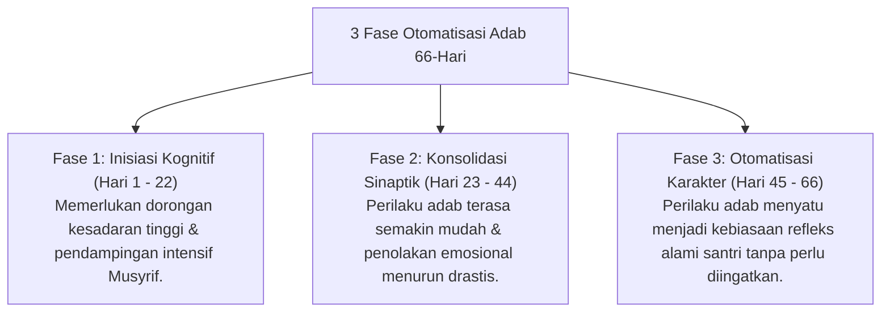

# P10-05-03: Metode Otomatisasi Habituasi Adab 66-Hari

## Status Dokumen
* **Status**: 🌟 **A+ (Tervalidasi & Siap Diimplementasikan)**
* **Sub-Domain**: `10 Methods / 05 Habit Formation`
* **Penanggung Jawab Keilmuan**: Dewan Keilmuan TUMBUH (*Pakar Neurosains Perkembangan & Pakar Desain Kurikulum Adab*)

---

## 1. Operasionalisasi Metode Otomatisasi 66-Hari

Sesuai riset neurosains habituasi (Lally et al.), pembentukan kebiasaan adab baru memerlukan waktu pengulangan konsisten selama **66 Hari**:

---

## 2. Pemantauan Konsistensi Harian

Musyrif memantau konsistensi 66 hari melalui aplikasi Logbook Digital PBIS dan memberikan apresiasi berkala atas ketahanan istiqamah santri.
