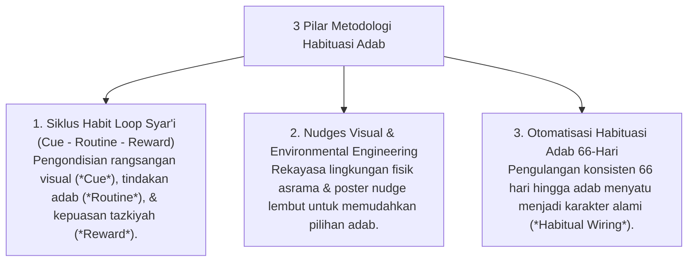

# P10-05: Metodologi Habituasi Adab

## Status Dokumen
* **Status**: 🌟 **A+ (Tervalidasi & Siap Diimplementasikan)**
* **Sub-Domain**: `10 Methods / 05 Habit Formation`
* **Penanggung Jawab Keilmuan**: Dewan Keilmuan TUMBUH (*Pakar Neurosains Perkembangan & Pakar Desain Kurikulum Adab*)

---

## 1. Konseptualisasi Metodologi Habituasi Adab

Metodologi Habituasi Adab (*Habit Formation*) merinci proses ilmiah pembentukan kebiasaan adab otomatis melalui prinsip neuroplastisitas dan ajaran Syar'i **Al-Adatu Muhakkamah** & **Istiqamah**:

---

## 2. Pengubahan Usaha Menjadi Otomatisasi

Habituasi adab menurunkan beban kognitif santri (*Cognitive Load Reduction*) sehingga perilaku beradab dapat dieksekusi secara spontan tanpa keterpaksaan.
