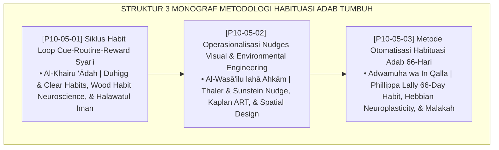

# P10-05: DOKUMEN INDUK METODOLOGI HABITUASI ADAB PESANTREN
## *Arsitektur dan Standarisasi Siklus Habit Loop Syar'i (Cue-Routine-Reward), Operasionalisasi Nudges Visual dan Rekayasa Lingkungan Fisik (Environmental Engineering), Serta Metode Otomatisasi Habituasi Adab 66-Hari sebagai Tiga Pilar Metodologi Pembentukan Kebiasaan Karakter (Syar'i Habit Loop Form MET-HabitLoop, Environmental Nudges Form MET-NudgeEngineering, Serta 66-Day Habituation Form MET-Habituasi66Hari) di Ekosistem TUMBUH Pesantren*

**Nomor Identifikasi**: `P10-05/DOKUMEN-INDUK-METODOLOGI-HABITUASI-ADAB/2026`  
**Domain**: `10 Methods` > `05 Habit Formation` (Gugus Sub-Domain 05: *Habit Formation, Environmental Engineering, & Behavioral Automaticity*)  
**Klasifikasi Naskah**: *Master Architecture & Navigation Monograph*  
**Rumpun Disiplin Pengkaji**: Habit Formation Science (Duhigg, Clear, Lally), Nudge Theory (Thaler & Sunstein), Neurobiology of Habit (Wood, Hebb), Fiqh Al-I'tiyad wal Istiqamah  

---

> ### 💡 INTISARI EKSEKUTIF
>
> * **Kedudukan Strategis Gugus Metodologi Habituasi Adab:** Gugus ini adalah mesin otomatisasi karakter dan keistiqamahan (*the behavioral automaticity & character crystallization engine*) di ekosistem TUMBUH. Mengakhiri ketergantungan pembinaan pada bentakan suara, ancaman rotan, dan mitos instan 21 hari (*From Threat-Driven Compliance to Automatic Basal Ganglia Crystallization*), gugus ini merekayasa lingkungan fisik yang ramah pilihan adab, mendesain siklus kebiasaan berbasis pemicu lembut dan manisnya iman, serta mengawal kurva neuroplastisitas 66 hari hingga adab menyatu menjadi watak bawaan (*Khuluq / Second Nature*).
> * **Triad Metodologi Habituasi Adab TUMBUH:** (1) **Siklus Habit Loop Syar'i** (Isyārah, 'Amal, Jazā' & Halāwah) untuk pembiasaan tanpa lelah kemauan (*Zero Willpower Fatigue*), (2) **Nudges Visual & Environmental Engineering** untuk tata ruang bebas friksi dan ramah adab (*Choice Architecture*), dan (3) **Metode Otomatisasi 66-Hari** (Inisiasi Kognitif, Konsolidasi Sinaptik, Otomatisasi Karakter) berbasis kurva empiris Phillippa Lally.
> * **3 Monograf Riset Komprehensif:** Form MET-HabitLoop, Form MET-NudgeEngineering, dan Form MET-Habituasi66Hari.

---

## 📑 PETA NAVIGASI TIGA MONOGRAF

---

## 📚 DESKRIPSI RINGKAS 3 BERKAS MONOGRAF

1. **[P10-05-01: Siklus Habit Loop Cue-Routine-Reward Syar'i](file:///c:/xampp/htdocs/tumbuh/10%20Methods/05%20Habit%20Formation/P10-05-01-Siklus-Habit-Loop-Cue-Routine-Reward-Syar'i.md)**  
   *SOP 3 komponen (Isyarah pemicu lembut, 'Amal beradab bebas friksi, Jaza' kelezatan dzikir & apresiasi 4:1), matriks habit 5 adab harian, lembar audit asrama, dan Form MET-HabitLoop.*
2. **[P10-05-02: Operasionalisasi Nudges Visual dan Environmental Engineering](file:///c:/xampp/htdocs/tumbuh/10%20Methods/05%20Habit%20Formation/P10-05-02-Operasionalisasi-Nudges-Visual-dan-Environmental-Engineering.md)**  
   *Protokol 3 pilar rekayasa tata ruang (aksesibilitas ergonomis selasar masjid & tempat wudhu, tipografi hadits kayu estetis, tata cahaya hangat 2700K & akustik hening), lembar audit fisik, dan Form MET-NudgeEngineering.*
3. **[P10-05-03: Metode Otomatisasi Habituasi Adab 66-Hari](file:///c:/xampp/htdocs/tumbuh/10%20Methods/05%20Habit%20Formation/P10-05-03-Metode-Otomatisasi-Habituasi-Adab-66-Hari.md)**  
   *Protokol 3 fase neuroplastisitas (Inisiasi Kognitif H1-22, Konsolidasi Sinaps H23-44, Otomatisasi Watak H45-66), toleransi single-lapse, lembar pelacak progres SIM, sertifikat kelulusan 66 hari, dan Form MET-Habituasi66Hari.*

---

## 🎯 STANDAR PENJAMINAN MUTU HABITUASI

Penerapan gugus **Metodologi Habituasi Adab** menjamin bahwa:
1. **Adab Menjadi Perilaku Spontan Tanpa Teriak dan Paksaan (*Frictionless Natural Adab Guarantee*)**: Habit loop melatih otak otomatis santri.
2. **Lingkungan Fisik Mengarahkan Santri Berbuat Tertib Sejak Langkah Pertama (*Intuitive Spatial Architecture Guarantee*)**: Nudges mengeliminasi titik rawan kesemrawutan.
3. **Karakter Terbentuk Permanen dan Bertahan Hingga Lulus (*Lifelong Asymptotic Retention Guarantee*)**: Protokol 66 hari mengunci adab ke dalam jalur sinapsis permanen.
