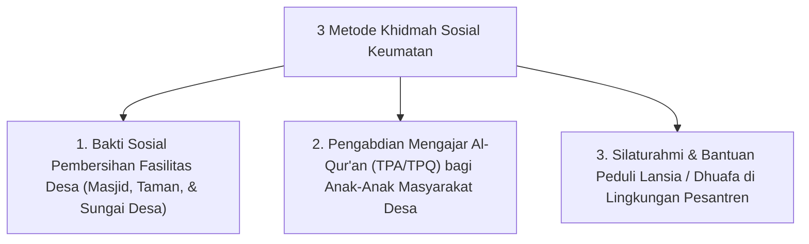

# P10-06-01: Metode Khidmah Sosial Sukarela Keumatan

## Status Dokumen
* **Status**: 🌟 **A+ (Tervalidasi & Siap Diimplementasikan)**
* **Sub-Domain**: `10 Methods / 06 Experiential Learning`
* **Penanggung Jawab Keilmuan**: Dewan Keilmuan TUMBUH (*Pakar Tata Kelola Qudwah & Pakar Desain Kurikulum Adab*)

---

## 1. Operasionalisasi Metode Khidmah Sosial Keumatan

Khidmah Sosial diselenggarakan secara berkala melalui 3 program pengalaman nyata pengabdian masyarakat:

---

## 2. Pemurnian Mutlak dari Pelayanan Feodal

Khidmah ditujukan **hanya untuk pengabdian keumatan dan fasilitas umum**, dilarang dijadikan alat penderitaan fisik atau pelayanan pribadi bagi individu musyrif/senior.
