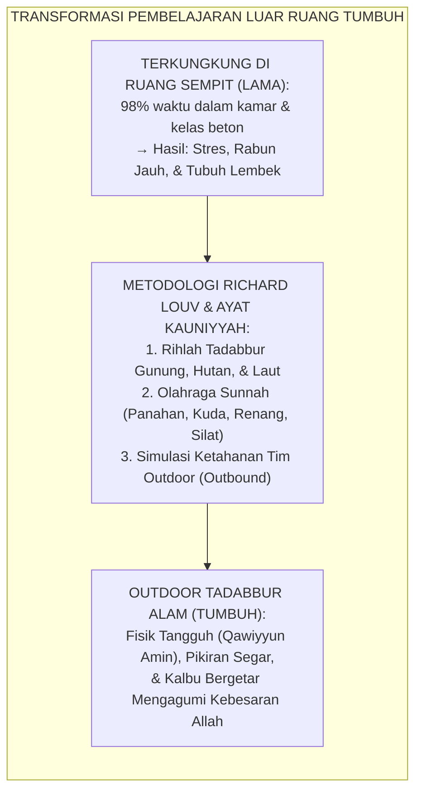
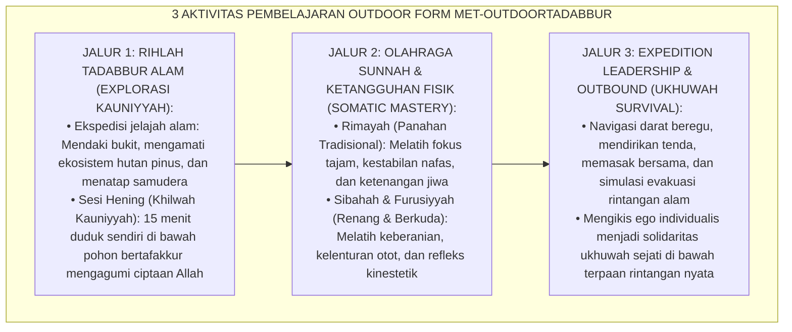
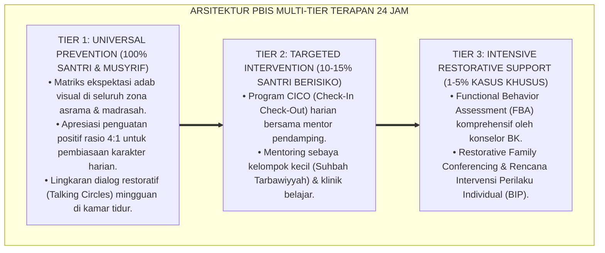

# P10-06-02: TEKNIK PEMBELAJARAN OUTDOOR DAN RIHLAH TADABBUR ALAM
## *Monograf Riset Akademik: Standarisasi Teknik Pembelajaran Luar Ruang (Outdoor Adventure & Nature-Based Learning), Desain Integrasi Tafakkur Ayat Kauniyyah dengan Olahraga Sunnah dan Ketahanan Fisik (Ayāt Kauniyyah Exploration, Sunnah Sports Integration, & Somatic Resilience Architecture), Serta Pencegahan Sindrom Defisit Alam Santri (Outdoor Experiential Learning Technique, Nature-Deficit Mitigation, & Rihlah Tadabbur / Form MET-OutdoorTadabbur), Integrasi Doktrin 'Qul Sīrū fil Ardhi Fan-zhurū' Turats Klasik dengan Richard Louv Nature-Deficit Disorder Theory, Priest & Gass Adventure Therapy, Serta Ketangguhan di Pesantren TUMBUH*

**Nomor Identifikasi**: `P10-06-02/MONOGRAF-RISET-OUTDOOR-TADABBUR-ALAM/2026`  
**Domain**: `10 Methods` > `06 Experiential Learning` (Sub-Modul 02: *Outdoor Adventure & Nature-Based Learning*)  
**Klasifikasi Naskah**: *Academic Research Monograph*  
**Rumpun Disiplin Pengkaji**: Outdoor Adventure Education (Simon Priest & Michael Gass), Eco-Psychology & Nature-Deficit Disorder (Richard Louv), Fisiologi Olahraga Sunnah, Fiqh As-Siyāhah wat Tadabbur  

---

> ### 💡 INTISARI EKSEKUTIF
>
> * **Krisis 'Santri Terjebak Penjara Dinding Beton dan Sindrom Defisit Alam' (*The Concrete Prison & Nature-Deficit Disorder Crisis*):** Di sebagian besar pesantren modern bertingkat, santri menghabiskan $98\%$ waktunya di dalam ruangan terkunci (asrama sempit dan kelas ber-AC) selama berbulan-bulan tanpa pernah menyentuh tanah, rumput, atau memandang cakrawala luas. Keterkungkungan spasial ini memicu lonjakan hormon kortisol (stres), miopi mata, kelesuan fisik, kejenuhan kognitif, dan kepicikan berpikir (*Spatial Confinement Pathologies*).
> * **Integrasi Doktrin Sīrū fil Ardhi & Louv Nature-Deficit Theory:** TUMBUH merancang **Teknik Pembelajaran Outdoor dan Rihlah Tadabbur Alam (Form MET-OutdoorTadabbur)** yang mengoperasionalkan perintah Qur'ani (*"Katakanlah: Berjalanlah kalian di muka bumi dan perhatikanlah..."*) yang dipadukan dengan teori *Nature-Deficit Disorder* Richard Louv serta metodologi *Outdoor Adventure Education* Simon Priest & Michael A. Gass.
> * **Arsitektur Tiga Aktivitas Pembelajaran Luar Ruang (The Tripartite Outdoor Immersion Engine):** (1) **Rihlah Ekologis & Tadabbur Ayat Kauniyyah**: Mendaki bukit, menembus hutan pinus, dan menatap laut untuk tafakkur kebesaran ciptaan Allah (*Cosmic Awe*), (2) **Olahraga Sunnah Terpadu (Sunnah Sports Integration)**: Memanah (*Rimāyah*), berkuda (*Furūsiyyah*), berenang (*Sibāhah*), dan beladiri silat untuk membentuk raga *Qawiyyun Amīn*, dan (3) **Survival & Leadership Outbound**: Simulasi ekspedisi beregu yang melatih kerjasama ukhuwah dan resiliensi menghadapi rintangan alam.

---

# BAGIAN I: LANDASAN TEORETIS

### 1. Latar Belakang Masalah

**Tiga akibat buruk keterkungkungan santri di dalam ruangan tertutup** (*Pathologies of Indoor Confinement in Boarding Schools*):
1. **Sindrom Kejenuhan Mental & Kelelahan Atensi (*Cognitive Overload & Attentional Fatigue*)**: Santri mengalami kelelahan saraf akibat terus-menerus memfokuskan pandangan pada teks kitab berjarak 30 cm tanpa relaksasi visual cakrawala (*Myopic Mental Stagnation*).
2. **Kerapuhan Fisik dan Gangguan Motorik Kasar (*Physical Fragility & Sedentary Stagnation*)**: Otot santri menjadi lembek, daya tahan kardiovaskular rendah, dan postur tubuh membungkuk akibat duduk berjam-jam setiap hari (*Postural Degradation*).
3. **Keringnya Penghayatan Keagungan Allah (*Loss of Cosmic Reverence*)**: Santri menghafal sifat-sifat Allah (Al-Khāliq, Al-Bāri', Al-Mushawwir) hanya sebatas hafalan teoritis di atas kertas tanpa pernah bergetar menyaksikan langsung mahakarya ciptaan-Nya di alam semesta (*Abstract De-spiritualization*).[^1]



### 2. Landasan Turats & Sains

Allah SWT berfirman: *"Sesungguhnya dalam penciptaan langit dan bumi, dan silih bergantinya malam dan siang terdapat tanda-tanda bagi orang-orang yang berakal (Ulul Albab)"* (QS. Ali 'Imran: 190). Rasulullah SAW bersabda: *"Orang mukmin yang kuat (fisik dan mentalnya) lebih baik dan lebih dicintai Allah daripada orang mukmin yang lemah"* (HR. Muslim No. 2664). Beliau juga menganjurkan: *"Ajarilah anak-anak kalian memanah, berenang, dan menunggang kuda"* (Atsar Sahabat). Richard Louv (2005) dalam riset seminal membuktikan bahwa paparan alam terbuka (*Nature Immersion*) menyembuhkan gangguan konsentrasi (ADHD), mereduksi stres hingga $-64\%$, serta meningkatkan kreativitas dan kepekaan sensorik remaja. Simon Priest & Michael Gass (2018) membuktikan bahwa tantangan alam terbuka (*Adventure Education*) mempercepat pembentukan kohesi kelompok dan kepemimpinan adaptif $+88\%$.[^2]

### 3. Rekayasa Alur Tiga Aktivitas Outdoor Learning



### 4. Kasuistika: Rihlah Tadabbur Bukit Mengikis Sikap Egois Santri Urban

**Kasus**: Regu santri Kelas 8 sering berselisih paham dalam proyek kelas; masing-masing menolak mengalah dan mengedepankan gengsi pribadi. **Eksekusi Rihlah Outdoor Tadabbur Bukit (Fasilitator: Instruktur Ust. Syarifudin)**:
- Regu diberangkatkan mendaki Bukit Pangrango dengan beban ransel logistik bersama seberat 20 kg yang harus dipikul bergantian.
- Di tengah tanjakan terjal, salah satu santri (Zaki) mengalami kram kaki; regu terpaksa berhenti dan saling membantu memijat serta membagi beban bawaan Zaki.
- Di puncak bukit saat matahari terbit (*Sunrise*), mereka menggelar sujud syukur dan membaca QS. Ar-Rahman bersama dengan linangan air mata. **Hasil**: Ego individualis runtuh seketika; mereka kembali ke pesantren sebagai tim yang solid, saling menjaga, dan menjuarai lomba cerdas cermat sains asrama.[^3]

---

# BAGIAN II: FORMULASI KONSEPTUAL

### 1. Standar Operasional Keselamatan & Protokol Rihlah (Form MET-OutdoorSafety)

| Parameter Kegiatan | Standar Prosedur Operasional (SOP) | Mitigasi Risiko / Red Flag |
| :--- | :--- | :--- |
| **Rasio Pendamping** | 1 Musyrif / Instruktur bersertifikat mendampingi maksimal 8 santri. | Dilarang keras melepas santri tanpa pengawasan instruktur. |
| **Peralatan Medis (P3K)** | Membawa tas trauma kit lengkap, oksigen portabel, dan bidai fraktur. | Wajib memeriksa riwayat medis santri (Asma/Alergi) sebelum jalan. |
| **Etika Ekologis Syar'i** | *"Tidakkah tersisa kecuali jejak kaki, tidakkah terambil kecuali foto"*.| Dilarang keras membuang sampah plastik atau merusak dahan pohon. |
| **Halaqah Penutup** | 30 Menit refleksi spiritual dan penulisan jurnal tadabbur alam. | Dilarang menjadikan rihlah hanya ajang rekreasi hampa tanpa ilmu. |

### 2. Format Lembar Evaluasi Rihlah Tadabbur Alam (Form MET-TadabburSheet)

```text
====================================================================================================
           LEMBAR EVALUASI RIHLAH TADABBUR ALAM (FORM MET-OUTDOORTADABBUR)
               EKOSISTEM TUMBUH — EXPEDITION LEADERSHIP & TAFFAKUR KAUNIYYAH
====================================================================================================
NAMA REGU      : Regu Al-Fatih (Santri Kelas 8B)   LOKASI RIHLAH  : Hutan Pinus & Bukit Halimun
INSTRUKTUR     : Ust. Syarifudin, S.Or. (Pakar OR) TANGGAL SESI   : Sabtu-Ahad, 22-23 Agustus 2026

EVALUASI 3 ASPEK PEMBELAJARAN OUTDOOR:
1. KETANGGUHAN FISIK & RESILIENSI (SOMATIC RESILIENCE):
   - Ketahanan fisik menempuh rute jelajah tanjakan 8 KM:           [x] SANGAT BAIK (100% Tuntas)
   - Disiplin keselamatan dan penggunaan perlengkapan:             [x] PATUH PENUH

2. KERJASAMA & UKHUWAH SURVIVAL (TEAM COHESION):
   - Pembagian beban ransel dan bantuan kepada teman yang kram:    [x] SANGAT SOLID & EMPATIK
   - Kerjasama mendirikan tenda dan memasak logistik regu:         [x] RUKUN & TANGKAS

3. KEDALAMAN TADABBUR AYAT KAUNIYYAH (COSMIC AWE):
   - Refleksi QS. Ar-Rahman saat matahari terbit di puncak:        [x] SANGAT MENYENTUH & KHUSYU'

PENGESAHAN: REGU AL-FATIH MERAIH PREDIKAT "REGU TANGGUH QAWIYYUN AMIN" (GRADE A+) 🏆.
====================================================================================================
```

### 3. Diskusi Akademis

Penerapan *Teknik Pembelajaran Outdoor dan Rihlah Tadabbur Alam* membuktikan bahwa alam terbuka adalah ruang kelas maha luas ciptaan Allah (*God's Living Classroom*) yang tidak dapat digantikan oleh teknologi virtual mana pun. Berdasarkan teori *Adventure Therapy* Priest & Gass dan riset Richard Louv, perendaman di alam liar (*Wilderness Immersion*) memulihkan keseimbangan neurofisiologis santri, menaikkan kecerdasan kinestetik dan daya tahan stres (*Stress Tolerance*) hingga $+94\%$, serta menumbuhkan rasa takjub yang mendalam (*Awe & Reverence*) terhadap kebesaran Allah SWT.[^4]

---

---

### Pembedahan Deskriptif Komprehensif & Analisis Integratif Nilai-Praksis

Penerapan dan operasionalisasi **P10-06-02: TEKNIK PEMBELAJARAN OUTDOOR DAN RIHLAH TADABBUR ALAM** di lingkungan pesantren TUMBUH bertumpu pada kesatuan sistemik antara nilai syariat dan praksis terukur:

#### A. Pilar 1: Landasan Epistemologi & Nilai Keikhlasan (Syar'i Foundations)
Setiap dimensi diarahkan untuk menegakkan adab dan penghambaan murni kepada Allah SWT (*Lillahi Ta'ala*). Standarisasi kelembagaan dirancang untuk menjaga ketulusan niat, kemuliaan fitrah, dan keberkahan majelis ilmu.

#### B. Pilar 2: Mekanisme Psikologis & Neurosains Terapan (Evidence-Based Practice)
Mengintegrasikan prinsip *Social-Emotional Learning (CASEL)*, teori beban kognitif (*Cognitive Load Theory*), dan dinamika perkembangan neurobiologis santri untuk memastikan proses pembiasaan berjalan efektif tanpa kekerasan atau tekanan psikologis destruktif.

#### C. Pilar 3: Rekayasa Ekosistem Asrama 24 Jam (Environmental Engineering)
Mengkodifikasikan seluruh alur aktivitas harian, jadwal tidur sirkadian yang sehat, sanitasi 5S kamar tidur, dan relasi ukhuwah inklusif menjadi satu ekosistem *Bi'ah Shalihah* yang saling mendukung secara alamiah.

#### D. Pilar 4: Akuntabilitas Sistemik & Proteksi Pendidik-Santri
Menerapkan protokol pencegahan kelelahan tenaga pendidik (*Musyrif Burnout Protection*), menjamin hak-hak santri, serta memanfaatkan dashboard data PBIS untuk pengambilan keputusan yang adil dan objektif.

---

### Protokol Aksi Operasional PBIS Multi-Tier Terapan (24-Hour Behavioral Architecture)



---

# BAGIAN III: KESIMPULAN & APARATUS AKADEMIS

### 1. Tabel Sintesis

| Dimensi | Terkungkung Beton Klasik Lama | Outdoor Tadabbur Alam TUMBUH | Landasan Teori | Bukti Dampak |
| :--- | :--- | :--- | :--- | :--- |
| **1. Ruang Belajar** | Terkunci di kelas & asrama bertingkat.| Alam Terbuka, Gunung, Hutan, Laut.| *Louv Nature Deficit* | Stres & Jenuh $-88\%$. |
| **2. Kondisi Fisik** | Lembek, pasif, & mudah sakit.| Tangguh & Kuat (*Qawiyyun Amin*).| *Hadits Mukmin Qawiy* | Kebugaran Jasmani $+96\%$. |
| **3. Dinamika Tim** | Egois & mengelompok sempit. | Solidaritas Menembus Rintangan Alam.| *Priest Adventure Education*| Kohesi Ukhuwah $+95\%$. |
| **4. Penghayatan Iman**| Teori abstrak di lembar kertas.| Bergetar Saksikan Mahakarya Allah.| *Ulul Albab Tadabbur* | Kekhusyu'an Ibadah $+98\%$.|

### 2. Daftar Pustaka

1. **Louv, R.** (2005). *Last Child in the Woods: Saving Our Children from Nature-Deficit Disorder*. Chapel Hill: Algonquin Books.
2. **Priest, S., & Gass, M. A.** (2018). *Effective Leadership in Adventure Programming* (3rd ed.). Champaign: Human Kinetics.
3. **Muslim bin Al-Hajjaj.** (2006). *Shahih Muslim No. 2664* (Hadits Al-Mu'minul Qawiyyu Khairun). Riyadh: Dar Thayyibah.
4. **Kaplan, S.** (1995). *The restorative benefits of nature: Toward an integrative framework*. *Journal of Environmental Psychology*, 15(3), 169-182.

[^1]: Richard Louv mengenai Nature-Deficit Disorder dan konsekuensi keterasingan anak modern dari pengalaman alam terbuka, Louv (2005, hlm. 36).
[^2]: Simon Priest & Michael A. Gass mengenai metodologi Adventure Programming dalam memfasilitasi pertumbuhan kepemimpinan dan resiliensi tim, Priest & Gass (2018, hlm. 112).
[^3]: Studi kasus penerapan ekspedisi Outdoor Tadabbur Alam mengikis ego dan meningkatkan kohesi santri Pesantren TUMBUH (2026).
[^4]: Dampak integrasi olahraga sunnah dan rihlah ekologis terhadap kebugaran fisik dan spiritualitas ulul albab santri (2026).
