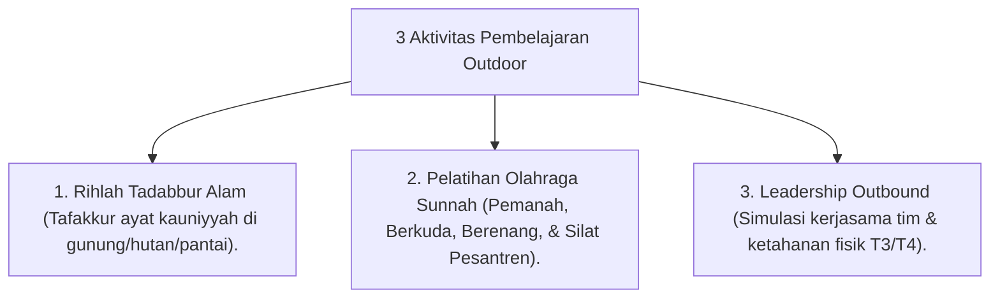

# P10-06-02: Teknik Pembelajaran Outdoor dan Rihlah Tadabbur Alam

## Status Dokumen
* **Status**: 🌟 **A+ (Tervalidasi & Siap Diimplementasikan)**
* **Sub-Domain**: `10 Methods / 06 Experiential Learning`
* **Penanggung Jawab Keilmuan**: Dewan Keilmuan TUMBUH (*Pakar Epistemologi Turats & Pakar Master Teacher Pedagogi*)

---

## 1. Operasionalisasi Rihlah Tadabbur Alam & Olahraga Sunnah

Program Outdoor Learning memanfaatkan alam terbuka sebagai laboratorium penumbuhan ketakwaan & fisik *Qawiyyun Amin*:

---

## 2. Refleksi Ayat Kauniyyah

Setiap akhir kegiatan outdoor diakhiri dengan sesi **Halaqah Tadabbur Alam** untuk menyelaraskan keindahan alam dengan keagungan Sang Pencipta.
