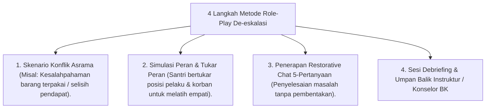

# P10-06-03: Metode Simulasi Role-Play Dan De-eskalasi Konflik

## Status Dokumen
* **Status**: 🌟 **A+ (Tervalidasi & Siap Diimplementasikan)**
* **Sub-Domain**: `10 Methods / 06 Experiential Learning`
* **Penanggung Jawab Keilmuan**: Dewan Keilmuan TUMBUH (*Pakar Social Emotional Learning & Pakar Kuratif Restoratif*)

---

## 1. Operasionalisasi Metode Simulasi Role-Play Konflik

Simulasi Role-Play melatih santri mempraktikkan de-eskalasi perselisihan secara langsung dalam suasana aman:

---

## 2. Penguatan Keterampilan Sosial Remaja

Role-play terbukti meningkatkan keberanian santri bersikap tegas ramah (*Assertive Communication*) tanpa jatuh pada sikap agresi.
