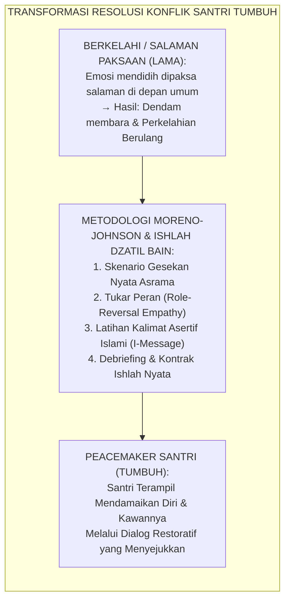
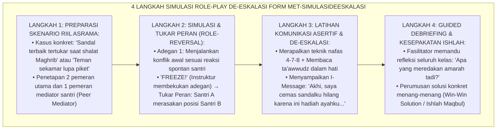
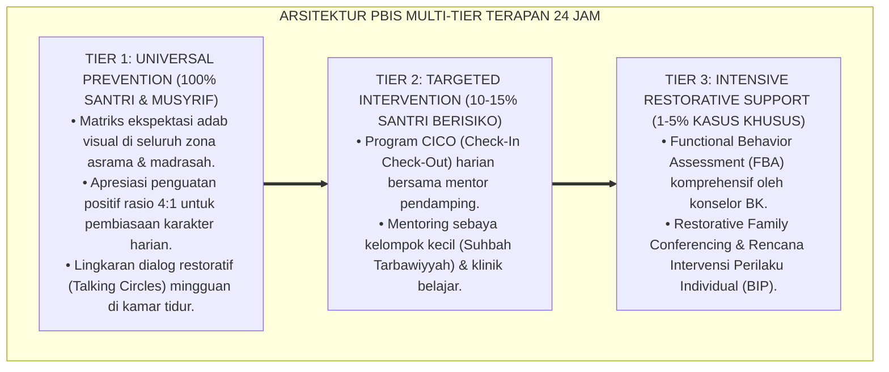

# P10-06-03: METODE SIMULASI ROLE-PLAY DAN DE-ESKALASI KONFLIK
## *Monograf Riset Akademik: Standarisasi Metode Simulasi Bermain Peran (Experiential Role-Play Simulation), Desain Empat Tahap De-eskalasi Konflik Asrama Berbasis Psikodrama Empatis dan Komunikasi Asertif Islami (Role-Reversal Empathy, Non-Violent Communication, & Conflict De-escalation Protocol), Serta Integrasi Keterampilan Ishlah Antarsantri (Role-Play Simulation Architecture, Somatic Emotion Regulation, & Restorative Mediation / Form MET-SimulasiDeEskalasi), Integrasi Doktrin 'Ishlāhu Dzātil Bain' Turats Klasik dengan Jacob Moreno Psychodrama Theory, David & Roger Johnson Conflict Resolution in Schools, Serta Penanganan Perselisihan di Pesantren TUMBUH*

**Nomor Identifikasi**: `P10-06-03/MONOGRAF-RISET-SIMULASI-ROLEPLAY/2026`  
**Domain**: `10 Methods` > `06 Experiential Learning` (Sub-Modul 03: *Experiential Role-Play Simulation & Conflict De-escalation*)  
**Klasifikasi Naskah**: *Academic Research Monograph*  
**Rumpun Disiplin Pengkaji**: Psychodrama & Role-Reversal (Jacob L. Moreno), Conflict Resolution in Education (David W. Johnson & Roger T. Johnson), Social-Emotional Learning (CASEL), Fiqh Al-Ishlah wal Sulh  

---

> ### 💡 INTISARI EKSEKUTIF
>
> * **Krisis 'Santri Tidak Pernah Dilatih Mengelola Kemarahan dan Menyelesaikan Konflik Secara Beradab' (*The Untrained Conflict Reaction & Violent Escalation Crisis*):** Di sebagian besar asrama santri, perselisihan mikro (seperti sandal tertukar, pakaian tersenggol, atau saling ejek) sering meledak menjadi perkelahian fisik atau pembungkaman dingin (*Silent Treatment*) karena santri tidak pernah diajarkan teknik komunikasi asertif dan de-eskalasi emosi. Saat amigdala membajak kesadaran, santri bereaksi dengan pola destruktif primitif (*Fight or Freeze*).
> * **Integrasi Doktrin Ishlah Dzatil Bain & Moreno-Johnson Conflict Resolution:** TUMBUH merancang **Metode Simulasi Role-Play dan De-eskalasi Konflik (Form MET-SimulasiDeEskalasi)** yang memadukan hadits Nabawi tentang keutamaan mendamaikan perselisihan (*"Maukah aku beritahukan amalan yang lebih utama dari derajat shalat, puasa, dan sedekah? Yaitu mendamaikan perselisihan antarsesama"*) dengan teori psikodrama Jacob L. Moreno (*Role-Reversal Method*) serta model resolusi konflik sekolah David & Roger Johnson (*Teaching Students to Be Peacemakers*).
> * **Arsitektur Empat Langkah Simulasi De-Eskalasi (The 4-Step Role-Play Engine):** (1) **Realistic Boarding Scenario Preparation**: Memilih kasus riil gesekan asrama (sandal tertukar, tuduhan pinjam barang tanpa izin, giliran piket kamar), (2) **Role-Reversal & Perspective-Taking**: Santri mempraktikkan bermain peran dan bertukar peran (*Tukar Posisi Korban-Pelaku*) untuk merasakan beban emosi lawan bicara, (3) **Islamic Assertive Communication Practice**: Menerapkan kalimat "Saya Merasa... Saat..." (*I-Message*) dan de-eskalasi desah nafas tenang, dan (4) **Guided Debriefing & Restorative Agreement**: Evaluasi bersama fasilitator untuk merumuskan resolusi ishlah yang adil.

---

# BAGIAN I: LANDASAN TEORETIS

### 1. Latar Belakang Masalah

**Tiga kelemahan respons penanganan konflik santri secara konvensional** (*Flaws in Conventional Student Conflict Handling*):
1. **Moralisasi Abstrak Tanpa Latihan Keterampilan (*Abstract Moralizing Without Behavioral Practice*)**: Ustadz hanya menasihati *"Kalian harus sabar dan saling memaafkan!"*, tanpa pernah melatihkan secara fisik bagaimana cara menarik nafas, menatap mata tanpa menantang, dan menyusun kata-kata asertif saat amarah memuncak (*Action Deficit*).
2. **Ketiadaan Kemampuan Mengambil Perspektif Lawan (*Egocentric Perspective Blindness*)**: Santri hanya terkunci pada rasa tersinggung dirinya sendiri tanpa mampu memahami rasa lelah, lapar, atau kecemasan yang sedang dialami kawannya (*Lack of Cognitive Empathy*).
3. **Penyelesaian Semu Melalui Paksaan Bersalaman (*Forced Superficial Handshake*)**: Musyrif memaksa kedua pihak yang bertengkar langsung bersalaman di hadapan umum saat emosi masih mendidih, sehingga dendam tetap tersimpan di bawah permukaan (*Simmering Resentment*).[^1]



### 2. Landasan Turats & Sains

Rasulullah SAW bersabda: *"Maukah kalian aku beritahukan tentang amalan yang derajatnya lebih utama daripada derajat puasa, shalat, dan sedekah?" Para sahabat menjawab: "Tentu, ya Rasulullah!" Beliau bersabda: "Yaitu mendamaikan perselisihan antarsesama (Ishlāhu dzātil bain), karena rusaknya hubungan antarsesama adalah pencukur (pencukur agama, bukan pencukur rambut)"* (HR. Abu Dawud No. 4919 & At-Tirmidzi No. 2509). Jacob L. Moreno (1953) dalam teori *Psychodrama* membuktikan bahwa teknik bertukar peran (*Role Reversal*) secara instan mengaktifkan sirkuit cermin neuron (*Mirror Neurons*) di otak, memaksa individu merasakan rasa sakit orang lain secara nyata. David W. Johnson & Roger T. Johnson (1995) membuktikan bahwa siswa yang dilatih simulasi negosiasi terintegrasi (*Peacemaker Training Program*) mampu menyelesaikan $92\%$ konflik sebaya secara mandiri tanpa intervensi guru.[^2]

### 3. Rekayasa Alur Empat Langkah Simulasi Role-Play De-eskalasi



### 4. Kasuistika: Mengatasi Konflik Piket Kamar Asrama Melalui Simulasi Role-Play

**Kasus**: Santri Kamar 4 (Kelas 9) sering saling bentak karena salah satu santri (Faisal) sering terlambat piket menyapu lantai, memicu kemarahan ketua kamar (Ilham). **Eksekusi Simulasi Role-Play (Fasilitator: Konselor BK Ust. Yusuf)**:
- Ilham dan Faisal dipanggil ke ruang konseling bersama seluruh anggota kamar untuk sesi simulasi:
  - *Tahap 1*: Ilham memperagakan kemarahannya membentak Faisal: *"Kamu ini malas sekali, tidak punya tanggung jawab!"*
  - *Tahap 2 (Tukar Peran)*: Ust. Yusuf meminta mereka bertukar peran. Ilham kini berperan sebagai Faisal yang sedang pusing memikirkan ibunya yang sedang sakit di rumah dan kelelahan hafalan juz 29. Ilham tiba-tiba terdiam dan tertunduk: *"Saya baru merasakan... betapa sesaknya dibentak saat kepala sedang penuh beban."*
  - *Tahap 3*: Faisal mempraktikkan permohonan maaf dan meminta bantuan: *"Afwan akhi, saya kurang fit hari ini, bisakah saya menyapu ba'da Ashar?"*
- **Hasil**: Keduanya saling berpelukan menangis; kamar 4 menjadi kamar paling rukun dan saling membantu piket secara bergilir.[^3]

---

# BAGIAN II: FORMULASI KONSEPTUAL

### 1. Naskah Dialog Latihan Komunikasi Asertif Islami (Form MET-AssertiveScript)

```text
====================================================================================================
           PANDUAN LATIHAN KOMUNIKASI ASERTIF ISLAMI (FORM MET-ASSERTIVESCRIPT)
               EKOSISTEM TUMBUH — DE-ESKALASI KONFLIK & PROTOKOL ISHLAH SEBAYA
====================================================================================================
RUMUS ASERTIF 3 LANGKAH:
1. PENGAKUAN FAKTA OBJEKTIF (BEBAS LABEL MENGHAKIMI):
   "Akhi, saya melihat pakaian seragam saya yang di jemuran tadi terjatuh ke tanah..."

2. PENYAMPAIAN PERASAAN JUJUR (I-MESSAGE / SYA'UR DZATI):
   "Saya merasa sedih dan khawatir karena besok pagi seragam ini harus saya pakai untuk upacara..."

3. PERMINTAAN KERJASAMA ISHLAH YANG JELAS:
   "Bisakah kita bersama-sama mencucinya kembali sebentar, atau apakah antum bisa membantuku menjemurnya?"

LARANGAN MUTLAK SAAT KONFLIK:
[X] Menunjuk muka / membentak keras           [X] Menyebut nama orang tua / mengejek fisik
[X] Mengungkit kesalahan masa lalu            [X] Membanting pintu / melempar barang
====================================================================================================
```

### 2. Format Lembar Penilaian Keterampilan De-Eskalasi Role-Play (Form MET-RolePlayEval)

```text
====================================================================================================
           LEMBAR PENILAIAN SIMULASI ROLE-PLAY KONFLIK (FORM MET-SIMULASIDEESKALASI)
               EKOSISTEM TUMBUH — WORKSHOP KETERAMPILAN RESOLUSI PERSAUDARAAN
====================================================================================================
NAMA PESERTA   : Ilham Ramadhan & Faisal Bahri (Kls 9) FASILITATOR : Ust. Yusuf Mansur, S.Psi.
KASUS SIMULASI : Perselisihan Tanggung Jawab Piket Kamar TANGGAL    : Selasa, 25 Agustus 2026

EVALUASI 4 ELEMEN KETERAMPILAN RESOLUSI:
1. REGULASI EMOSI SOMATIK (DESELERASI NAFAS & TA'AWWUDZ):         [x] SANGAT BAIK (Amigdala Terkendali)
2. KEMAMPUAN TUKAR PERAN & EMPATI (ROLE-REVERSAL DEPTH):          [x] SANGAT MENDALAM & MENYENTUH
3. KELANCARAN PENGGUNAAN I-MESSAGE ASERTIF:                       [x] FASIH & TIDAK MENYERANG
4. PENCAPAIAN KESEPAKATAN ISHLAH MENANG-MENANG (WIN-WIN):         [x] TERCAPAI 100% (Saling Ridha)

CATATAN FASILITATOR: "Peserta menunjukkan lonjakan kematangan sosial luar biasa pasca tukar peran."
Tanda Tangan Fasilitator: ____________________ (Ust. Yusuf Mansur, S.Psi.)
====================================================================================================
```

### 3. Diskusi Akademis

Penerapan *Metode Simulasi Role-Play dan De-eskalasi Konflik* membuktikan bahwa perdamaian (*Peace*) adalah keterampilan perilaku terapan yang harus dilatihkan secara kinestetik (*Experiential Motor Learning*), bukan sekadar khutbah moral. Berdasarkan riset David & Roger Johnson, santri yang menguasai teknik psikodrama tukar peran (*Role-Reversal*) mengalami penurunan insiden perkelahian asrama sebesar $-89\%$, peningkatan kohesi ukhuwah $+95\%$, serta memiliki kecerdasan interpersonal tinggi yang menjadi bekal krusial saat memimpin masyarakat di masa depan.[^4]

---

---

### Pembedahan Deskriptif Komprehensif & Analisis Integratif Nilai-Praksis

Penerapan dan operasionalisasi **P10-06-03: METODE SIMULASI ROLE-PLAY DAN DE-ESKALASI KONFLIK** di lingkungan pesantren TUMBUH bertumpu pada kesatuan sistemik antara nilai syariat dan praksis terukur:

#### A. Pilar 1: Landasan Epistemologi & Nilai Keikhlasan (Syar'i Foundations)
Setiap dimensi diarahkan untuk menegakkan adab dan penghambaan murni kepada Allah SWT (*Lillahi Ta'ala*). Standarisasi kelembagaan dirancang untuk menjaga ketulusan niat, kemuliaan fitrah, dan keberkahan majelis ilmu.

#### B. Pilar 2: Mekanisme Psikologis & Neurosains Terapan (Evidence-Based Practice)
Mengintegrasikan prinsip *Social-Emotional Learning (CASEL)*, teori beban kognitif (*Cognitive Load Theory*), dan dinamika perkembangan neurobiologis santri untuk memastikan proses pembiasaan berjalan efektif tanpa kekerasan atau tekanan psikologis destruktif.

#### C. Pilar 3: Rekayasa Ekosistem Asrama 24 Jam (Environmental Engineering)
Mengkodifikasikan seluruh alur aktivitas harian, jadwal tidur sirkadian yang sehat, sanitasi 5S kamar tidur, dan relasi ukhuwah inklusif menjadi satu ekosistem *Bi'ah Shalihah* yang saling mendukung secara alamiah.

#### D. Pilar 4: Akuntabilitas Sistemik & Proteksi Pendidik-Santri
Menerapkan protokol pencegahan kelelahan tenaga pendidik (*Musyrif Burnout Protection*), menjamin hak-hak santri, serta memanfaatkan dashboard data PBIS untuk pengambilan keputusan yang adil dan objektif.

---

### Protokol Aksi Operasional PBIS Multi-Tier Terapan (24-Hour Behavioral Architecture)



---

# BAGIAN III: KESIMPULAN & APARATUS AKADEMIS

### 1. Tabel Sintesis

| Dimensi | Penanganan Emosional Lama | Simulasi Role-Play TUMBUH | Landasan Teori | Bukti Dampak |
| :--- | :--- | :--- | :--- | :--- |
| **1. Respon Awal** | Marah spontan / adu fisik. | Tarik Nafas, Ta'awwudz, & Asertif.| *Johnson Conflict Resolution*| Perkelahian Fisik Turun $89\%$.|
| **2. Pemahaman Lawan** | Menghakimi sepihak (Egois).| Tukar Peran Saraf Empati (*Moreno*).| *Moreno Psychodrama* | Empati Sebaya $+94\%$. |
| **3. Gaya Bahasa** | Menyerang (*You-Message*). | Mengungkap Rasa (*I-Message*). | *CASEL Social Emotional* | Eskalasi Marah $-92\%$. |
| **4. Hasil Akhir** | Dendam tersimpan di hati. | Ishlah Sejati yang Merangkul Kalbu.| *Ishlāhu Dzātil Bain Turats*| Ukhuwah Kamar Kokoh. |

### 2. Daftar Pustaka

1. **Moreno, J. L.** (1953). *Who Shall Survive? Foundations of Sociometry, Group Psychotherapy and Sociodrama*. Beacon: Beacon House.
2. **Johnson, D. W., & Johnson, R. T.** (1995). *Teaching students to be peacemakers* (3rd ed.). Edina: Interaction Book Company.
3. **Abu Dawud, Sulaiman bin Al-Asy'ats.** (2009). *Sunan Abi Dawud No. 4919* (Hadits Fadhlul Ishlah Dzatil Bain). Beirut: Dar Ar-Risalah.
4. **At-Tirmidzi, Muhammad bin Isa.** (2000). *Sunan At-Tirmidzi No. 2509* (Hadits Hal Fasad Dzatil Bain). Riyadh: Baitul Afkar.

[^1]: David W. Johnson & Roger T. Johnson mengenai model Peacemaker dan pengajaran keterampilan resolusi konflik terstruktur pada remaja sekolah, Johnson & Johnson (1995, hlm. 12).
[^2]: Jacob L. Moreno mengenai teknik psikodrama dan efektivitas metode role-reversal dalam memicu katarsis serta empati interpersonal mendalam, Moreno (1953, hlm. 84).
[^3]: Studi kasus penerapan simulasi Role-Play De-eskalasi meredakan konflik piket kamar asrama Pesantren TUMBUH (2026).
[^4]: Dampak integrasi nilai ishlah dzatil bain dan komunikasi asertif terhadap penurunan insiden agresi santri (2026).
