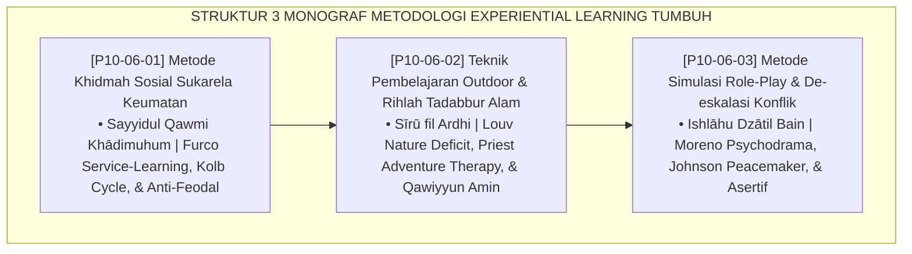

# P10-06: DOKUMEN INDUK METODOLOGI EXPERIENTIAL LEARNING PESANTREN
## *Arsitektur dan Standarisasi Metode Khidmah Sosial Sukarela Keumatan, Teknik Pembelajaran Outdoor dan Rihlah Tadabbur Alam, Serta Metode Simulasi Role-Play dan De-Eskalasi Konflik sebagai Tiga Pilar Metodologi Pembelajaran Berbasis Pengalaman Nyata (Service-Learning Form MET-KhidmahSosial, Outdoor Immersion Form MET-OutdoorTadabbur, Serta Conflict Role-Play Form MET-SimulasiDeEskalasi) di Ekosistem TUMBUH Pesantren*

**Nomor Identifikasi**: `P10-06/DOKUMEN-INDUK-METODOLOGI-EXPERIENTIAL-LEARNING/2026`  
**Domain**: `10 Methods` > `06 Experiential Learning` (Gugus Sub-Domain 06: *Experiential Learning, Outdoor Immersion, & Conflict Psychodrama*)  
**Klasifikasi Naskah**: *Master Architecture & Navigation Monograph*  
**Rumpun Disiplin Pengkaji**: Experiential Learning (David Kolb), Service-Learning (Andrew Furco), Outdoor Adventure (Priest & Louv), Conflict Resolution (Johnson & Moreno), Fiqh Al-Khidmah wat Tadabbur  

---

> ### 💡 INTISARI EKSEKUTIF
>
> * **Kedudukan Strategis Gugus Metodologi Experiential Learning:** Gugus ini adalah kawah candradimuka penempaan kematangan karakter terapan (*the somatic & social maturity immersion engine*) di ekosistem TUMBUH. Mengakhiri isolasi santri di menara gading hafalan teoritis dan kekerasan verbal saat konflik (*From Rote Theoretical Learning to Lived Transformative Experience*), gugus ini menerjunkan santri melayani umat dhuafa, merendam mereka di alam liar untuk mentadabburi keagungan Allah, serta melatih fisik dan mental santri memadamkan perselisihan dengan komunikasi asertif beradab.
> * **Triad Metodologi Experiential Learning TUMBUH:** (1) **Khidmah Sosial Sukarela Keumatan** (Siklus Kolb 4-Tahap & Anti-Feodalisme) untuk menumbuhkan jiwa *Servant Leader*, (2) **Pembelajaran Outdoor & Rihlah Tadabbur Alam** (Olahraga Sunnah & Resiliensi Alam Liar) untuk membentuk raga *Qawiyyun Amīn*, dan (3) **Simulasi Role-Play De-Eskalasi Konflik** (Psikodrama Tukar Peran & *I-Message*) untuk melahirkan *Peacemaker* sejati.
> * **3 Monograf Riset Komprehensif:** Form MET-KhidmahSosial, Form MET-OutdoorTadabbur, dan Form MET-SimulasiDeEskalasi.

---

## 📑 PETA NAVIGASI TIGA MONOGRAF

---

## 📚 DESKRIPSI RINGKAS 3 BERKAS MONOGRAF

1. **[P10-06-01: Metode Khidmah Sosial Sukarela Keumatan](file:///c:/xampp/htdocs/tumbuh/10%20Methods/06%20Experiential%20Learning/P10-06-01-Metode-Khidmah-Sosial-Sukarela-Keumatan.md)**  
   *Protokol siklus Kolb 4 tahap (Concrete Experience, Reflective Observation, Abstract Conceptualization, Active Experimentation), eliminasi khidmah feodal senioritas, lembar refleksi santri, dan Form MET-KhidmahSosial.*
2. **[P10-06-02: Teknik Pembelajaran Outdoor dan Rihlah Tadabbur Alam](file:///c:/xampp/htdocs/tumbuh/10%20Methods/06%20Experiential%20Learning/P10-06-02-Teknik-Pembelajaran-Outdoor-dan-Rihlah-Tadabbur-Alam.md)**  
   *Protokol 3 jalur aktivitas alam (ekspedisi tadabbur ayat kauniyyah, olahraga sunnah panahan/kuda/renang/silat, leadership outbound), SOP keselamatan & P3K, lembar evaluasi regu, dan Form MET-OutdoorTadabbur.*
3. **[P10-06-03: Metode Simulasi Role-Play Dan De-eskalasi Konflik](file:///c:/xampp/htdocs/tumbuh/10%20Methods/06%20Experiential%20Learning/P10-06-03-Metode-Simulasi-Role-Play-Dan-De-eskalasi-Konflik.md)**  
   *Protokol simulasi 4 langkah (skenario asrama, tukar peran psikodrama, kalimat asertif I-Message, debriefing ishlah), naskah dialog asertif, lembar penilaian resolusi, dan Form MET-SimulasiDeEskalasi.*

---

## 🎯 STANDAR PENJAMINAN MUTU PEMBELAJARAN BERPENGALAMAN

Penerapan gugus **Metodologi Experiential Learning** menjamin bahwa:
1. **Santri Menjadi Pemimpin Berjiwa Pelayan Umat (*Servant Leadership Guarantee*)**: Khidmah mengikis kesombongan akademis.
2. **Kesehatan Mental dan Fisik Santri Tangguh dan Seimbang (*Somatic & Psychological Resilience Guarantee*)**: Terapi alam memulihkan stres.
3. **Konflik Diselesaikan Secara Damai Tanpa Kekerasan (*Non-Violent Restorative Peace Guarantee*)**: Role-play membekali keterampilan mediasi sebaya.
