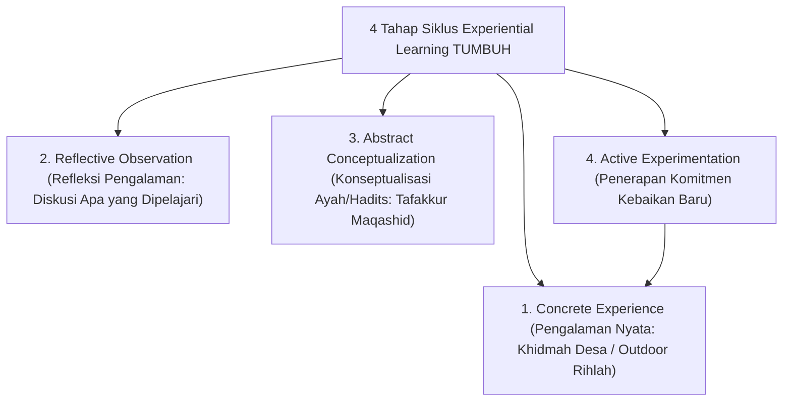

# P10-06: Metodologi Experiential Learning

## Status Dokumen
* **Status**: 🌟 **A+ (Tervalidasi & Siap Diimplementasikan)**
* **Sub-Domain**: `10 Methods / 06 Experiential Learning`
* **Penanggung Jawab Keilmuan**: Dewan Keilmuan TUMBUH (*Pakar Master Teacher Pedagogi & Pakar Psikologi Sosial Santri*)

---

## 1. Konseptualisasi Experiential Learning Pesantren

Metodologi Experiential Learning dalam ekosistem **TUMBUH** diselaraskan dengan Siklus Pembelajaran Berbasis Pengalaman (Kolb) & ajaran **Tafakkur fi Khalqillah**:

---

## 2. Dampak Pada Kepekaan Sosial Santri

Pengalaman langsung melatih kepedulian (*Nafi'un Lighairih*) dan membentuk pemikiran tauhid yang hidup melalui pengamatan keagungan ciptaan Allah.
