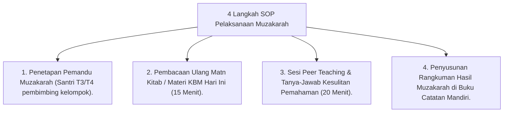

# P10-07-01: Metode Muzakarah dan Diskusi Kelompok Kecil

## Status Dokumen
* **Status**: 🌟 **A+ (Tervalidasi & Siap Diimplementasikan)**
* **Sub-Domain**: `10 Methods / 07 Collaborative Learning`
* **Penanggung Jawab Keilmuan**: Dewan Keilmuan TUMBUH (*Pakar Master Teacher Pedagogi & Pakar Epistemologi Turats*)

---

## 1. Operasionalisasi Metode Muzakarah

Metode Muzakarah dilaksanakan dalam kelompok 4–5 santri pada jam belajar mandiri malam (20.00 - 20.45) di koridor/saung asrama:

---

## 2. Peningkatan Retensi Hafalan & Pemahaman

Muzakarah terbukti meningkatkan retensi memori materi hingga 90% karena santri saling mengajarkan konsep satu sama lain (*Learning Pyramid*).
