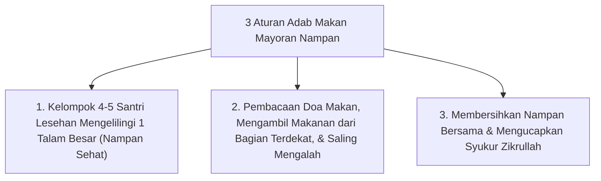

# P10-07-02: Teknik Makan Mayoran Nampan dan Ritus Ukhuwah

## Status Dokumen
* **Status**: 🌟 **A+ (Tervalidasi & Siap Diimplementasikan)**
* **Sub-Domain**: `10 Methods / 07 Collaborative Learning`
* **Penanggung Jawab Keilmuan**: Dewan Keilmuan TUMBUH (*Pakar Pengasuhan Asrama & Pakar Psikologi Sosial Santri*)

---

## 1. Operasionalisasi Ritus Makan Mayoran Nampan

Tradisi Mayoran diselenggarakan setiap makan siang/malam di ruang makan asrama:

---

## 2. Pengikisan Individualisme

Makan mayoran menghilangkan egoistis santri, mengajarkan keberkahan berbagi (*Al-Barakatu ma'a al-Jama'ah*), dan menyatukan santri senior-junior dalam kehangatan ukhuwah.
