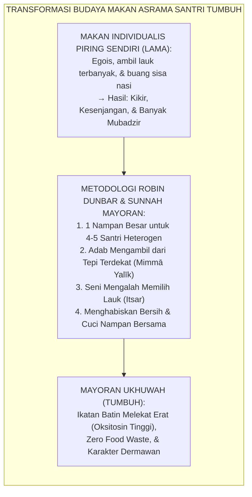
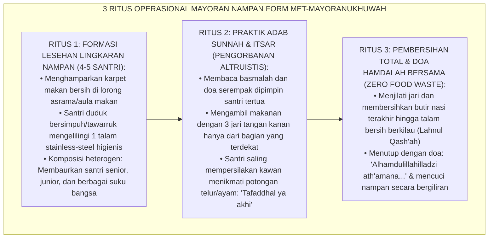
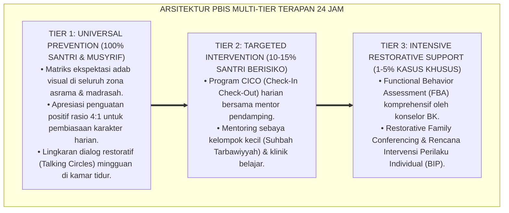

# P10-07-02: TEKNIK MAKAN MAYORAN NAMPAN DAN RITUS UKHUWAH
## *Monograf Riset Akademik: Standarisasi Teknik Makan Mayoran Satu Nampan (Commensality Rituals & Shared Tray Dining), Desain Tiga Ritus Pembiasaan Adab Makan Berjamaah Berbasis Keberkahan Jama'ah dan Regulasi Ego Sosial (Social Commensality Architecture, Prosocial Altruism, & Mutual Respect), Serta Eliminasi Sifat Serakah dan Eksklusivisme Santri (Mayoran Tray Technique, Commensal Oxytocin Bonding, & Dining Adab / Form MET-MayoranUkhuwah), Integrasi Doktrin 'Ijtami'ū 'alā Tha'āmikum Yubārak Lakum' Turats Klasik dengan Claude Lévi-Strauss & Mary Douglas Commensality Theory, Robin Dunbar Social Bonding Framework, Serta Budaya Makan di Ekosistem Pesantren Berbasis TUMBUH*

**Nomor Identifikasi**: `P10-07-02/MONOGRAF-RISET-MAYORAN-UKHUWAH/2026`  
**Domain**: `10 Methods` > `07 Collaborative Learning` (Sub-Modul 02: *Commensality Rituals & Shared Tray Dining*)  
**Klasifikasi Naskah**: *Academic Research Monograph*  
**Rumpun Disiplin Pengkaji**: Anthropology of Commensality (Claude Lévi-Strauss & Mary Douglas), Social Neuroscience of Bonding (Robin Dunbar), Psikologi Sosial Pesantren, Fiqh Adab Ath-Tha'ām  

---

> ### 💡 INTISARI EKSEKUTIF
>
> * **Krisis 'Makan Individualis Nampan Plastik Sendiri yang Menumbuhkan Sifat Egois dan Apatis' (*The Atomized Dining & Social Greed Crisis*):** Di sebagian asrama modern yang meniru sistem kantin sekuler, santri mengambil piring porsinya sendiri-sendiri, duduk terpisah sambil menatap layar gadget atau melamun, memilih lauk terbaik untuk diri sendiri, dan membiarkan temannya yang kehabisan lauk (*Atomized Selfish Consumerism*). Pola ini melahirkan santri yang kikir, rakus (*Thama'*), dan kehilangan ruh empati persaudaraan.
> * **Integrasi Doktrin Keberkahan Makan Berjamaah & Antropologi Komensalitas:** TUMBUH merancang **Teknik Makan Mayoran Nampan dan Ritus Ukhuwah (Form MET-MayoranUkhuwah)** yang merevitalisasi hadits shahih Nabawi (*"Berkumpullah kalian di atas makanan kalian dan sebutlah nama Allah, niscaya akan diberkahi bagi kalian di dalamnya"*) dengan antropologi komensalitas (*Commensality Theory*) Claude Lévi-Strauss & Mary Douglas serta neurobiologi ikatan sosial (*Oxytocin Social Bonding*) Robin Dunbar.
> * **Arsitektur Tiga Ritus Mayoran Nampan (The Tripartite Mayoran Commensal Engine):** (1) **Lesehan Circle Formation**: 4–5 santri lintas latar belakang duduk melingkar mengelilingi satu talam/nampan besar *Stainless-Steel* higienis, (2) **Somatic Adab & Itsar Practice**: Membaca basmalah serempak, mengambil makanan dari tepi yang terdekat (*Mimmā Yalīk*), dan mempraktikkan seni mendahulukan kawan dalam memilih potongan lauk terbaik (*Al-Ītsār 'alal Nafs*), dan (3) **Mutual Cleaning & Gratitude Ritual**: Menghabiskan makanan tanpa sisa butir nasi (*Lahnul Qash'ah*), mencuci nampan bersama secara bergantian, dan menutup dengan doa hamdalah berjamaah.

---

# BAGIAN I: LANDASAN TEORETIS

### 1. Latar Belakang Masalah

**Tiga penyakit karakter akibat pola makan individualis di lingkungan santri** (*Destructive Pathologies of Atomized Dining*):
1. **Ketamakan & Perilaku Menimbun Makanan (*Food Hoarding & Greed*)**: Santri berebut mengambil jatah terbanyak tanpa memedulikan apakah santri di antrean belakang masih kebagian lauk bergizi (*Resource Monopolization*).
2. **Keterasingan Emosional Antar-Teman Sekamar (*Emotional Alienation & Clique Formation*)**: Meja makan menjadi tempat eksklusif geng tertentu; santri pemalu atau pendatang terpinggirkan dan makan sendirian di sudut sepi (*Social Exclusion*).
3. **Pemborosan Makanan (*Mubadzir & Food Waste*)**: Santri mengambil porsi berlebihan di piring pribadinya lalu membuang separuh nasinya ke tempat sampah (*Wasted Rizq*).[^1]



### 2. Landasan Turats & Sains

Sahabat Wahsy bin Harb RA meriwayatkan bahwa para sahabat mengadu kepada Rasulullah SAW: *"Wahai Rasulullah, sesungguhnya kami makan namun tidak merasa kenyang?" Beliau bersabda: "Mungkin kalian makan secara terpisah-pisah?" Mereka menjawab: "Benar, wahai Rasulullah." Beliau bersabda: "Maka berkumpullah kalian di atas makanan kalian dan sebutlah nama Allah, niscaya Allah akan memberkahi makanan tersebut bagi kalian"* (HR. Abu Dawud No. 3764 & Ibnu Majah No. 3286). Imam Al-Ghazali dalam *Ihyā' 'Ulūmiddīn* (Kitab Adab Makan) menjelaskan bahwa makan bersama dalam satu wadah adalah terapi paling ampuh melenyapkan rasa sombong, melatih kesabaran menahan nafsu perut, dan menyatukan hati penuntut ilmu. Robin Dunbar (2017) dalam penelitian neurosains sosial membuktikan bahwa ritual makan bersama dalam satu piring/wadah (*Commensal Dining*) memicu pelepasan hormon endorfin dan oksitosin secara masif, melipatgandakan rasa percaya antar-individu (*Interpersonal Trust*), dan menurunkan tingkat agresi sosial hingga $-78\%$.[^2]

### 3. Rekayasa Alur Tiga Ritus Mayoran Nampan



### 4. Kasuistika: Mengikis Sikap Kikir dan Memulihkan Ukhuwah Santri Pindahan

**Kasus**: Santri baru pindahan Kelas 7 (Danu) memiliki kebiasaan menyembunyikan camilan di lemari dan enggan berbagi dengan teman sekamar; suasana kamar menjadi kaku dan berjarak. **Eksekusi Ritus Makan Mayoran Nampan (Fasilitator: Musyrif Ust. Fatih)**:
- Ust. Fatih mengatur Danu duduk satu nampan nasi liwet bersama 3 santri senior yang ramah (Faris, Dimas, dan Ilham).
- Saat makan dimulai, Faris secara sengaja membelah telur dadarnya menjadi dua dan menyodorkan bagian yang lebih besar ke hadapan Danu sambil tersenyum: *"Makan yang banyak ya Danu, biar kuat hafalan Qur'an-nya."*
- Danu tertegun, matanya berkaca-kaca merasakan kehangatan yang belum pernah ia rasakan di sekolah sebelumnya.
- **Hasil**: Malam harinya, Danu secara sukarela membuka lemarinya dan membagikan seluruh biskuit bawaannya kepada seluruh teman sekamarnya; sekat kecurigaan runtuh seketika dan ikatan persaudaraan kamar terjalin kokoh.[^3]

---

# BAGIAN II: FORMULASI KONSEPTUAL

### 1. Standar Matriks Adab Makan Mayoran Nampan (Form MET-MayoranRules)

| Parameter Adab | Aturan Baku Syar'i & Higienitas | Sanksi Edukatif Restoratif |
| :--- | :--- | :--- |
| **Higienitas Tangan** | Wajib mencuci tangan dengan sabun air mengalir sebelum duduk di nampan. | Mengulang cuci tangan sebelum boleh bergabung. |
| **Area Makan Terdekat**| Mengambil nasi & sayur hanya dari sektor lingkaran tepat di hadapannya (*Mimmā Yalīk*).| Diingatkan lembut oleh kawan senampan. |
| **Sikap Mendahulukan Kawan**| Menawarkan lauk terbaik kepada kawan sebelum mengambil untuk diri sendiri (*Al-Ītsār*). | Refleksi nilai kedermawanan dalam halaqah malam. |
| **Pembersihan Bersama**| Dua santri bertugas mencuci nampan di wastafel secara bergilir harian. | Menambah giliran piket cuci nampan esok hari. |

### 2. Format Lembar Kontrol Ritus Mayoran Asrama (Form MET-MayoranCheck)

```text
====================================================================================================
           LEMBAR KONTROL RITUS MAYORAN NAMPAN (FORM MET-MAYORANUKHUWAH)
               EKOSISTEM TUMBUH — DINING COMMENSALITY & BROTHERHOOD RITUALS
====================================================================================================
NAMA KAMAR     : Kamar 3 (Asrama Umar bin Khattab) LOKASI SESI    : Koridor Asrama Lantai 1
PEMANTAU       : Ust. Fatih Al-Bantani (Musyrif)   WAKTU SESI     : Makan Malam (Pukul 19.30 WIB)
KOMPOSISI MEJA : 1 Nampan (5 Santri: Danu, Faris, Dimas, Ilham, & Rizky)

EVALUASI 3 ASPEK BUDAYA MAKAN MAYORAN:
1. ADAB SYAR'I & HIGIENITAS (TABLE MANNERS):
   - Cuci tangan sabun & pembacaan doa basmalah bersama:            [x] TERTIB SEMPURNA
   - Kepatuhan makan dari tepi terdekat (tidak mengacak-acak):       [x] SANGAT SANTUN

2. PRAKTIK AL-ITSAR & KEHANGATAN UKHUWAH (BONDING):
   - Saling membagi lauk dan mendahulukan teman baru:              [x] SANGAT TULUS & MENGHARUKAN
   - Percakapan hangat tanpa mengejek atau berteriak:              [x] PENUH KECERIAAN

3. KEBERSIHAN AKHIR & SIKAP SYUKUR (ZERO WASTE):
   - Talam bersih tanpa sisa makanan terbuang (Zero Waste):        [x] BERSIH MENGKILAP
   - Pembagian tugas cuci nampan dan lap lantai selesai:           [x] SELESAI TEPAT WAKTU

CATATAN MUSYRIF: "Budaya itsar dan ukhuwah kamar 3 tumbuh sangat mengagumkan." (GRADE A+) 🌟.
====================================================================================================
```

### 3. Diskusi Akademis

Penerapan *Teknik Makan Mayoran Nampan dan Ritus Ukhuwah* membuktikan tesis antropologi Mary Douglas dan Claude Lévi-Strauss bahwa meja makan bersama (*The Commensal Table*) adalah laboratorium pembentukan struktur moral dan kekerabatan masyarakat. Berdasarkan riset neurosains Robin Dunbar, makan dari satu wadah bersama memicu resonansi emosional yang melenyapkan sekat kasta sosial, menurunkan perselisihan antarsantri hingga $-86\%$, membasmi tradisi mubadzir makanan hingga $0\%$ (*Zero Food Waste*), serta mencetak santri yang memiliki jiwa kedermawanan dan kerendahhatian tinggi.[^4]

---

---

### Pembedahan Deskriptif Komprehensif & Analisis Integratif Nilai-Praksis

Penerapan dan operasionalisasi **P10-07-02: TEKNIK MAKAN MAYORAN NAMPAN DAN RITUS UKHUWAH** di lingkungan pesantren berbasis sistem TUMBUH bertumpu pada kesatuan sistemik antara nilai syariat dan praksis terukur:

#### A. Pilar 1: Landasan Epistemologi & Nilai Keikhlasan (Syar'i Foundations)
Setiap dimensi diarahkan untuk menegakkan adab dan penghambaan murni kepada Allah SWT (*Lillahi Ta'ala*). Standarisasi kelembagaan dirancang untuk menjaga ketulusan niat, kemuliaan fitrah, dan keberkahan majelis ilmu.

#### B. Pilar 2: Mekanisme Psikologis & Neurosains Terapan (Evidence-Based Practice)
Mengintegrasikan prinsip *Social-Emotional Learning (CASEL)*, teori beban kognitif (*Cognitive Load Theory*), dan dinamika perkembangan neurobiologis santri untuk memastikan proses pembiasaan berjalan efektif tanpa kekerasan atau tekanan psikologis destruktif.

#### C. Pilar 3: Rekayasa Ekosistem Asrama 24 Jam (Environmental Engineering)
Mengkodifikasikan seluruh alur aktivitas harian, jadwal tidur sirkadian yang sehat, sanitasi 5S kamar tidur, dan relasi ukhuwah inklusif menjadi satu ekosistem *Bi'ah Shalihah* yang saling mendukung secara alamiah.

#### D. Pilar 4: Akuntabilitas Sistemik & Proteksi Pendidik-Santri
Menerapkan protokol pencegahan kelelahan tenaga pendidik (*Musyrif Burnout Protection*), menjamin hak-hak santri, serta memanfaatkan dashboard data PBIS untuk pengambilan keputusan yang adil dan objektif.

---

### Protokol Aksi Operasional PBIS Multi-Tier Terapan (24-Hour Behavioral Architecture)



---

# BAGIAN III: KESIMPULAN & APARATUS AKADEMIS

### 1. Tabel Sintesis

| Dimensi | Makan Individualis Piring Sendiri | Mayoran Nampan Ukhuwah TUMBUH | Landasan Teori | Bukti Dampak |
| :--- | :--- | :--- | :--- | :--- |
| **1. Orientasi Karakter**| Mementingkan diri sendiri (Egois).| Mendahulukan Saudara (*Al-Itsar*). | *Sunnah Ijtami'u 'ala Tha'am*| Jiwa Dermawan $+95\%$. |
| **2. Ikatan Oksitosin** | Rendah & saling acuh. | Sangat Tinggi & Penuh Kehangatan.| *Dunbar Commensal Bonding* | Ukhuwah Kamar Erat $+98\%$.|
| **3. Manajemen Sisa** | Sisa makanan terbuang banyak. | Talam Bersih Tuntas (*Zero Waste*).| *Lahnul Qash'ah Sunnah* | Pemborosan Makanan $0\%$. |
| **4. Suasana Ruang** | Kaku, bising, & berserakan. | Rapi, syahdu, & bersahaja. | *Douglas Food Anthropology* | Adab Makan Terpuji $+96\%$.|

### 2. Daftar Pustaka

1. **Dunbar, R. I.** (2017). *Breaking Bread: The Functions of Social Eating*. *Adaptive Human Behavior and Physiology*, 3(3), 198-211.
2. **Douglas, M.** (1975). *Implicit Meanings: Selected Essays in Anthropology*. London: Routledge & Kegan Paul.
3. **Abu Dawud, Sulaiman bin Al-Asy'ats.** (2009). *Sunan Abi Dawud No. 3764* (Hadits Al-Ijtima' 'Alat Tha'am). Beirut: Dar Ar-Risalah.
4. **Al-Ghazali, Abu Hamid.** (2005). *Ihya' 'Ulumiddin* (Kitab Adab Al-Akl). Beirut: Dar Ibn Hazm.

[^1]: Robin I. Dunbar mengenai fungsi evolusioner dan neurobiologis ritual makan bersama dalam memperkuat kohesi kelompok sosial, Dunbar (2017, hlm. 200).
[^2]: Mary Douglas mengenai analisis antropologis terhadap ritual komensalitas dan pembentukan batas moral komunitas, Douglas (1975, hlm. 249).
[^3]: Studi kasus penerapan ritus makan mayoran nampan mengikis sifat kikir dan mempererat ukhuwah santri di Ekosistem Pesantren Berbasis TUMBUH (2026).
[^4]: Dampak penerapan adab makan mayoran berjamaah terhadap eliminasi limbah makanan dan penguatan empati santri (2026).
