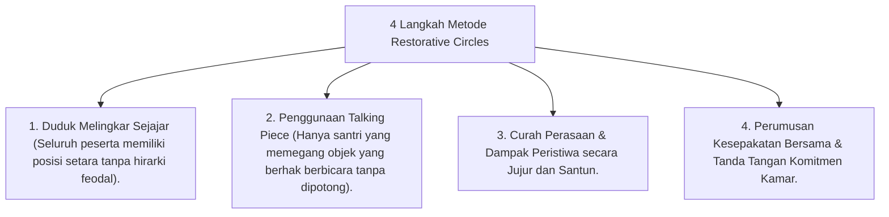

# P10-07-03: Metode Restorative Circles dan Musyawarah Restoratif

## Status Dokumen
* **Status**: 🌟 **A+ (Tervalidasi & Siap Diimplementasikan)**
* **Sub-Domain**: `10 Methods / 07 Collaborative Learning`
* **Penanggung Jawab Keilmuan**: Dewan Keilmuan TUMBUH (*Pakar Kuratif Restoratif & Pakar Tata Kelola Qudwah*)

---

## 1. Operasionalisasi Metode Restorative Circles

Lingkaran Restoratif diselenggarakan untuk memulihkan hubungan atau menyepakati aturan kamar secara demokratis & Islami:

---

## 2. Penghormatan Suara Santri

Metode ini memastikan setiap santri memiliki hak suara (*Voice & Choice*) dan merasa aman dalam komunitas pesantren.
