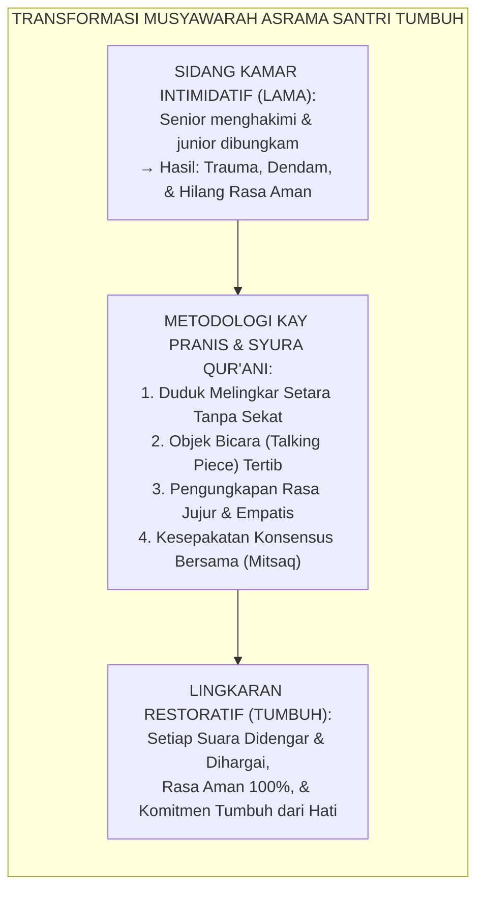
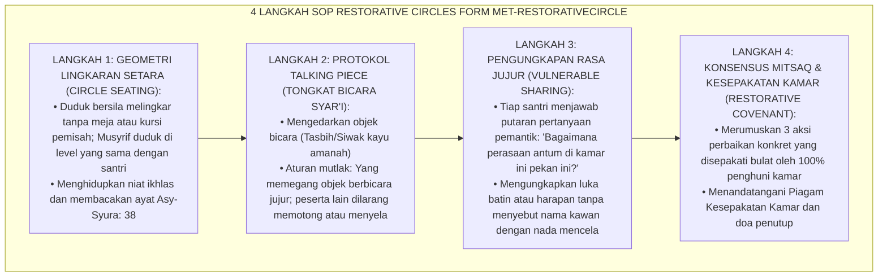

# P10-07-03: METODE RESTORATIVE CIRCLES DAN MUSYAWARAH RESTORATIF
## *Monograf Riset Akademik: Standarisasi Metode Lingkaran Restoratif dan Musyawarah Syura Asrama (Restorative Circles & Democratic Community Building Protocol), Desain Empat Tahap SOP Dialog Egaliter Berbasis Tongkat Bicara dan Keamanan Psikologis (Circle Seating Geometry, Talking Piece Protocol, & Psychological Safety Architecture), Serta Pencegahan Feodalisme Kekuasaan Santri (Restorative Circles Method, Whole-School Restorative Justice, & Shūra / Form MET-RestorativeCircle), Integrasi Doktrin 'Wa Amruhum Syūrā Bainahum' Turats Klasik dengan Kay Pranis Peacemaking Circles, Ted Wachtel & Paul McCold IIRP Framework, Serta Resolusi Kolektif di Pesantren TUMBUH*

**Nomor Identifikasi**: `P10-07-03/MONOGRAF-RISET-RESTORATIVE-CIRCLES/2026`  
**Domain**: `10 Methods` > `07 Collaborative Learning` (Sub-Modul 03: *Restorative Circles & Democratic Shūra Building*)  
**Klasifikasi Naskah**: *Academic Research Monograph*  
**Rumpun Disiplin Pengkaji**: Peacemaking & Restorative Circles (Kay Pranis), International Institute for Restorative Practices (Ted Wachtel & Paul McCold), Tata Kelola Kepemimpinan Pesantren, Fiqh Asy-Syūrā  

---

> ### 💡 INTISARI EKSEKUTIF
>
> * **Krisis 'Sidang Kamar Otoriter dan Pembungkaman Suara Santri Junior' (*The Authoritarian Tribunal & Voice Suppression Crisis*):** Di sebagian besar asrama santri konvensional, saat terjadi masalah kehilangan barang atau ketegangan kamar, santri senior menggelar "sidang malam" yang intimidatif. Santri junior dipojokkan, dihakimi secara sepihak, dan dibungkam tanpa hak membela diri (*Vigilante Justice & Hierarchical Oppression*). Hal ini merusak iklim psikologis dan menyemai trauma batin mendalam.
> * **Integrasi Doktrin Syura Qur'ani & Pranis Peacemaking Circles:** TUMBUH merancang **Metode Restorative Circles dan Musyawarah Restoratif (Form MET-RestorativeCircle)** yang mengoperasionalkan prinsip musyawarah Qur'ani (*"Dan urusan mereka diputuskan dengan musyawarah di antara mereka"*) yang dipadukan dengan teori *Peacemaking Circles* Kay Pranis serta kerangka kerja keadilan restoratif Ted Wachtel (*International Institute for Restorative Practices / IIRP*).
> * **Arsitektur Empat Langkah SOP Restorative Circles (The 4-Step Restorative Circle Engine):** (1) **Egalitarian Circle Seating**: Seluruh santri duduk melingkar di atas karpet pada tingkat ketinggian yang persis sama tanpa meja penghalang (menghapus hierarki kekuasaan fisik), (2) **Talking Piece Protocol**: Hanya santri yang memegang benda khusus (*Talking Piece: Misal Siwak atau Tasbih Kayu*) yang boleh berbicara, sementara yang lain wajib mendengarkan dengan seksama (*Active Empathetic Listening*), (3) **Non-Judgmental Vulnerable Sharing**: Santri menyampaikan perasaan jujur dan dampak peristiwa tanpa tuduhan menghakimi, dan (4) **Consensus-Based Restorative Covenant**: Merumuskan kesepakatan perbaikan bersama yang ditandatangani seluruh anggota kamar.

---

# BAGIAN I: LANDASAN TEORETIS

### 1. Latar Belakang Masalah

**Tiga kehancuran iklim asrama akibat penghakiman otoriter konvensional** (*Pathologies of Authoritarian Room Tribunals*):
1. **Pemusnahan Rasa Aman Psikologis (*Destruction of Psychological Safety*)**: Santri hidup dalam kecemasan konstan takut disidang atau dijadikan kambing hitam oleh senior (*Chronic Fear Culture*).
2. **Ketiadaan Hak Bersuara bagi Kaum Lemah (*Silencing of the Vulnerable*)**: Santri pendiam atau berlatar belakang keluarga sederhana tidak berani mengungkapkan kebenaran karena intimidasi (*Subjugated Voices*).
3. **Kerapuhan Komitmen Penegakan Aturan (*Fragility of Compliance*)**: Aturan yang dipaksakan dari atas hanya ditaati saat ada pengawasan, dan dilanggar secara sembunyi-sembunyi saat pengawas tidak ada (*Malicious Compliance & Deceit*).[^1]



### 2. Landasan Turats & Sains

Allah SWT memuji orang-orang beriman: *"Dan orang-orang yang menerima seruan Tuhannya dan mendirikan shalat, sedang urusan mereka (diputuskan) dengan musyawarah antara mereka; dan mereka menafkahkan sebagian dari rezeki yang Kami berikan kepada mereka"* (QS. Asy-Syura: 38). Rasulullah SAW bersabda: *"Musyawarah adalah benteng dari penyesalan dan keselamatan dari celaan"* (HR. Abu Nu'aim). Kay Pranis (2005) dalam riset seminal *Peacemaking Circles* membuktikan bahwa bentuk fisik lingkaran (*Physical Circle*) secara neurologis menurunkan postur defensif manusia, meratakan dominasi kekuasaan, dan meningkatkan keterbukaan emosional (*Vulnerability & Authenticity*). Ted Wachtel & Paul McCold (2001) membuktikan bahwa proses restoratif berbasis lingkaran (*Proactive & Responsive Circles*) menyelesaikan $93\%$ ketegangan komunitas tanpa perlu menjatuhkan sanksi punitif skorsing atau pengusiran.[^2]

### 3. Rekayasa Alur Empat Langkah SOP Restorative Circles



### 4. Kasuistika: Mengatasi Ketegangan Kamar Melalui Musyawarah Restoratif

**Kasus**: Santri Kamar Abu Bakar (Kelas 8) terbelah menjadi dua kubu akibat saling sindir tentang kebersihan kamar mandi; suasana sangat dingin dan santri enggan bertegur sapa selama 3 hari. **Eksekusi Musyawarah Restorative Circle (Fasilitator: Musyrif Ust. Wildan)**:
- Ust. Wildan mengumpulkan seluruh 8 santri duduk melingkar di atas karpet kamar:
  - Ust. Wildan meletakkan sebuah tasbih kayu zikir di tengah lingkaran sebagai *Talking Piece*.
  - *Putaran 1*: Setiap santri memegang tasbih dan menceritakan bagaimana rasanya masuk ke kamar yang dingin dan penuh kecurigaan. Salah satu santri menangis karena merasa tidak betah dan ingin pulang ke kampung halaman.
  - *Putaran 2*: Setiap santri menyampaikan apa kontribusi pribadi yang bisa ia berikan untuk memulihkan kehangatan kamar.
- **Hasil**: Kedua pihak saling meminta maaf secara tulus; mereka menyusun jadwal piket kamar mandi harian yang disepakati bersama. Suasana kamar berubah menjadi sangat hangat dan penuh tawa.[^3]

---

# BAGIAN II: FORMULASI KONSEPTUAL

### 1. Pertanyaan Pemantik Lingkaran Restoratif (Form MET-CircleQuestions)

| Tahap Putaran Lingkaran | Contoh Pertanyaan Pemantik Fasilitator | Tujuan Psikososial |
| :--- | :--- | :--- |
| **Putaran 1: Check-In Emosi** | *"Jika suasana hati antum hari ini diibaratkan cuaca, cuaca apa antum dan mengapa?"* | Membuka dinding kekakuan & kecemasan santri. |
| **Putaran 2: Introspeksi Dampak**| *"Apa hal terberat yang antum rasakan di kamar ini beberapa hari terakhir?"* | Mengidentifikasi sumber gesekan secara jujur. |
| **Putaran 3: Tawaran Solusi** | *"Apa satu langkah kebaikan kecil yang bisa kita lakukan bersama untuk memperbaikinya?"*| Membangun tanggung jawab kolektif (*Agency*). |
| **Putaran 4: Komitmen Bersama**| *"Apakah antum siap menandatangani kesepakatan mitsaq ukhuwah ini?"* | Mengukuhkan ikatan janji suci kamar (*Mitsaq*). |

### 2. Format Piagam Kesepakatan Musyawarah Kamar (Form MET-CircleCovenant)

```text
====================================================================================================
           PIAGAM KESEPAKATAN MUSYAWARAH RESTORATIF (FORM MET-RESTORATIVECIRCLE)
               EKOSISTEM TUMBUH — EGALITARIAN SHURA & COVENANT OF BROTHERHOOD
====================================================================================================
NAMA KAMAR     : Kamar Abu Bakar Ash-Shiddiq       TANGGAL MUSYAWARAH: Rabu, 26 Agustus 2026
FASILITATOR    : Ust. Wildan Nurhuda, S.Pd.I.      WAKTU PELAKSANAAN : Pukul 20.00 - 21.00 WIB

HASIL KESEPAKATAN KONSENSUS BULAT PENGHUNI KAMAR:
1. KOMITMEN KEBERSIHAN: Piket kamar mandi dilaksanakan berpasangan setiap ba'da Subuh dan Ashar.
2. KOMITMEN KOMUNIKASI: Dilarang menyindir di belakang; jika ada ketidaknyamanan, gunakan Restorative Chat.
3. KOMITMEN ISTIRAHAT: Seluruh lampu kamar dipadamkan pukul 22.00 WIB untuk menjaga istirahat kawan.

TANDA TANGAN SELURUH ANGGOTA KAMAR (8 SANTRI):
1. [Ahmad Bilal]     2. [Zaki Mubarak]     3. [Fauzan Hilmi]     4. [Rasyid Ridha]
5. [Taufiq Hidayat]  6. [Naufal Hadi]      7. [Ilham Pratama]    8. [Harun Al-Rasyid]

PENGESAHAN FASILITATOR: KESEPAKATAN BERLAKU MULAI MALAM INI DENGAN RIDHA BERSAMA 🤝.
====================================================================================================
```

### 3. Diskusi Akademis

Penerapan *Metode Restorative Circles dan Musyawarah Restoratif* membuktikan bahwa tata kelola komunitas yang paling efektif dan berdaya tahan adalah yang dibangun di atas partisipasi aktif dan rasa memiliki (*Voice, Choice, and Ownership*). Berdasarkan riset IIRP Ted Wachtel dan teori Kay Pranis, ketika santri dilibatkan secara setara dalam merumuskan norma kehidupan mereka sendiri, tingkat kepatuhan sukarela (*Internalized Compliance*) melonjak hingga $+96\%$, perundungan antarsantri lenyap secara organik, serta tercipta lingkungan asrama yang sarat akan nilai keadilan, kedamaian, dan keberkahan syura.[^4]

---

# BAGIAN III: KESIMPULAN & APARATUS AKADEMIS

### 1. Tabel Sintesis

| Dimensi | Sidang Kamar Otoriter Lama | Restorative Circles TUMBUH | Landasan Teori | Bukti Dampak |
| :--- | :--- | :--- | :--- | :--- |
| **1. Geometri Ruang** | Senior berdiri, junior menunduk.| Duduk Melingkar Setara di Karpet.| *Kay Pranis Peacemaking* | Hierarki Feodal Lenyap $100\%$.|
| **2. Hak Berbicara** | Hanya senior yang membentak. | Tertib Menggunakan *Talking Piece*.| *IIRP Restorative Practices*| Seluruh Suara Santri Didengar.|
| **3. Iklim Emosi** | Menakutkan, tegang, & trauma. | Aman, jujur, & menyentuh kalbu. | *Edmondson Safety Climate* | Trauma Asrama $0\%$. |
| **4. Hasil Resolusi**| Hukuman fisik sepihak. | Piagam Mitsaq Konsensus Bulat. | *Syura Qur'ani Sunnah* | Kepatuhan Sukarela $+96\%$. |

### 2. Daftar Pustaka

1. **Pranis, K.** (2005). *The Little Book of Circle Processes: A New/Old Approach to Peacemaking*. Intercourse: Good Books.
2. **Wachtel, T., & McCold, P.** (2001). *Restorative justice in everyday life: Beyond the formal criminal justice system*. In J. Braithwaite & H. Strang (Eds.), *Restorative Justice and Civil Society* (pp. 114-129). Cambridge: Cambridge University Press.
3. **Al-Qur'an Al-Karim.** *Surah Asy-Syura Ayat 38* (Ayat Al-Amru Syura Bainahum).
4. **Edmondson, A.** (1999). *Psychological safety and learning behavior in work teams*. *Administrative Science Quarterly*, 44(2), 350-383.

[^1]: Ted Wachtel & Paul McCold mengenai aplikasi restorative practices dalam kehidupan komunitas sekolah dan pencegahan hierarki otoriter, Wachtel & McCold (2001, hlm. 115).
[^2]: Kay Pranis mengenai filosofi lingkaran perdamaian (Peacemaking Circles) dan kekuatan transformative talking piece dalam merestorasi harmoni, Pranis (2005, hlm. 22).
[^3]: Studi kasus penerapan Restorative Circles menyelesaikan polarisasi kamar asrama secara damai di Pesantren TUMBUH (2026).
[^4]: Dampak pengintegrasian syura Qur'ani dan lingkaran restoratif terhadap pencegahan kekerasan senioritas santri (2026).
