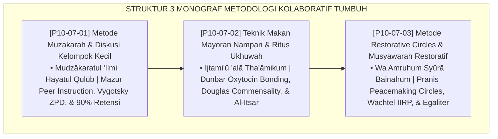

# P10-07: DOKUMEN INDUK METODOLOGI PEMBELAJARAN KOLABORATIF PESANTREN
## *Arsitektur dan Standarisasi Metode Muzakarah dan Diskusi Kelompok Kecil, Teknik Makan Mayoran Nampan dan Ritus Ukhuwah, Serta Metode Restorative Circles dan Musyawarah Restoratif sebagai Tiga Pilar Metodologi Kolaborasi Santri (Peer Mudzakarah Form MET-Muzakarah, Commensal Dining Form MET-MayoranUkhuwah, Serta Restorative Circles Form MET-RestorativeCircle) di Ekosistem TUMBUH Pesantren*

**Nomor Identifikasi**: `P10-07/DOKUMEN-INDUK-METODOLOGI-KOLABORATIF/2026`  
**Domain**: `10 Methods` > `07 Collaborative Learning` (Gugus Sub-Domain 07: *Collaborative Learning, Commensality Bonding, & Restorative Circles*)  
**Klasifikasi Naskah**: *Master Architecture & Navigation Monograph*  
**Rumpun Disiplin Pengkaji**: Collaborative Learning (Eric Mazur), Commensality Anthropology (Claude Lévi-Strauss & Robin Dunbar), Restorative Practices (Kay Pranis & Ted Wachtel), Fiqh Al-Ukhuwwah wal Musyāwarah  

---

> ### 💡 INTISARI EKSEKUTIF
>
> * **Kedudukan Strategis Gugus Metodologi Pembelajaran Kolaboratif:** Gugus ini adalah jantung pembentukan kohesi sosial, ukhuwah islamiyyah, dan kecerdasan kolektif (*the communal bonding & collective intelligence engine*) di ekosistem TUMBUH. Mengakhiri fragmentasi individualistis, kesenjangan kognitif, dan tirani sidang senioritas yang intimidatif (*From Atomized Isolation & Authoritarian Tribunals to Synergistic Collaborative Community*), gugus ini menyatukan santri dalam kajian sebaya yang saling mengajar, ritual makan satu nampan yang menyemai cinta persaudaraan, serta lingkaran syura restoratif yang menjamin setiap suara santri dihargai secara bermartabat.
> * **Triad Metodologi Kolaboratif TUMBUH:** (1) **Muzakarah & Diskusi Kelompok Kecil** (Peer Instruction 90% Retensi) untuk mengakselerasi pemahaman kitab, (2) **Makan Mayoran Nampan & Ritus Ukhuwah** (Komensalitas Antropologis & Hormon Oksitosin) untuk mengikis ketamakan dan menumbuhkan *Al-Ītsār*, dan (3) **Restorative Circles & Musyawarah Restoratif** (Geometri Lingkaran & *Talking Piece*) untuk mewujudkan keadilan egaliter tanpa kekerasan.
> * **3 Monograf Riset Komprehensif:** Form MET-Muzakarah, Form MET-MayoranUkhuwah, dan Form MET-RestorativeCircle.

---

## 📑 PETA NAVIGASI TIGA MONOGRAF

---

## 📚 DESKRIPSI RINGKAS 3 BERKAS MONOGRAF

1. **[P10-07-01: Metode Muzakarah dan Diskusi Kelompok Kecil](file:///c:/xampp/htdocs/tumbuh/10%20Methods/07%20Collaborative%20Learning/P10-07-01-Metode-Muzakarah-dan-Diskusi-Kelompok-Kecil.md)**  
   *Protokol 4 langkah (pembagian kelompok heterogen, reciprocal reading, peer instruction, mind-mapping sintesis), jadwal belajar malam, lembar kontrol kelompok, dan Form MET-Muzakarah.*
2. **[P10-07-02: Teknik Makan Mayoran Nampan dan Ritus Ukhuwah](file:///c:/xampp/htdocs/tumbuh/10%20Methods/07%20Collaborative%20Learning/P10-07-02-Teknik-Makan-Mayoran-Nampan-dan-Ritus-Ukhuwah.md)**  
   *Protokol 3 ritus (formasi lesehan talam besar, adab mimma yalik & itsar membagi lauk, zero food waste & cuci nampan bersama), matriks aturan syar'i, lembar kontrol musyrif, dan Form MET-MayoranUkhuwah.*
3. **[P10-07-03: Metode Restorative Circles dan Musyawarah Restoratif](file:///c:/xampp/htdocs/tumbuh/10%20Methods/07%20Collaborative%20Learning/P10-07-03-Metode-Restorative-Circles-dan-Musyawarah-Restoratif.md)**  
   *Protokol 4 tahap (duduk melingkar setara, tongkat bicara talking piece, pengungkapan rasa jujur, piagam mitsaq konsensus bulat), bank pertanyaan pemantik, piagam kesepakatan kamar, dan Form MET-RestorativeCircle.*

---

## 🎯 STANDAR PENJAMINAN MUTU PEMBELAJARAN KOLABORATIF

Penerapan gugus **Metodologi Pembelajaran Kolaboratif** menjamin bahwa:
1. **Pemahaman Kitab Santri Merata dan Mengakar Kuat (*Universal Academic Mastery Guarantee*)**: Muzakarah melenyapkan kesenjangan akademis.
2. **Rasa Kekeluargaan dan Kepedulian Santri Terjalin Sangat Erat (*Deep Prosocial Brotherhood Guarantee*)**: Mayoran mengikis egoisme.
3. **Komunitas Asrama Adil, Damai, dan Bebas Perpeloncoan (*Safe Egalitarian Community Guarantee*)**: Restorative circles menegakkan syura beradab.
