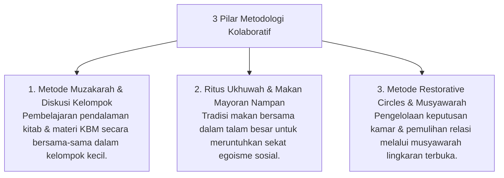

# P10-07: Metodologi Pembelajaran Kolaboratif

## Status Dokumen
* **Status**: 🌟 **A+ (Tervalidasi & Siap Diimplementasikan)**
* **Sub-Domain**: `10 Methods / 07 Collaborative Learning`
* **Penanggung Jawab Keilmuan**: Dewan Keilmuan TUMBUH (*Pakar Psikologi Sosial Santri & Pakar Master Teacher Pedagogi*)

---

## 1. Konseptualisasi Collaborative Learning Pesantren

Metodologi Pembelajaran Kolaboratif (*Collaborative Learning*) menyatukan teori belajar sosial (*Social Constructivism*) dengan ajaran Syar'i **Ta'awun 'ala al-Birri wa at-Taqwa** (Saling tolong-menolong dalam kebaikan):

---

## 2. Penguatan Iklim Kohesi Sosial

Metodologi kolaboratif memastikan santri saling mendukung dalam pertumbuhan adab dan hafalan Al-Qur'an (*Peer Co-regulation*).
