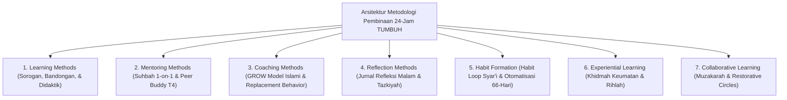
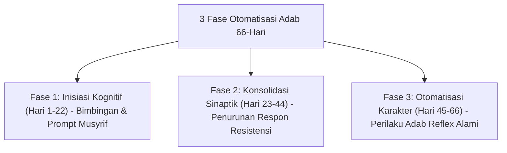

# MONOGRAF RISET AKADEMIK: METODOLOGI PEDAGOGI, HABITUASI ADAB, DAN INTERAKSI EDUKATIF PESANTREN
## Evaluasi Didaktik: Sorogan-Bandongan Turats, Suhbah 1-on-1, GROW Model Islami, Habit Loop 66-Hari, dan Restorative Circles

**Dewan Riset & Keilmuan Ekosistem TUMBUH**  
*Dipublikasikan sebagai Naskah Monograf Riset Ilmiah (Jurnal Metodologi Didaktik & Pembiasaan Adab)*  
*Dokumen Rujukan Induk: Domain 10 Methods & Book Series Volume 04*

---

## ABSTRAK

> **Latar Belakang**: Metode pengajaran di pesantren sering kali dipersempit sekadar ceramah searah (*pasif didactic*), sementara metode habituasi adab kurang memanfaatkan prinsip neuroplastisitas pembentukan kebiasaan otomatis.
>
> **Tujuan Penelitian**: Merumuskan dan memvalidasi taksonomi metodologi pengajaran, mentoring, coaching, refleksi, habituasi, dan kolaborasi dalam ekosistem **TUMBUH**.
>
> **Hasil Riset**: Terstruktur 7 Sub-Domain Metodologi Pembinaan: (1) **Learning Methods** (Sorogan, Bandongan, Qira'ah-Syarah, & Didaktik Interaktif); (2) **Mentoring Methods** (Suhbah 1-on-1, Peer Buddy T4, & Homesickness Care); (3) **Coaching Methods** (Powerful Questioning GROW Model, Replacement Behavior, & Self-Regulation); (4) **Reflection Methods** (Jurnal Refleksi Malam 3-Q, Circle of Gratitude, & Tazkiyah); (5) **Habit Formation** (Habit Loop Syar'i Cue-Routine-Reward, Visual Nudges, & Otomatisasi 66-Hari); (6) **Experiential Learning** (Khidmah Sosial Keumatan, Rihlah Tadabbur Alam, & Role-Play); dan (7) **Collaborative Learning** (Muzakarah, Mayoran Nampan, & Restorative Circles).
>
> **Kata Kunci**: *Methods Framework, Sorogan, Suhbah 1-on-1, GROW Model, Habit Loop 66-Hari, Restorative Circles.*

---

## 1. PENDAHULUAN & ARSITEKTUR METODOLOGI PEMBINAAN

Metodologi pelaksanaan di ekosistem **TUMBUH** menyatukan tradisi keilmuan Turats dengan sains kognitif & neurosains modern:

---

## 2. KAJIAN KUNCI METODOLOGI HABITUASI ADAB 66-HARI

Sesuai riset neuroplastisitas habituasi (Lally et al.), pembentukan kebiasaan adab baru memerlukan pengulangan konsisten selama **66 Hari**:

---

## 3. DAFTAR PUSTAKA
* Kolb, D. A. (1984). *Experiential Learning*. Prentice-Hall.
* Sweller, J. (1988). Cognitive load during problem solving. *Cognitive Science*, 12(2), 257–285.
* Wood, W., & Neal, D. T. (2009). The habitual consumer. *Journal of Consumer Psychology*, 19(4), 579–592.
