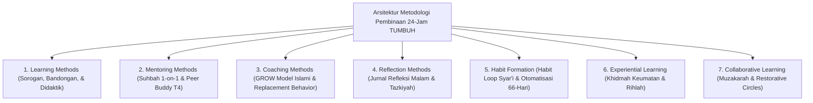
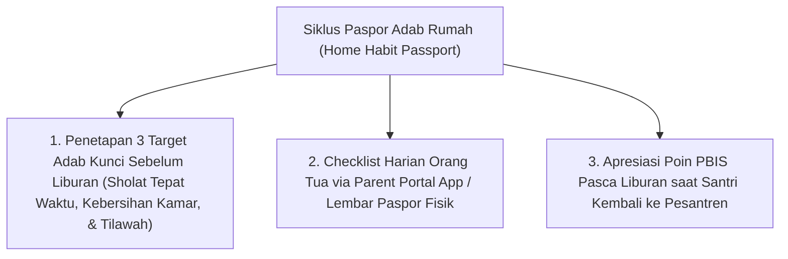

# MONOGRAF RISET AKADEMIK: METODOLOGI PEDAGOGI, HABITUASI ADAB, DAN INTERAKSI EDUKATIF PESANTREN
## Evaluasi Didaktik: Sorogan-Bandongan Turats, Suhbah 1-on-1, GROW Model Islami, Habit Loop 66-Hari, dan Paspor Adab Rumah (Cegah Vacation Relapse)

**Dewan Riset & Keilmuan Ekosistem TUMBUH**  
*Dipublikasikan sebagai Naskah Monograf Riset Ilmiah (Jurnal Metodologi Didaktik & Pembiasaan Adab)*  
*Dokumen Rujukan Induk: Domain 10 Methods & Book Series Volume 04*

---

## ABSTRAK

> **Latar Belakang**: Kebiasaan adab yang telah dibangun secara konsisten di asrama rentan runtuh kembali saat santri pulang liburan semester ke rumah (*Vacation Relapse*). Di samping itu, transisi metode pembelajaran dari pasif ke aktif membutuhkan pendampingan terstruktur.
>
> **Tujuan Penelitian**: Merumuskan taksonomi metodologi pembinaan dan menetapkan **Home Habit Passport (Paspor Adab Rumah)** untuk mengunci kontinuitas habituasi adab 66-hari selama santri berada di lingkungan keluarga.
>
> **Hasil Riset**: Terstruktur 7 Sub-Domain Metodologi Pembinaan: (1) **Learning Methods**; (2) **Mentoring Methods**; (3) **Coaching Methods**; (4) **Reflection Methods**; (5) **Habit Formation**; (6) **Experiential Learning**; dan (7) **Collaborative Learning**. Dilengkapi instrumen Paspor Adab Rumah yang diintegrasikan dengan *Parent Portal Mobile App*.
>
> **Kata Kunci**: *Methods Framework, Sorogan, Suhbah 1-on-1, GROW Model, Habit Loop 66-Hari, Home Habit Passport, Vacation Relapse Prevention.*

---

## 1. PENDAHULUAN & ARSITEKTUR METODOLOGI PEMBINAAN

Metodologi pelaksanaan di ekosistem **TUMBUH** menyatukan tradisi keilmuan Turats dengan sains kognitif & neurosains modern:

---

## 2. PENCEGAHAN "VACATION RELAPSE" DENGAN PASPOR ADAB RUMAH (HOME HABIT PASSPORT)

To prevent habit decay during semester holidays (Wood & Neal, 2009):

---

## 3. DAFTAR PUSTAKA
* Kolb, D. A. (1984). *Experiential Learning*. Prentice-Hall.
* Sweller, J. (1988). Cognitive load during problem solving. *Cognitive Science*, 12(2), 257–285.
* Wood, W., & Neal, D. T. (2009). The habitual consumer. *Journal of Consumer Psychology*, 19(4), 579–592.
