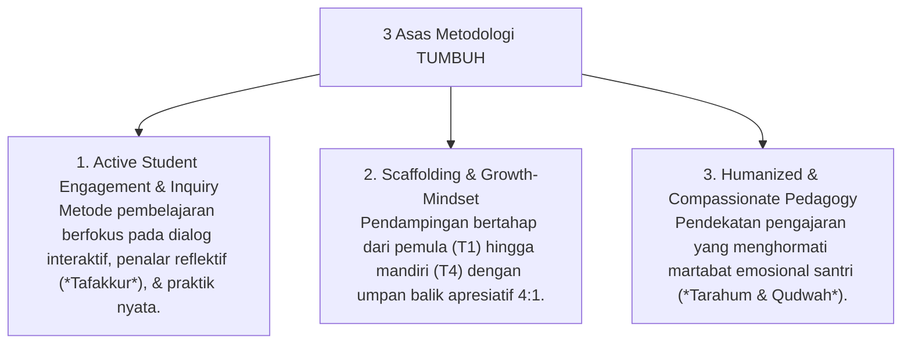
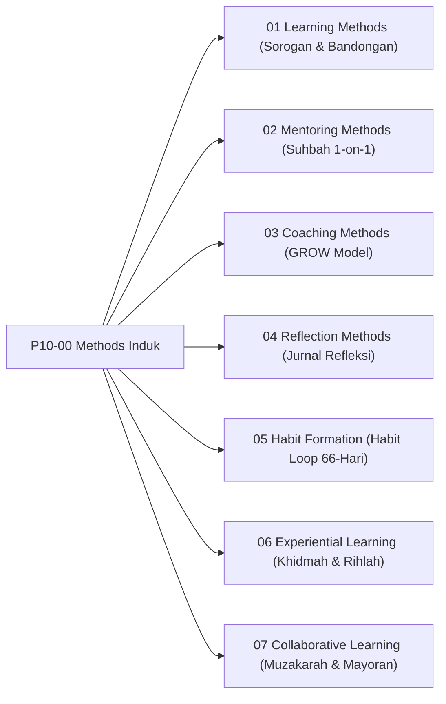

# P10-00: Methods Induk (Kerangka Kerja Metodologi Pedagogi Pesantren TUMBUH)

## Status Dokumen
* **Status**: 🌟 **A+ (Tervalidasi & Induk Baku)**
* **Domain**: Project 10 — `10 Methods`
* **Penanggung Jawab Keilmuan**: Dewan Keilmuan TUMBUH (*Pakar Master Teacher Pedagogi, Pakar Epistemologi Turats, & Pakar Neurosains Perkembangan*)

---

## 1. Pendahuluan & Prinsip Metodologi Pedagogi Islami

Sesuai Dokumen Induk `AGENTS.md`, metodologi pelaksanaan di ekosistem **TUMBUH** memadukan seni pengajaran Turats Islam (*At-Ta'lim wa at-Ta'dib*) dengan metode sains pembelajaran modern yang ramah fitrah dan bebas dari hukuman fisik/feodalisme.

---

## 2. Model Triad Pertumbuhan Simbiotik dalam Metodologi

- **Santri Tumbuh**: Mendapatkan pengalaman belajar & habituasi yang aktif, menyenangkan, ilmiah, dan berkesan tinggi bagi ingatan jangka panjang.
- **Guru & Musyrif Tumbuh**: Memiliki penguasaan metode pengajaran & pendampingan yang bervariasi, mencegah kejenuhan mengajar, & meningkatkan efikasi diri.
- **Sistem Lembaga Tumbuh**: Memiliki standarisasi mutu metodologi pembelajaran 24-jam yang teruji secara psikometrik & akademis.

---

## 3. Peta Hubungan Sub-Domain Metodologi

---

## 4. Rujukan Keilmuan Multidisiplin

1. **Turats Islam**: *Ta'lim al-Muta'allim* (Al-Zarnuji), *Adab al-Alim wa al-Muta'allim* (Imam An-Nawawi), *Tadzkirat as-Sami'* (Ibn Jama'ah).
2. **Sains Kontemporer**: *Experiential Learning Theory* (Kolb), *Cognitive Load Theory* (Sweller), *Habit Formation Theory* (Lally et al.), *Restorative Practices in Schools* (Zehr & Evans).
