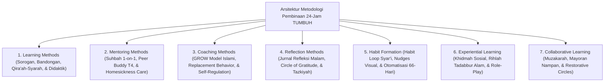

# 10 Methods (Kerangka Kerja Metodologi Pedagogi Pesantren TUMBUH)

Domain ini memuat petunjuk praktis dan metodologi pelaksanaan (*Pedagogical & Behavioral Methods*) di ekosistem **TUMBUH** yang terbagi dalam **7 Sub-Domain Utama**: Learning Methods, Mentoring Methods, Coaching Methods, Reflection Methods, Habit Formation, Experiential Learning, dan Collaborative Learning.

---

## Arsitektur Metodologi Pembinaan & Pembiasaan Adab

---

## Indeks Dokumen Induk & 7 Sub-Domain Modul

* 📄 **[P10-00-Methods-Induk.md](./P10-00-Methods-Induk.md)**: Dokumen Maha-Induk Metodologi Pedagogi & Pembiasaan Adab Pesantren.

### Sub-Domain 01: Learning Methods
* 📁 **[01 Learning Methods](./01%20Learning%20Methods/)**:
  * 📄 [P10-01-Metodologi-Pembelajaran.md](./01%20Learning%20Methods/P10-01-Metodologi-Pembelajaran.md)
  * 📄 [P10-01-01-Metode-Qiraah-Syarah-dan-Sorogan-Kitab-Turats.md](./01%20Learning%20Methods/P10-01-01-Metode-Qiraah-Syarah-dan-Sorogan-Kitab-Turats.md)
  * 📄 [P10-01-02-Metode-Bandongan-dan-Halaqah-Tafakkur-Tematik.md](./01%20Learning%20Methods/P10-01-02-Metode-Bandongan-dan-Halaqah-Tafakkur-Tematik.md)
  * 📄 [P10-01-03-Metode-Didaktik-Interaktif-dan-Asesmen-Formatif-Kelas.md](./01%20Learning%20Methods/P10-01-03-Metode-Didaktik-Interaktif-dan-Asesmen-Formatif-Kelas.md)

### Sub-Domain 02: Mentoring Methods
* 📁 **[02 Mentoring Methods](./02%20Mentoring%20Methods/)**:
  * 📄 [P10-02-Metodologi-Mentoring.md](./02%20Mentoring%20Methods/P10-02-Metodologi-Mentoring.md)
  * 📄 [P10-02-01-Teknik-Suhbah-wa-Mulazamah-Musyrif-1-on-1.md](./02%20Mentoring%20Methods/P10-02-01-Teknik-Suhbah-wa-Mulazamah-Musyrif-1-on-1.md)
  * 📄 [P10-02-02-Metode-Pendampingan-Sebaya-Peer-Buddy-T4.md](./02%20Mentoring%20Methods/P10-02-02-Metode-Pendampingan-Sebaya-Peer-Buddy-T4.md)
  * 📄 [P10-02-03-Teknik-Pendampingan-Adaptasi-Homesickness-Care.md](./02%20Mentoring%20Methods/P10-02-03-Teknik-Pendampingan-Adaptasi-Homesickness-Care.md)

### Sub-Domain 03: Coaching Methods
* 📁 **[03 Coaching Methods](./03%20Coaching%20Methods/)**:
  * 📄 [P10-03-Metodologi-Coaching.md](./03%20Coaching%20Methods/P10-03-Metodologi-Coaching.md)
  * 📄 [P10-03-01-Teknik-Powerful-Questioning-Inquiry-GROW-Islami.md](./03%20Coaching%20Methods/P10-03-01-Teknik-Powerful-Questioning-Inquiry-GROW-Islami.md)
  * 📄 [P10-03-02-Metode-Akuisisi-Replacement-Behavior-Adaptif.md](./03%20Coaching%20Methods/P10-03-02-Metode-Akuisisi-Replacement-Behavior-Adaptif.md)
  * 📄 [P10-03-03-Teknik-Coaching-Self-Regulation-dan-BIP-Tier-3.md](./03%20Coaching%20Methods/P10-03-03-Teknik-Coaching-Self-Regulation-dan-BIP-Tier-3.md)

### Sub-Domain 04: Reflection Methods
* 📁 **[04 Reflection Methods](./04%20Reflection%20Methods/)**:
  * 📄 [P10-04-Metodologi-Refleksi.md](./04%20Reflection%20Methods/P10-04-Metodologi-Refleksi.md)
  * 📄 [P10-04-01-Teknik-Jurnal-Refleksi-Malam-3-Pertanyaan-Muhasabah.md](./04%20Reflection%20Methods/P10-04-01-Teknik-Jurnal-Refleksi-Malam-3-Pertanyaan-Muhasabah.md)
  * 📄 [P10-04-02-Metode-Refleksi-Kelompok-Circle-of-Gratitude.md](./04%20Reflection%20Methods/P10-04-02-Metode-Refleksi-Kelompok-Circle-of-Gratitude.md)
  * 📄 [P10-04-03-Teknik-Metakognisi-Diri-dan-Tazkiyatun-Nafs.md](./04%20Reflection%20Methods/P10-04-03-Teknik-Metakognisi-Diri-dan-Tazkiyatun-Nafs.md)

### Sub-Domain 05: Habit Formation
* 📁 **[05 Habit Formation](./05%20Habit%20Formation/)**:
  * 📄 [P10-05-Metodologi-Habituasi-Adab.md](./05%20Habit%20Formation/P10-05-Metodologi-Habituasi-Adab.md)
  * 📄 [P10-05-01-Siklus-Habit-Loop-Cue-Routine-Reward-Syar'i.md](./05%20Habit%20Formation/P10-05-01-Siklus-Habit-Loop-Cue-Routine-Reward-Syar'i.md)
  * 📄 [P10-05-02-Operasionalisasi-Nudges-Visual-dan-Environmental-Engineering.md](./05%20Habit%20Formation/P10-05-02-Operasionalisasi-Nudges-Visual-dan-Environmental-Engineering.md)
  * 📄 [P10-05-03-Metode-Otomatisasi-Habituasi-Adab-66-Hari.md](./05%20Habit%20Formation/P10-05-03-Metode-Otomatisasi-Habituasi-Adab-66-Hari.md)

### Sub-Domain 06: Experiential Learning
* 📁 **[06 Experiential Learning](./06%20Experiential%20Learning/)**:
  * 📄 [P10-06-Metodologi-Experiential-Learning.md](./06%20Experiential%20Learning/P10-06-Metodologi-Experiential-Learning.md)
  * 📄 [P10-06-01-Metode-Khidmah-Sosial-Sukarela-Keumatan.md](./06%20Experiential%20Learning/P10-06-01-Metode-Khidmah-Sosial-Sukarela-Keumatan.md)
  * 📄 [P10-06-02-Teknik-Pembelajaran-Outdoor-dan-Rihlah-Tadabbur-Alam.md](./06%20Experiential%20Learning/P10-06-02-Teknik-Pembelajaran-Outdoor-dan-Rihlah-Tadabbur-Alam.md)
  * 📄 [P10-06-03-Metode-Simulasi-Role-Play-Dan-De-eskalasi-Konflik.md](./06%20Experiential%20Learning/P10-06-03-Metode-Simulasi-Role-Play-Dan-De-eskalasi-Konflik.md)

### Sub-Domain 07: Collaborative Learning
* 📁 **[07 Collaborative Learning](./07%20Collaborative%20Learning/)**:
  * 📄 [P10-07-Metodologi-Pembelajaran-Kolaboratif.md](./07%20Collaborative%20Learning/P10-07-Metodologi-Pembelajaran-Kolaboratif.md)
  * 📄 [P10-07-01-Metode-Muzakarah-dan-Diskusi-Kelompok-Kecil.md](./07%20Collaborative%20Learning/P10-07-01-Metode-Muzakarah-dan-Diskusi-Kelompok-Kecil.md)
  * 📄 [P10-07-02-Teknik-Makan-Mayoran-Nampan-dan-Ritus-Ukhuwah.md](./07%20Collaborative%20Learning/P10-07-02-Teknik-Makan-Mayoran-Nampan-dan-Ritus-Ukhuwah.md)
  * 📄 [P10-07-03-Metode-Restorative-Circles-dan-Musyawarah-Restoratif.md](./07%20Collaborative%20Learning/P10-07-03-Metode-Restorative-Circles-dan-Musyawarah-Restoratif.md)
