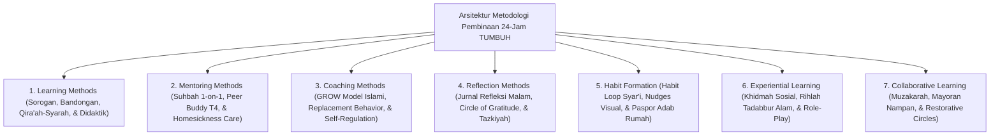

# Domain 10: Methods (Kerangka Kerja Metodologi Pedagogi Ekosistem Pesantren Berbasis TUMBUH)

Domain ini memuat petunjuk praktis dan metodologi pelaksanaan (*Pedagogical & Behavioral Methods*) di ekosistem **TUMBUH** yang terbagi dalam **7 Sub-Domain Utama**: Learning Methods, Mentoring Methods, Coaching Methods, Reflection Methods, Habit Formation, Experiential Learning, dan Collaborative Learning.

---

## Indeks Dokumen Induk & Jurnal Riset Monograf Utuh

* 📄 **[Jurnal-Monograf-Riset-Metodologi-Pedagogi-TUMBUH.md](./Jurnal-Monograf-Riset-Metodologi-Pedagogi-TUMBUH.md)**: **Monograf Riset Ilmiah Utuh & Terkonsolidasi** (Mencakup Sorogan/Bandongan Turats, Suhbah 1-on-1, GROW Model Islami, Habit Loop 66-Hari, & Paspor Adab Rumah Home Habit Passport).
* 📄 **[P10-00-Methods-Induk.md](./P10-00-Methods-Induk.md)**: Dokumen Maha-Induk Metodologi Pedagogi & Pembiasaan Adab Pesantren.

---

## Arsitektur Metodologi Pembinaan & Pembiasaan Adab

---

## 7 Sub-Domain Modul Metodologi Pedagogi

1. 📂 **[01 Learning Methods](./01%20Learning%20Methods/)**: Didaktik Turats (Qira'ah-Syarah, Sorogan Kitab, Bandongan, & Asesmen Formatif Kelas).
2. 📂 **[02 Mentoring Methods](./02%20Mentoring%20Methods/)**: Suhbah wa Mulazamah 1-on-1 Musyrif, Peer Buddy T4, & Homesickness Care.
3. 📂 **[03 Coaching Methods](./03%20Coaching%20Methods/)**: GROW Model Islami, Replacement Behavior, & Coaching Tier 3 BIP.
4. 📂 **[04 Reflection Methods](./04%20Reflection%20Methods/)**: Jurnal Refleksi Malam 3-Q, Circle of Gratitude, & Tazkiyatun Nafs.
5. 📂 **[05 Habit Formation](./05%20Habit%20Formation/)**: Habit Loop Syar'i, Environmental Engineering, & Paspor Adab Rumah (*Home Habit Passport*).
6. 📂 **[06 Experiential Learning](./06%20Experiential%20Learning/)**: Khidmah Sosial Keumatan, Rihlah Tadabbur Alam, & Role-Play De-eskalasi.
7. 📂 **[07 Collaborative Learning](./07%20Collaborative%20Learning/)**: Muzakarah Kelompok, Mayoran Nampan Ukhuwah, & Restorative Circles.
