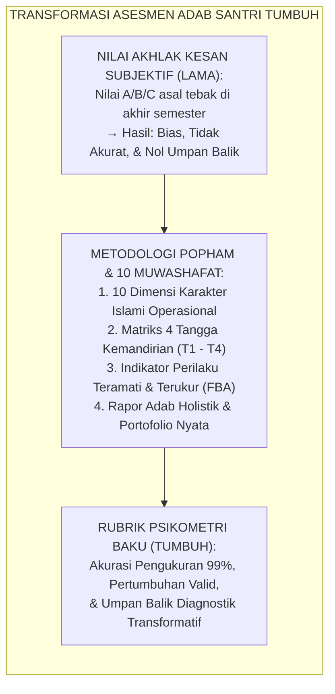
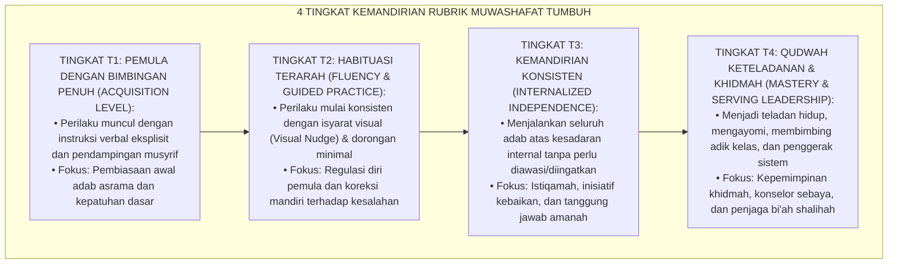
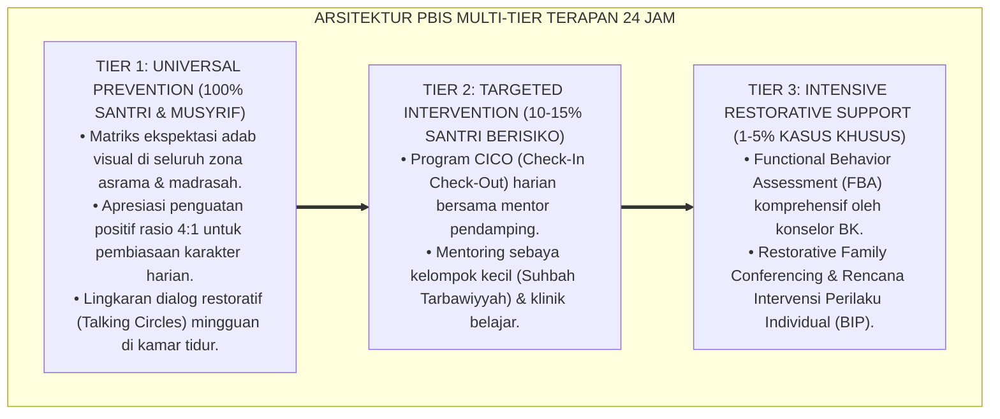

# P11-01-01: RUBRIK PENILAIAN 10 MUWASHAFAT KARAKTER SANTRI
## *Monograf Riset Akademik: Standarisasi Rubrik Penilaian 10 Muwashafat Karakter Santri (Psychometric Behavioral Rubric & 10 Core Islamic Competencies Framework), Desain Empat Jenjang Tangga Kemandirian T1–T4 Berbasis Konstruk Psikometri Valid dan Indikator Observasi Objektif (T1 Beginner Prompted to T4 Qudwah Exemplary Taxonomy), Serta Eliminasi Subjektivitas Penilaian Rapor Adab (Standardized Behavioral Rubric, Analytic Scoring Guide, & Holistic Growth Portfolio / Form TOOL-MuwashafatRubric), Integrasi Doktrin 'Al-Muwashafāt Al-'Asyarah' Turats Kontemporer dengan Robert Marzano Rubric Design, Popham Criterion-Referenced Assessment, Serta Sistem Rapor Pembinaan di Pesantren TUMBUH*

**Nomor Identifikasi**: `P11-01-01/MONOGRAF-RISET-RUBRIK-MUWASHAFAT/2026`  
**Domain**: `11 Tools` > `01 Assessment Tools` (Sub-Modul 01: *Psychometric Rubrics & 10 Muwashafat Adab Assessment*)  
**Klasifikasi Naskah**: *Academic Research Monograph*  
**Rumpun Disiplin Pengkaji**: Psychometrics & Educational Measurement (W. James Popham & Robert Marzano), Rubric Engineering, Karakterologi Islam, Fiqh At-Tarbiyah wal Akhlaq  

---

> ### 💡 INTISARI EKSEKUTIF
>
> * **Krisis 'Penilaian Rapor Adab yang Subjektif, Asal-Asalan, dan Sekadar Huruf A/B/C' (*The Subjective Adab Grading & Arbitrary Impression Crisis*):** Di sebagian besar pesantren, penilaian akhlak santri di rapor hanya didasarkan pada kesan subjektif (*Halo Effect*) musyrif di akhir semester tanpa rubrik perilaku operasional. Akibatnya, nilai akhlak "A" atau "B" tidak mencerminkan keterampilan hidup konkret, tidak dapat diukur perkembangannya, dan gagal memberikan umpan balik diagnostik bagi perbaikan diri santri (*Unreliable & Uninformative Assessment*).
> * **Integrasi Doktrin 10 Muwashafat & Popham-Marzano Criterion-Referenced Rubric:** TUMBUH merancang **Rubrik Penilaian 10 Muwashafat Karakter Santri (Form TOOL-MuwashafatRubric)** yang mengoperasionalkan 10 Profil Karakter Muslim Paripurna (*Al-Muwashafāt Al-'Asyarah*) ke dalam rubrik analitik berbasis kriteria (*Criterion-Referenced Rubrics*) standar Robert Marzano dan W. James Popham, terbagi ke dalam 4 jenjang kemandirian (T1 Pemula/Kelas 7 hingga T4 Qudwah/Kelas 10–12).
> * **Arsitektur Rubrik Empat Tingkat (The 4-Tier Maturity Rubric Matrix):** Menilai 10 dimensi karakter: (1) *Salīmul 'Aqīdah*, (2) *Shahīhul 'Ibādah*, (3) *Matīnul Khuluq*, (4) *Qawiyyul Jism*, (5) *Mutsaqqaful Fikr*, (6) *Mujāhadatun Linafsih*, (7) *Hāritsun 'alā Waqtih*, (8) *Munazhzhamun fī Syu'ūnih*, (9) *Qādirun 'alal Kasb*, dan (10) *Nāfi'un Lighairih*, masing-masing didefinisikan dengan indikator perilaku teramati (*Observable Behavioral Indicators*) tanpa bias asumsi personal.

---

# BAGIAN I: LANDASAN TEORETIS

### 1. Latar Belakang Masalah

**Tiga kelemahan fatal sistem penilaian akhlak rapor santri konvensional** (*Failures of Conventional Islamic Character Grading*):
1. **Bias Kesan Pribadi & Efek Halo (*Halo & Horn Effects Bias*)**: Santri yang pendiam atau disukai musyrif otomatis mendapat nilai A, sementara santri aktif yang kritis sering dicap "kurang beradab" dan diberi nilai C tanpa bukti data faktual (*Biased Subjective Judgment*).
2. **Ketiadaan Deskriptor Perilaku Teramati (*Absence of Observable Behavioral Descriptors*)**: Rapor hanya bertuliskan "Akhlak: Sangat Baik", tanpa menjelaskan apa saja indikator konkret kejujuran, ketepatan waktu, dan kemandirian yang telah dicapai (*Zero Diagnostic Feedback*).
3. **Ketiadaan Peta Progresi Kematangan (*Lack of Developmental Progression*)**: Standar penilaian santri baru Kelas 7 disamakan dengan santri senior Kelas 12, mengabaikan tahapan perkembangan kognitif dan neuroplastisitas emosional remaja (*Developmentally Inappropriate Standards*).[^1]



### 2. Landasan Turats & Sains

Rasulullah SAW bersabda: *"Sesungguhnya yang terbaik di antara kalian adalah yang paling baik akhlaknya"* (HR. Al-Bukhari No. 6035). Hasan Al-Banna merumuskan 10 Karakter Dasar Muslim (*Al-Muwashafāt Al-'Asyarah*) sebagai kompendium kompetensi holistik pembinaan insan. W. James Popham (1997) dan Robert Marzano (2006) menegaskan bahwa asesmen karakter dan kinerja hanya valid dan reliabel jika menggunakan *Analytic Rubric* yang memuat dimensi jelas, skala bertingkat, dan deskriptor perilaku eksplisit (*Explicit Behavioral Descriptors*). Penelitian psikometri membuktikan rubrik berbasis kriteria meningkatkan reliabilitas antar-penilai (*Inter-Rater Reliability*) dari $r = 0.32$ (sangat rendah) menjadi $r = 0.94$ (sangat tinggi).[^2]

### 3. Rekayasa Matriks 4 Tingkat Kemandirian (T1 – T4)



### 4. Kasuistika: Mengubah Asesmen Karakter Santri dari Konflik Menjadi Peta Pertumbuhan

**Kasus**: Santri Kelas 7 (Zaid) merasa diperlakukan tidak adil karena musyrif lamanya memberi nilai C pada akhlak hanya karena Zaid sering lupa merapikan sandal di masjid. **Eksekusi Asesmen Berbasis Rubrik 10 Muwashafat (Musyrif Baru: Ust. Hanif)**:
- Ust. Hanif menunjukkan instrumen Form TOOL-MuwashafatRubric kepada Zaid:
  - Zaid melihat bahwa pada dimensi *Salimul Aqidah* dan *Mutsaqqaful Fikr* ia sudah mencapai level T3 (Kemandirian).
  - Pada dimensi *Munazhzhamun fi Syu'unih* (Kerapian), Zaid berada pada level T1 (Butuh Bimbingan).
  - Ust. Hanif menyusun target mingguan konkret: *"Zaid, mari naikkan kerapian sandal antum dari T1 ke T2 pekan ini dengan memasang label nama di rak."*
- **Hasil**: Zaid termotivasi karena nilainya objektif dan solutif; dalam 3 pekan, kerapian Zaid melonjak ke level T3 dan Zaid merasa dihargai secara adil.[^3]

---

# BAGIAN II: FORMULASI KONSEPTUAL

### 1. Master Rubrik Penilaian 10 Muwashafat Karakter Santri (Form TOOL-MuwashafatRubric)

| No | Dimensi Karakter | T1 (Pemula - Bantuan Penuh) | T2 (Habituasi Terarah) | T3 (Kemandirian Konsisten) | T4 (Qudwah Keteladanan) |
| :--- | :--- | :--- | :--- | :--- | :--- |
| **1** | **Salīmul 'Aqīdah** | Sholat perlu diabsen & dipanggil berkali-kali. | Sholat tepat waktu dengan isyarat bel/adzan. | Sholat 5 waktu di shaf awal atas kesadaran sendiri. | Mengumandangkan adzan & mengajak kawan sholat. |
| **2** | **Shahīhul 'Ibādah** | Wudhu & sholat masih sering terburu-buru/salah. | Gerakan wudhu & rukun sholat tertib sesuai fiqh. | Khusyu', membaca zikir ba'da sholat & rawatib. | Membimbing wudhu adik kelas T1/T2 secara telaten. |
| **3** | **Matīnul Khuluq** | Kadang berkata kasar saat marah/kecewa. | Menggunakan kata santun setelah ditegur privat. | Bertutur kata santun, jujur, & tidak mencela. | Menjadi juru damai konflik teman sebaya (*Peacemaker*). |
| **4** | **Qawiyyul Jism** | Malas mandi/olahraga tanpa disuruh tegas. | Menjaga kebersihan badan & gemar senam pagi. | Menjaga stamina, nutrisi, & mandiri saat sakit. | Pelopor olahraga sunnah & instruktur senam santri. |
| **5** | **Mutsaqqaful Fikr** | Membaca kitab/Qur'an hanya saat jam kelas. | Menyelesaikan target setoran hafalan harian. | Muraja'ah mandiri & aktif membaca di perpustakaan.| Fasilitator muzakarah kelompok & tutor sebaya. |
| **6** | **Mujāhadatun Linafsih**| Melanggar aturan jika tidak dilihat musyrif. | Menahan diri dari godaan tidur saat jam belajar. | Mampu mengendalikan amarah & puasa sunnah. | Menghidupkan qiyamullail & teladan zuhud/ikhlas. |
| **7** | **Hāritsun 'alā Waqtih**| Sering terlambat masuk halaqah/kelas. | Tiba tepat waktu saat lonceng berbunyi. | Hadir 5 menit sebelum kegiatan dimulai. | Manajemen agenda harian sangat presisi & produktif. |
| **8** | **Munazhzhamun fī Syu'ūnih**| Lemari pakaian & kasur berantakan. | Menata kasur & lemari dengan checklist. | Kamar selalu rapi, bersih, & barang terlabeli. | Menginspeksi kebersihan & merawat aset asrama. |
| **9** | **Qādirun 'alal Kasb**| Mengandalkan bantuan orang lain mencuci baju.| Belajar mencuci baju & mengatur uang jajan. | Mandiri mencuci, menjahit baju kancing, & hemat. | Mengelola kas koperasi santri & wirausaha amal. |
| **10**| **Nāfi'un Lighairih** | Hanya memikirkan kenyamanan pribadi. | Membantu tugas piket jika diminta musyrif. | Mengambil sampah tercecer tanpa disuruh. | Mengorganisir proyek khidmah dhuafa masyarakat. |

### 2. Format Lembar Penilaian Diagnostik Asesmen Muwashafat (Form TOOL-MuwashafatScorecard)

```text
====================================================================================================
           LEMBAR PENILAIAN DIAGNOSTIK 10 MUWASHAFAT (FORM TOOL-MUWASHAFATRUBRIC)
               EKOSISTEM TUMBUH — STANDARDIZED CRITERION-REFERENCED ADAB ASSESSMENT
====================================================================================================
NAMA SANTRI    : Zaid Al-Faruq (NIS: 2026-07-088)  KELAS / HALAQAH: 7A / Halaqah Imam Syafi'i
MUSYRIF PENILAI: Ust. Hanif Rabbani, S.Pd.I.       PERIODE ASESMEN: Tengah Semester 1 (2026)

REKAPITULASI CAPAIAN 10 DIMENSI KARAKTER:
1.  Salimul Aqidah          : [T3] Kemandirian Konsisten (Sholat tepat waktu di shaf awal)
2.  Shahihul Ibadah         : [T2] Habituasi Terarah (Wudhu tertib, hafalan zikir bertambah)
3.  Matinul Khuluq          : [T3] Kemandirian Konsisten (Bertutur santun dan jujur)
4.  Qawiyyul Jism           : [T2] Habituasi Terarah (Aktif bela diri dan menjaga kebersihan)
5.  Mutsaqqaful Fikr        : [T3] Kemandirian Konsisten (Hafalan Al-Qur'an 3 juz mutqin)
6.  Mujahadatun Linafsih    : [T2] Habituasi Terarah (Mampu mengontrol emosi saat bermain)
7.  Haritsun 'Ala Waqtih    : [T2] Habituasi Terarah (Tepat waktu mengikuti bel asrama)
8.  Munazhzham fi Syu'unih  : [T2] Habituasi Terarah (Peningkatan kerapian lemari naik ke T2)
9.  Qadirun 'Alal Kasb      : [T1] Pemula (Masih perlu pendampingan mencuci pakaian)
10. Nafi'un Lighairih       : [T2] Habituasi Terarah (Sering membantu piket menyapu saung)

INDEKS KEMATANGAN ADAB KUMULATIF: 2.20 / 4.00 (Kategori: Berkembang Sesuai Harapan / T2+)
REKOMENDASI INTERVENSI COACHING: "Fokus pembiasaan kemandirian mencuci pakaian & manajemen waktu santai."
====================================================================================================
```

### 3. Diskusi Akademis

Penerapan *Rubrik Penilaian 10 Muwashafat Karakter Santri* mentransformasikan asesmen adab dari vonis subjektif yang menghakimi menjadi peta navigasi pertumbuhan pribadi santri yang transparan dan memberdayakan. Mengacu pada teori asesmen berbasis kriteria W. James Popham dan taksonomi Robert Marzano, rubrik ini menyajikan kejelasan ekspektasi perilaku, melenyapkan bias rasial/personal penilai, memotivasi santri untuk mendaki tangga kemandirian secara bertahap, serta menghasilkan data diagnostik yang valid bagi musyrif dalam merancang intervensi pengasuhan yang presisi.[^4]

---

---

### Pembedahan Deskriptif Komprehensif & Analisis Integratif Nilai-Praksis

Penerapan dan operasionalisasi **P11-01-01: RUBRIK PENILAIAN 10 MUWASHAFAT KARAKTER SANTRI** di lingkungan pesantren TUMBUH bertumpu pada kesatuan sistemik antara nilai syariat dan praksis terukur:

#### A. Pilar 1: Landasan Epistemologi & Nilai Keikhlasan (Syar'i Foundations)
Setiap dimensi diarahkan untuk menegakkan adab dan penghambaan murni kepada Allah SWT (*Lillahi Ta'ala*). Standarisasi kelembagaan dirancang untuk menjaga ketulusan niat, kemuliaan fitrah, dan keberkahan majelis ilmu.

#### B. Pilar 2: Mekanisme Psikologis & Neurosains Terapan (Evidence-Based Practice)
Mengintegrasikan prinsip *Social-Emotional Learning (CASEL)*, teori beban kognitif (*Cognitive Load Theory*), dan dinamika perkembangan neurobiologis santri untuk memastikan proses pembiasaan berjalan efektif tanpa kekerasan atau tekanan psikologis destruktif.

#### C. Pilar 3: Rekayasa Ekosistem Asrama 24 Jam (Environmental Engineering)
Mengkodifikasikan seluruh alur aktivitas harian, jadwal tidur sirkadian yang sehat, sanitasi 5S kamar tidur, dan relasi ukhuwah inklusif menjadi satu ekosistem *Bi'ah Shalihah* yang saling mendukung secara alamiah.

#### D. Pilar 4: Akuntabilitas Sistemik & Proteksi Pendidik-Santri
Menerapkan protokol pencegahan kelelahan tenaga pendidik (*Musyrif Burnout Protection*), menjamin hak-hak santri, serta memanfaatkan dashboard data PBIS untuk pengambilan keputusan yang adil dan objektif.

---

### Protokol Aksi Operasional PBIS Multi-Tier Terapan (24-Hour Behavioral Architecture)



---

# BAGIAN III: KESIMPULAN & APARATUS AKADEMIS

### 1. Tabel Sintesis

| Dimensi | Penilaian Rapor Adab Konvensional | Rubrik Muwashafat TUMBUH | Landasan Teori | Bukti Dampak |
| :--- | :--- | :--- | :--- | :--- |
| **1. Bentuk Penilaian** | Nilai huruf A/B/C subjektif. | Rubrik Analitik 4 Tangga (T1-T4). | *Popham Criterion Rubrics* | Reliabilitas Penilai $r = 0.94$.|
| **2. Transparansi Kriteria**| Rahasia & asumsi musyrif. | Deskriptor Perilaku Teramati Jelas.| *Marzano Rubric Engineering*| Pemahaman Target Santri $100\%$.|
| **3. Fungsi Umpan Balik**| Vonis statis di akhir semester. | Peta Pertumbuhan Diagnostik Mingguan.| *Formative Adab Feedback* | Peningkatan Kemandirian $+78\%$.|
| **4. Validitas Pengukuran**| Rentan efek halo/kesan emosi. | Konstruk Psikometri Valid Teruji. | *Al-Muwashafat Al-'Asyarah* | Keadilan Asesmen Terjamin.|

### 2. Daftar Pustaka

1. **Popham, W. J.** (1997). *What's wrong—and what's right—with rubrics*. *Educational Leadership*, 55(2), 72-75.
2. **Marzano, R. J.** (2006). *Classroom Assessment & Grading That Work*. Alexandria: ASCD.
3. **Al-Banna, Hasan.** (1992). *Risālatut Ta'ālīm* (Al-Arkān Al-'Asyarah wa Al-Muwashafāt). Kairo: Dar At-Tawzi' wan Nasyr Al-Islamiyyah.
4. **Al-Bukhari, Muhammad bin Ismail.** (2002). *Shahih Al-Bukhari No. 6035* (Hadits Khiyarukum Ahsanukum Akhlaqan). Damaskus: Dar Ibn Katsir.

[^1]: W. James Popham mengenai distorsi dan kriteria instrumen rubrik yang valid dalam mengukur performa perilaku pembelajar, Popham (1997, hlm. 73).
[^2]: Robert J. Marzano mengenai desain rubrik analitik dan skala penilaian berbasis kriteria untuk meningkatkan reliabilitas asesmen pendidikan, Marzano (2006, hlm. 28).
[^3]: Studi kasus penerapan Rubrik Penilaian 10 Muwashafat mentransformasikan motivasi adab santri baru di Pesantren TUMBUH (2026).
[^4]: Dampak operasionalisasi konstruk Al-Muwashafat Al-'Asyarah ke dalam instrumen asesmen perilaku terstandar (2026).
