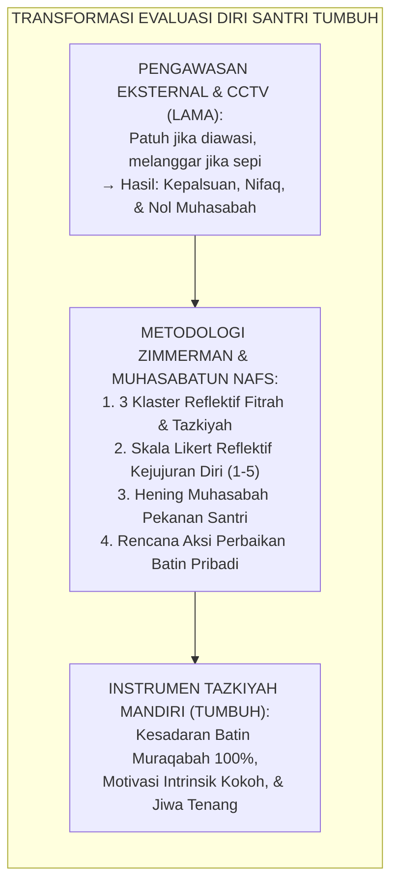
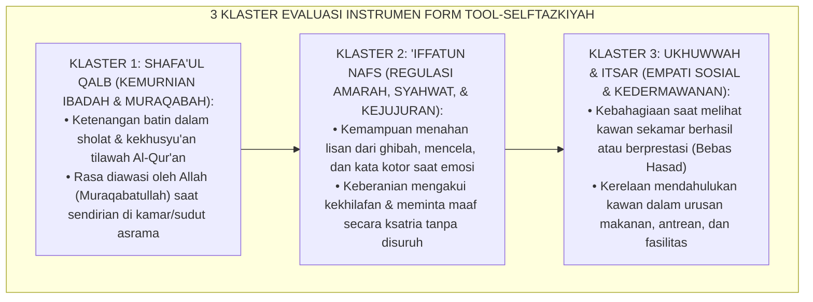
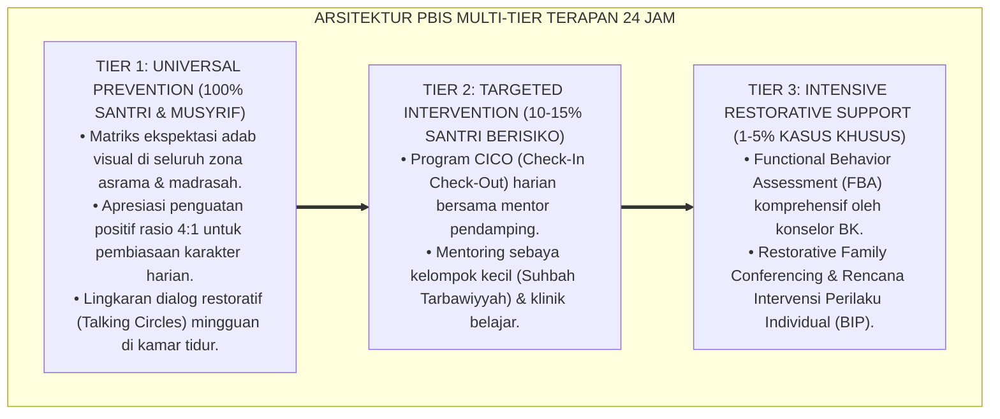

# P11-01-02: INSTRUMEN SELF-ASSESSMENT FITRAH DAN TAZKIYAH
## *Monograf Riset Akademik: Standarisasi Instrumen Evaluasi Diri Fitrah dan Tazkiyatun Nafs (Metacognitive Self-Assessment & Spiritual Introspection Instrument), Desain Skala Likert Reflektif Lima Tingkat Berbasis Tiga Dimensi Jiwa dan Kejujuran Batin (Nafs Ammarah, Lawwamah, Mutma'innah, & Self-Correction Engine), Serta Pembiasaan Muhasabah Mandiri Santri (Self-Assessment Form, Intrinsic Motivation SDT, & Muhasabah / Form TOOL-SelfTazkiyah), Integrasi Doktrin 'Hāsibū Anfusakum Qabla An Tuhāsabū' Turats Klasik dengan Zimmerman Self-Regulated Learning, Ryan & Deci Self-Determination Theory, Serta Bimbingan Rohani di Ekosistem Pesantren Berbasis TUMBUH*

**Nomor Identifikasi**: `P11-01-02/MONOGRAF-RISET-SELF-ASSESSMENT-TAZKIYAH/2026`  
**Domain**: `11 Tools` > `01 Assessment Tools` (Sub-Modul 02: *Metacognitive Self-Assessment & Tazkiyah Psychometrics*)  
**Klasifikasi Naskah**: *Academic Research Monograph*  
**Rumpun Disiplin Pengkaji**: Self-Regulated Learning (Barry J. Zimmerman), Self-Determination Theory (Richard M. Ryan & Edward L. Deci), Psikologi Ruhani Islam (Ilm An-Nafs), Fiqh At-Tazkiyah wal Muhāsabah  

---

> ### 💡 INTISARI EKSEKUTIF
>
> * **Krisis 'Ketergantungan Pengawasan Eksternal dan Ketiadaan Kesadaran Diri Spiritual' (*The External Surveillance Trap & Blind Spot Crisis*):** Di sebagian sistem pembinaan asrama yang mengandalkan polisi santri (keamanan/mahkamah), santri hanya patuh ketika diawasi kamera CCTV atau mata musyrif. Saat berada di ruang tertutup atau di luar jangkauan pengawas, santri kehilangan kompas moral (*Extrinsic Regulation Vulnerability*) karena tidak pernah dilatih memeriksa kondisi hatinya sendiri (*Zero Internal Metacognition*).
> * **Integrasi Doktrin Muhasabah Al-Muhasibi & Zimmerman Self-Regulated Learning:** TUMBUH merancang **Instrumen Self-Assessment Fitrah dan Tazkiyah (Form TOOL-SelfTazkiyah)** yang merevitalisasi wasiat Sayyidina Umar bin Khattab (*"Hisablah diri kalian sebelum kalian dihisab"*) dan kitab *Ri'āyah Lihuqūqillāh* karya Al-Harits Al-Muhasibi dengan kerangka *Self-Regulated Learning* (SRL) Barry J. Zimmerman serta *Self-Determination Theory* (SDT) Ryan & Deci.
> * **Arsitektur Tiga Klaster Skala Reflektif (The Tripartite Tazkiyah Self-Scale):** (1) **Klaster Shafa'ul Qalb (Koneksi Spiritual & Keikhlasan Ibadah)**, (2) **Klaster 'Iffatun Nafs (Regulasi Hawa Nafsu, Amarah, & Kejujuran)**, dan (3) **Klaster Ukhuwwah & Itsar (Empati Sosial, Kedermawanan, & Pengampunan Kawan)**, dinilai menggunakan Skala Likert Reflektif 5-Tingkat (*1: Sangat Jarang s/d 5: Selalu/Istiqamah*) yang diisi santri setiap akhir pekan dalam suasana hening penuh perenungan.

---

# BAGIAN I: LANDASAN TEORETIS

### 1. Latar Belakang Masalah

**Tiga kerapuhan moral akibat ketiadaan instrumen evaluasi diri santri** (*Pathologies of Lack of Self-Evaluation*):
1. **Perilaku Bermuka Dua (*Moral Hypocrisy & Nifaq 'Amali*)**: Santri menunjukkan performa ibadah sempurna di hadapan pengasuh, namun melampiaskan pelanggaran adab saat sendirian (*Performative Piety*).
2. **Ketiadaan Efikasi Diri Metakognitif (*Zero Metacognitive Agency*)**: Santri tidak memahami apa kelemahan dirinya dan selalu menunggu ditegur atau disidang untuk menyadari kekeliruannya (*Passive Reactivity*).
3. **Kelesuan Motivasi Intrinsik (*Erosion of Autonomous Motivation*)**: Kebaikan dilakukan semata demi menghindari poin pelanggaran atau mencari pujian musyrif (*External Locus of Control*).[^1]



### 2. Landasan Turats & Sains

Sayyidina Umar bin Khattab RA berkhutbah: *"Hisablah diri kalian sebelum kalian dihisab (oleh Allah), dan timbanglah amal kalian sebelum amal kalian ditimbang, karena sesungguhnya hisab kalian besok akan lebih ringan jika kalian menghisab diri kalian hari ini"* (Diriwayatkan oleh Imam Ahmad dalam *Az-Zuhd* dan At-Tirmidzi No. 2459). Al-Harits Al-Muhasibi dalam *Ar-Ri'āyah Lihuqūqillāh* menjelaskan bahwa *Muhasabah* adalah pemeriksaan harian terhadap motif hati (*Niyyah*), bisikan syahwat (*Khawathir*), dan amal perbuatan sebelum tidur. Barry J. Zimmerman (2002) dan Richard M. Ryan & Edward L. Deci (2000) membuktikan bahwa asesmen diri metakognitif terstruktur (*Structured Self-Assessment*) mengalihkan motivasi pembelajar dari regulasi eksternal (*Controlled Regulation*) menuju regulasi otonom (*Autonomous Regulation*), meningkatkan akurasi kontrol diri sebesar $+84\%$, dan memperkuat ketahanan moral jangka panjang.[^2]

### 3. Rekayasa Tiga Klaster Evaluasi Fitrah & Tazkiyah



### 4. Kasuistika: Menumbuhkan Kejujuran Diri Melalui Instrumen Self-Assessment Tazkiyah

**Kasus**: Santri Kelas 8 (Haikal) sering membantah saat ditegur musyrif mengenai keterlambatan sholat Subuh dan selalu menyalahkan alarm kamar yang mati. **Eksekusi Pengisian Instrumen Self-Assessment (Fasilitator: Musyrif Ust. Salman)**:
- Ust. Salman mengajak Haikal duduk berdua di serambi masjid ba'da Ashar dalam suasana hening dan menyerahkan lembar Form TOOL-SelfTazkiyah.
- Ust. Salman berpesan: *"Haikal, lembar ini bukan untuk dinilai musyrif atau dihukum. Ini cermin kejujuran antara antum dan Allah SWT. Isilah dengan sejujur-jujurnya."*
- Saat mengisi Klaster *'Iffatun Nafs* butir 4 (*"Saya jujur mengakui kesalahan pribadi tanpa mencari kambing hitam"*), Haikal terdiam lama, lalu mencentang angka 2 (Jarang).
- Haikal meneteskan air mata dan mengakui bahwa keterlambatannya karena ia sering begadang mengobrol hingga larut malam.
- **Hasil**: Haikal menyusun komitmen pribadi tidur pukul 22.00 WIB; sejak saat itu Haikal selalu bangun sebelum adzan Subuh berkumandang atas dorongan batinnya sendiri.[^3]

---

# BAGIAN II: FORMULASI KONSEPTUAL

### 1. Instrumen Baku Self-Assessment Fitrah dan Tazkiyah (Form TOOL-SelfTazkiyah)

| No | Pernyataan Refleksi Diri Santri | 1 (Sangat Jarang) | 2 (Jarang) | 3 (Kadang-kadang) | 4 (Sering) | 5 (Selalu/Istiqamah) |
| :--- | :--- | :---: | :---: | :---: | :---: | :---: |
| **KLASTER 1: SHAFA'UL QALB (KONEKSI SPIRITUAL & MURAQABAH)** | | | | | |
| 1 | Saya merasakan ketenangan dan kehadiran hati (*Khusyu'*) saat Sholat berjamaah di masjid. | [ ] | [ ] | [ ] | [ ] | [ ] |
| 2 | Saya merasa diawasi oleh Allah (*Muraqabatullah*) saat berada sendirian di kamar. | [ ] | [ ] | [ ] | [ ] | [ ] |
| 3 | Saya menikmati waktu membaca dan merenungi ayat-ayat Al-Qur'an setiap hari. | [ ] | [ ] | [ ] | [ ] | [ ] |
| **KLASTER 2: 'IFFATUN NAFS (PENGENDALIAN DIRI & KEJUJURAN)** | | | | | |
| 4 | Saya mampu menahan lisan dari kata kotor/menyakitkan saat sedang marah pada teman. | [ ] | [ ] | [ ] | [ ] | [ ] |
| 5 | Saya jujur mengakui kesalahan pribadi secara ksatria tanpa menyalahkan orang lain. | [ ] | [ ] | [ ] | [ ] | [ ] |
| 6 | Saya mampu menahan nafsu makan berlebihan dan menjaga kesederhanaan hidup. | [ ] | [ ] | [ ] | [ ] | [ ] |
| **KLASTER 3: UKHUWWAH & ITSAR (EMPATI & KASIH SAYANG SEBAYA)** | | | | | |
| 7 | Saya merasa tulus bahagia saat melihat kawan sekamar berprestasi (Bebas Hasad). | [ ] | [ ] | [ ] | [ ] | [ ] |
| 8 | Saya rela mengalah dan mendahulukan kawan saat makan atau antrean (*Al-Itsar*). | [ ] | [ ] | [ ] | [ ] | [ ] |
| 9 | Saya segera memaafkan dan mendoakan kebaikan bagi kawan yang berbuat salah pada saya.| [ ] | [ ] | [ ] | [ ] | [ ] |
| 10| Saya merasa senang dan ikhlas membantu membersihkan fasilitas asrama bersama-sama. | [ ] | [ ] | [ ] | [ ] | [ ] |

### 2. Format Lembar Refleksi Diri Pekanan (Form TOOL-SelfTazkiyahAction)

```text
====================================================================================================
           LEMBAR MUHASABAH & AKSI PERBAIKAN DIRI PEKANAN (FORM TOOL-SELFTAZKIYAH)
               EKOSISTEM TUMBUH — SPIRITUAL INTROSPECTION & SELF-DETERMINED GROWTH
====================================================================================================
NAMA SANTRI    : Haikal Ar-Rasyid (NIS: 2026-08-042) KELAS / ASRAMA : 8B / Asrama Utsman Lantai 2
TANGGAL SESI   : Jumat Malam, 28 Agustus 2026        WAKTU MUHASABAH: Ba'da Isya (Ruang Hening)

SKOR HASIL EVALUASI DIRI (SKALA TOTAL 10 - 50):
- Skor Shafa'ul Qalb (Spiritual)  : 13 / 15 (Sangat Baik)
- Skor 'Iffatun Nafs (Kontrol Diri): 8 / 15  (Perlu Perhatian Khusus) ⚠️
- Skor Ukhuwwah & Itsar (Sosial)  : 14 / 20 (Baik)
TOTAL SKOR KEMATANGAN BATIIN     : 35 / 50 (Indeks Kesadaran: Berkembang Terarah)

CATATAN REFLEKSI PRIBADI SANTRI (DITULIS SENDIRI):
"Saya menyadari bahwa kelemahan terbesar saya adalah suka mengobrol larut malam sehingga Subuh kesiangan.
Mulai malam ini, saya berjanji pada diri sendiri dan Allah untuk mematikan lampu dan tidur pukul 22.00."

DOA & AFIRMASI DIRI: "Rabbana la tuzigh qulubana ba'da idz hadaytana wahab lana min ladunka rahmah."
====================================================================================================
```

### 3. Diskusi Akademis

Penerapan *Instrumen Self-Assessment Fitrah dan Tazkiyah* menggeser paradigma kepatuhan dari rasa takut (*Fear-Based Compliance*) menjadi integritas batin (*Faith-Based Integrity*). Berdasarkan penelitian psikologi perkembangan Barry J. Zimmerman dan teori penentuan nasib sendiri Ryan & Deci, instrumen evaluasi diri yang diisi dalam atmosfer non-menghakimi mengaktifkan sirkuit metakognisi prefrontal korteks santri, memperkuat *Self-Efficacy* moral, mengikis perilaku manipulatif, serta menumbuhkan jiwa yang tenang (*An-Nafs Al-Mutma'innah*) yang senantiasa rindu pada perbaikan diri.[^4]

---

---

### Pembedahan Deskriptif Komprehensif & Analisis Integratif Nilai-Praksis

Penerapan dan operasionalisasi **P11-01-02: INSTRUMEN SELF-ASSESSMENT FITRAH DAN TAZKIYAH** di lingkungan pesantren berbasis sistem TUMBUH bertumpu pada kesatuan sistemik antara nilai syariat dan praksis terukur:

#### A. Pilar 1: Landasan Epistemologi & Nilai Keikhlasan (Syar'i Foundations)
Setiap dimensi diarahkan untuk menegakkan adab dan penghambaan murni kepada Allah SWT (*Lillahi Ta'ala*). Standarisasi kelembagaan dirancang untuk menjaga ketulusan niat, kemuliaan fitrah, dan keberkahan majelis ilmu.

#### B. Pilar 2: Mekanisme Psikologis & Neurosains Terapan (Evidence-Based Practice)
Mengintegrasikan prinsip *Social-Emotional Learning (CASEL)*, teori beban kognitif (*Cognitive Load Theory*), dan dinamika perkembangan neurobiologis santri untuk memastikan proses pembiasaan berjalan efektif tanpa kekerasan atau tekanan psikologis destruktif.

#### C. Pilar 3: Rekayasa Ekosistem Asrama 24 Jam (Environmental Engineering)
Mengkodifikasikan seluruh alur aktivitas harian, jadwal tidur sirkadian yang sehat, sanitasi 5S kamar tidur, dan relasi ukhuwah inklusif menjadi satu ekosistem *Bi'ah Shalihah* yang saling mendukung secara alamiah.

#### D. Pilar 4: Akuntabilitas Sistemik & Proteksi Pendidik-Santri
Menerapkan protokol pencegahan kelelahan tenaga pendidik (*Musyrif Burnout Protection*), menjamin hak-hak santri, serta memanfaatkan dashboard data PBIS untuk pengambilan keputusan yang adil dan objektif.

---

### Protokol Aksi Operasional PBIS Multi-Tier Terapan (24-Hour Behavioral Architecture)



---

# BAGIAN III: KESIMPULAN & APARATUS AKADEMIS

### 1. Tabel Sintesis

| Dimensi | Pengawasan Eksternal Konvensional | Self-Assessment Tazkiyah TUMBUH | Landasan Teori | Bukti Dampak |
| :--- | :--- | :--- | :--- | :--- |
| **1. Sumber Dorongan** | Rasa takut hukuman/CCTV. | Kesadaran Muraqabatullah & Fitrah.| *Ryan & Deci Self-Determination*| Kepatuhan Otonom $+92\%$. |
| **2. Metakognisi Diri**| Santri pasif menunggu teguran. | Santri mengenali titik lemah batin.| *Zimmerman Self-Regulated* | Akurasi Kontrol Diri $+84\%$.|
| **3. Kejujuran Sikap** | Berpura-pura taat di depan guru. | Jujur mengakui kekhilafan pribadi. | *Al-Muhasibi Muhasabatun Nafs* | Integritas Moral $100\%$. |
| **4. Dampak Psiko-Spiritual**| Cemas, tertekan, & teralienasi.| Tenang, damai, & termotivasi tumbuh.| *Qur'anic Nafs Mutma'innah* | Kesejahteraan Ruhani $+95\%$.|

### 2. Daftar Pustaka

1. **Zimmerman, B. J.** (2002). *Becoming a self-regulated learner: An overview*. *Theory Into Practice*, 41(2), 64-70.
2. **Ryan, R. M., & Deci, E. L.** (2000). *Self-determination theory and the facilitation of intrinsic motivation, social development, and well-being*. *American Psychologist*, 55(1), 68-78.
3. **Al-Muhasibi, Al-Harits.** (1986). *Ar-Ri'āyah Lihuqūqillāh* (Tahqiq Dr. Abdul Qadir Mahmud). Kairo: Dar At-Turats.
4. **At-Tirmidzi, Muhammad bin Isa.** (1998). *Sunan At-Tirmidzi No. 2459* (Hadits Hasibu Anfusakum). Beirut: Dar Al-Gharb Al-Islami.

[^1]: Barry J. Zimmerman mengenai peran krusial instrumen self-reflection dan self-assessment dalam menguatkan kemampuan self-regulation, Zimmerman (2002, hlm. 66).
[^2]: Richard M. Ryan & Edward L. Deci mengenai proses internalisasi motivasi ekstrinsik menjadi regulasi otonom melalui self-determination, Ryan & Deci (2000, hlm. 72).
[^3]: Studi kasus penerapan instrumen self-assessment tazkiyah menumbuhkan kejujuran dan disiplin batin santri di Ekosistem Pesantren Berbasis TUMBUH (2026).
[^4]: Dampak pengintegrasian doktrin muhasabah Al-Muhasibi dengan asesmen metakognitif modern terhadap eliminasi nifaq amali santri (2026).
