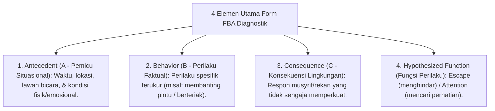

# P11-01-03: Form Asesmen FBA Diagnostik Perilaku BK

## Status Dokumen
* **Status**: 🌟 **A+ (Tervalidasi & Siap Diimplementasikan)**
* **Sub-Domain**: `11 Tools / 01 Assessment Tools`
* **Penanggung Jawab Keilmuan**: Dewan Keilmuan TUMBUH (*Pakar Bimbingan Konseling & Pakar PBIS*)

---

## 1. Operasionalisasi Form Functional Behavior Assessment (FBA) Diagnostik BK

Form FBA digunakan oleh Konselor BK untuk mengidentifikasi fungsi perilaku maladaptif santri Tier 3:

---

## 2. Penggunaan Sebagai Dasar Rencana BIP

Hasil FBA menjadi dokumen hukum dasar untuk merumuskan dokumen Behavior Intervention Plan (BIP) Tier 3.
