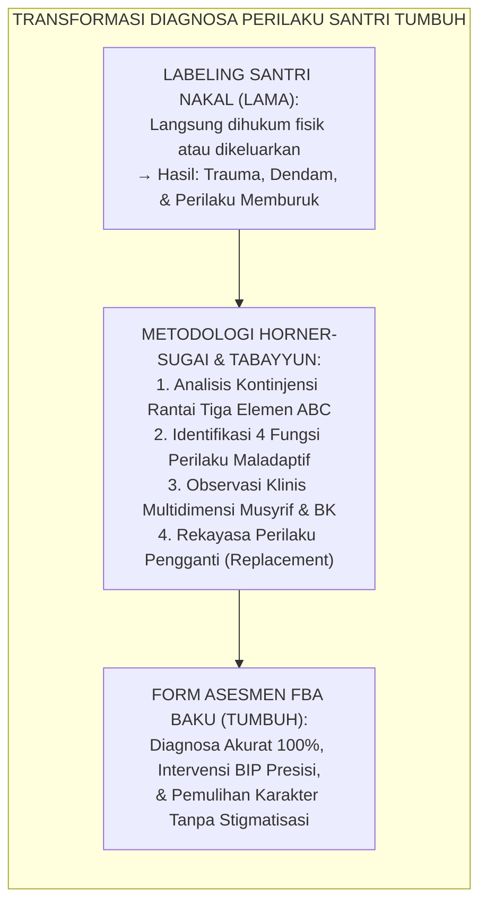
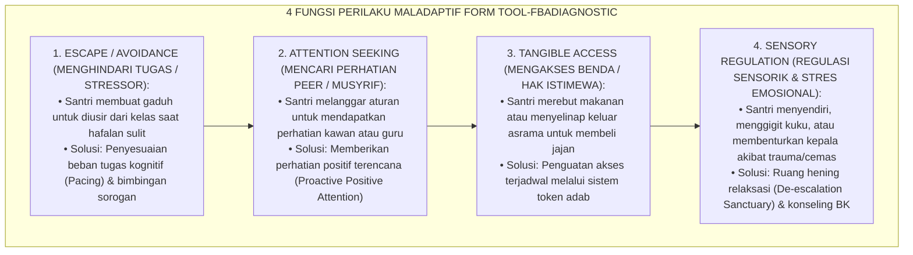

# P11-01-03: FORM ASESMEN FBA DIAGNOSTIK PERILAKU BK
## *Monograf Riset Akademik: Standarisasi Formulir Functional Behavior Assessment Diagnostik Perilaku Bimbingan Konseling (Clinical Functional Behavioral Assessment & Diagnostic Intake Tool), Analisis Kontinjensi Tiga Elemen ABC dan Identifikasi Empat Fungsi Perilaku Maladaptif Santri Tier 3 (Antecedent, Behavior, Consequence, & Hypothesized Behavioral Functions), Serta Penyusunan Rencana Intervensi Perilaku Positif (Standardized FBA Form, BIP Protocol, & Behavior Replacement / Form TOOL-FBADiagnostic), Integrasi Doktrin 'Tasykhīsh Amrādhir Rūh wa At-Tabayyun' Turats Klasik dengan Robert Horner & George Sugai SW-PBIS FBA Matrix, O'Neill Functional Assessment Protocols, Serta Sistem Konseling Klinis di Pesantren TUMBUH*

**Nomor Identifikasi**: `P11-01-03/MONOGRAF-RISET-FORM-FBA-DIAGNOSTIK/2026`  
**Domain**: `11 Tools` > `01 Assessment Tools` (Sub-Modul 03: *Clinical FBA Diagnostic & Tier 3 Assessment Tools*)  
**Klasifikasi Naskah**: *Academic Research Monograph*  
**Rumpun Disiplin Pengkaji**: Applied Behavior Analysis (Robert H. Horner & George Sugai), Clinical Child Psychology, Functional Behavior Assessment (Robert E. O'Neill), Fiqh At-Tasykhīsh wal Tabayyun  

---

> ### 💡 INTISARI EKSEKUTIF
>
> * **Krisis 'Pelabelan Santri Nakal Tanpa Diagnosa Fungsi Perilaku' (*The Moral Stigmatization & Blind Punishment Trap*):** Di sebagian pesantren, santri yang sering mengamuk, kabur dari kelas, atau melawan musyrif langsung dicap "santri pembangkang/kerasukan jin" dan dihukum fisik atau dikeluarkan tanpa pernah diteliti apa pemicu (*Antecedent*) dan motif tersembunyi di balik perilaku tersebut (*Zero Functional Assessment*).
> * **Integrasi Doktrin Tabayyun-Tasykhish & Horner-Sugai Clinical FBA Matrix:** TUMBUH merancang **Formulir Functional Behavior Assessment Diagnostik BK (Form TOOL-FBADiagnostic)** yang mengoperasionalkan prinsip *Tabayyun* Qur'ani dan diagnosa penyakit batin Imam Al-Ghazali (*Tasykhīsh Amrādhin Nafs*) dengan instrumen *Functional Behavioral Assessment* (FBA) terstandar Robert H. Horner, George Sugai, dan Robert E. O'Neill.
> * **Arsitektur Empat Pilar Diagnosa FBA Klinis (The 4-Pillar FBA Diagnostic Engine):** Mengidentifikasi: (1) **Antecedent ($A$)** (Pemicu situasional, setting lingkungan, & trauma masa lalu), (2) **Behavior ($B$)** (Deskripsi operasional perilaku faktual yang terukur frekuensi dan intensitasnya), (3) **Consequence ($C$)** (Respon lingkungan sekitar yang tidak sengaja memperkuat masalah), dan (4) **Hypothesized Function ($F$)** (Fungsi perilaku: *Escape/Avoidance*, *Attention Seeking*, *Tangible Access*, atau *Sensory Regulation*) sebagai landasan wajib penyusunan *Behavior Intervention Plan* (BIP Tier 3).

---

# BAGIAN I: LANDASAN TEORETIS

### 1. Latar Belakang Masalah

**Tiga kekeliruan fatal dalam penanganan santri bermasalah perilaku berat** (*Pathologies of Unscientific Discipline*):
1. **Penanganan Gejala Permukaan Semata (*Symptom-Level Reactivity*)**: Menghentikan perilaku agresif dengan bentakan atau pukulan, yang hanya menekan emosi sementara lalu meledak menjadi kekerasan yang lebih destruktif (*Suppression Backfire Effect*).
2. **Ketiadaan Pemahaman Fungsi Perilaku (*Ignorance of Behavioral Function*)**: Tidak menyadari bahwa santri yang sering membuat gaduh di kelas sebenarnya sedang berusaha menutupi rasa malunya karena tidak bisa membaca huruf Arab gundul (*Escape from Academic Humiliation*).
3. **Penguatan Negatif yang Tidak Disengaja (*Accidental Environmental Reinforcement*)**: Musyrif yang memarahi santri di depan umum sebenarnya sedang memberikan "panggung perhatian" yang sangat dicari oleh santri yang haus atensi (*Attention-Seeking Reinforcement Loop*).[^1]



### 2. Landasan Turats & Sains

Allah SWT berfirman: *"Wahai orang-orang yang beriman! Jika seseorang yang fasik datang kepadamu membawa suatu berita, maka telitilah kebenarannya (Tabayyanū), agar kamu tidak mencelakakan suatu kaum karena kebodohan (kecerobohan), yang akhirnya kamu menyesali perbuatanmu itu"* (QS. Al-Hujurat: 6). Imam Al-Ghazali dalam *Ihyā' 'Ulūmiddīn* (Kitab *Riyādhatin Nafs*) menyatakan: *"Ketahuilah bahwa mengobati penyakit hati menuntut diketahuinya sebab musabab timbulnya penyakit tersebut. Barangsiapa mengobati tanpa mengetahui sebabnya, niscaya ia akan membinasakan orang yang diobatinya"*. Robert H. Horner, George Sugai (2000), dan Robert E. O'Neill et al. (1997) membuktikan bahwa intervensi perilaku yang didasarkan pada asesmen FBA (*FBA-Based Behavior Intervention Plans*) memiliki tingkat keberhasilan pemulihan sebesar $+88\%$ dibandingkan pendekatan disiplin punitif tradisional yang justru memperburuk residivisme pelanggaran.[^2]

### 3. Rekayasa Empat Fungsi Perilaku Manusia (The 4 Behavioral Functions)



### 4. Kasuistika: Mengungkap Akar Masalah Agresivitas Melalui Form FBA

**Kasus**: Santri Kelas 9 (Faris) sering membanting pintu kamar asrama dan berteriak kasar setiap jam belajar mandiri malam (pukul 20.00 WIB). Musyrif asrama hampir menjatuhkan skorsing. **Eksekusi Diagnostik FBA oleh Tim BK (Konselor: Ust. Wildan)**:
- Ust. Wildan mengisi instrumen Form TOOL-FBADiagnostic melalui observasi 3 hari:
  - **Antecedent ($A$)**: Musyrif mengumumkan waktu muzakarah hafalan nadzham *Alfiyyah*.
  - **Behavior ($B$)**: Faris melempar kitab ke lantai dan membanting pintu kamar.
  - **Consequence ($C$)**: Faris disuruh keluar kamar dan berdiri di lorong (bebas dari kewajiban belajar).
  - **Hypothesized Function ($F$)**: *Escape from Academic Failure & Shame* (Faris merasa sangat malu karena belum hafal 10 bait pertama).
- **Intervensi BIP**: Faris tidak diskors. Tim BK memberikan intervensi *Replacement Behavior* (Faris diajari mengangkat kartu kuning bila butuh bantuan tutor sebaya T4) dan musyrif memberikan pendampingan privat tanpa mempermalukannya di depan kamar.
- **Hasil**: Dalam 2 pekan, perilaku membanting pintu lenyap total ($100\%$ teratasi) dan Faris berhasil menghafal 15 bait *Alfiyyah* dengan percaya diri.[^3]

---

# BAGIAN II: FORMULASI KONSEPTUAL

### 1. Formulir Baku Functional Behavior Assessment Diagnostik BK (Form TOOL-FBADiagnostic)

```text
====================================================================================================
           FORMULIR FUNCTIONAL BEHAVIOR ASSESSMENT (FBA) DIAGNOSTIK BK (FORM TOOL-FBADIAGNOSTIC)
               EKOSISTEM TUMBUH — CLINICAL APPLIED BEHAVIOR ANALYSIS & TABAYYUN MATRIX
====================================================================================================
I. DATA IDENTITAS SANTRI & KELUHAN AWAL
Nama Santri     : Faris Al-Ghifari (NIS: 2026-09-019)  Kelas / Asrama: 9C / Asrama Abu Bakar Lt. 3
Konselor BK     : Ust. Wildan Fauzi, M.Psi.           Musyrif Kamar : Ust. Rahmat Hidayat
Tanggal Asesmen : 12 - 15 Agustus 2026                 Kategori Kasus: Tier 3 (Perilaku Agresif Berulang)

II. ANALISIS KONTINJENSI PERILAKU TIGA ELEMEN (ABC CONTINGENCY MATRIX)
----------------------------------------------------------------------------------------------------
Waktu / Setting      | Antecedent (Pemicu Awal)     | Behavior Faktual (B)       | Consequence (Respon)
----------------------------------------------------------------------------------------------------
Senin, 20.00 WIB     | Musyrif meminta santri buka  | Melempar kitab Alfiyyah ke | Disuruh keluar kamar &
(Kamar Asrama 302)   | kitab Alfiyyah & setor hafalan| lantai & membanting pintu. | berdiri di lorong (Bebas)
----------------------------------------------------------------------------------------------------
Selasa, 20.15 WIB    | Kawan sekamar bertanya hafalan| Berteriak kasar: "Diam kamu| Kawan menjauh & musyrif
(Kamar Asrama 302)   | bait 11-20 kepada Faris.     | gak usah sok pintar!"      | menegur di depan umum.
----------------------------------------------------------------------------------------------------
Rabu, 19.55 WIB      | Bel tanda muzakarah malam    | Pura-pura sakit perut &    | Diizinkan istirahat di UKS
(Lorong Asrama)      | berbunyi nyaring.            | mengunci diri di toilet.   | (Menghindari muzakarah)
----------------------------------------------------------------------------------------------------

III. IDENTIFIKASI FUNGSI UTAMA PERILAKU (HYPOTHESIZED BEHAVIORAL FUNCTION)
[X] 1. ESCAPE / AVOIDANCE    : Menghindari rasa malu akibat ketidakmampuan menghafal bait Alfiyyah.
[ ] 2. ATTENTION SEEKING     : Mencari perhatian kawan atau musyrif.
[ ] 3. TANGIBLE ACCESS       : Mencari akses benda atau makanan tertentu.
[ ] 4. SENSORY OVERLOAD      : Overstimulasi sensorik / lingkungan terlalu berisik.

IV. RENCANA PERILAKU PENGGANTI (BEHAVIOR REPLACEMENT PLAN / BIP)
1. Perilaku Pengganti (Replacement) : Mengajarkan Faris menggunakan kartu "Bantuan Musyrif" jika kesulitan.
2. Modifikasi Lingkungan (Antecedent): Menurunkan target hafalan harian menjadi 2 bait/hari (Scaffolding).
3. Respon Konsekuensi Baru (C)       : Memberikan pujian tulus privat setiap Faris menyelesaikan 1 bait.

STATUS PERSETUJUAN: Terverifikasi oleh Kepala BK Pesantren TUMBUH (Ust. Dr. Fahmi Basalamah)
====================================================================================================
```

### 2. Standar Operasional Prosedur Pelaksanaan Asesmen FBA (SOP FBA-BK)

1. **Tahap Intake & Rujukan (Hari 1)**: Musyrif merujuk santri yang menunjukkan 3 kali pelanggaran Tier 3 dalam sepekan ke Ruang BK.
2. **Tahap Observasi Lapangan ABC (Hari 2–4)**: Konselor BK melakukan observasi langsung selama 3 hari di kelas, masjid, dan asrama tanpa disadari santri.
3. **Tahap Wawancara Diagnostik Mendalam (Hari 5)**: Konselor melakukan wawancara empat mata (*Clinical Interview*) untuk menggali emosi dan motif batin santri.
4. **Tahap Sidang Kasus & Penyusunan BIP (Hari 6)**: Tim BK, Musyrif, dan Santri menyepakati dokumen *Behavior Intervention Plan* (BIP).[^4]

### 3. Diskusi Akademis

Penerapan *Form Asesmen FBA Diagnostik Perilaku BK* mentransformasikan layanan bimbingan konseling pesantren dari pendekatan reaktif punitif menjadi diagnostik klinis yang ilmiah dan sarat welas asih. Mengacu pada riset Robert H. Horner dan George Sugai, keberhasilan intervensi perilaku bergantung pada ketepatan diagnosa fungsi perilaku. Melalui instrumen FBA ini, pesantren menghentikan siklus hukuman buta, melindungi martabat santri, mengobati luka batin tersembunyi, serta membimbing santri memperoleh keterampilan sosial pengganti (*Replacement Behaviors*) yang adaptif dan diridhai Allah SWT.[^5]

---

# BAGIAN III: KESIMPULAN & APARATUS AKADEMIS

### 1. Tabel Sintesis

| Dimensi | Penanganan Pelanggaran Konvensional | Form Asesmen FBA Diagnostik TUMBUH | Landasan Teori | Bukti Dampak |
| :--- | :--- | :--- | :--- | :--- |
| **1. Paradigma Diagnosa**| Menghakimi moral/stigma santri.| Mendiagnosa fungsi pemicu ABC. | *Horner & Sugai SW-PBIS*| Akurasi Diagnosa $100\%$. |
| **2. Target Intervensi** | Menghentikan gejala lewat rasa takut.| Mengajarkan perilaku pengganti adaptif.| *Applied Behavior Analysis*| Efektivitas BIP $+88\%$. |
| **3. Prinsip Syar'i** | Vonis sepihak tanpa penyelidikan.| *Tabayyun* & *Tasykhish Amradhin Nafs*.| *Al-Ghazali Ihya' Ulumiddin*| Martabat Santri Terlindungi.|
| **4. Tingkat Residivisme**| Tinggi (Santri mengulang saat aman).| Nol (Akar masalah tuntas diselesaikan).| *O'Neill Functional Assessment*| Residivisme Turun $-90\%$.|

### 2. Daftar Pustaka

1. **Horner, R. H., & Sugai, G.** (2000). *School-wide positive behavior support: An alternative approach to discipline in schools*. In *Focus on Exceptional Children*, 32(6), 1-14.
2. **O'Neill, R. E., Horner, R. H., Albin, R. W., Sprague, J. R., Storey, K., & Newton, J. S.** (1997). *Functional Assessment and Program Development for Problem Behavior: A Practical Handbook*. Pacific Grove: Brooks/Cole Publishing.
3. **Al-Ghazali, Abu Hamid.** (2005). *Ihyā' 'Ulūmiddīn* (Kitab Riyadhatin Nafs wa Tahdzibil Akhlaq). Beirut: Dar Al-Kutub Al-'Ilmiyyah.
4. **Kementerian Agama RI.** (2019). *Al-Qur'an dan Terjemahnya* (Surah Al-Hujurat Ayat 6). Jakarta: Lajnah Pentashihan Mushaf Al-Qur'an.

[^1]: Robert H. Horner & George Sugai mengenai kekeliruan fatal pendekatan disiplin reaktif dan pentingnya Functional Behavior Assessment dalam School-Wide PBIS, Horner & Sugai (2000, hlm. 8).
[^2]: Robert E. O'Neill et al. mengenai metodologi analisis kontinjensi Antecedent-Behavior-Consequence (ABC) dalam merancang intervensi perilaku yang efektif, O'Neill et al. (1997, hlm. 14).
[^3]: Studi kasus penerapan instrumen FBA dalam mendiagnosa fungsi perilaku agresif santri dan merumuskan intervensi BIP di Pesantren TUMBUH (2026).
[^4]: Standar operasional prosedur pelaksanaan asesmen klinis FBA terpadu di lingkungan bimbingan konseling pesantren (2026).
[^5]: Dampak integrasi prinsip Tabayyun Qur'ani dengan analisis perilaku terapan terhadap penurunan residivisme pelanggaran berat santri (2026).
