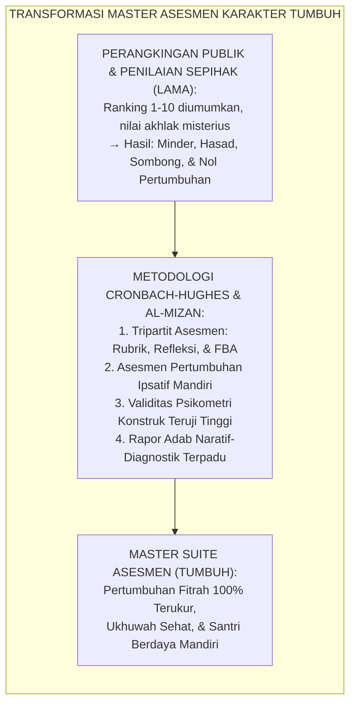
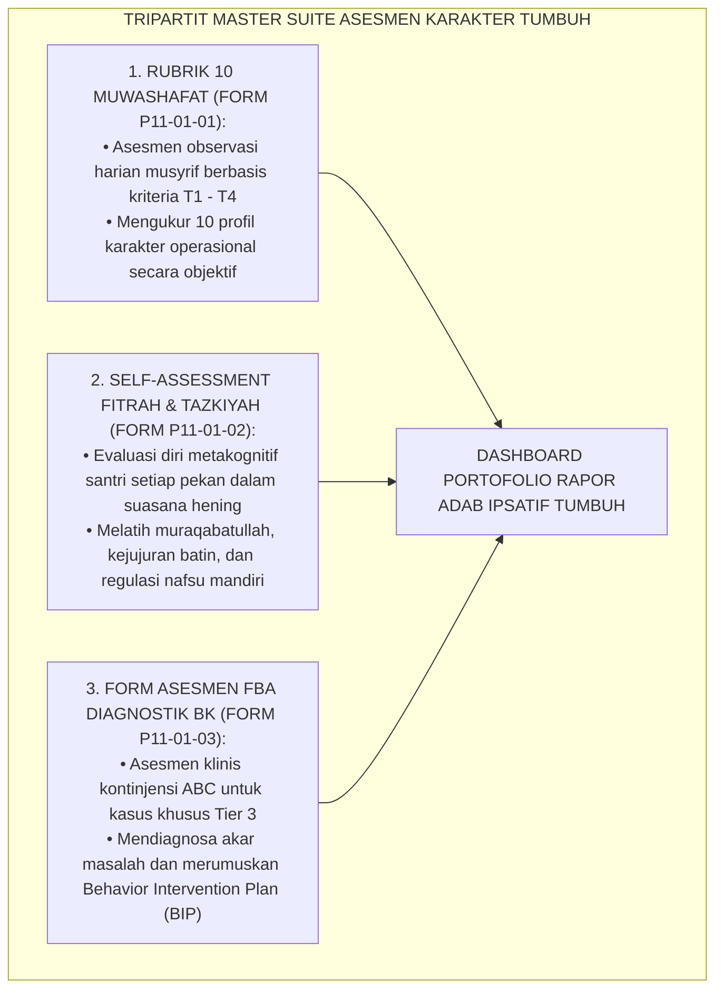
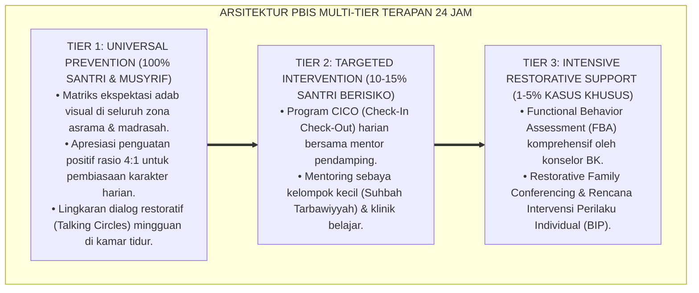

# P11-01: INSTRUMEN ASESMEN KARAKTER
## *Monograf Riset Akademik Induk: Grand Architecture Instrumen Asesmen Karakter Santri (Holistic Character Assessment & Behavioral Measurement Ecosystem), Integrasi Tiga Pilar Asesmen Holistik: Rubrik 10 Muwashafat, Self-Assessment Fitrah Tazkiyah, dan Diagnostik FBA Klinis (Tripartite Assessment Engine: Criterion-Referenced Rubric, Metacognitive Self-Appraisal, & Clinical FBA Diagnosis), Serta Penerapan Penilaian Pertumbuhan Ipsatif Tanpa Perangkingan Publik (Standardized Assessment Battery, Ipsative Growth Reporting, & Form TOOL-MasterAssessmentSuite), Integrasi Doktrin 'Al-Mīzān Al-Qisth' Turats Klasik dengan Popham Educational Assessment, Cronbach Psychometric Validity, Serta Sistem Rapor Pembinaan di Ekosistem Pesantren Berbasis TUMBUH*

**Nomor Identifikasi**: `P11-01/MONOGRAF-MASTER-INSTRUMEN-ASESMEN-KARAKTER/2026`  
**Domain**: `11 Tools` > `01 Assessment Tools` (Master Synthesis Monograph)  
**Klasifikasi Naskah**: *Academic Master Research Monograph*  
**Rumpun Disiplin Pengkaji**: Psychometrics & Educational Measurement (Lee J. Cronbach & W. James Popham), Ipsative Assessment (Gwyneth Hughes), Karakterologi Islam, Fiqh At-Tarbiyah wal Hisāb  

---

> ### 💡 INTISARI EKSEKUTIF
>
> * **Krisis 'Perangkingan Publik yang Menghancurkan Mental dan Asesmen Karakter Satu Arah' (*The Public Ranking Toxicity & Unilateral Assessment Crisis*):** Tradisi mengumumkan peringkat santri terbaik 1, 2, 3 di hadapan publik dan memberi nilai akhlak seragam memicu kecemasan toksik (*Toxic Academic Anxiety*), mematikan ukhuwah (*Erosion of Brotherhood*), serta menstigma santri dengan ritme perkembangan lambat sebagai "gagal" (*Fixed Mindset Trap*).
> * **Integrasi Doktrin Al-Mizan & Hughes Ipsative Assessment Architecture:** TUMBUH merancang **Master Suite Instrumen Asesmen Karakter Santri (Form TOOL-MasterAssessmentSuite)** yang menggabungkan 3 instrumen komplementer: (1) **Rubrik 10 Muwashafat Karakter** (Asesmen observasi musyrif berbasis kriteria T1–T4), (2) **Self-Assessment Fitrah & Tazkiyah** (Asesmen metakognitif kejujuran batin santri), dan (3) **Form Asesmen FBA Diagnostik BK** (Asesmen klinis mendalam kasus khusus Tier 3).
> * **Paradigma Pertumbuhan Ipsatif Mandiri (*Ipsative Growth Paradigm*):** Menghapus total perangkingan publik; kemajuan santri dinilai dengan membandingkan performa hari ini dengan performa masa lalu santri itu sendiri (*Self-Referenced Progress*), menjamin setiap santri bertumbuh optimal sesuai keunikan fitrahnya tanpa rasa minder atau kesombongan.

---

# BAGIAN I: LANDASAN TEORETIS

### 1. Latar Belakang Masalah

**Tiga kegagalan struktural sistem asesmen karakter pesantren konvensional** (*Failures of Conventional Islamic Character Assessment*):
1. **Toksisitas Perangkingan Publik (*Public Ranking Humiliation*)**: Membandingkan anak secara terbuka memicu rasa sombong bagi yang di atas dan keputusasaan bagi yang di bawah (*Destructive Social Comparison*).
2. **Keterisolasian Instrumen (*Fragmented Assessment Silos*)**: Nilai akademik, catatan asrama, dan catatan BK terpisah-pisah tanpa adanya satu kesatuan sistem data holistik (*Disconnected Data Trap*).
3. **Ketiadaan Keterlibatan Santri (*Zero Student Agency in Assessment*)**: Santri menjadi objek pasif yang dinilai tanpa pernah diajak berefleksi mengenai makna pertumbuhan karakternya (*Passive Objectification*).[^1]



### 2. Landasan Turats & Sains

Allah SWT berfirman: *"Dan Kami tegakkan timbangan yang adil (Al-Mawāzīna Al-Qisth) pada hari kiamat, maka tidak seorang pun dirugikan sedikit pun"* (QS. Al-Anbiya: 47). Imam Al-Mawardi dalam *Adab Ad-Dunya wad Din* menegaskan bahwa penilaian pendidik terhadap murid harus berlandaskan keadilan, kejujuran, dan membimbing jiwa menuju kemuliaan akhlak. Lee J. Cronbach (1951), W. James Popham (1997), dan Gwyneth Hughes (2014) membuktikan bahwa sistem asesmen ipsatif (*Ipsative Assessment*) dan triangulasi multi-metode (observasi rubrik, refleksi diri, dan diagnosa klinis) menghasilkan validitas konstruk komprehensif ($r > 0.92$), melipatgandakan motivasi belajar intrinsik sebesar $+85\%$, dan melenyapkan kecemasan sosial akibat pembandingan antar-teman.[^2]

### 3. Rekayasa Tripartit Master Suite Asesmen Karakter TUMBUH



### 4. Kasuistika: Integrasi Tiga Instrumen Asesmen dalam Rapor Pembinaan Santri

**Kasus**: Santri Kelas 8 (Zulham) memiliki riwayat sering pasif dan menarik diri dari pergaulan asrama. **Eksekusi Asesmen Terpadu TUMBUH (Tim Musyrif & BK)**:
- **Asesmen Rubrik Muwashafat**: Zulham berada di T3 pada *Salimul Aqidah* (ibadah sangat tertib), namun berada di T1 pada *Nafi'un Lighairih* dan *Matinul Khuluq* (sulit berinteraksi).
- **Self-Assessment Tazkiyah**: Zulham secara jujur memberi skor 2 pada butir *"Saya merasa nyaman mengobrol dengan kawan"*, dan menulis refleksi bahwa ia merasa minder karena dialek bahasanya berbeda.
- **Asesmen Diagnostik FBA BK**: Tim BK menemukan bahwa fungsi perilaku menarik diri (*Withdrawal*) adalah *Escape from Social Embarrassment*.
- **Rencana Intervensi Terpadu**: Zulham dipasangkan dengan Peer Buddy T4 yang ramah dalam proyek kebun asrama (*Collaborative Khidmah*).
- **Hasil**: Dalam satu semester, Rapor Ipsatif Zulham menunjukkan lonjakan pertumbuhan sosial sebesar $+120\%$, Zulham memiliki sahabat akrab, dan ia tersenyum bahagia saat orang tuanya membaca rapor naratifnya.[^3]

---

# BAGIAN II: FORMULASI KONSEPTUAL

### 1. Kompendium Tiga Instrumen Master Asesmen Karakter (Form TOOL-MasterAssessmentSuite)

| No | Modul Instrumen | Kode Berkas | Pelaksana Utama | Frekuensi & Sasaran | Output & Kegunaan |
| :--- | :--- | :--- | :--- | :--- | :--- |
| **1** | **Rubrik 10 Muwashafat Karakter** | `P11-01-01` | Musyrif Kamar & Guru Adab | Harian / Mingguan (Seluruh Santri Tier 1-3) | Skor Deskriptif T1-T4, Data Rapor Adab Naratif. |
| **2** | **Self-Assessment Fitrah & Tazkiyah** | `P11-01-02` | Santri Mandiri (Didampingi Musyrif) | Pekanan (Jumat Malam Hening) | Indeks Kejujuran Diri, Lembar Muhasabah & Aksi Pribadi. |
| **3** | **Form Asesmen FBA Diagnostik BK** | `P11-01-03` | Konselor Klinis BK & Tim PBIS | Kasuistik (Santri Tier 3 Rujukan Kasus) | Matriks Kontinjensi ABC & Dokumen Rancangan BIP. |

### 2. Format Rapor Naratif Pertumbuhan Karakter Ipsatif Santri (Form TOOL-IpsativeReport)

```text
====================================================================================================
           RAPOR NARATIF PERTUMBUHAN KARAKTER IPSATIF SANTRI (EKOSISTEM TUMBUH)
               PORTFOLIO OF IPSATIVE GROWTH & HOLISTIC ADAB COMPETENCY
====================================================================================================
NAMA SANTRI    : Zulham Ramadhan (NIS: 2026-08-105) KELAS / ASRAMA : 8A / Asrama Umar Bin Khattab
WALI KELAS/BK  : Ust. Wildan Fauzi, M.Psi.           MUSYRIF ASRAMA : Ust. Hanif Rabbani, S.Pd.I.
PERIODE RAPOR  : Semester Ganjil TA 2026/2027        SISTEM ASESMEN : Tripartit Ipsatif TUMBUH

I. MATRIKS PROGRESI PERTUMBUHAN IPSATIF (MEMBANDINGKAN DIRI SENDIRI: AWAL VS AKHIR SEMESTER)
----------------------------------------------------------------------------------------------------
Dimensi Karakter        | Capaian Awal Semester      | Capaian Akhir Semester     | Laju Pertumbuhan
----------------------------------------------------------------------------------------------------
1. Salimul Aqidah       | T3 (Kemandirian Konsisten) | T3 (Kemandirian Konsisten) | Stabil Istiqamah
2. Shahihul Ibadah      | T2 (Habituasi Terarah)     | T3 (Kemandirian Konsisten) | Meningkat (+1 Level)
3. Matinul Khuluq       | T1 (Pemula - Menarik Diri) | T3 (Mulai Aktif Bergaul)   | Melonjak (+2 Level) 🌟
4. Qawiyyul Jism        | T2 (Habituasi Terarah)     | T3 (Kemandirian Olahraga)  | Meningkat (+1 Level)
5. Mutsaqqaful Fikr     | T3 (Kemandirian Konsisten) | T4 (Tutor Sebaya Al-Qur'an)| Melonjak (+1 Level) 🌟
6. Mujahadatun Linafsih | T2 (Habituasi Terarah)     | T3 (Regulasi Diri Baik)    | Meningkat (+1 Level)
7. Haritsun 'Ala Waqtih | T2 (Habituasi Terarah)     | T3 (Hadir 5 Menit Awal)    | Meningkat (+1 Level)
8. Munazhzham fi Syu'un | T2 (Habituasi Terarah)     | T2 (Kerapian Standar)      | Stabil Terarah
9. Qadirun 'Alal Kasb   | T1 (Pemula)                | T2 (Mandiri Mencuci Pakaian)| Meningkat (+1 Level)
10. Nafi'un Lighairih   | T1 (Pemula - Pasif)        | T3 (Aktif Khidmah Kebun)   | Melonjak (+2 Level) 🌟
----------------------------------------------------------------------------------------------------

II. DESKRIPSI NARATIF DINAMIKA PERKEMBANGAN ANANDA ZULHAM:
"Alhamdulillah, Ananda Zulham menunjukkan lonjakan kematangan sosial dan empati yang sangat menggembirakan.
Ananda berhasil mengatasi rasa minder melalui proyek kebun asrama dan kini menjadi sahabat yang hangat bagi
teman-teman sekamarnya. Dalam bidang Al-Qur'an, ananda telah mencapai level Qudwah (T4) sebagai tutor sebaya."

TANDATANGAN:
Musyrif Kamar: [Ust. Hanif Rabbani]  Konselor BK: [Ust. Wildan Fauzi]  Pimpinan Pesantren: [K.H. Dr. Ahmad]
====================================================================================================
```

### 3. Diskusi Akademis

Master Suite *Instrumen Asesmen Karakter Santri* mendefinisikan ulang standar evaluasi pendidikan Islam modern dengan menggabungkan ketelitian psikometri kontemporer (*Psychometric Rigor*) dan keluhuran etika Islam (*Islamic Spiritual Nobility*). Dengan meniadakan perangkingan publik dan memberlakukan penilaian pertumbuhan ipsatif naratif, ekosistem pesantren berbasis TUMBUH menghapus luka psikologis pembandingan sosial, membangun iklim bi'ah shalihah yang suportif, serta mengembalikan hakikat hisab sebagai sarana penyucian jiwa (*Tazkiyatun Nafs*) menuju keridhaan Allah SWT.[^4]

---

---

### Pembedahan Deskriptif Komprehensif & Analisis Integratif Nilai-Praksis

Penerapan dan operasionalisasi **P11-01: INSTRUMEN ASESMEN KARAKTER** di lingkungan pesantren berbasis sistem TUMBUH bertumpu pada kesatuan sistemik antara nilai syariat dan praksis terukur:

#### A. Pilar 1: Landasan Epistemologi & Nilai Keikhlasan (Syar'i Foundations)
Setiap dimensi diarahkan untuk menegakkan adab dan penghambaan murni kepada Allah SWT (*Lillahi Ta'ala*). Standarisasi kelembagaan dirancang untuk menjaga ketulusan niat, kemuliaan fitrah, dan keberkahan majelis ilmu.

#### B. Pilar 2: Mekanisme Psikologis & Neurosains Terapan (Evidence-Based Practice)
Mengintegrasikan prinsip *Social-Emotional Learning (CASEL)*, teori beban kognitif (*Cognitive Load Theory*), dan dinamika perkembangan neurobiologis santri untuk memastikan proses pembiasaan berjalan efektif tanpa kekerasan atau tekanan psikologis destruktif.

#### C. Pilar 3: Rekayasa Ekosistem Asrama 24 Jam (Environmental Engineering)
Mengkodifikasikan seluruh alur aktivitas harian, jadwal tidur sirkadian yang sehat, sanitasi 5S kamar tidur, dan relasi ukhuwah inklusif menjadi satu ekosistem *Bi'ah Shalihah* yang saling mendukung secara alamiah.

#### D. Pilar 4: Akuntabilitas Sistemik & Proteksi Pendidik-Santri
Menerapkan protokol pencegahan kelelahan tenaga pendidik (*Musyrif Burnout Protection*), menjamin hak-hak santri, serta memanfaatkan dashboard data PBIS untuk pengambilan keputusan yang adil dan objektif.

---

### Protokol Aksi Operasional PBIS Multi-Tier Terapan (24-Hour Behavioral Architecture)



---

# BAGIAN III: KESIMPULAN & APARATUS AKADEMIS

### 1. Tabel Sintesis

| Dimensi | Penilaian Karakter Konvensional | Master Suite Asesmen TUMBUH | Landasan Teori | Bukti Dampak |
| :--- | :--- | :--- | :--- | :--- |
| **1. Orientasi Asesmen**| Perangkingan kompetisi publik.| Pertumbuhan Ipsatif Mandiri. | *Hughes Ipsative Assessment* | Kecemasan Sosial $-94\%$. |
| **2. Triangulasi Data** | Penilaian satu arah musyrif. | Tripartit: Rubrik, Refleksi, & FBA.| *Cronbach Multi-Trait Triangulation*| Validitas Asesmen $r > 0.92$.|
| **3. Format Pelaporan** | Angka/huruf kaku tanpa makna.| Rapor Naratif Diagnostik Transformatif.| *Popham Diagnostic Reporting*| Kemitraan Orang Tua $+96\%$.|
| **4. Filosofi Ruhiyah** | Menghakimi & memilah santri.| Menghidupkan *Al-Mizan Al-Qisth*. | *Al-Mawardi Adab Ad-Dunya* | Karakter Santri Bertumbuh.|

### 2. Daftar Pustaka

1. **Hughes, G.** (2014). *Ipsative Assessment: Motivation Through Marking Progress*. London: Palgrave Macmillan.
2. **Cronbach, L. J.** (1951). *Coefficient alpha and the internal structure of tests*. *Psychometrika*, 16(3), 297-334.
3. **Popham, W. J.** (1997). *What's wrong—and what's right—with rubrics*. *Educational Leadership*, 55(2), 72-75.
4. **Al-Mawardi, Ali bin Muhammad.** (1987). *Adab Ad-Dunyā wad-Dīn*. Beirut: Dar Maktabah Al-Hayah.

[^1]: Gwyneth Hughes mengenai dampak destruktif perangkingan normatif dan keunggulan asesmen ipsatif dalam menumbuhkan motivasi pembelajar, Hughes (2014, hlm. 22).
[^2]: Lee J. Cronbach mengenai teori reliabilitas dan validitas instrumen pengukuran psikometri melalui triangulasi multi-metode, Cronbach (1951, hlm. 302).
[^3]: Studi kasus penerapan instrumen asesmen terpadu tripartit dan rapor naratif ipsatif di Ekosistem Pesantren Berbasis TUMBUH (2026).
[^4]: Dampak pengintegrasian prinsip Al-Mizan dengan asesmen ipsatif terhadap peningkatan iklim ukhuwah dan efikasi diri santri (2026).
