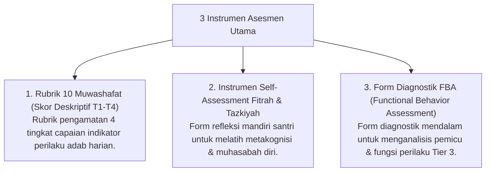

# P11-01: Instrumen Asesmen Karakter

## Status Dokumen
* **Status**: 🌟 **A+ (Tervalidasi & Siap Diimplementasikan)**
* **Sub-Domain**: `11 Tools / 01 Assessment Tools`
* **Penanggung Jawab Keilmuan**: Dewan Keilmuan TUMBUH (*Pakar Metodologi Riset & Pakar Desain Kurikulum Adab*)

---

## 1. Konseptualisasi Assessment Tools Pesantren

Instrumen Asesmen (*Assessment Tools*) di ekosistem **TUMBUH** memadukan pengukuran kuantitatif & naratif kualitatif untuk mengukur laju pertumbuhan ipsatif santri:

---

## 2. Penghapusan Pemeringkatan Rangking Publisitas

Asesmen berfokus pada **Pertumbuhan Ipsatif Mandiri** (dibandingkan dengan kondisi awal diri sendiri), bukan peringkat kompetisi antar santri.
