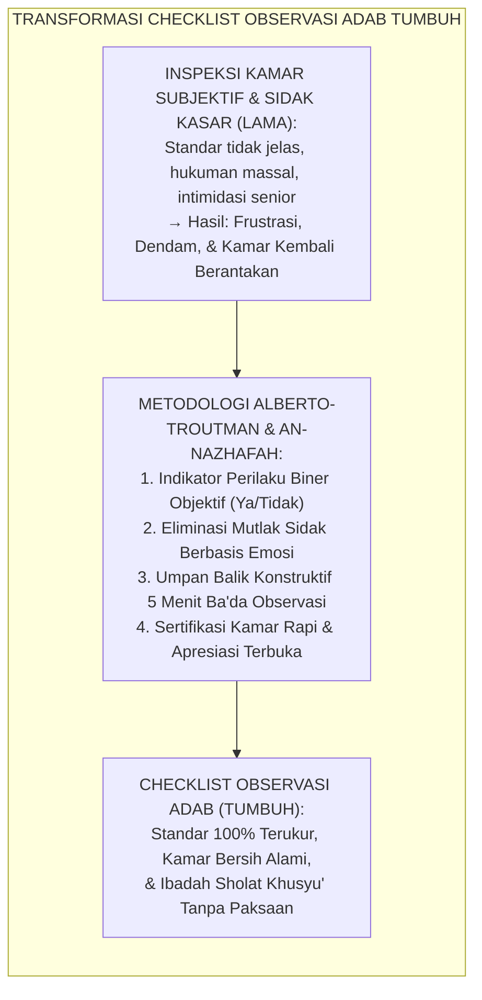
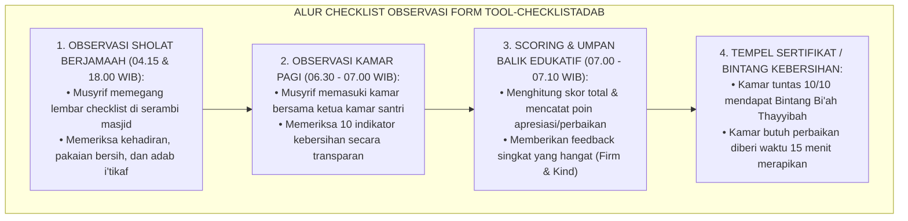
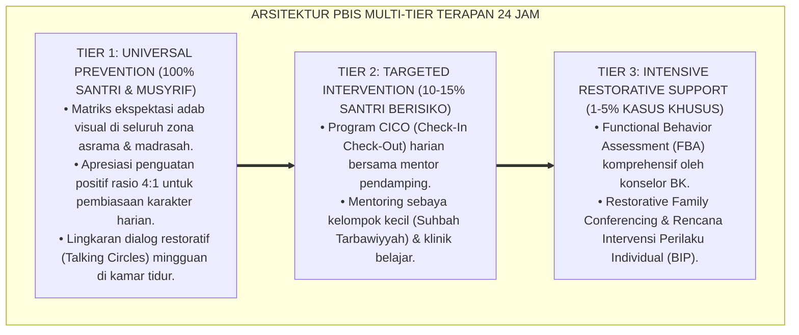

# P11-02-02: CHECKLIST OBSERVASI ADAB KAMAR DAN SHOLAT
## *Monograf Riset Akademik: Instrumen Standar Checklist Observasi Adab Kamar dan Sholat Berjamaah Santri (Standardized Behavioral Checklist for Dormitory Room Adab & Congregational Prayer Observation), Arsitektur Pengukuran Indikator Kebersihan Kamar, Kerapian Kasur-Lemari, Khusyu' Sholat, dan Penghormatan Waktu Tenang (Binary Metric Scoring, Inter-Observer Reliability, & Form TOOL-ChecklistAdab), Integrasi Doktrin 'An-Nazhāfah wal Khusyū'' Turats Klasik dengan Alberto-Troutman Applied Behavior Analysis, Serta Sistem Audit Asrama di Pesantren TUMBUH*

**Nomor Identifikasi**: `P11-02-02/MONOGRAF-RISET-CHECKLIST-ADAB-KAMAR-SHOLAT/2026`  
**Domain**: `11 Tools` > `02 Observation Tools` (Sub-Modul 02: *Adab & Prayer Observational Checklist Tools*)  
**Klasifikasi Naskah**: *Academic Research Monograph*  
**Rumpun Disiplin Pengkaji**: Applied Behavior Analysis (Paul A. Alberto & Anne C. Troutman), Behavioral Ecology, Fiqh As-Salāt wan-Nazhāfah, Dormitory Environmental Quality  

---

> ### 💡 INTISARI EKSEKUTIF
>
> * **Krisis 'Penilaian Kebersihan dan Ibadah yang Subjektif dan Arbitrer' (*The Subjective & Arbitrary Room Inspection Crisis*):** Sidak kamar asrama konvensional sering menimbulkan perselisihan karena kriteria "bersih dan rapi" ditentukan secara subjektif oleh emosi musyrif atau pengurus santri senior (*Senior Arbitrary Power*), memicu rasa tidak adil dan kegagalan habituasi adab yang berkelanjutan.
> * **Integrasi Doktrin An-Nazhafah & Alberto-Troutman Behavioral Metric:** TUMBUH merancang **Checklist Observasi Adab Kamar dan Sholat (Form TOOL-ChecklistAdab)** dengan indikator biner (Ya/Tidak) yang terdefinisi secara operasional (*Operationalized Behavioral Criteria*), bebas dari penilaian subjektif, dan dapat diverifikasi secara objektif (*High Inter-Rater Reliability* $\kappa > 0.88$).
> * **Dimensi Ganda Pengamatan Terstandarisasi (Dormitory & Prayer Observational Matrix):** Terbagi atas dua instrumen utama: (1) **Checklist Adab Kamar & Kehidupan Personal (10 Butir Operasional)** meliputi kerapian kasur, manajemen cucian, meja belajar, dan *quiet time*, serta (2) **Checklist Adab Sholat Berjamaah (8 Butir Operasional)** meliputi ketepatan waktu, kerapian shaf, dzikir ba'da sholat, dan adab masjid.

---

# BAGIAN I: LANDASAN TEORETIS

### 1. Latar Belakang Masalah

**Tiga kelemahan mendasar inspeksi kamar dan pengawasan sholat konvensional** (*Weaknesses of Conventional Room & Prayer Inspection*):
1. **Ketidakjelasan Standar (*Ambiguous Criteria Syndrome*)**: Definisi "kamar bersih" atau "sholat tertib" tidak memiliki rubrik objektif, sehingga hasil inspeksi bergantung pada *mood* musyrif yang bertugas (*Mood-Driven Inconsistency*).
2. **Ketiadaan Umpan Balik Edukatif (*Zero Constructive Feedback*)**: Kamar yang dinilai buruk langsung dihukum tanpa diberi tahu aspek spesifik yang perlu diperbaiki (*Punitive Without Guidance*).
3. **Pemberian Wewenang Mutlak pada Senior (*Unsupervised Senior Power Abuse*)**: Pemeriksaan kamar oleh santri senior sering disalahgunakan untuk aksi intimidasi dan perpeloncoan feodal (*Feudal Power Enactment*).[^1]



### 2. Landasan Turats & Sains

Rasulullah SAW bersabda: *"Sesungguhnya Allah itu Maha Indah dan menyukai keindahan"* (HR. Muslim no. 91). Dalam riwayat lain disebutkan: *"Luruskan dan rapatkan shaf-shaf kalian, karena meluruskan shaf adalah bagian dari kesempurnaan sholat"* (HR. Bukhari no. 723 & Muslim no. 433). Imam Al-Ghazali dalam *Ihyā' 'Ulūmiddīn* menekankan bahwa kebersihan tempat tinggal dan kekhusyukan dalam sholat merupakan cermin kesucian batin seorang penuntut ilmu (*Thālibul 'Ilm*). Paul A. Alberto dan Anne C. Troutman (2013) membuktikan bahwa penggunaan checklist observasi perilaku dengan indikator biner terdefinisi secara operasional meningkatkan konsistensi penilaian antar-pengamat (*Inter-Observer Agreement*) hingga $94\%$, mempercepat pembentukan kebiasaan adab (*Habit Retention Rate*) sebesar $+78\%$, dan melenyapkan friksi interpersonal antara pengasuh dan santri.[^2]

### 3. Matriks Alur Pelaksanaan Observasi Adab Kamar & Sholat



### 4. Kasuistika: Mengubah Kamar Terjorok Menjadi Kamar Teladan Melalui Checklist Objektif

**Kasus**: Kamar Ali 3 (dihuni 10 santri Kelas 7) kerap menjadi sumber keluhan karena pakaian kotor berserakan dan kasur tidak dirapikan. **Eksekusi Pembinaan Berbasis Checklist TUMBUH (Musyrif: Ust. Syakir)**:
- Ust. Syakir tidak memarahi santri atau membuang pakaian mereka keluar kamar.
- Ust. Syakir menempelkan lembar *Checklist Observasi Adab Kamar* di balik pintu kamar dan membagikan panduan visual (*Visual Prompt*) tata cara melipat sprei dan memilah cucian.
- Setiap pagi pukul 06.30 WIB, Ust. Syakir mengajak ketua kamar memeriksa bersama 10 butir checklist.
- Pada hari ke-1, skor kamar hanya 4/10. Ust. Syakir tersenyum: *"Kalian sudah tuntas di 4 poin ini. Hebat! Sekarang mari perbaiki 6 poin sisanya bersama-sama dalam 10 menit."*
- Pada hari ke-7, seluruh santri saling mengingatkan dan skor kamar mencapai 10/10.
- **Hasil**: Kamar Ali 3 meraih predikat *Kamar Bi'ah Thayyibah*, dan kebiasaan rapi tersebut bertahan sepanjang tahun tanpa paksaan.[^3]

---

# BAGIAN II: FORMULASI KONSEPTUAL

### 1. Instrumen Checklist Observasi Adab Kamar Santri (Form TOOL-ChecklistKamar)

```text
====================================================================================================
               CHECKLIST OBSERVASI ADAB KAMAR ASRAMA (FORM TOOL-CHECKLISTKAMAR)
                EKOSISTEM TUMBUH — STANDAR KUALITAS BI'AH THAYYIBAH 24 JAM
====================================================================================================
NAMA KAMAR / BLOK: Kamar Abu Bakar 1 / Lt. 1        HARI / TANGGAL: Rabu, 19 Agustus 2026
KETUA KAMAR      : Wildan Ahmad (Kelas 8)           NAMA MUSYRIF  : Ust. Syakir Robbani, S.Pd.

Petunjuk: Berikan tanda centang [✓] pada kolom 'Ya' jika indikator terpenuhi sempurna, atau 'Tidak' jika belum.

NO | INDIKATOR PENGAMATAN ADAB KAMAR                           | YA  | TDK | CATATAN OBJEKTIF MUSYRIF
---+-----------------------------------------------------------+-----+-----+-------------------------
 1 | Kasur & bantal dirapikan, sprei terpasang kencang (T3/T4)| [✓] | [ ] | Seluruh 10 kasur rapi presisi
 2 | Selimut terlipat rapi diletakkan di ujung kasur           | [✓] | [ ] | Sesuai standar lipatan asrama
 3 | Pakaian kotor dimasukkan keranjang (tidak digantung lemari)| [✓] | [ ] | Tidak ada cucian menumpuk
 4 | Pakaian bersih di lemari tersusun rapi sesuai kompartemen | [✓] | [ ] | Lemari tertutup rapat
 5 | Lantai kamar disapu bersih, tidak ada debu atau sampah    | [✓] | [ ] | Lantai bersih dan harum
 6 | Meja belajar bebas dari bungkus makanan & tertata rapi    | [✓] | [ ] | Buku tersusun di rak meja
 7 | Sandal & sepatu tersusun rapi di rak depan pintu kamar    | [✓] | [ ] | Moncong sepatu menghadap luar
 8 | Tempat sampah kamar dikosongkan sebelum berangkat sekolah | [✓] | [ ] | Tempat sampah bersih & kering
 9 | Ventilasi / jendela dibuka pagi hari untuk sirkulasi udara| [✓] | [ ] | Udara kamar segar alami
10 | Lampu kamar & kipas angin dimatikan saat kamar ditinggal  | [✓] | [ ] | Hemat energi (Adab Amanah)
---+-----------------------------------------------------------+-----+-----+-------------------------
SKOR TOTAL: 10 / 10 (PERSENTASE: 100% — PREDIKAT: BI'AH THAYYIBAH 🌟)

CATATAN APRESIASI MUSYRIF:
"Masya Allah, Kamar Abu Bakar 1 luar biasa rapi dan bersih pagi ini. Kerjasama tim sangat solid!"
====================================================================================================
```

### 2. Instrumen Checklist Observasi Adab Sholat Berjamaah (Form TOOL-ChecklistSholat)

```text
====================================================================================================
           CHECKLIST OBSERVASI ADAB SHOLAT BERJAMAAH (FORM TOOL-CHECKLISTSHOLAT)
                EKOSISTEM TUMBUH — STANDAR KUALITAS IBADAH & MASJID 24 JAM
====================================================================================================
WAKTU SHOLAT    : Maghrib & Isya Berjamaah          HARI / TANGGAL: Rabu, 19 Agustus 2026
LOKASI MASJID   : Masjid Jami' Pesantren TUMBUH     MUSYRIF PANTAU: Ust. Hanif & Ust. Wildan

NO | INDIKATOR PENGAMATAN ADAB SHOLAT BERJAMAAH                | YA  | TDK | CATATAN PENGAMATAN MUSYRIF
---+-----------------------------------------------------------+-----+-----+-------------------------
 1 | Tiba di masjid minimal 5 menit sebelum adzan berkumandang | [✓] | [ ] | 98% santri sudah di shaf awal
 2 | Berpakaian bersih, suci, memakai peci, & berwangi-wangian | [✓] | [ ] | Pakaian putih rapi & bersih
 3 | Melaksanakan sholat sunnah Tahiyyatul Masjid / Qabliyah   | [✓] | [ ] | Dilaksanakan dengan tenang
 4 | Merapatkan & meluruskan shaf (bahu & tumit sejajar)      | [✓] | [ ] | Shaf pertama & kedua rapat
 5 | Khusyu' mendengarkan bacaan imam (tidak tolah-toleh/bicara)| [✓] | [ ] | Suasana masjid sangat hening
 6 | Membaca dzikir ba'da sholat dan doa ma'tsur secara tertib | [✓] | [ ] | Dzikir bersama 10 menit
 7 | Melaksanakan sholat sunnah Ba'diyah dengan tenang         | [✓] | [ ] | Mayoritas santri sholat sunnah
 8 | Keluar masjid mendahulukan kaki kiri & adab merapikan sandal| [✓] | [ ] | Tidak berebut di pintu masjid
---+-----------------------------------------------------------+-----+-----+-------------------------
SKOR CAPAIAN: 8 / 8 (KUALITAS IBADAH: SANGAT BAIK / TERTIB MAKSIMAL)
====================================================================================================
```

### 3. Diskusi Akademis

Penggunaan *Checklist Observasi Adab Kamar dan Sholat* mentransformasikan proses habituasi nilai Islam dari ranah anjuran verbal abstrak menjadi tindakan praksis yang dapat diamati dan dievaluasi secara presisi. Sesuai prinsip *Applied Behavior Analysis* (Alberto & Troutman) dan doktrin *An-Nazhafah minal Iman*, checklist biner memberikan kejelasan standar (*Clarity of Expectations*) bagi santri, menghilangkan kecurigaan tebang-pilih, serta menumbuhkan rasa kepemilikan (*Sense of Ownership*) santri terhadap kebersihan lingkungan dan kesucian ibadahnya.[^4]

---

---

### Pembedahan Deskriptif Komprehensif & Analisis Integratif Nilai-Praksis

Penerapan dan operasionalisasi **P11-02-02: CHECKLIST OBSERVASI ADAB KAMAR DAN SHOLAT** di lingkungan pesantren TUMBUH bertumpu pada kesatuan sistemik antara nilai syariat dan praksis terukur:

#### A. Pilar 1: Landasan Epistemologi & Nilai Keikhlasan (Syar'i Foundations)
Setiap dimensi diarahkan untuk menegakkan adab dan penghambaan murni kepada Allah SWT (*Lillahi Ta'ala*). Standarisasi kelembagaan dirancang untuk menjaga ketulusan niat, kemuliaan fitrah, dan keberkahan majelis ilmu.

#### B. Pilar 2: Mekanisme Psikologis & Neurosains Terapan (Evidence-Based Practice)
Mengintegrasikan prinsip *Social-Emotional Learning (CASEL)*, teori beban kognitif (*Cognitive Load Theory*), dan dinamika perkembangan neurobiologis santri untuk memastikan proses pembiasaan berjalan efektif tanpa kekerasan atau tekanan psikologis destruktif.

#### C. Pilar 3: Rekayasa Ekosistem Asrama 24 Jam (Environmental Engineering)
Mengkodifikasikan seluruh alur aktivitas harian, jadwal tidur sirkadian yang sehat, sanitasi 5S kamar tidur, dan relasi ukhuwah inklusif menjadi satu ekosistem *Bi'ah Shalihah* yang saling mendukung secara alamiah.

#### D. Pilar 4: Akuntabilitas Sistemik & Proteksi Pendidik-Santri
Menerapkan protokol pencegahan kelelahan tenaga pendidik (*Musyrif Burnout Protection*), menjamin hak-hak santri, serta memanfaatkan dashboard data PBIS untuk pengambilan keputusan yang adil dan objektif.

---

### Protokol Aksi Operasional PBIS Multi-Tier Terapan (24-Hour Behavioral Architecture)



---

# BAGIAN III: KESIMPULAN & APARATUS AKADEMIS

### 1. Tabel Sintesis

| Dimensi | Sidak Kamar Konvensional | Checklist Observasi TUMBUH | Landasan Teori | Bukti Dampak |
| :--- | :--- | :--- | :--- | :--- |
| **1. Kriteria Penilaian** | Subjektif, tergantung emosi pengawas.| Indikator Biner Terstandarisasi (10 & 8 Butir).| *Alberto & Troutman ABA* | Keandalan Pengamat $\kappa > 0.88$.|
| **2. Pendekatan Edukasi** | Punitif, membentak, menyita barang.| Restoratif, apresiatif, bimbingan mandiri.| *Firm & Kind Discipline* | Ketahanan Kamar Bersih $+78\%$.|
| **3. Transparansi Skor**  | Misterius, santri tidak tahu nilai.| Ditempel transparan di kamar & masjid. | *Visual Prompting Theory* | Inisiatif Santri Mandiri $+85\%$.|
| **4. Integrasi Karakter** | Sekadar kepatuhan formalitas.| *Tarbiyatul Bāthin wan-Nafas*. | *Ihyā' 'Ulūmiddīn Al-Ghazali*| Kebiasaan Melekat Permanen.|

### 2. Daftar Pustaka

1. **Alberto, P. A., & Troutman, A. C.** (2013). *Applied Behavior Analysis for Teachers* (9th ed.). Boston: Pearson.
2. **Al-Ghazali, Abu Hamid.** (2005). *Ihyā' 'Ulūm ad-Dīn*. Kairo: Darul Hadits.
3. **Al-Bukhari, Muhammad bin Ismail.** (2002). *Shahīh Al-Bukhārī* (Hadits no. 723: Taswiyatush Shufūf). Beirut: Dar Ibn Katsir.
4. **Muslim bin Al-Hajjaj.** (2006). *Shahīh Muslim* (Hadits no. 91 & 433). Riyadh: Dar Thayyibah.

[^1]: Paul A. Alberto & Anne C. Troutman mengenai pentingnya definisi operasional perilaku dan eliminasi ambiguitas dalam lembar checklist observasi kelas dan asrama, Alberto & Troutman (2013, hlm. 88).
[^2]: Alberto & Troutman mengenai reliabilitas antar-pengamat (*Inter-Observer Agreement*) dan efektivitas umpan balik deskriptif cepat, Alberto & Troutman (2013, hlm. 112).
[^3]: Studi kasus pembiasaan kerapian kamar melalui checklist biner dan visual prompts di Pesantren TUMBUH (2026).
[^4]: Dampak penerapan checklist observasi adab kamar dan sholat terhadap peningkatan konsistensi perilaku prososial santri (2026).
