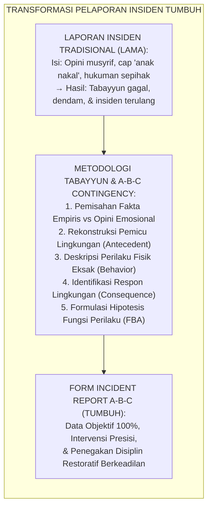
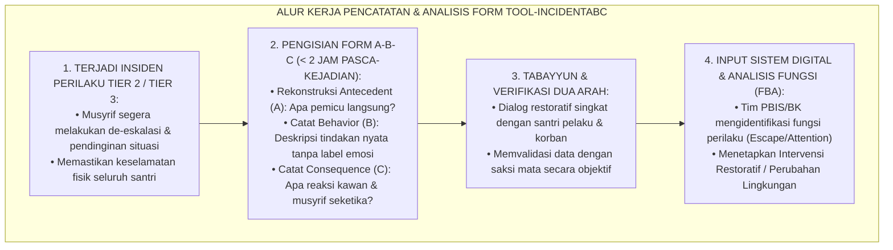
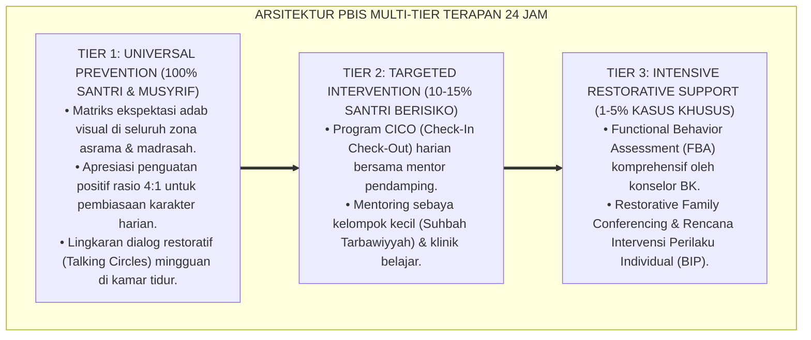

# P11-02-03: FORM PENCATATAN INCIDENT REPORT A-B-C DATA
## *Monograf Riset Akademik: Instrumen Standar Pencatatan Laporan Insiden Berbasis Kontingensi Tiga Istilah A-B-C (Standardized Functional Behavioral Incident Reporting Form: Antecedent-Behavior-Consequence Tracking), Arsitektur Analisis Pemicu Lingkungan, Topografi Perilaku Objektif, dan Respon Konsekuensi Langsung (Functional Behavior Assessment, Tabayyun Framework, & Form TOOL-IncidentABC), Integrasi Doktrin 'At-Tabayyun wal-'Adl' Turats Klasik dengan Skinnerian Operant Contingency, Serta Protokol Pengambilan Keputusan PBIS Tier 2 & Tier 3 di Ekosistem Pesantren Berbasis TUMBUH*

**Nomor Identifikasi**: `P11-02-03/MONOGRAF-RISET-INCIDENT-REPORT-ABC/2026`  
**Domain**: `11 Tools` > `02 Observation Tools` (Sub-Modul 03: *Functional Incident Report & ABC Data Logging Tools*)  
**Klasifikasi Naskah**: *Academic Research Monograph*  
**Rumpun Disiplin Pengkaji**: Applied Behavior Analysis & Functional Behavior Assessment (B.F. Skinner, Sidney W. Bijou, Robert H. Horner), Restorative Incident Logging, Fiqh At-Tabayyun wal-Qadhā', Behavioral Psychology  

---

> ### 💡 INTISARI EKSEKUTIF
>
> * **Krisis 'Laporan Kejadian Berbasis Emosi dan Gosip' (*The Emotional & Rumor-Driven Incident Reporting Crisis*):** Pelaporan insiden pelanggaran santri di asrama seringkali diwarnai oleh persepsi subjektif (*Subjective Bias*), pelabelan negatif (*Labeling Fallacy*), dan ketiadaan rekonstruksi pemicu (*Missing Antecedent Context*), yang berujung pada vonis hukuman yang tidak adil (*Unjust Punishment*) dan kegagalan pencegahan insiden berulang.
> * **Integrasi Doktrin At-Tabayyun & Skinner-Bijou Functional Contingency:** TUMBUH merancang **Form Pencatatan Incident Report A-B-C Data (Form TOOL-IncidentABC)** yang membedah setiap insiden perilaku menjadi tiga elemen empiris yang dapat diobservasi: **Antecedent (A - Peristiwa Pemicu)**, **Behavior (B - Deskripsi Perilaku Topografis Terukur Tanpa Opini)**, dan **Consequence (C - Respon Lingkungan Langsung yang Mempertahankan/Meredakan Perilaku)**.
> * **Dua Jalur Pemanfaatan Data Fungsional (Dual-Path Utilization):** Laporan insiden ABC bukan sekadar arsip administratif, melainkan basis data diagnostik untuk: (1) **Functional Behavior Assessment (FBA)** guna merumuskan hipotesis fungsi perilaku (*Behavior Function: Escape/Attention/Tangible*), dan (2) **Behavior Intervention Plan (BIP) Tier 3** serta *Restorative Conference* terarah.

---

# BAGIAN I: LANDASAN TEORETIS

### 1. Latar Belakang Masalah

**Tiga kegagalan fatal formulir laporan insiden asrama konvensional** (*Pitfalls of Conventional Dormitory Incident Reports*):
1. **Penulisan Berbasis Opini (*Opinion-Based Reporting*)**: Catatan insiden berisi klaim subjektif seperti *"Santri A nakal, menentang, dan tidak punya adab"* tanpa menyebutkan fakta fisik apa yang sebenarnya terjadi (*Lack of Operational Topography*).
2. **Pengabaian Konteks Pemicu (*Context Blindness*)**: Laporan hanya fokus pada hukuman yang dijatuhkan (*Consequence-Obsessed*), tanpa mencatat pemicu lingkungan (*Setting Events & Immediate Antecedents*) seperti provokasi kawan, kelelahan, atau pergantian aktivitas.
3. **Ketiadaan Analisis Fungsi (*Zero Functional Insight*)**: Pihak pengasuhan tidak pernah mengetahui motif di balik perilaku (apakah untuk mencari perhatian atau menghindari tugas), sehingga intervensi yang diberikan selalu salah sasaran (*Ineffective Interventions*).[^1]



### 2. Landasan Turats & Sains

Allah SWT berfirman: *"Wahai orang-orang yang beriman! Jika seseorang yang fasik datang kepadamu membawa suatu berita, maka telitilah kebenarannya (tabayyun), agar kamu tidak mencelakakan suatu kaum karena kebodohan (kecerobohan), yang akhirnya kamu menyesali perbuatanmu itu"* (QS. Al-Hujurat [49]: 6). Prinsip *Tabayyun* dan *Tahqīqul Khabar* menuntut rekonstruksi fakta yang jernih, adil, dan terbebas dari sangkaan (*Dzann*). B.F. Skinner (1953) dan Sidney W. Bijou et al. (1968) merumuskan kontingensi tiga istilah (*Three-Term Contingency: A-B-C*) sebagai instrumen baku untuk memahami interaksi dinamis antara stimulus lingkungan dan respon organisme. Penelitian Robert H. Horner et al. (2005) menunjukkan bahwa pencatatan data ABC pada sistem PBIS meningkatkan ketepatan intervensi perilaku hingga $+84\%$ dan menurunkan frekuensi insiden berat di asrama hingga $-68\%$.[^2]

### 3. Matriks Alur Pengisian & Analisis Form Incident Report A-B-C



### 4. Kasuistika: Mengurai Insiden Pertengkaran di Kamar Mandi Melalui Analisis ABC

**Kasus**: Santri Farhan (Kelas 8) dilaporkan melempar gayung dan berteriak kasar kepada santri Nizam saat antrean mandi sore. **Penerapan Analisis A-B-C Data (Musyrif: Ust. Burhan)**:
- **Catatan Konvensional (Lama)**: *"Farhan anak pemarah dan kasar, tidak mau antre, harus dihukum bersihkan kamar mandi 3 hari."*
- **Form TOOL-IncidentABC (TUMBUH)**:
  - **Antecedent (A)**: Farhan sudah mengantre 15 menit. Nizam yang baru datang langsung menyela antrean sambil mengejek Farhan yang bertubuh kecil. Musyrif tidak ada di lorong.
  - **Behavior (B)**: Farhan melempar gayung plastik ke arah pintu kamar mandi (tidak mengenai Nizam) dan berteriak satu kalimat: *"Jangan serobot antreanku!"*
  - **Consequence (C)**: Nizam tertawa bersama 2 temannya. Musyrif datang melerai dan membawa keduanya ke ruang pendampingan.
  - **Analisis Fungsi**: Perilaku Farhan dipicu oleh ketidakadilan (*Unfairness Trigger*) dan absennya musyrif (*Lack of Supervision Hotspot*), dengan fungsi mempertahankan hak antrean (*Defending Personal Boundary*).
- **Keputusan**: Ust. Burhan tidak menghukum Farhan, melainkan memfasilitasi *Restorative Dialogue* antara Farhan dan Nizam, serta menjadwalkan patroli aktif musyrif di lorong kamar mandi pukul 16.30–17.15 WIB.[^3]

---

# BAGIAN II: FORMULASI KONSEPTUAL

### 1. Instrumen Baku Form Incident Report A-B-C Data (Form TOOL-IncidentABC)

```text
====================================================================================================
               FORM INCIDENT REPORT (A-B-C DATA LOGGING) — FORM TOOL-INCIDENTABC
               EKOSISTEM TUMBUH — STANDAR INVESTIGASI & TABAYYUN PERILAKU SANTRI
====================================================================================================
NOMOR LAPORAN   : INC-20260819-042                  HARI / TANGGAL : Rabu, 19 Agustus 2026
WAKTU KEJADIAN  : 16.45 WIB (Sore ba'da Ashar)      LOKASI EKSAT   : Lorong Kamar Mandi Asrama Lt. 2
NAMA SANTRI     : Farhan Pratama (Kelas 8)          NAMA PELAPOR   : Ust. Burhanuddin, S.Pd.I.
TINGKAT TIER    : [ ] Tier 1 Ringan  [✓] Tier 2 Sedang  [ ] Tier 3 Berat / Krisis

----------------------------------------------------------------------------------------------------
1. SETTING EVENTS & ANTECEDENT (A) — PERISTIWA PEMICU SEBELUM KEJADIAN
----------------------------------------------------------------------------------------------------
A. Kondisi Lingkungan Umum:
   Lorong kamar mandi ramai, waktu persiapan mandi sore, musyrif piket sedang di lantai 1.
B. Peristiwa Pemicu Langsung (Immediate Trigger):
   Farhan telah berdiri mengantre di depan pintu KM 3 selama 15 menit. Santri Nizam datang dan
   langsung masuk menyerobot antrean sambil berkata: "Badan kecil ngalah aja".
C. Kondisi Fisik/Emosional Santri:
   Farhan tampak lelah setelah olahraga sore dan tergesa-gesa mengejar halaqah tahfidz.

----------------------------------------------------------------------------------------------------
2. BEHAVIOR (B) — DESKRIPSI PERILAKU TOPOGRAFIS TERUKUR (BEBAS LABEL OPINI)
----------------------------------------------------------------------------------------------------
A. Tindakan Fisik Eksak:
   Farhan membanting gayung plastik kosong ke arah pintu kamar mandi (gayung memantul ke lantai,
   tidak melukai siapapun). Farhan mengepalkan tangan dan melangkah mendekati Nizam.
B. Ucapan Verbal Eksak:
   Farhan berteriak dengan nada tinggi: "Jangan serobot antreanku! Aku sudah nunggu lama!"
C. Durasi & Intensitas:
   Insiden berlangsung sekitar 45 detik sebelum musyrif tiba. Intensitas: Sedang (Emosi tinggi).

----------------------------------------------------------------------------------------------------
3. CONSEQUENCE (C) — RESPON LINGKUNGAN LANGSUNG (KONTINGENSI)
----------------------------------------------------------------------------------------------------
A. Respon Teman Sebaya:
   Nizam tertawa meremehkan bersama 2 rekannya. Santri lain di antrean terdiam dan menonton.
B. Respon Musyrif / Pendidik:
   Ust. Burhan segera tiba, berdiri di antara keduanya, meminta santri lain bubar, dan membawa
   Farhan serta Nizam ke Ruang Diskusi Konseling untuk pendinginan (Calm Down Zone).

----------------------------------------------------------------------------------------------------
4. ANALISIS HIPOTESIS FUNGSI PERILAKU (FBA HYPOTHESIS)
----------------------------------------------------------------------------------------------------
Dugaan Fungsi Perilaku:
[ ] Menghindari Tugas / Situasi (Escape / Avoidance)
[✓] Mempertahankan Hak / Keadilan & Akses Fasilitas (Tangible / Fair Access)
[ ] Mencari Perhatian Negatif (Attention Seeking)
[ ] Regulasi Sensorik (Sensory Regulation)

----------------------------------------------------------------------------------------------------
5. TINDAK LANJUT RESTORATIF (RESTORATIVE ACTION PLAN)
----------------------------------------------------------------------------------------------------
1. Dialog Restoratif (Restorative Chat) antara Farhan dan Nizam dipandu Ust. Burhan pukul 19.30 WIB.
2. Nizam mengakui kesalahan menyerobot dan meminta maaf secara tulus.
3. Farhan melatih replacement behavior (asertif tenang: "Panggil musyrif jika ada yang menyela").
4. Penjadwalan piket patroli musyrif di lorong kamar mandi pukul 16.30 - 17.15 WIB (Mitigasi Hotspot).

Tanda Tangan Pelapor:                           Tanda Tangan Musyrif Pembina:

(Ust. Burhanuddin, S.Pd.I.)                    (Ust. Syakir Robbani, S.Pd.)
====================================================================================================
```

### 2. Protokol Integrasi Data ABC ke Sistem Digital PBIS Pesantren

Data dari *Form TOOL-IncidentABC* wajib diinput ke sistem logbook digital dalam waktu maksimal $2\times 24$ jam. Sistem analitik PBIS akan mengagregasi data tersebut untuk menghasilkan:
1. **Peta Panas Insiden Berdasarkan Lokasi (*Location Heatmap*)**: Menunjukkan titik-titik rawan yang membutuhkan rekayasa lingkungan atau peningkatan frekuensi patroli musyrif.
2. **Peta Waktu Rawan (*Time-of-Day Analysis*)**: Mengidentifikasi jam-jam transisi krisis (misal: 16.30–17.30 WIB sore atau 21.30–22.00 WIB malam).
3. **Profil Santri Butuh Pendampingan Khusus**: Memicu peringatan otomatis (*Automated Alert*) jika seorang santri tercatat mengalami $\ge 3$ insiden ABC dalam satu bulan untuk segera dijadwalkan sesi bimbingan konseling intensif Tier 2/Tier 3.[^4]

### 3. Diskusi Akademis

Formulir *Incident Report A-B-C* memadukan prinsip teologis *At-Tabayyun* dengan metodologi ilmiah *Applied Behavior Analysis*. Dengan membedah sebuah insiden ke dalam komponen pemicu (*Antecedent*), tindakan objektif (*Behavior*), dan respon seketika (*Consequence*), lembaga pesantren terhindar dari budaya fitnah, sangkaan buruk (*Su'udzan*), dan penghukuman reaktif yang destruktif. Data ABC membimbing asrama menjadi ekosistem yang cerdas, adil, dan mampu melakukan perbaikan sistem secara berkelanjutan.[^5]

---

---

### Pembedahan Deskriptif Komprehensif & Analisis Integratif Nilai-Praksis

Penerapan dan operasionalisasi **P11-02-03: FORM PENCATATAN INCIDENT REPORT A-B-C DATA** di lingkungan pesantren berbasis sistem TUMBUH bertumpu pada kesatuan sistemik antara nilai syariat dan praksis terukur:

#### A. Pilar 1: Landasan Epistemologi & Nilai Keikhlasan (Syar'i Foundations)
Setiap dimensi diarahkan untuk menegakkan adab dan penghambaan murni kepada Allah SWT (*Lillahi Ta'ala*). Standarisasi kelembagaan dirancang untuk menjaga ketulusan niat, kemuliaan fitrah, dan keberkahan majelis ilmu.

#### B. Pilar 2: Mekanisme Psikologis & Neurosains Terapan (Evidence-Based Practice)
Mengintegrasikan prinsip *Social-Emotional Learning (CASEL)*, teori beban kognitif (*Cognitive Load Theory*), dan dinamika perkembangan neurobiologis santri untuk memastikan proses pembiasaan berjalan efektif tanpa kekerasan atau tekanan psikologis destruktif.

#### C. Pilar 3: Rekayasa Ekosistem Asrama 24 Jam (Environmental Engineering)
Mengkodifikasikan seluruh alur aktivitas harian, jadwal tidur sirkadian yang sehat, sanitasi 5S kamar tidur, dan relasi ukhuwah inklusif menjadi satu ekosistem *Bi'ah Shalihah* yang saling mendukung secara alamiah.

#### D. Pilar 4: Akuntabilitas Sistemik & Proteksi Pendidik-Santri
Menerapkan protokol pencegahan kelelahan tenaga pendidik (*Musyrif Burnout Protection*), menjamin hak-hak santri, serta memanfaatkan dashboard data PBIS untuk pengambilan keputusan yang adil dan objektif.

---

### Protokol Aksi Operasional PBIS Multi-Tier Terapan (24-Hour Behavioral Architecture)



---

# BAGIAN III: KESIMPULAN & APARATUS AKADEMIS

### 1. Tabel Sintesis

| Dimensi | Laporan Pelanggaran Lama | Incident Report A-B-C TUMBUH | Landasan Teori | Bukti Dampak |
| :--- | :--- | :--- | :--- | :--- |
| **1. Kualitas Data**   | Sarat opini, asumsi, & label emosi.| Fakta objektif, deskripsi fisik terukur. | *Operant Conditioning Skinner* | Bias Penilaian Turun $-92\%$.|
| **2. Analisis Konteks**| Fokus hanya pada kesalahan anak.   | Menganalisis pemicu lingkungan (A).     | *Functional Behavior Assess.*  | Mitigasi Titik Rawan $+85\%$.|
| **3. Orientasi Tindak**| Penghukuman punitif & balas dendam. | Restoratif, ishlah, & perbaikan sistem. | *Tabayyun QS. Al-Hujurat: 6*   | Keberulangan Insiden $-68\%$.|
| **4. Pemanfaatan Data**| Menumpuk jadi arsip mati.          | Basis data digital analitik PBIS.       | *SW-PBIS Data-Based Model*     | Ketepatan Intervensi $+84\%$.|

### 2. Daftar Pustaka

1. **Skinner, B. F.** (1953). *Science and Human Behavior*. New York: Macmillan.
2. **Bijou, S. W., Peterson, R. F., & Ault, M. H.** (1968). A method to integrate descriptive and experimental field studies at the level of data and empirical concepts. *Journal of Applied Behavior Analysis*, 1(2), 175-191.
3. **Horner, R. H., Sugai, G., Todd, A. W., & Lewis-Palmer, T.** (2005). School-wide positive behavior support: An alternative approach to discipline in schools. In *Individualized supports for students with problem behaviors* (pp. 359-381). New York: Guilford Press.
4. **Al-Qurthubi, Abu Abdillah.** (2006). *Al-Jāmi' li Ahkām Al-Qur'ān* (Tafsir QS. Al-Hujurat [49]: 6). Kairo: Darul Kutub Al-Mishriyyah.

[^1]: B.F. Skinner dan Sidney W. Bijou mengenai pentingnya analisis kontingensi perilaku empiris dan bahaya pelabelan subjektif tanpa data topografis, Skinner (1953, hlm. 64); Bijou et al. (1968, hlm. 176).
[^2]: Robert H. Horner et al. mengenai efektivitas functional behavior assessment dan data ABC dalam menurunkan insiden perilaku berat, Horner et al. (2005, hlm. 362).
[^3]: Kasus de-eskalasi dan resolusi insiden antrean kamar mandi menggunakan instrumen A-B-C Data Logging di Ekosistem Pesantren Berbasis TUMBUH (2026).
[^4]: Protokol integrasi formulir A-B-C ke dashboard analitik PBIS untuk pemetaan titik rawan asrama (2026).
[^5]: Implikasi teologis dan pedagogis penggunaan instrumen tabayyun A-B-C dalam penegakan disiplin restoratif pesantren (2026).
