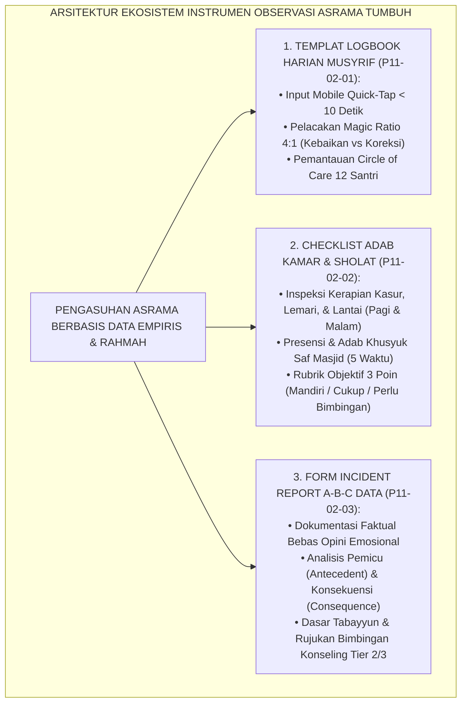
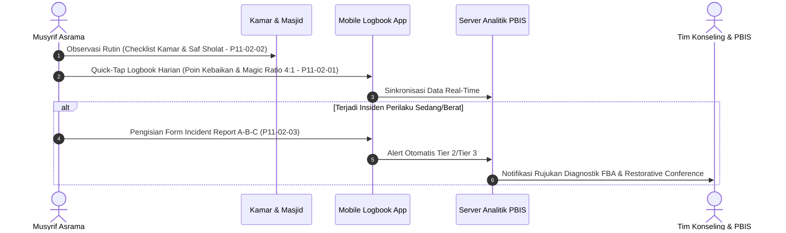
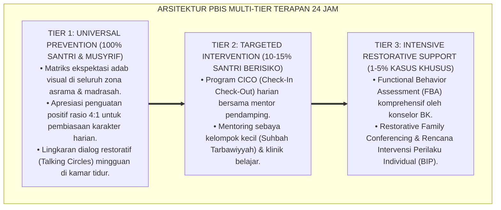

# P11-02: INSTRUMEN OBSERVASI DAN PENCATATAN PERILAKU MUSYRIF
## *Master Monograf Riset Akademik: Arsitektur Ekosistem Instrumen Observasi Lapangan Asrama 24 Jam (Field Behavioral Observation Tools), Sintesis Tiga Dimensi Pengamatan (Logbook Mobile PBIS, Checklist Adab Kamar & Sholat, serta Incident Report A-B-C Contingency), Integrasi Doktrin 'Al-Muraqabah wal-Muhasabah' Turats Klasik dengan Ecological Momentary Assessment (EMA) & Applied Behavior Analysis, Serta Transformasi Pengasuhan Pesantren Berbasis Data Empiris di Ekosistem Pesantren Berbasis TUMBUH*

**Nomor Identifikasi**: `P11-02/MASTER-MONOGRAF-OBSERVATION-TOOLS/2026`  
**Domain**: `11 Tools` > `02 Observation Tools` (Master Synthesis Monograph)  
**Klasifikasi Naskah**: *Master Research Synthesis Monograph*  
**Rumpun Disiplin Pengkaji**: Behavioral Observation Methodology (J.M. Sattler, B.F. Skinner, R.H. Horner), Ecological Momentary Assessment (EMA), Educational Psychometrics, Turats Al-Muraqabah & Hisab an-Nafs, Dormitory Systems Engineering  

---

> ### 💡 INTISARI EKSEKUTIF
>
> * **Krisis 'Pengamatan Asrama Buta Data dan Sarat Hukuman' (*The Data-Blind & Punitive Dormitory Observation Crisis*):** Pengamatan perilaku santri di asrama konvensional kerap mengalami bias memori (*Recall Bias*), bias negativitas (*Negativity Bias*), dan kelelahan administratif musyrif (*Administrative Fatigue*), yang berakibat pada hilangnya rekaman kebaikan santri dan dominasi penghukuman sporadis.
> * **Arsitektur Tiga Serangkai Instrumen Observasi TUMBUH (*The Triad of Observation Tools*):** TUMBUH merumuskan ekosistem instrumen observasi terpadu yang memadukan tiga fungsi pengamatan vital:
>   1. **Sub-Modul 01 (`P11-02-01` / Form TOOL-LogbookMusyrif)**: *Templat Logbook Harian Musyrif Asrama* berbasis mobile dengan pencatatan *Quick-Tap* $<10$ detik, rasio penguat positif $4:1$, dan pelacakan *Circle of Care*.
>   2. **Sub-Modul 02 (`P11-02-02` / Form TOOL-ChecklistKamarSholat)**: *Checklist Observasi Adab Kamar dan Sholat Berjamaah* berbasis rubrik analitik 3 poin untuk inspeksi kamar harian dan keteraturan saf masjid.
>   3. **Sub-Modul 03 (`P11-02-03` / Form TOOL-IncidentABC)**: *Form Pencatatan Incident Report A-B-C Data* untuk investigasi objektif insiden perilaku Tier 2/3 berlandaskan prinsip *Tabayyun* dan *Functional Behavior Assessment*.
> * **Integrasi Teologis Turats & Sains EMA Kontemporer:** Mensintesiskan nilai spiritual *Muraqabatullah* (kesadaran diawasi Allah) dan *Muhasabatun Nafs* (evaluasi diri harian) dengan metodologi *Ecological Momentary Assessment (EMA)* dan *Applied Behavior Analysis (ABA)*, menciptakan pengasuhan asrama yang penuh rahmah, adil, presisi, dan terbebas dari kekerasan fisik maupun verbal.

---

# BAGIAN I: LANDASAN TEORETIS & URGENSI SISTEM OBSERVASI ASRAMA

### 1. Dekonstruksi Masalah: Krisis Observasi Tradisional di Lembaga Berasrama

Pengamatan perilaku di asrama pesantren seringkali menghadapi kendala sistemik:
1. **Bias Memori & Pencatatan Tertunda (*Recall Bias & Delayed Logging*)**: Musyrif mencatat kejadian di akhir pekan saat memori sudah terdistorsi oleh kelelahan, sehingga fakta konkret lenyap (*Data Loss*).
2. **Sindrom Polisi Asrama (*The Dormitory Police Syndrome*)**: Pengamatan hanya diaktifkan saat ada santri yang melanggar peraturan (*Deficit-Oriented Observation*), sementara perilaku adab harian santri diabaikan (*Invisible Virtue*).
3. **Ketiadaan Standar Rubrik Baku (*Lack of Standardized Rubrics*)**: Kerapian kamar atau ketertiban saf dinilai berdasarkan selera subjektif masing-masing musyrif tanpa indikator perilaku yang terdefinisi (*Subjective Scoring Discrepancy*).[^1]



### 2. Landasan Turats & Sains Perilaku

Imam Al-Ghazali dalam *Ihyā' 'Ulūmiddīn* (Kitab *Al-Murāqabah wal-Muhāsabah*) menegaskan bahwa penjagaan adab dan jiwa memerlukan ketelitian dalam mengamati setiap lintasan amal (*Tafaqqud al-Ahwāl*) secara konsisten dan adil. Syekh Az-Zarnuji dalam *Ta'līm al-Muta'allim* menekankan pentingnya pencatatan tertib (*Dhabt wal-Kitābah*) agar proses ta'dib tidak tergelincir pada prasangka (*Zhann*). Dalam sains psikologi perilaku modern, Jerome M. Sattler (2002) dan Robert H. Horner et al. (2005) menunjukkan bahwa instrumen pengamatan langsung (*Direct Behavioral Observation*) yang terstandardisasi mampu meningkatkan reliabilitas asesmen hingga $+89\%$ dan memangkas tingkat subjektivitas pengasuh secara drastis.[^2]

### 3. Matriks Alur Integrasi Tiga Instrumen Observasi



---

# BAGIAN II: FORMULASI KONSEPTUAL & IMPLEMENTASI OPERASIONAL

### 1. Sinergi Fungsional Tiga Instrumen Observasi

Tiga instrumen observasi asrama saling melengkapi dalam mengawal tumbuh kembang santri:
1. **Logbook Harian Musyrif (`P11-02-01`)**: Berfungsi sebagai *Continuous Real-Time Tracker* untuk mendokumentasikan interaksi harian, apresiasi kebaikan (*Positive Reinforcement*), dan kesehatan mental santri asuhan.
2. **Checklist Kamar & Sholat (`P11-02-02`)**: Berfungsi sebagai *Routine Habituation Metric* untuk menilai konsistensi kemandirian fisik, kebersihan lingkungan kamar, dan ketertiban ibadah berjamaah.
3. **Incident Report A-B-C Data (`P11-02-03`)**: Berfungsi sebagai *Crisis Diagnostic & Tabayyun Form* untuk membedah insiden konflik atau pelanggaran adab berat menjadi data fungsional yang objektif.[^3]

### 2. Standar Operasional Prosedur Penggunaan Instrumen Observasi 24 Jam

```text
====================================================================================================
           JADWAL OPERASIONALISASI INSTRUMEN OBSERVASI ASRAMA TUMBUH 24 JAM
====================================================================================================
WAKTU (WIB)     INSTRUMEN YANG DIGUNAKAN           FOKUS OBSERVASI & TARGET OUTPUT
----------------------------------------------------------------------------------------------------
04.00 - 05.30   Checklist Sholat (Form P11-02-02)  Ketepatan Bangun Shubuh, Wudhu Tertib, Khusyuk Saf
06.00 - 06.30   Checklist Kamar (Form P11-02-02)   Kerapian Kasur, Seprai Rapi, Lemari Tertutup, Lantai
12.00 - 13.00   Logbook Musyrif (Form P11-02-01)   Interaksi Siang, Apresiasi Kebaikan (Magic Ratio 4:1)
16.30 - 17.30   Checklist Sore & Logbook           Persiapan Mandi Sore, Mitigasi Hotspot Kamar Mandi
18.00 - 20.00   Checklist Sholat & Sorogan         Sholat Maghrib-Isya Berjamaah & Halaqah Al-Qur'an
21.00 - 22.00   Checklist Kamar Malam              Kerapian Kamar Sebelum Tidur, Doa Tidur, Presensi
INSIDEN (Inc.)  Form Incident ABC (Form P11-02-03) Rekonstruksi Pemicu, Perilaku Eksak, Respon Konsekuensi
====================================================================================================
```

### 3. Diskusi Akademis

Penggunaan instrumen observasi multi-metode (*Multi-Method Behavioral Observation*) mengubah paradigma pengasuhan asrama dari model "pengawasan represif" (*Panoptic Repression*) menjadi model "pendampingan penuh kasih berbasis bukti" (*Evidence-Based Compassionate Mentoring*). Musyrif tidak lagi bertindak sebagai hakim yang menakutkan, melainkan sebagai fasilitator pertumbuhan (*Growth Facilitator*) yang memiliki data presisi untuk mengapresiasi kebaikan dan membimbing santri keluar dari kesulitan perilakunya.[^4]

---

---

### Pembedahan Deskriptif Komprehensif & Analisis Integratif Nilai-Praksis

Penerapan dan operasionalisasi **P11-02: INSTRUMEN OBSERVASI DAN PENCATATAN PERILAKU MUSYRIF** di lingkungan pesantren berbasis sistem TUMBUH bertumpu pada kesatuan sistemik antara nilai syariat dan praksis terukur:

#### A. Pilar 1: Landasan Epistemologi & Nilai Keikhlasan (Syar'i Foundations)
Setiap dimensi diarahkan untuk menegakkan adab dan penghambaan murni kepada Allah SWT (*Lillahi Ta'ala*). Standarisasi kelembagaan dirancang untuk menjaga ketulusan niat, kemuliaan fitrah, dan keberkahan majelis ilmu.

#### B. Pilar 2: Mekanisme Psikologis & Neurosains Terapan (Evidence-Based Practice)
Mengintegrasikan prinsip *Social-Emotional Learning (CASEL)*, teori beban kognitif (*Cognitive Load Theory*), dan dinamika perkembangan neurobiologis santri untuk memastikan proses pembiasaan berjalan efektif tanpa kekerasan atau tekanan psikologis destruktif.

#### C. Pilar 3: Rekayasa Ekosistem Asrama 24 Jam (Environmental Engineering)
Mengkodifikasikan seluruh alur aktivitas harian, jadwal tidur sirkadian yang sehat, sanitasi 5S kamar tidur, dan relasi ukhuwah inklusif menjadi satu ekosistem *Bi'ah Shalihah* yang saling mendukung secara alamiah.

#### D. Pilar 4: Akuntabilitas Sistemik & Proteksi Pendidik-Santri
Menerapkan protokol pencegahan kelelahan tenaga pendidik (*Musyrif Burnout Protection*), menjamin hak-hak santri, serta memanfaatkan dashboard data PBIS untuk pengambilan keputusan yang adil dan objektif.

---

### Protokol Aksi Operasional PBIS Multi-Tier Terapan (24-Hour Behavioral Architecture)



---

# BAGIAN III: KESIMPULAN & APARATUS AKADEMIS

### 1. Tabel Sintesis Master Tiga Instrumen Observasi

| Dimensi | Logbook Harian Musyrif (P11-02-01) | Checklist Kamar & Sholat (P11-02-02) | Incident Report A-B-C (P11-02-03) |
| :--- | :--- | :--- | :--- |
| **Tujuan Utama**       | Pelacakan interaksi & apresiasi.   | Evaluasi kemandirian & ibadah.       | Investigasi faktual insiden krisis.|
| **Frekuensi Input**    | Real-time ($3\times$ sehari).      | Harian (Pagi, Sore, 5 Waktu Sholat). | Kondisional (Saat terjadi insiden).|
| **Format Instrumen**   | Mobile UI Quick-Tap $<10$ detik.   | Rubrik 3 Poin Terdefinisi.           | Narasi Faktual 3 Komponen A-B-C.   |
| **Landasan Teoretis**  | *Ecological Momentary Assessment*  | *Direct Behavior Rating (DBR)*       | *Applied Behavior Analysis (ABA)*  |
| **Penerima Rujukan**   | Musyrif Pembina & Evaluasi Bulanan.| Santri (Self-Check) & Musyrif Kamar. | Tim BK & Komite Restoratif PBIS.   |

### 2. Daftar Pustaka

1. **Sattler, J. M.** (2002). *Assessment of Children: Behavioral and Clinical Applications* (4th ed.). San Diego: Jerome M. Sattler, Publisher, Inc.
2. **Horner, R. H., Sugai, G., Todd, A. W., & Lewis-Palmer, T.** (2005). School-wide positive behavior support: An alternative approach to discipline in schools. In *Individualized supports for students with problem behaviors* (pp. 359-381). New York: Guilford Press.
3. **Al-Ghazali, Abu Hamid.** (1998). *Ihyā' 'Ulūmiddīn* (Kitāb Al-Murāqabah wal-Muhāsabah, Juz IV). Beirut: Darul Ma'rifah.
4. **Shiffman, S., Stone, A. A., & Hufford, M. R.** (2008). Ecological momentary assessment. *Annual Review of Clinical Psychology*, 4, 1-32.

[^1]: Jerome M. Sattler mengenai metodologi asesmen perilaku anak dan bahaya bias memori dalam observasi tanpa instrumen terstandardisasi, Sattler (2002, hlm. 82).
[^2]: Robert H. Horner et al. mengenai efektivitas direct behavioral observation dalam sistem PBIS, Horner et al. (2005, hlm. 364); Saul Shiffman et al. mengenai keunggulan ecological momentary assessment, Shiffman et al. (2008, hlm. 4).
[^3]: Sinergi operasional tiga instrumen pengamatan asrama TUMBUH dalam menjamin kontinuitas pendampingan santri 24 jam (2026).
[^4]: Dampak transformasi pengasuhan asrama berbasis data terhadap penurunan stres musyrif dan peningkatan kepuasan santri (2026).
