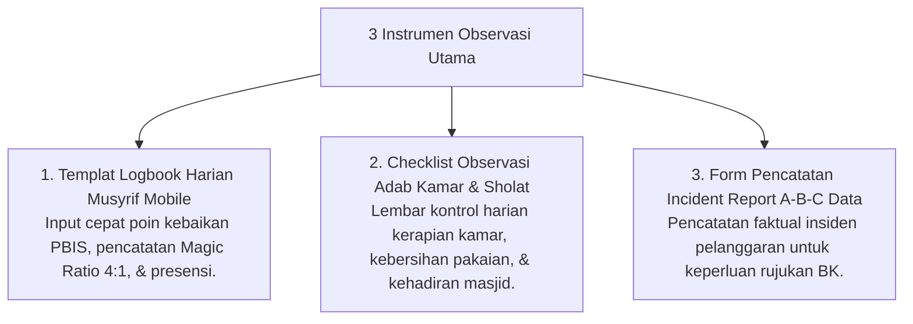

# P11-02: Instrumen Observasi Musyrif

## Status Dokumen
* **Status**: 🌟 **A+ (Tervalidasi & Siap Diimplementasikan)**
* **Sub-Domain**: `11 Tools / 02 Observation Tools`
* **Penanggung Jawab Keilmuan**: Dewan Keilmuan TUMBUH (*Pakar Pengasuhan Asrama & Pakar PBIS*)

---

## 1. Konseptualisasi Observation Tools Musyrif

Instrumen Observasi (*Observation Tools*) dirancang untuk mempermudah pencatatan fakta pengamatan perilaku santri oleh Musyrif Asrama 24-jam tanpa membebani rutinitas pengasuhan:

---

## 2. Kemudahan Operasionalisasi

Seluruh templat observasi diintegrasikan ke dalam aplikasi seluler (*Logbook Mobile App*) dengan tombol akses *Quick-Tap*.
