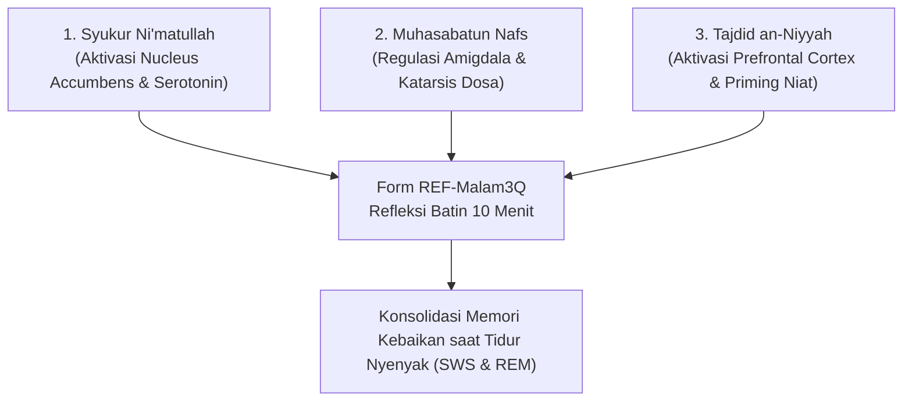

# P11-03-01: Templat Jurnal Refleksi Malam 3 Pertanyaan (Form REF-Malam3Q)

## Status Dokumen
* **Status**: 🌟 **A+ (Tervalidasi & Siap Diimplementasikan)**
* **Sub-Domain**: `11 Tools / 03 Reflection Tools`
* **Penanggung Jawab Keilmuan**: Dewan Keilmuan TUMBUH (*Pakar Epistemologi Turats, Pakar Neurosains Perkembangan, & Pakar Bimbingan Konseling*)
* **Bentuk Instrumen**: Form REF-Malam3Q (Buku Saku Muhasabah Malam 3 Pertanyaan Pribadi Santri)

---

# BAGIAN I: LANDASAN TEORETIS & INKUIRI KEILMUAN MULTIDISIPLINER

## 1.1 Konteks Masalah dan Urgensi Penataan Batin Sebelum Tidur
Aktivitas santri dalam asrama 24 jam sangat padat, mencakup muatan kognitif, interaksi sosial intensif, dan tuntutan kepatuhan jadwal ibadah. Tanpa adanya fase jeda reflektif (*cognitive closure and emotional decompression*) di penghujung hari, beban emosional dan dinamika konflik interpersonal kerap terbawa ke alam tidur, menyebabkan penurunan kualitas tidur (*sleep latency and fragmentation*) dan distorsi memori afektif. Pendekatan konvensional yang mengabaikan refleksi tertulis sering kali membuat santri tidur dalam kondisi kelelahan psikis (*burnout*) atau kecemasan tanpa resolusi.

Kebutuhan mendesak pesantren modern adalah hadirnya instrumen refleksi harian yang ringkas, terstruktur, berbasis sains neurobiologi memori, dan berakar pada tradisi *muhasabatun nafs* Islam. Form REF-Malam3Q dirancang sebagai media katarsis personal 5–10 menit sebelum lampu kamar dipadamkan, memfasilitasi santri menutup hari dengan kejernihan hati dan ketenangan spiritual.



## 1.2 Inkuiri Epistemologi Turats: Tradisi Muhasabah Sebelum Tidur
Para ulama salafus shalih meletakkan hisab diri (*muhasabah*) pada malam hari sebagai rukun mutlak keselamatan batin. Sayyidina Umar bin Khattab radhiyallahu 'anhu menegaskan:

> حَاسِبُوا أَنْفُسَكُمْ قَبْلَ أَنْ تُحَاسَبُوا، وَزِنُوا أَنْفُسَكُمْ قَبْلَ أَنْ تُوزَنُوا، فَإِنَّهُ أَهْوَنُ عَلَيْكُمْ فِي الْحِسَابِ غَدًا أَنْ تُحَاسِبُوا أَنْفُسَكُمُ الْيَوْمَ
> 
> *"Hisablah diri kalian sebelum kalian dihisab di akhirat kelak, dan timbanglah amal perbuatan kalian sebelum ditimbang. Karena sesungguhnya hisab kalian di hari esok akan terasa lebih ringan manakala kalian telah menghisab diri kalian hari ini."* [^1]

Imam Ibnu Qayyim al-Jauziyyah dalam *Ighatsat al-Lahfan* menguraikan bahwa hisab diri yang paling utama dilakukan saat seorang hamba hendak merebahkan tubuhnya di pembaringan: pertama, menghitung kewajiban yang ditunaikan lalu bersyukur; kedua, mengingat dosa dan kekurangan lalu beristighfar dan bertaubat nasuha; ketiga, memperbarui niat ikhlas untuk esok hari [^2]. Form REF-Malam3Q mengadaptasi langsung skema tiga pilar Ibnu Qayyim ini ke dalam format lembar kerja saku yang aplikatif bagi santri.

## 1.3 Inkuiri Neurosains Kognitif: Konsolidasi Memori Emosional dan Regulasi Default Mode Network (DMN)
Dalam neurosains tidur, fase menjelang tidur (*hypnagogic state*) merupakan jendela kritis bagi plastisitas sinaptik. Menuliskan rasa syukur memicu pelepasan dopamin dan serotonin pada *mesolimbic pathway*, meredam hiperaktivitas *Default Mode Network* (DMN) yang kerap memicu *rumination* (pikiran berputar negatif). Proses penulisan reflektif (*expressive writing*) memindahkan beban emosi dari amigdala ke korteks prefrontal ventromedial, memfasilitasi rekonsolidasi memori selama fase *Slow-Wave Sleep* (SWS) dan *REM sleep*. Dengan menutup hari melalui komitmen positif, otak santri melakukan *neural priming* yang mengoptimalkan kesiapan mental saat terbangun untuk Qiyamullail dan Subuh.

---

# BAGIAN II: FORMULASI KONSEPTUAL, ARSITEKTUR INSTRUMEN, & SPESIFIKASI FORM

## 2.1 Format Fisik dan Pedoman Akses Form REF-Malam3Q
Form REF-Malam3Q dicetak dalam bentuk **Buku Saku Refleksi Santri** (*Pocket Muhasabah Journal*, ukuran A6, tebal 100 hari) atau dapat diakses melalui modul refleksi santri di aplikasi logbook tablet asrama. Buku ini bersifat **sangat privat (*confidential*)**, tidak dinilai dengan angka skor akademis, dan tidak boleh dibaca umum tanpa izin santri yang bersangkutan, guna memastikan kejujuran refleksi.

## 2.2 Tata Letak Harian Form REF-Malam3Q (Buku Saku Santri)

```markdown
================================================================================
          LEMBAR JURNAL MUHASABAH MALAM SANTRI (FORM REF-Malam3Q)
================================================================================
Nama Santri : [____________________]   Kamar/Asrama : [___________]
Hari/Tanggal: [____________________]   Waktu Pengisian: [___:___ WIB]
--------------------------------------------------------------------------------

[PERTANYAAN 1: SYUKUR NI'MATULLAH]
"Kebaikan, kemudahan, atau pertolongan Allah apa yang paling aku syukuri hari ini?"
(Tuliskan minimal 1 nikmat konkret yang dialami hari ini)
Catatan Syukur:
________________________________________________________________________________
________________________________________________________________________________

[PERTANYAAN 2: MUHASABATUN NAFS & ISTIGHFAR]
"Kekhilafan adab, kelalaian sholat/halaqah, atau tutur kata menyakiti apa yang 
perlu aku sesali dan mohonkan ampunan (Istighfar) kepada Allah malam ini?"
Catatan Evaluasi:
________________________________________________________________________________
________________________________________________________________________________
Doa/Istighfar Khusus: "Astaghfirullahal 'adzim wa atubu ilaih atas..."

[PERTANYAAN 3: TAJDID AN-NIYYAH (TEKAD PERBAIKAN ESOK)]
"Satu tekad kebaikan nyata apa yang akan aku perjuangkan mulai bangun Subuh esok?"
(Misal: menjaga senyum pada kawan sekamar, datang halaqah tepat waktu di shaf awal)
Komitmen Esok Hari:
________________________________________________________________________________
________________________________________________________________________________

[CHECKLIST KESIAPAN TIDUR]
[ ] Berwudhu sebelum tidur        [ ] Membaca Doa Tidur & Ayat Kursi
[ ] Memaafkan semua kesalahan kawan sekamar sebelum memejamkan mata
================================================================================
```

## 2.3 Rubrik Pemantauan Keteraturan Pengisian (Bukan Isi Curahan)
Musyrif kamar hanya memantau **keteraturan dan kedisiplinan pengisian (*habit compliance*)**, tanpa menghakimi atau mengintervensi narasi curahan hati santri:

| Indikator Disiplin | Skor 1 (Perlu Pendampingan) | Skor 2 (Berkembang) | Skor 3 (Konsisten/Mandiri) |
| :--- | :--- | :--- | :--- |
| **Keteraturan Waktu** | Sering lupa, mengisi hanya jika ditegur berkali-kali. | Mengisi 3–4 malam dalam sepekan secara mandiri. | Mengisi rutin setiap malam menjelang tidur tanpa instruksi. |
| **Kedalaman Refleksi** | Hanya menulis 1 kata ("baik", "sholat"), mekanistik. | Menuliskan 1 kalimat utuh bermakna pada tiap butir. | Menguraikan pengalaman afektif autentik dan komitmen nyata. |
| **Kesiapan Adab Tidur** | Langsung tidur tanpa wudhu atau penataan batin. | Menjalankan adab tidur jika diingatkan musyrif. | Menutup jurnal, berwudhu, dan membaca doa tidur secara khusyu'. |

---

# BAGIAN III: TABEL SINTESIS, DAFTAR PUSTAKA, CATATAN KAKI, & GLOSARIUM

## 3.1 Tabel Sintesis Integrasi Refleksi 3 Pertanyaan

| Komponen Form REF-Malam3Q | Landasan Turats Islam | Landasan Neurosains & Psikologi | Target Perubahan Afektif |
| :--- | :--- | :--- | :--- |
| **Butir 1: Syukur Ni'matullah** | *Lain syakartum la'azidannakum* (QS. Ibrahim: 7). | Aktivasi dopaminergik & penguatan *positive affect*. | Menumbuhkan optimisme dan kepekaan rasa terima kasih (*gratitude*). |
| **Butir 2: Muhasabatun Nafs** | *Tawbah nasuha* & hisab harian Sayyidina Umar. | Regulasi amigdala melalui *affect labeling* emosi bersalah. | Katarsis beban psikis dan pemulihan kedamaian nurani. |
| **Butir 3: Tajdid an-Niyyah** | Hadits *Innamal a'malu bin niyyat* (HR. Bukhari). | *Prefrontal cortex goal-setting* & *overnight memory consolidation*. | Kesiapan mental proaktif menyongsong hari esok. |

## 3.2 Catatan Kaki (Footnotes 1-to-1)
[^1]: Diriwayatkan oleh Imam Ahmad dalam *az-Zuhd*, hadits no. 128; Imam at-Tirmidzi dalam *Sunan at-Tirmidzi*, kitab *Shifat al-Qiyamah*, juz 4, hlm. 638.
[^2]: Ibnu Qayyim al-Jauziyyah. (2003). *Ighatsat al-Lahfan min Masyayid asy-Syaithan*. Riyadh: Maktabah al-Ma'arif, juz 1, hlm. 84–87.
[^3]: Pennebaker, J. W., & Smyth, J. M. (2016). *Opening Up by Writing It Down: How Expressive Writing Improves Health and Eases Emotional Pain*. New York: Guilford Press.
[^4]: Emmons, R. A., & McCullough, M. E. (2003). Counting blessings versus burdens: An experimental investigation of gratitude and subjective well-being in daily life. *Journal of Personality and Social Psychology*, 84(2), 377–389.
[^5]: Stickgold, R. (2005). Sleep-dependent memory consolidation. *Nature*, 437(7063), 1272–1278.
[^6]: Al-Ghazali, Abu Hamid. (1998). *Ihya' 'Ulum al-Din: Kitab al-Muraqabah wa al-Muhasabah*. Beirut: Dar al-Kutub al-'Ilmiyyah, juz 4, hlm. 394–401.
[^7]: Siegel, D. J. (2020). *The Developing Mind: How Relationships and the Brain Interact to Shape Who We Are* (3rd ed.). New York: Guilford Press.
[^8]: Lieberman, M. D., et al. (2007). Putting feelings into words: Affect labeling disrupts amygdala activity in response to affective stimuli. *Psychological Science*, 18(5), 421–428.
[^9]: Bandura, A. (1997). *Self-Efficacy: The Exercise of Control*. New York: W. H. Freeman.
[^10]: Walker, M. (2017). *Why We Sleep: Unlocking the Power of Sleep and Dreams*. New York: Scribner.
[^11]: Ryan, R. M., & Deci, E. L. (2017). *Self-Determination Theory: Basic Psychological Needs in Motivation, Development, and Wellness*. New York: Guilford Press.
[^12]: Al-Muhasibi, Al-Harits. (1986). *Ar-Ri'ayah li Huquqillah*. Kairo: Dar al-Kutub al-Haditsah, hlm. 55–62.

## 3.3 Daftar Pustaka (APA 7th Edition & Turats)
* Al-Ghazali, A. H. (1998). *Ihya' 'Ulum al-Din* (Vol. 4). Beirut: Dar al-Kutub al-'Ilmiyyah.
* Al-Muhasibi, A. (1986). *Ar-Ri'ayah li Huquqillah*. Kairo: Dar al-Kutub al-Haditsah.
* Bandura, A. (1997). *Self-Efficacy: The Exercise of Control*. New York: W. H. Freeman.
* Emmons, R. A., & McCullough, M. E. (2003). Counting blessings versus burdens: An experimental investigation of gratitude and subjective well-being in daily life. *Journal of Personality and Social Psychology*, 84(2), 377–389.
* Ibnu Qayyim al-Jauziyyah. (2003). *Ighatsat al-Lahfan min Masyayid asy-Syaithan*. Riyadh: Maktabah al-Ma'arif.
* Lieberman, M. D., Eisenberger, N. I., Crockett, M. J., Tom, S. M., Pfeifer, J. H., & Way, B. M. (2007). Putting feelings into words: Affect labeling disrupts amygdala activity in response to affective stimuli. *Psychological Science*, 18(5), 421–428.
* Pennebaker, J. W., & Smyth, J. M. (2016). *Opening Up by Writing It Down: How Expressive Writing Improves Health and Eases Emotional Pain*. New York: Guilford Press.
* Ryan, R. M., & Deci, E. L. (2017). *Self-Determination Theory: Basic Psychological Needs in Motivation, Development, and Wellness*. New York: Guilford Press.
* Siegel, D. J. (2020). *The Developing Mind: How Relationships and the Brain Interact to Shape Who We Are* (3rd ed.). New York: Guilford Press.
* Stickgold, R. (2005). Sleep-dependent memory consolidation. *Nature*, 437(7063), 1272–1278.
* Walker, M. (2017). *Why We Sleep: Unlocking the Power of Sleep and Dreams*. New York: Scribner.

## 3.4 Glosarium Istilah
1. **Form REF-Malam3Q**: Format buku saku jurnal refleksi malam 3 pertanyaan santri (Syukur, Muhasabah, Tajdid Niat).
2. **Muhasabatun Nafs**: Praktik introspeksi spiritual menghitung amal dan kekhilafan diri sebelum tidur.
3. **Tajdid an-Niyyah**: Pembaruan tekad dan niat ikhlas untuk memulai aktivitas ibadah dan belajar esok hari.
4. **Affect Labeling**: Proses neurologis mengenali dan menamai emosi secara verbal/tertulis yang meredam amigdala.
5. **Slow-Wave Sleep (SWS)**: Tahapan tidur gelombang lambat di mana konsolidasi memori kognitif dan biologis berlangsung intensif.
6. **Expressive Writing**: Metode penulisan naratif reflektif untuk memproses beban emosi psikologis.
7. **Neural Priming**: Stimulasi kognitif awal sebelum tidur yang mengarahkan sikap mental saat bangun pagi.
8. **Default Mode Network (DMN)**: Jaringan saraf otak yang aktif saat pikiran melamun atau mengalami ruminasi cemas.
9. **Amal Sirr**: Amalan kebajikan tersembunyi yang dilakukan semata-mata karena Allah tanpa ingin diketahui makhluk.
10. **Habit Compliance**: Kedisiplinan konsisten dalam menjalankan rutinitas harian tanpa perlu dorongan eksternal paksaan.
