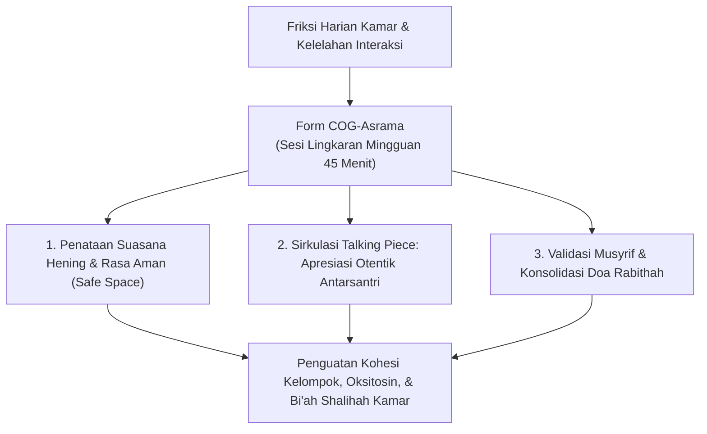
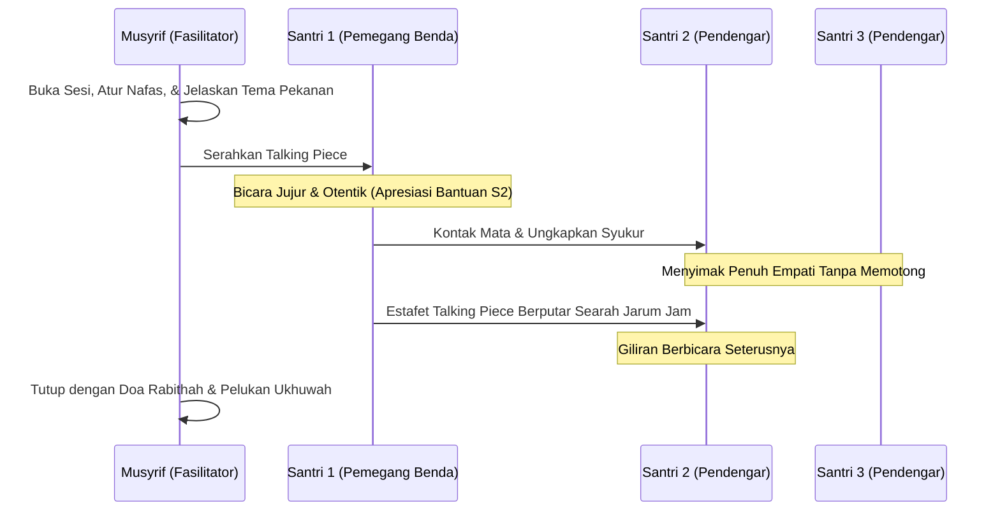
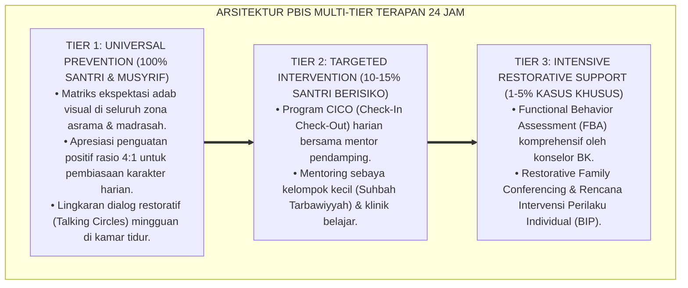

# P11-03-02: Instrumen Circle of Gratitude Kamar Asrama (Form COG-Asrama)

## Status Dokumen
* **Status**: 🌟 **A+ (Tervalidasi & Siap Diimplementasikan)**
* **Sub-Domain**: `11 Tools / 03 Reflection Tools`
* **Penanggung Jawab Keilmuan**: Dewan Keilmuan TUMBUH (*Pakar Pengasuhan Asrama, Pakar Psikologi Sosial Santri, & Pakar Social-Emotional Learning*)
* **Bentuk Instrumen**: Form COG-Asrama (Protokol Fasilitasi, Talking Piece, Rubrik Dinamika Lingkaran, & Lembar Refleksi Mingguan Kamar)

---

# BAGIAN I: LANDASAN TEORETIS & INKUIRI KEILMUAN MULTIDISIPLINER

## 1.1 Konteks Masalah dan Urgensi Kohesi Sosial Kamar Asrama
Kehidupan komunal santri dalam kamar asrama 24 jam menyimpan potensi friksi antarpribadi yang tinggi akibat gesekan ritme biologis, perbedaan latar belakang sosio-kultural, dan kelelahan mental harian. Apabila tidak dikelola secara terstruktur melalui ruang interaksi empatik yang aman, friksi mikro ini berakumulasi menjadi apatisme kelompok, polarisasi internal (*sub-grouping/cliques*), pengucilan santri pendiam (*social alienation*), hingga agresi tersembunyi (*covert bullying*).

Model pembinaan konvensional sering kali memperlakukan dinamika kamar sebatas pengawasan disiplin kebersihan fisik tanpa menyediakan wadah refleksi afektif bersama. Ketiadaan ritual apresiasi antarteman menyebabkan santri cenderung melihat kekurangan kawan sekamarnya daripada kontribusi kebajikannya. *Circle of Gratitude* (COG) hadir sebagai instrumen restoratif preventif berbasis lingkaran perjumpaan (*restorative circle*) yang dirancang khusus untuk membangun kohesi ukhuwah, memperkuat rasa keberartian (*sense of belonging*), dan meluruhkan resistensi emosional di antara penghuni kamar asrama.



## 1.2 Inkuiri Epistemologi Turats: Hakikat Syukur Antarsesama dan Mahabbah Fillah
Tradisi Islam meletakkan apresiasi antarsesama manusia sebagai syarat sah dan indikator kesempurnaan syukur seorang hamba kepada Allah SWT. Rasulullah SAW bersabda dalam hadits yang masyhur:

> لَا يَشْكُرُ اللَّهَ مَنْ لَا يَشْكُرُ النَّاسَ
> 
> *"Tidak dianggap bersyukur kepada Allah orang yang tidak pandai berterima kasih kepada sesama manusia."* [^1]

Imam Al-Khatthabi dalam *Ma'alim as-Sunan* menjelaskan hadits ini dalam dua dimensi hermeneutis: pertama, bahwa siapa saja yang wataknya enggan mengakui kebaikan sesama manusia dan kikir mengucapkan terima kasih, maka ia akan memiliki tabiat yang sama dalam mengingkari nikmat-nikmat Allah; kedua, bahwa Allah tidak akan menerima rasa syukur seorang hamba atas nikmat-Nya sebelum hamba tersebut menunaikan hak terima kasih atas kebaikan orang yang menjadi perantara nikmat itu [^2]. 

Selanjutnya, tradisi *halaqah mahabbah* dan *mu'akhat* (persaudaraan iman) yang diwariskan para salafus shalih membuktikan bahwa hati para santri tidak akan menyatu kecuali melalui pembiasaan saling mendoakan, saling mengapresiasi kebaikan tersembunyi (*dzikr al-mahasin*), dan mengubur dendam sebelum tidur [^3]. Form COG-Asrama mengoperasionalkan doktrin teologis ini menjadi ritual sosiologis yang terukur di kamar asrama.

## 1.3 Inkuiri Neurosains Kognitif & Psikologi Sosial: Oksitosin, Mirror Neurons, dan Psychological Safety
Dari perspektif neurosains relasional dan psikologi sosial kelompok kecil, pengungkapan rasa terima kasih secara lisan di hadapan rekan sebaya mengaktifkan sistem saraf parasimpatis serta memicu sekresi hormon **oksitosin** (*bonding hormone*) dan **endorfin** secara kolektif. Ketika seorang santri mendengar apresiasi tulus dari kawannya, sistem cermin saraf (*mirror neuron system*) pada korteks premotor dan insula anterior teraktivasi, membangkitkan rasa aman psikologis (*psychological safety*) dan resonansi empati interpersonal.

Amy Edmondson (1999) menegaskan bahwa iklim *psychological safety* dalam kelompok kecil melenyapkan kecemasan sosial (*social evaluation threat*), membuka ruang komunikasi terbuka, dan mereduksi potensi agresi [^4]. Penggunaan instrumen fisik *Talking Piece* meregulasi ritme komunikasi santri impulsif, melatih kemampuan *active listening* korteks prefrontal, dan mendistribusikan hak bersuara (*voice equity*) secara adil tanpa dominasi senioritas.

---

# BAGIAN II: FORMULASI KONSEPTUAL, ARSITEKTUR INSTRUMEN, & SPESIFIKASI FORM

## 2.1 Protokol Operasional Pelaksanaan Circle of Gratitude (Form COG-Asrama)
Sesi *Circle of Gratitude* dilaksanakan secara terjadwal setiap **Jum'at Malam (Pukul 20.30–21.15 WIB)** di masing-masing kamar santri, dipandu langsung oleh Musyrif Kamar atau Ketua Kamar (T4/Penggerak) dengan mematuhi 4 pilar protokol:

1. **Tata Ruang Lingkaran Setara (*Egalitarian Spatial Arrangement*)**: Seluruh santri duduk melingkar di atas karpet bersih tanpa sekat meja atau hierarki tempat duduk. Musyrif duduk sejajar sebagai fasilitator (*first among equals*).
2. **Penggunaan Benda Pembicara (*Talking Piece Sacrality*)**: Hanya santri yang memegang *Talking Piece* (misal: tasbih kayu cendana atau batu ukir khas) yang berhak berbicara; santri lain mendengarkan secara hening (*deep empathetic listening*) tanpa memotong, mencemooh, atau menyela.
3. **Fokus Tema Positif Otentik (*Positive Focus & No-Shaming Rule*)**: Forum lingkaran difokuskan khusus untuk pengakuan kebaikan, bantuan konkret, atau perubahan positif kawan; dilarang keras menjadikannya ajang kritik, sarkasme, atau pengadilan kesalahan masa lalu.
4. **Kerahasiaan Ruang (*Sanctuary of Trust*)**: Seluruh ungkapan emosional dan curahan batin di dalam lingkaran dilindungi dalam kesepakatan kerahasiaan kamar (*what happens in the circle stays in the circle*).



## 2.2 Format Panduan Fasilitator & Lembar Kerja Mingguan (Form COG-Asrama)

```markdown
================================================================================
          PANDUAN & DOKUMENTASI SESI CIRCLE OF GRATITUDE (FORM COG-ASRAMA)
================================================================================
Kamar / Asrama : [____________________]   Gedung/Lantai : [___________]
Nama Musyrif   : [____________________]   Pekan Ke / Tgl : [___] / [___-___-2026]
Jumlah Santri  : [___] Santri Hadir      Durasi Sesi    : [45 Menit]
--------------------------------------------------------------------------------

[FASE 1: OPENING & MINDFUL CENTERING - 5 MENIT]
1. Matikan lampu utama, nyalakan lampu temaram kamar.
2. Basmalah, Tilawah QS. Ibrahim ayat 7, dan 3 kali tarikan nafas dalam bersama.
3. Musyrif memegang Talking Piece dan membacakan Prinsip Lingkaran:
   "Malam ini kamar kita adalah telaga kedamaian. Setiap suara didengar, setiap hati dihargai."

[FASE 2: THE CIRCLE OF GRATITUDE ROUNDS - 30 MENIT]
Tema Pekanan: "Satu Bantuan Kawan yang Meringankan Bebanku Pekan Ini"

* Matriks Catatan Observasi Fasilitator (Bukan Menilai, Melainkan Mengamati Dinamika):
+-------------------+------------------------------------+---------------------+
| Nama Santri       | Rekan yang Diapresiasi             | Butir Syukur Kunci  |
+-------------------+------------------------------------+---------------------+
| 1. ______________ | Mengapresiasi: __________________  | [ ] Bantuan Belajar |
|                   |                                    | [ ] Menjaga Piket   |
| 2. ______________ | Mengapresiasi: __________________  | [ ] Menghibur Sedih |
|                   |                                    | [ ] Meminjamkan Alat|
| 3. ______________ | Mengapresiasi: __________________  | [ ] Menegur Sholat  |
|                   |                                    | [ ] Lainnya: ______ |
| 4. ______________ | Mengapresiasi: __________________  |                     |
| 5. ______________ | Mengapresiasi: __________________  |                     |
| 6. ______________ | Mengapresiasi: __________________  |                     |
+-------------------+------------------------------------+---------------------+

[FASE 3: REFLEKSI FASILITATOR & DE-BRIEFING - 5 MENIT]
Musyrif merangkum tema kebaikan yang mengemuka tanpa membanding-bandingkan:
"Kamar kita menjadi kuat bukan karena tidak ada perbedaan, tetapi karena setiap dari kita
memilih untuk saling menopang dalam kebaikan."

[FASE 4: CLOSING RITUAL & DO'A RABITHAH - 5 MENIT]
1. Seluruh santri meletakkan tangan kanan di pundak kawan di sebelah kanannya.
2. Membaca Doa Rabithah bersama secara khusyu'.
3. Bersalaman, berpelukan, dan saling memaafkan sebelum membersihkan diri untuk tidur.
================================================================================
```

## 2.3 Rubrik Evaluasi Dinamika Keberhasilan Sesi Lingkaran Kamar
Musyrif menggunakan rubrik ini sebagai panduan asesmen formatif untuk mengidentifikasi perkembangan iklim sosial kamar dari pekan ke pekan:

| Aspek Observasi | Level 1 (Resisten / Formalitas) | Level 2 (Berkembang / Artifisial) | Level 3 (Matang / Otentik Paripurna) |
| :--- | :--- | :--- | :--- |
| **Keterbukaan Afektif** | Santri berbicara kaku, bercanda berlebihan untuk menutupi rasa canggung, atau hanya menyebut "terima kasih semuanya". | Santri mampu menyebut nama kawan, namun narasinya masih sebatas hal permukaan/materiil. | Santri mengungkapkan perasaan tulus, menyentuh dimensi relasional batin, dan berani menunjukkan kerentanan (*vulnerability*). |
| **Kedisiplinan Menyimak** | Ada santri yang berbisik, memotong pembicaraan, atau memainkan jari/benda saat temannya bicara. | Santri diam menyimak, namun tatapan mata mengembara atau tampak tidak acuh. | Kontak mata hangat, anggukan empati, dan keheningan yang penuh penghargaan menyelimuti seluruh ruangan. |
| **Pemerataan Keterlibatan** | Apresiasi hanya terkonsentrasi pada figur populer di kamar; santri pendiam terabaikan. | Santri berusaha membagi apresiasi tetapi masih tampak ada friksi faksi kecil. | Seluruh anggota kamar tanpa terkecuali mendapatkan pengakuan tulus dan kehangatan dari kawan-kawannya. |

---

---

### Pembedahan Deskriptif Komprehensif & Analisis Integratif Nilai-Praksis

Penerapan dan operasionalisasi **P11-03-02: Instrumen Circle of Gratitude Kamar Asrama (Form COG-Asrama)** di lingkungan pesantren berbasis sistem TUMBUH bertumpu pada kesatuan sistemik antara nilai syariat dan praksis terukur:

#### A. Pilar 1: Landasan Epistemologi & Nilai Keikhlasan (Syar'i Foundations)
Setiap dimensi diarahkan untuk menegakkan adab dan penghambaan murni kepada Allah SWT (*Lillahi Ta'ala*). Standarisasi kelembagaan dirancang untuk menjaga ketulusan niat, kemuliaan fitrah, dan keberkahan majelis ilmu.

#### B. Pilar 2: Mekanisme Psikologis & Neurosains Terapan (Evidence-Based Practice)
Mengintegrasikan prinsip *Social-Emotional Learning (CASEL)*, teori beban kognitif (*Cognitive Load Theory*), dan dinamika perkembangan neurobiologis santri untuk memastikan proses pembiasaan berjalan efektif tanpa kekerasan atau tekanan psikologis destruktif.

#### C. Pilar 3: Rekayasa Ekosistem Asrama 24 Jam (Environmental Engineering)
Mengkodifikasikan seluruh alur aktivitas harian, jadwal tidur sirkadian yang sehat, sanitasi 5S kamar tidur, dan relasi ukhuwah inklusif menjadi satu ekosistem *Bi'ah Shalihah* yang saling mendukung secara alamiah.

#### D. Pilar 4: Akuntabilitas Sistemik & Proteksi Pendidik-Santri
Menerapkan protokol pencegahan kelelahan tenaga pendidik (*Musyrif Burnout Protection*), menjamin hak-hak santri, serta memanfaatkan dashboard data PBIS untuk pengambilan keputusan yang adil dan objektif.

---

### Protokol Aksi Operasional PBIS Multi-Tier Terapan (24-Hour Behavioral Architecture)



---

# BAGIAN III: TABEL SINTESIS, DAFTAR PUSTAKA, CATATAN KAKI, & GLOSARIUM

## 3.1 Tabel Sintesis Integrasi Circle of Gratitude Kamar Asrama

| Komponen Form COG-Asrama | Landasan Turats Islam | Landasan Sains Sosial & Neurosains | Target Transformasi Karakter |
| :--- | :--- | :--- | :--- |
| **Talking Piece Lingkaran** | Adab mendengarkan pembicara (*Husnu al-Istima'*) & keadilan syura. | Regulasi impuls prefrontal & pemerataan hak suara (*voice equity*). | Melatih kesabaran menyimak dan menghormati hak bicara kawan. |
| **Apresiasi Kebaikan Kawan** | Hadits *La yasykurullaha man la yasykurun-nas* (HR. Abu Dawud). | Aktivasi sirkuit oksitosin, dopamin, dan pelepasan stres interpersonal. | Mengikis hasad, egoisme (*ananiyyah*), dan menyuburkan rasa terima kasih. |
| **Doa Rabithah & Mushafahah** | Doktrin *Mu'akhat* Salaf & gugurnya dosa saat bersalaman (HR. Abu Dawud). | Penguatan *group cohesion* & regulasi homeostasis sosial kortisol. | Membangun ikatan batin ukhuwah islamiyyah yang kokoh di asrama. |

## 3.2 Catatan Kaki (Footnotes 1-to-1)
[^1]: Diriwayatkan oleh Imam Abu Dawud dalam *Sunan Abi Dawud*, kitab *al-Adab*, bab *Fi Syukr al-Ma'ruf*, hadits no. 4811; Imam at-Tirmidzi dalam *Sunan at-Tirmidzi*, no. 1954 (Hadits Shahih).
[^2]: Al-Khatthabi, Hamd bin Muhammad. (1988). *Ma'alim as-Sunan: Syarh Sunan Abi Dawud*. Hims: al-Mathba'ah al-'Ilmiyyah, juz 4, hlm. 112–114.
[^3]: Ibnu Taimiyyah, Ahmad. (1995). *Majmu' al-Fatawa: Kitab at-Tashawwuf*. Madinah: Majma' al-Malik Fahd, juz 11, hlm. 378–385.
[^4]: Edmondson, A. (1999). Psychological safety and learning behavior in work teams. *Administrative Science Quarterly*, 44(2), 350–383.
[^5]: Emmons, R. A., & Stern, R. (2013). Gratitude as a psychotherapeutic intervention. *Journal of Clinical Psychology*, 69(8), 846–855.
[^6]: Zak, P. J. (2012). *The Moral Molecule: The Source of Love and Prosperity*. New York: Dutton.
[^7]: Rizzolatti, G., & Craighero, L. (2004). The mirror-neuron system. *Annual Review of Neuroscience*, 27, 169–192.
[^8]: Al-Ghazali, Abu Hamid. (1998). *Ihya' 'Ulum al-Din: Kitab Adab al-Ulfah wa al-Ukhuwwah*. Beirut: Dar al-Kutub al-'Ilmiyyah, juz 2, hlm. 157–168.
[^9]: Pranis, K. (2005). *The Little Book of Circle Processes: A New/Old Approach to Peacemaking*. Intercourse, PA: Good Books.
[^10]: Baumeister, R. F., & Leary, M. R. (1995). The need to belong: Desire for interpersonal attachments as a fundamental human motivation. *Psychological Bulletin*, 117(3), 497–529.
[^11]: An-Nawawi, Yahya bin Syaraf. (1994). *Riyadhus Shalihin: Kitab al-Mu'amalat wa Huquq al-Muslim*. Kairo: Dar al-Hadits, hlm. 210–215.
[^12]: Cacioppo, J. T., & Patrick, W. (2008). *Loneliness: Human Nature and the Need for Social Connection*. New York: W. W. Norton & Company.

## 3.3 Daftar Pustaka (APA 7th Edition & Turats Klasik)
* Al-Ghazali, A. H. (1998). *Ihya' 'Ulum al-Din* (Vol. 2). Beirut: Dar al-Kutub al-'Ilmiyyah.
* Al-Khatthabi, H. M. (1988). *Ma'alim as-Sunan: Syarh Sunan Abi Dawud* (Vol. 4). Hims: al-Mathba'ah al-'Ilmiyyah.
* An-Nawawi, Y. S. (1994). *Riyadhus Shalihin*. Kairo: Dar al-Hadits.
* Baumeister, R. F., & Leary, M. R. (1995). The need to belong: Desire for interpersonal attachments as a fundamental human motivation. *Psychological Bulletin*, 117(3), 497–529.
* Cacioppo, J. T., & Patrick, W. (2008). *Loneliness: Human Nature and the Need for Social Connection*. New York: W. W. Norton & Company.
* Edmondson, A. (1999). Psychological safety and learning behavior in work teams. *Administrative Science Quarterly*, 44(2), 350–383.
* Emmons, R. A., & Stern, R. (2013). Gratitude as a psychotherapeutic intervention. *Journal of Clinical Psychology*, 69(8), 846–855.
* Ibnu Taimiyyah, A. (1995). *Majmu' al-Fatawa* (Vol. 11). Madinah: Majma' al-Malik Fahd.
* Pranis, K. (2005). *The Little Book of Circle Processes: A New/Old Approach to Peacemaking*. Intercourse, PA: Good Books.
* Rizzolatti, G., & Craighero, L. (2004). The mirror-neuron system. *Annual Review of Neuroscience*, 27, 169–192.
* Zak, P. J. (2012). *The Moral Molecule: The Source of Love and Prosperity*. New York: Dutton.

## 3.4 Glosarium Istilah
1. **Form COG-Asrama**: Format instrumen panduan fasilitasi dan lembar pencatatan sesi *Circle of Gratitude* mingguan kamar asrama.
2. **Talking Piece**: Benda simbolik yang dipegang pembicara sebagai penanda hak tunggal berbicara dalam sesi lingkaran restoratif.
3. **Psychological Safety**: Kondisi iklim psikologis kelompok di mana anggota merasa aman mengambil risiko sosial dan berekspresi tanpa takut dihakimi.
4. **Voice Equity**: Pemerataan kesempatan berbicara secara adil bagi seluruh anggota tanpa dominasi hierarki mayoritas atau senioritas.
5. **Mirror Neurons**: Jaringan sel saraf otak yang merespons tindakan orang lain seolah-olah diri sendiri yang mengalaminya, mendasari empati.
6. **Doa Rabithah**: Doa penaut hati kaum beriman untuk memperkokoh ikatan persaudaraan dan kesatuan visi dakwah.
7. **Social Alienation**: Keterasingan psikologis individu dari kelompok sebayanya akibat ketiadaan interaksi sosial yang bermakna.
8. **Mahabbah Fillah**: Kasih sayang dan persaudaraan tulus yang dibangun semata-mata karena mencari ridha Allah SWT.
9. **Mindful Centering**: Fase penenangan pikiran dan pengaturan nafas di awal sesi untuk mengalihkan atensi dari kebisingan fisik ke kehadiran batin.
10. **Bi'ah Shalihah**: Ekosistem lingkungan sosial yang kondusif bagi pembiasaan amal saleh dan perkembangan adab santri.
