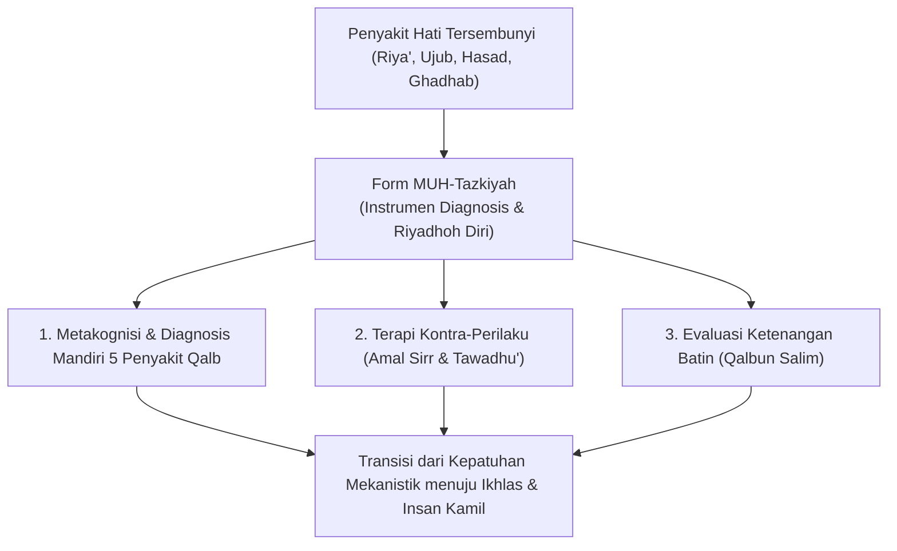
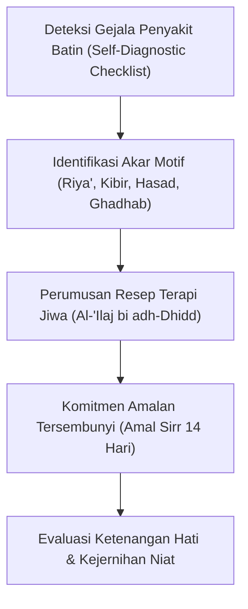
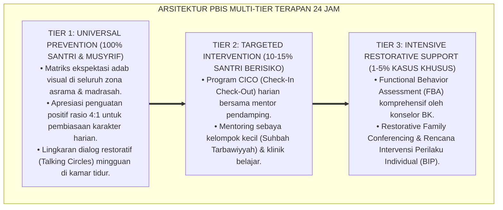

# P11-03-03: Lembar Muhasabah Mandiri dan Tazkiyatun Nafs (Form MUH-Tazkiyah)

## Status Dokumen
* **Status**: 🌟 **A+ (Tervalidasi & Siap Diimplementasikan)**
* **Sub-Domain**: `11 Tools / 03 Reflection Tools`
* **Penanggung Jawab Keilmuan**: Dewan Keilmuan TUMBUH (*Pakar Epistemologi Turats, Pakar Bimbingan Konseling, & Pakar Psikologi Belajar*)
* **Bentuk Instrumen**: Form MUH-Tazkiyah (Matriks Diagnosis Penyakit Qalb, Lembar Terapi Riyadhoh Jiwa, & Rubrik Pemurnian Niat Santri)

---

# BAGIAN I: LANDASAN TEORETIS & INKUIRI KEILMUAN MULTIDISIPLINER

## 1.1 Konteks Masalah dan Jebakan Formalisme Ibadah Santri
Dalam iklim kehidupan pesantren yang sarat dengan rutinitas ibadah komunal dan tuntutan hafalan, santri rentan terjebak dalam fenomena patologi spiritual yang disebut oleh ulama tasawuf sebagai **formalisme ibadah (*ar-riya' al-khafiy*)** dan keangkuhan intelektual-spiritual (*ujub*). Ketika ibadah, hafalan Al-Qur'an, dan kedisiplinan adab hanya diukur dari tampilan mekanistik lahiriah, santri kehilangan kepekaan dalam mendeteksi gejolak motivasi batin (*inner motivational dynamics*), seperti riya' (ingin dipuji makhluk), hasad (dengki atas capaian kawan), sum'ah (memperdengarkan amal), dan kibir (merasa lebih suci dari kawan sekamar).

Pendekatan bimbingan konvensional kerap kali hanya mengoreksi perilaku fisik luar (*outer behavioral conformity*) tanpa membekali santri dengan instrumen introsepksi diri (*self-monitoring tool*) yang sistematis untuk menata hati (*tazkiyatun nafs*). Tanpa adanya perangkat hisab diri yang privat dan ilmiah, santri tidak memiliki keterampilan metakognitif untuk membedakan antara dorongan fitrah yang ikhlas dengan manipulasi hawa nafsu (*talbis iblis*). Form MUH-Tazkiyah hadir sebagai instrumen hisab spiritual mandiri yang memandu santri melakukan diagnosis batin berkala dan merumuskan terapi *riyadhoh* jiwa secara terarah.



## 1.2 Inkuiri Epistemologi Turats: Doktrin Tazkiyatun Nafs dan Muraqabatullah
Konsep pembersihan jiwa (*tazkiyatun nafs*) merupakan poros utama risalah kenabian sebagaimana ditegaskan dalam Al-Qur'an: *"Sungguh beruntung orang yang menyucikan jiwanya, dan sungguh merugi orang yang mengotorinya"* (*Qad Aflaha Man Zakkāhā, wa Qad Khāba Man Dassāhā* — QS. Asy-Syams: 9–10).

Imam Abu Hamid Al-Ghazali dalam mahakaryanya *Ihya' 'Ulum al-Din* (Kitab *Riyadhat an-Nafs wa Tahdzib al-Akhlaq*) meletakkan kaidah fundamental penyembuhan penyakit batin melalui prinsip **Al-'Ilaj bi adh-Dhidd (Pengobatan dengan Lawan Sifat)**:

> اعْلَمْ أَنَّ الْعِلَاجَ فِي حَقِّ كُلِّ مَرَضٍ هُوَ بِقَطْعِ سَبَبِهِ، وَسَبَبُ مَرَضِ الْقَلْبِ هُوَ اتِّبَاعُ الْهَوَى، فَلَا عِلَاجَ لَهُ إِلَّا بِمُخَالَفَةِ الْهَوَى، وَكَمَا أَنَّ عِلَاجَ الْعِلَّةِ الْبَارِدَةِ بِالْحَرَارَةِ، فَكَذَلِكَ عِلَاجُ الْكِبْرِ بِالتَّوَاضُعِ، وَعِلَاجُ الرِّيَاءِ بِالْإِخْلَاصِ وَإِخْفَاءِ الْعَمَلِ
> 
> *"Ketahuilah bahwa terapi bagi setiap penyakit adalah dengan memutus sebab akarnya. Dan sebab dari segala penyakit hati adalah mengikuti hawa nafsu, maka tidak ada obat baginya kecuali dengan menyelisihi hawa nafsu tersebut. Sebagaimana penyakit dingin diobati dengan panas, demikian pula penyakit sombong (kibir) diobati dengan merendahkan diri (tawadhu'), dan penyakit pamer (riya') diobati dengan ikhlas dan menyembunyikan amal kebajikan."* [^1]

Imam Al-Harits Al-Muhasibi dalam *Ar-Ri'ayah li Huquqillah* menguraikan metodologi *Muraqabah* (pengawasan batin) yang ketat melalui hisab niat pada tiga fase amal: sebelum beramal (*qabl al-'amal*), saat beramal (*hal al-'amal*), dan setelah beramal (*ba'd al-'amal*) [^2]. Form MUH-Tazkiyah menyintesiskan kaidah pengobatan Al-Ghazali dan hisab tiga fase Al-Muhasibi ke dalam format inventori diri yang praktis.

## 1.3 Inkuiri Sains Kognitif: Metakognisi, Self-Regulation, dan Cognitive Reappraisal
Dalam kerangka psikologi kognitif dan teori regulasi diri (*Self-Determination Theory* & *Cognitive Reappraisal*), pembiasaan hisab diri melatih kemampuan **metakognisi tingkat tinggi** (*executive metacognitive monitoring*). Ketika santri secara sadar mengamati proses berpikir dan motif internalnya, aktivitas korteks prefrontal dorsolateral (dlPFC) meningkat, mengintervensi dorongan impulsif subkortikal sistem limbik.

James Gross (2002) membuktikan bahwa regulasi emosi berbasis restrukturisasi kognitif mendalam (*cognitive reappraisal*) jauh lebih efektif menjaga kesehatan mental dan stabilitas perilaku jangka panjang daripada represi emosional (*expressive suppression*) [^3]. Form MUH-Tazkiyah memfasilitasi santri mengubah motif ekstrinsik (takut dihukum atau haus pujian) menjadi motivasi otonom intrinsik (*spiritual autonomous motivation*) yang bersumber dari kesadaran kehadiran Allah (*muraqabatullah*).

---

# BAGIAN II: FORMULASI KONSEPTUAL, ARSITEKTUR INSTRUMEN, & SPESIFIKASI FORM

## 2.1 Struktur & Prinsip Operasional Form MUH-Tazkiyah
Form MUH-Tazkiyah dirancang sebagai lembar refleksi dwimingguan (*bi-weekly self-inventory*) yang diisi santri secara mandiri pada waktu hening (misal: saat I'tikaf malam Jum'at atau ba'da Sholat Dhuha). Instrumen ini mencakup 5 domain penyakit hati utama:

1. **Domain 1: Ikhlas vs. Riya'/Sum'ah (Kemurnian Motif Amal)**
2. **Domain 2: Syukur vs. Kufur/Keluh Kesah (Penerimaan Takdir & Fasilitas)**
3. **Domain 3: Tawadhu' vs. Kibir/'Ujub (Kerendahan Hati & Penghormatan Sesama)**
4. **Domain 4: Sabar/Hilim vs. Ghadhab/Dendam (Pengendalian Emosi Marah)**
5. **Domain 5: Salamatus Shadr vs. Hasad/Su'udzhon (Kebersihan Hati dari Dengki & Prasangka)**



## 2.2 Format Instrumen Form MUH-Tazkiyah (Lembar Diagnostik & Riyadhoh Santri)

```markdown
================================================================================
         LEMBAR MUHASABAH MANDIRI & TAZKIYATUN NAFS (FORM MUH-TAZKIYAH)
================================================================================
Nama Santri : [____________________]   Kelas/Jenjang : [___________]
Kamar/Asrama: [____________________]   Periode Pekan : [___ s/d ___]
--------------------------------------------------------------------------------
PETUNJUK PENGISIAN:
Lembar ini adalah cermin kejujuran antara antum dengan Allah Ta'ala. Tidak ada 
jawaban yang dinilai salah. Berikan tanda ceklis (V) sesuai kondisi batin antum.
--------------------------------------------------------------------------------

[BAGIAN A: INVENTORI DIAGNOSTIK PENYAKIT HATI MANDIRI]

1. DOMAIN IKHLAS VS RIYA' & SUM'AH
   [ ] Saya merasa lebih bersemangat shalat/tilawah saat dilihat musyrif/kawan.
   [ ] Saya merasa kecewa atau berkecil hati jika kebaikan/prestasi saya tidak dipuji.
   [ ] Terapi Penawar: Melakukan 1 amalan kebaikan tersembunyi (tanpa ada yang tahu).

2. DOMAIN TAWADHU' VS KIBIR & 'UJUB
   [ ] Saya merasa lebih pintar, lebih kaya, atau lebih mulia dari kawan sekamar.
   [ ] Saya merasa gengsi/berat untuk meminta maaf terlebih dahulu saat berselisih.
   [ ] Terapi Penawar: Melayani kawan (menuangkan air/merapikan sandal kawan).

3. DOMAIN SALAMATUS SHADR VS HASAD & DENGKI
   [ ] Timbul rasa tidak nyaman/iri di hati saat kawan sekamar mendapat apresiasi.
   [ ] Saya diam-diam merasa senang saat kawan yang tidak saya sukai ditegur musyrif.
   [ ] Terapi Penawar: Mendoakan keberkahan kawan tersebut dalam sujud rahasia.

4. DOMAIN SABAR & HILIM VS GHADHAB (AMARAH)
   [ ] Saya mudah membentak atau melempar barang saat barang saya tersenggol/hilang.
   [ ] Saya menyimpan dendam dan mendiamkan kawan lebih dari 1 hari.
   [ ] Terapi Penawar: Berwudhu, istighfar 70x, dan menyapa kawan dengan senyuman.

--------------------------------------------------------------------------------

[BAGIAN B: LEMBAR RESEP RIYADHOH PRIBADI (AMAL SIRR 14 HARI)]
"Tuliskan 1 Amalan Tersembunyi (Amal Sirr) yang akan antum rutinkan selama 14 hari 
ke depan untuk membersihkan penyakit hati yang paling dominan di atas:"

Target Riyadhoh Saya:
"Mulai malam ini, saya bertekad untuk: _________________________________________
 _____________________________________________________________________________"
Waktu Pelaksanaan : [ ] Sepertiga Malam   [ ] Ba'da Ashar   [ ] Menjelang Tidur
Saksi Tunggal     : Hanya Allah Subhanahu wa Ta'ala.

================================================================================
```

## 2.3 Rubrik Pemetaan Level Kematangan Penataan Hati Santri
Guru pembimbing atau konselor asrama menggunakan rubrik konseptual ini untuk memantau kematangan spiritual santri dari waktu ke waktu:

| Dimensi Kematangan | Level 1: Nafsul Ammarah | Level 2: Nafsul Lawwamah | Level 3: Nafsul Muthma'innah |
| :--- | :--- | :--- | :--- |
| **Kesadaran Motivasi (Niat)** | Tidak menyadari riya'/ujub; menganggap diri selalu benar dan membela ego nafsu. | Menyadari kekeliruan niat setelah beramal; merasa menyesal dan segera beristighfar. | Menjaga niat sejak awal hingga akhir amal; ikhlas murni mengharap ridha Allah semata. |
| **Respons terhadap Kritik** | Marah, tersinggung, menyerang balik, dan mendendam pada penegur. | Menerima teguran walau batin masih sedikit berat; berusaha mengevaluasi diri. | Berterima kasih atas teguran; memandang kritik sebagai hadiah penunjuk aib diri. |
| **Hubungan dengan Sesama** | Sering hasad, suka menggunjing (*ghibah*), dan meremehkan kawan yang lebih lemah. | Menahan lisan dari ghibah; berusaha memerangi bisikan dengki di dalam hati. | Berhati lapang (*salamatus shadr*), mencintai kawan seperti mencintai diri sendiri. |

---

---

### Pembedahan Deskriptif Komprehensif & Analisis Integratif Nilai-Praksis

Penerapan dan operasionalisasi **P11-03-03: Lembar Muhasabah Mandiri dan Tazkiyatun Nafs (Form MUH-Tazkiyah)** di lingkungan pesantren TUMBUH bertumpu pada kesatuan sistemik antara nilai syariat dan praksis terukur:

#### A. Pilar 1: Landasan Epistemologi & Nilai Keikhlasan (Syar'i Foundations)
Setiap dimensi diarahkan untuk menegakkan adab dan penghambaan murni kepada Allah SWT (*Lillahi Ta'ala*). Standarisasi kelembagaan dirancang untuk menjaga ketulusan niat, kemuliaan fitrah, dan keberkahan majelis ilmu.

#### B. Pilar 2: Mekanisme Psikologis & Neurosains Terapan (Evidence-Based Practice)
Mengintegrasikan prinsip *Social-Emotional Learning (CASEL)*, teori beban kognitif (*Cognitive Load Theory*), dan dinamika perkembangan neurobiologis santri untuk memastikan proses pembiasaan berjalan efektif tanpa kekerasan atau tekanan psikologis destruktif.

#### C. Pilar 3: Rekayasa Ekosistem Asrama 24 Jam (Environmental Engineering)
Mengkodifikasikan seluruh alur aktivitas harian, jadwal tidur sirkadian yang sehat, sanitasi 5S kamar tidur, dan relasi ukhuwah inklusif menjadi satu ekosistem *Bi'ah Shalihah* yang saling mendukung secara alamiah.

#### D. Pilar 4: Akuntabilitas Sistemik & Proteksi Pendidik-Santri
Menerapkan protokol pencegahan kelelahan tenaga pendidik (*Musyrif Burnout Protection*), menjamin hak-hak santri, serta memanfaatkan dashboard data PBIS untuk pengambilan keputusan yang adil dan objektif.

---

### Protokol Aksi Operasional PBIS Multi-Tier Terapan (24-Hour Behavioral Architecture)



---

# BAGIAN III: TABEL SINTESIS, DAFTAR PUSTAKA, CATATAN KAKI, & GLOSARIUM

## 3.1 Tabel Sintesis Integrasi Form MUH-Tazkiyah

| Dimensi Form MUH-Tazkiyah | Landasan Turats Islam | Landasan Sains Kognitif & Psikologi | Target Transformasi Karakter |
| :--- | :--- | :--- | :--- |
| **Diagnosis Mandiri Qalb** | Kitab *Ar-Ri'ayah* Al-Muhasibi & hisab jiwa Salaf. | Metakognisi & *Self-awareness* dlPFC. | Mengembangkan kejujuran batin & kepekaan moral. |
| **Al-'Ilaj bi adh-Dhidd** | Kaidah terapi Al-Ghazali dalam *Ihya'*. | *Counter-conditioning* & modifikasi perilaku. | Mengikis watak kibir, riya', dan dendam secara konkret. |
| **Komitmen Amal Sirr** | Hadits *Sab'atun Yuzhilluhumullah* (HR. Bukhari). | *Intrinsic Autonomous Motivation* (Deci & Ryan). | Menumbuhkan keikhlasan murni & kemandirian spiritual. |

## 3.2 Catatan Kaki (Footnotes 1-to-1)
[^1]: Al-Ghazali, Abu Hamid. (1998). *Ihya' 'Ulum al-Din: Kitab Riyadhat an-Nafs wa Tahdzib al-Akhlaq wa Mu'alajat Amradh al-Qalb*. Beirut: Dar al-Kutub al-'Ilmiyyah, juz 3, hlm. 62–68.
[^2]: Al-Muhasibi, Al-Harits. (1986). *Ar-Ri'ayah li Huquqillah*. Ditahqiq oleh Abdul Qadir Ahmad 'Atha. Kairo: Dar al-Kutub al-Haditsah, hlm. 78–86.
[^3]: Gross, J. J. (2002). Emotion regulation: Affective, cognitive, and social consequences. *Psychophysiology*, 39(3), 281–291.
[^4]: Ryan, R. M., & Deci, E. L. (2017). *Self-Determination Theory: Basic Psychological Needs in Motivation, Development, and Wellness*. New York: Guilford Press.
[^5]: Ibnu Qayyim al-Jauziyyah. (2004). *Madarij as-Salikin baina Manazil Iyyaka Na'budu wa Iyyaka Nasta'in*. Kairo: Dar al-Hadits, juz 1, hlm. 142–155.
[^6]: Tangney, J. P., & Dearing, R. L. (2002). *Shame and Guilt*. New York: Guilford Press.
[^7]: Flavell, J. H. (1979). Metacognition and cognitive monitoring: A new area of cognitive-developmental inquiry. *American Psychologist*, 34(10), 906–911.
[^8]: Ibnu Rajab al-Hanbali. (2001). *Jami' al-'Ulum wa al-Hikam fi Syarh Khamsina Haditsan min Jawami' al-Kalim*. Beirut: Mu'assasah ar-Risalah, juz 1, hlm. 68–79.
[^9]: Beck, A. T. (1979). *Cognitive Therapy of Depression*. New York: Guilford Press.
[^10]: Al-Ajurri, Abu Bakr Muhammad. (1996). *Akhlaq al-'Ulama'*. Beirut: Dar al-Kutub al-'Ilmiyyah, hlm. 45–52.
[^11]: Goleman, D. (1995). *Emotional Intelligence: Why It Can Matter More Than IQ*. New York: Bantam Books.
[^12]: An-Nawawi, Yahya bin Syaraf. (2002). *At-Tibyan fi Adab Hamalat al-Qur'an*. Beirut: Dar Ibn Hazm, hlm. 35–41.

## 3.3 Daftar Pustaka (APA 7th Edition & Turats Klasik)
* Al-Ajurri, A. B. M. (1996). *Akhlaq al-'Ulama'*. Beirut: Dar al-Kutub al-'Ilmiyyah.
* Al-Ghazali, A. H. (1998). *Ihya' 'Ulum al-Din* (Vol. 3). Beirut: Dar al-Kutub al-'Ilmiyyah.
* Al-Muhasibi, A. (1986). *Ar-Ri'ayah li Huquqillah*. Kairo: Dar al-Kutub al-Haditsah.
* An-Nawawi, Y. S. (2002). *At-Tibyan fi Adab Hamalat al-Qur'an*. Beirut: Dar Ibn Hazm.
* Beck, A. T. (1979). *Cognitive Therapy of Depression*. New York: Guilford Press.
* Flavell, J. H. (1979). Metacognition and cognitive monitoring: A new area of cognitive-developmental inquiry. *American Psychologist*, 34(10), 906–911.
* Goleman, D. (1995). *Emotional Intelligence: Why It Can Matter More Than IQ*. New York: Bantam Books.
* Gross, J. J. (2002). Emotion regulation: Affective, cognitive, and social consequences. *Psychophysiology*, 39(3), 281–291.
* Ibnu Qayyim al-Jauziyyah. (2004). *Madarij as-Salikin* (Vol. 1). Kairo: Dar al-Hadits.
* Ibnu Rajab al-Hanbali. (2001). *Jami' al-'Ulum wa al-Hikam* (Vol. 1). Beirut: Mu'assasah ar-Risalah.
* Ryan, R. M., & Deci, E. L. (2017). *Self-Determination Theory: Basic Psychological Needs in Motivation, Development, and Wellness*. New York: Guilford Press.
* Tangney, J. P., & Dearing, R. L. (2002). *Shame and Guilt*. New York: Guilford Press.

## 3.4 Glosarium Istilah
1. **Form MUH-Tazkiyah**: Format lembar inventori hisab mandiri dan panduan terapi pembersihan jiwa santri berkala.
2. **Tazkiyatun Nafs**: Proses penyucian jiwa dari noda-noda dosa dan penyakit hati menuju kesucian fitrah.
3. **Al-'Ilaj bi adh-Dhidd**: Metode terapi psikospiritual Islam mengobati penyakit akhlak dengan cara membiasakan sifat lawannya secara konsisten.
4. **Amal Sirr**: Amalan kebaikan yang dikerjakan secara sembunyi-sembunyi tanpa diketahui oleh manusia manapun demi memurnikan keikhlasan.
5. **Riya' al-Khafiy**: Sikap pamer tersembunyi yang menyusup ke dalam batin untuk mencari pengakuan dan pujian makhluk.
6. **Salamatus Shadr**: Kebersihan dan kelapangan dada dari segala bentuk kedengkian, dendam, dan kebencian terhadap sesama muslim.
7. **Executive Metacognitive Monitoring**: Kemampuan kognitif tingkat tinggi dalam mengamati, mengevaluasi, dan mengendalikan motif berpikir diri sendiri.
8. **Cognitive Reappraisal**: Strategi regulasi emosi dengan cara memaknai ulang stimulus secara rasional dan positif.
9. **Muraqabatullah**: Kesadaran batin yang mendalam bahwa seluruh gerak-gerik hati dan amal senantiasa berada dalam pengawasan Allah SWT.
10. **Qalbun Salim**: Hati yang selamat dan bersih dari kemusyrikan, keraguan, dan penyakit-penyakit nafsu saat menghadap Allah SWT.
